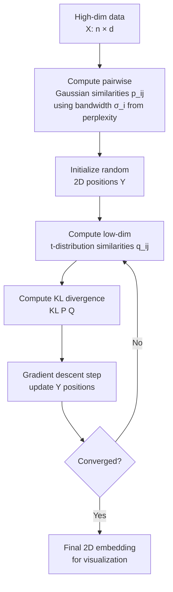

# 🌌 t-SNE

> [!abstract] TL;DR
> t-SNE is a non-linear dimensionality reduction algorithm designed for visualization of high-dimensional data in 2D/3D. It converts pairwise similarities in high-dimensional space to probabilities, then arranges points in low-dimensional space to match those probabilities using KL divergence minimization. It preserves **local** neighborhood structure beautifully but distorts global distances. Never use t-SNE for anything except visualization.

## Intuition — Analogy First

Imagine you're a cartographer tasked with placing stars from a 3D constellation onto a 2D star map. Your one rule: stars that are close neighbors in 3D must stay close neighbors on the map. You're willing to distort the overall shape of the galaxy — compress some regions, stretch others — as long as each star's immediate neighborhood looks right.

t-SNE does exactly this. It starts with every star at a random position on the map, then gradually nudges stars: if two stars should be neighbors (similar in high-D), pull them together; if they shouldn't be (dissimilar), push them apart. After thousands of nudges, similar points cluster tightly, dissimilar points are pushed to different regions.

**The "t" in t-SNE:** In low-dimensional space, the algorithm uses a Student's t-distribution (heavier tails than Gaussian) to represent similarities. This prevents the **crowding problem** — in 2D, there's not enough room to place all the moderately-similar points if you use a Gaussian, so they'd all collapse toward the center. The t-distribution's heavy tail allows moderately similar points to be placed farther apart.

## How It Works — Mechanics

**Step 1: High-dim → probabilities**
For each pair of points $(i, j)$, compute conditional probability that $i$ would pick $j$ as a neighbor:
$$p_{j|i} = \frac{\exp(-\|x_i - x_j\|^2 / 2\sigma_i^2)}{\sum_{k \neq i} \exp(-\|x_i - x_k\|^2 / 2\sigma_i^2)}$$

Symmetrize: $p_{ij} = \frac{p_{j|i} + p_{i|j}}{2n}$

The bandwidth $\sigma_i$ is chosen per-point so that the perplexity equals the user-specified value.

**Step 2: Low-dim → probabilities (t-distribution)**
In 2D, similarity is modeled with a Student's t-distribution (1 degree of freedom):
$$q_{ij} = \frac{(1 + \|y_i - y_j\|^2)^{-1}}{\sum_{k \neq l}(1 + \|y_k - y_l\|^2)^{-1}}$$

**Step 3: Minimize KL divergence**
Optimize the 2D positions $\{y_i\}$ to minimize:
$$KL(P \| Q) = \sum_{i \neq j} p_{ij} \log \frac{p_{ij}}{q_{ij}}$$

Using gradient descent (with momentum for speed).

**Perplexity** — the most important hyperparameter. Roughly the effective number of neighbors each point considers. Range: typically 5–50. Higher perplexity = considers more neighbors = more global structure visible.



## The Math

**Perplexity** controls $\sigma_i$ per point:
$$\text{Perp}(P_i) = 2^{H(P_i)} = 2^{-\sum_j p_{j|i} \log_2 p_{j|i}}$$

Binary search finds $\sigma_i$ such that $\text{Perp}(P_i) = \text{target\_perplexity}$.

**KL divergence gradient** (the key formula that drives optimization):
$$\frac{\partial KL}{\partial y_i} = 4 \sum_j (p_{ij} - q_{ij})(y_i - y_j)(1 + \|y_i - y_j\|^2)^{-1}$$

**Why t-distribution solves crowding:**
In 2D, the volume of a sphere of radius $r$ grows as $r^2$ (vs $r^d$ in d dimensions). There's much less room to place moderately-similar points. The t-distribution's heavier tails allow a larger range of low-D distances to represent a moderate q_ij value, giving more "room" for these points.

**Complexity:**
- Naive: O(n²) per iteration
- Barnes-Hut approximation (sklearn default): O(n log n) per iteration

## Code Demo

```python
import numpy as np
import matplotlib.pyplot as plt
from sklearn.manifold import TSNE
from sklearn.decomposition import PCA
from sklearn.datasets import load_digits
from sklearn.preprocessing import StandardScaler

# Load digits
digits = load_digits()
X, y = digits.data, digits.target
X_scaled = StandardScaler().fit_transform(X)

# --- PCA pre-reduction (recommended before t-SNE) ---
# Reduces noise and speeds up t-SNE
pca_pre = PCA(n_components=50)
X_pca = pca_pre.fit_transform(X_scaled)

# --- t-SNE with different perplexities ---
fig, axes = plt.subplots(1, 3, figsize=(18, 5))
perplexities = [5, 30, 50]

for ax, perp in zip(axes, perplexities):
    tsne = TSNE(
        n_components=2,
        perplexity=perp,
        max_iter=1000,
        learning_rate='auto',
        init='pca',       # Better than random init
        random_state=42,
        n_jobs=-1
    )
    X_tsne = tsne.fit_transform(X_pca)

    scatter = ax.scatter(X_tsne[:, 0], X_tsne[:, 1],
                         c=y, cmap='tab10', alpha=0.7, s=10)
    ax.set_title(f't-SNE (perplexity={perp})')
    ax.axis('off')

plt.colorbar(scatter, ax=axes[-1], label='Digit')
plt.suptitle('t-SNE on Digits Dataset — Effect of Perplexity')
plt.tight_layout()
plt.show()

# --- Compare PCA vs t-SNE side by side ---
fig, axes = plt.subplots(1, 2, figsize=(14, 6))

# PCA
pca_2d = PCA(n_components=2)
X_pca_2d = pca_2d.fit_transform(X_scaled)
axes[0].scatter(X_pca_2d[:, 0], X_pca_2d[:, 1], c=y, cmap='tab10', alpha=0.6, s=10)
axes[0].set_title('PCA (linear, global)')
axes[0].set_xlabel(f'PC1 ({pca_2d.explained_variance_ratio_[0]:.1%})')
axes[0].set_ylabel(f'PC2 ({pca_2d.explained_variance_ratio_[1]:.1%})')

# t-SNE
tsne_best = TSNE(n_components=2, perplexity=30, init='pca',
                 max_iter=1000, random_state=42)
X_tsne_best = tsne_best.fit_transform(X_pca)
axes[1].scatter(X_tsne_best[:, 0], X_tsne_best[:, 1], c=y, cmap='tab10', alpha=0.6, s=10)
axes[1].set_title('t-SNE (non-linear, local)')
axes[1].axis('off')

plt.suptitle('PCA vs t-SNE on MNIST Digits')
plt.tight_layout()
plt.show()

# --- Word embedding visualization simulation ---
np.random.seed(42)
# Simulate 4 semantic clusters in 50D embedding space
n_per_cluster = 50
clusters = {
    'animals': np.random.normal([1]*50, 0.3, (n_per_cluster, 50)),
    'food': np.random.normal([-1, 1]*25, 0.3, (n_per_cluster, 50)),
    'tech': np.random.normal([0, -1]*25, 0.3, (n_per_cluster, 50)),
    'sports': np.random.normal([-1, -1]*25, 0.3, (n_per_cluster, 50)),
}
X_embed = np.vstack(list(clusters.values()))
labels = np.repeat(list(clusters.keys()), n_per_cluster)

tsne_embed = TSNE(n_components=2, perplexity=20, init='pca',
                  max_iter=1000, random_state=42)
X_embed_2d = tsne_embed.fit_transform(X_embed)

plt.figure(figsize=(8, 6))
colors = {'animals': 'red', 'food': 'blue', 'tech': 'green', 'sports': 'orange'}
for cluster, color in colors.items():
    mask = labels == cluster
    plt.scatter(X_embed_2d[mask, 0], X_embed_2d[mask, 1],
                c=color, label=cluster, alpha=0.7, s=30)
plt.legend()
plt.title('t-SNE on Simulated Word Embeddings')
plt.axis('off')
plt.show()

# Print t-SNE diagnostics
print(f"KL divergence (final): {tsne_best.kl_divergence_:.3f}")
print("Note: lower KL = better fit")
```

## Real-World Example

**Visualizing Word Embedding Spaces:**
OpenAI and Google use t-SNE to validate that their word embedding models (Word2Vec, GloVe, BERT) have learned meaningful semantic structure. When you project 300-dimensional word vectors to 2D with t-SNE, semantically related words cluster together: "king/queen/prince/princess" form one cluster, "dog/cat/pet/animal" another, sports terms in their own region. This is how teams debug embeddings and communicate what the model has "learned."

**Single-Cell RNA Sequencing (scRNA-seq):**
t-SNE became the dominant visualization tool for single-cell biology around 2017–2019. Each cell is described by expression levels of ~20,000 genes. t-SNE projects these into 2D, revealing distinct cell type clusters (T-cells, B-cells, stem cells, etc.) and developmental trajectories. Tools like Seurat (R) and Scanpy (Python) use t-SNE extensively.

## Trade-offs

| Aspect | Pro | Con |
|---|---|---|
| Local structure | Preserves local neighborhoods beautifully | Global distances are meaningless |
| Visualization | Best-in-class for 2D/3D visualization | Cannot generalize to new data (must refit) |
| Non-linearity | Handles non-linear manifolds | Very slow: O(n log n) even with Barnes-Hut |
| Interpretability | Clear visual clusters | Cluster sizes and inter-cluster distances are not meaningful |
| Reproducibility | Deterministic with fixed seed | Different seeds can produce different layouts |
| Use as features | — | Never use t-SNE output as model features |

## When to Use vs Avoid

**Use t-SNE when:**
- Pure visualization goal (2D/3D only)
- Want to explore local cluster structure
- Communicating results to non-technical stakeholders (beautiful plots)
- Validating that a representation model (embedding, autoencoder) has learned structure

**Avoid t-SNE when:**
- You need to process new data without refitting (use UMAP)
- Preserving global structure matters (use PCA or UMAP)
- Speed is critical (UMAP is 5-10x faster)
- Features for downstream ML (t-SNE output is not meaningful as features)
- Interpreting cluster sizes or inter-cluster distances

## Common Pitfalls

1. **Interpreting cluster sizes** — t-SNE distorts densities. A large cluster in t-SNE space does not mean more data points. Use actual cluster size statistics separately.

2. **Interpreting distances between clusters** — distances between clusters in t-SNE are not meaningful. Two well-separated clusters in t-SNE might be close in the original space.

3. **Not pre-reducing with PCA** — for data with d > 50, always apply PCA first (to ~50 components). This removes noise dimensions that confuse t-SNE and speeds it up dramatically.

4. **Using t-SNE output as features** — t-SNE is for visualization only. The 2D coordinates are NOT a reliable lower-dimensional representation for downstream ML tasks.

5. **Trusting one perplexity setting** — t-SNE results vary with perplexity. Always try multiple values (5, 30, 50, 100). Very different-looking results at different perplexities is normal and informative.

6. **Using random initialization** — always set `init='pca'` in sklearn. Random initialization leads to poor and non-reproducible results.

## Related Concepts

- [[_MOC_Classical_ML|↑ Section MOC]]

- [[PCA]] — linear dimensionality reduction; preserves global structure; faster; use as preprocessing step before t-SNE
- [[UMAP]] — modern alternative: faster, preserves global structure, can generalize to new data
- [[Word_Embeddings]] — t-SNE is the primary tool for visualizing embedding spaces
- [[KMeans]] — often applied after t-SNE to formalize cluster boundaries seen visually

## Review Questions

1. After running t-SNE on your dataset, you notice that cluster A appears much larger than cluster B. A colleague concludes that class A is more common in the dataset. Is this correct? Explain what cluster size actually means in a t-SNE plot.

2. You want to add new test data to an existing t-SNE visualization of your training set. What fundamental limitation of t-SNE prevents this, and what alternative would you use?

3. Explain in plain language why t-SNE uses a Student's t-distribution in low-dimensional space but a Gaussian in high-dimensional space. What problem does this solve?

## Sources

- van der Maaten, L. & Hinton, G. (2008). "Visualizing data using t-SNE." *Journal of Machine Learning Research*, 9(86), 2579–2605.
- van der Maaten, L. (2014). "Accelerating t-SNE using tree-based algorithms." *Journal of Machine Learning Research*, 15(93), 3221–3245.
- Wattenberg, M., Viégas, F., & Johnson, I. (2016). "How to use t-SNE effectively." *Distill*. https://distill.pub/2016/misread-tsne/
- Scikit-learn documentation: [TSNE](https://scikit-learn.org/stable/modules/generated/sklearn.manifold.TSNE.html)

#dimensionality-reduction #tsne #visualization #unsupervised-learning #embeddings #non-linear
