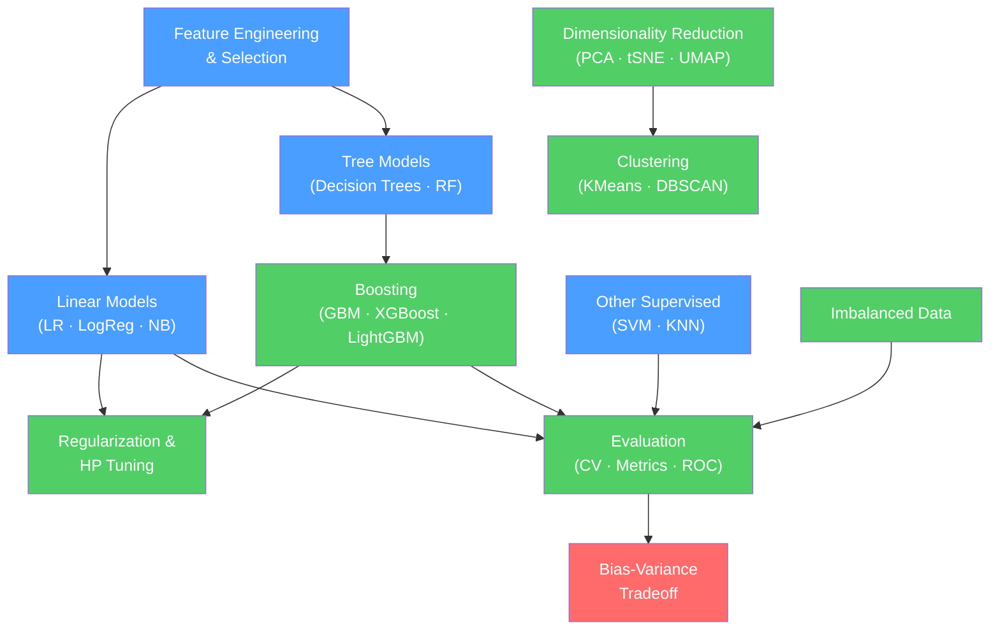

# 🗺️ Classical ML — Map of Content

> [!info] How to use this map
> Start with Fundamentals, follow the arrows, and use the Learning Path below as your guide.
> Each node links to a full note. Come back here when you feel lost.

---

## Concept Map

*(Blue = fundamental, Green = intermediate, Red = advanced)*

---

## Learning Path

1. [[Linear_Regression]] — the simplest supervised model; introduces MSE loss, the normal equation, and gradient descent in the clearest possible setting.
2. [[Logistic_Regression]] — extends linear regression to classification; introduces sigmoid output, cross-entropy loss, and probabilistic predictions.
3. [[Regularization]] — prevents overfitting; L1 (Lasso) and L2 (Ridge) penalties appear in almost every model going forward.
4. [[Decision_Trees]] — first non-linear model; introduces information gain, Gini impurity, and the tree paradigm that boosting builds on.
5. [[Random_Forests]] — bagging ensemble of trees; introduces variance reduction through averaging and the power of diversity.
6. [[Gradient_Boosting]] — sequential error-correcting ensemble; the theoretical foundation for XGBoost and LightGBM.
7. [[XGBoost]] — regularized gradient boosting; the industry workhorse for tabular data competitions and production systems.
8. [[LightGBM]] — histogram-based boosting; faster and more memory-efficient than XGBoost on large datasets.
9. [[SVM]] — maximum-margin classifier; introduces the kernel trick for non-linear decision boundaries.
10. [[KNN]] — lazy learning via nearest neighbors; a useful baseline and intuition builder for distance-based reasoning.
11. [[Naive_Bayes]] — probabilistic classifier with conditional independence assumption; fast and surprisingly robust baseline.
12. [[Cross_Validation]] — the correct way to evaluate models; k-fold, stratified k-fold, and time-series splits.
13. [[Classification_Metrics]] — precision, recall, F1-score, confusion matrix; metrics that matter when accuracy is not enough.
14. [[Regression_Metrics]] — MAE, MSE, RMSE, R²; choosing the right metric for your regression problem.
15. [[ROC_and_AUC]] — threshold-independent classification performance; understanding the ROC curve and AUC score.
16. [[Bias_Variance_Tradeoff]] — unified theory of underfitting and overfitting; the framework that explains every model selection decision.
17. [[Feature_Engineering]] — transforming raw features into representations that algorithms can learn from.
18. [[Feature_Selection]] — removing irrelevant and redundant features; filter, wrapper, and embedded methods.
19. [[Handling_Imbalanced_Data]] — oversampling (SMOTE), undersampling, class weights; what to do when classes are unequal.
20. [[Ensemble_Methods]] — theoretical foundation of bagging, boosting, and stacking; when and why ensembles beat individual models.
21. [[Hyperparameter_Tuning]] — grid search, random search, Bayesian optimization; finding the best model configuration.
22. [[PCA]] — principal component analysis; dimensionality reduction via eigendecomposition of the covariance matrix.
23. [[tSNE]] — t-SNE for visualization; non-linear dimensionality reduction that preserves local structure.
24. [[UMAP]] — faster and more scalable than t-SNE; preserves both local and global structure.
25. [[KMeans]] — centroid-based clustering; the default starting point for unsupervised learning.
26. [[DBSCAN]] — density-based clustering; handles noise and non-spherical cluster shapes.
27. [[Hierarchical_Clustering]] — builds a dendrogram; useful when the number of clusters is unknown.

---

## All Notes in This Section

### Supervised Learning

| Note | Core Idea | Difficulty |
|------|-----------|------------|
| [[Linear_Regression]] | Fit a hyperplane by minimizing MSE; normal equation or gradient descent | Beginner |
| [[Logistic_Regression]] | Binary/multiclass classification via sigmoid/softmax; MLE under Bernoulli model | Beginner |
| [[Decision_Trees]] | Recursive feature splits using Gini/entropy; interpretable, prone to overfitting | Beginner |
| [[Random_Forests]] | Bagging ensemble of decorrelated trees; robust and fast to train | Intermediate |
| [[Gradient_Boosting]] | Additive model that fits residuals sequentially; powerful but slow | Intermediate |
| [[XGBoost]] | Regularized GBM with second-order gradients; the Kaggle champion algorithm | Intermediate |
| [[LightGBM]] | Histogram-based boosting; leaf-wise splits; fastest for large datasets | Intermediate |
| [[SVM]] | Maximum-margin hyperplane; kernel trick maps data to higher dimensions | Intermediate |
| [[KNN]] | Classify by majority vote of k nearest neighbors; no training, slow at inference | Beginner |
| [[Naive_Bayes]] | Bayes + conditional independence; fast probabilistic baseline for text | Beginner |

### Unsupervised Learning

| Note | Core Idea | Difficulty |
|------|-----------|------------|
| [[KMeans]] | Assign points to k centroids, then update centroids; sensitive to init | Beginner |
| [[DBSCAN]] | Groups dense regions; labels sparse points as noise; no k needed | Intermediate |
| [[Hierarchical_Clustering]] | Agglomerative or divisive; produces a dendrogram for visual exploration | Intermediate |
| [[PCA]] | Projects data onto directions of maximum variance (eigenvectors of covariance) | Intermediate |
| [[tSNE]] | Non-linear 2D/3D visualization; minimizes KL divergence between neighborhoods | Intermediate |
| [[UMAP]] | Manifold learning for visualization and general dimensionality reduction | Intermediate |

### Evaluation

| Note | Core Idea | Difficulty |
|------|-----------|------------|
| [[Cross_Validation]] | Estimate generalization error via held-out folds; prevents test set leakage | Beginner |
| [[Classification_Metrics]] | Precision, recall, F1, confusion matrix — when accuracy is not enough | Beginner |
| [[Regression_Metrics]] | MAE, MSE, RMSE, MAPE, R² — choosing the right metric for regression | Beginner |
| [[ROC_and_AUC]] | Threshold-free performance; AUC = probability model ranks positive above negative | Intermediate |
| [[Bias_Variance_Tradeoff]] | Every error = bias² + variance + noise; the theory behind overfitting/underfitting | Intermediate |

### Techniques

| Note | Core Idea | Difficulty |
|------|-----------|------------|
| [[Feature_Engineering]] | Creating informative features: polynomials, interactions, binning, encoding | Intermediate |
| [[Feature_Selection]] | Filter (correlation), wrapper (RFE), embedded (LASSO) — keep only what matters | Intermediate |
| [[Handling_Imbalanced_Data]] | SMOTE, class weights, threshold tuning, resampling strategies | Intermediate |
| [[Regularization]] | L1 (sparsity), L2 (shrinkage), ElasticNet — penalize model complexity | Intermediate |
| [[Ensemble_Methods]] | Bagging (variance↓), boosting (bias↓), stacking (both↓) | Intermediate |
| [[Hyperparameter_Tuning]] | Grid search, random search, Bayesian optimization, early stopping | Intermediate |

---

## Key Questions This Section Answers

- When should you use a tree-based model instead of a linear model?
- What is the difference between bagging (Random Forests) and boosting (XGBoost)? When does each win?
- How do you diagnose whether your model is overfitting or underfitting, and what do you do about it?
- What does PCA actually compute, and when is dimensionality reduction necessary?
- How do you handle a dataset where 99% of labels are class 0 and 1% are class 1?
- What metrics should you report for an imbalanced binary classification problem?
- Why can XGBoost outperform a vanilla Random Forest on the same dataset?

### Reinforcement Learning

| Note | Core Idea | Difficulty |
|------|-----------|------------|
| [[RL_Fundamentals]] | MDP formalism, Bellman equations, V(s) vs Q(s,a), on-policy vs off-policy | Intermediate |
| [[Q_Learning_and_SARSA]] | Tabular TD algorithms; off-policy Q-Learning vs on-policy SARSA; ε-greedy exploration | Intermediate |
| [[Deep_Q_Networks]] | DQN: neural Q-function + experience replay + target network; Double/Dueling/PER/Rainbow variants | Advanced |
| [[Policy_Gradient_Methods]] | REINFORCE, Actor-Critic, PPO; optimize π directly; continuous actions; RLHF foundation | Advanced |
| [[Multi_Agent_and_Inverse_RL]] | MARL (CTDE, MADDPG, QMIX), IRL, GAIL, RLHF connection | Advanced |

---

## Connections to Other Sections

- [[_MOC_Foundations]] — probability theory (Naive Bayes, MLE), optimization (gradient boosting), and linear algebra (PCA, SVM kernels) are prerequisites from the Foundations section
- [[_MOC_Deep_Learning]] — ensemble ideas recur in transformer blocks; decision tree intuitions help with understanding attention-based feature selection
- [[_MOC_AI_ML_Master]] — Reinforcement Learning section (RL Fundamentals through Multi-Agent & Inverse RL) is the gateway to deep RL and RLHF

---

#MOC #AI-ML #Classical-ML
