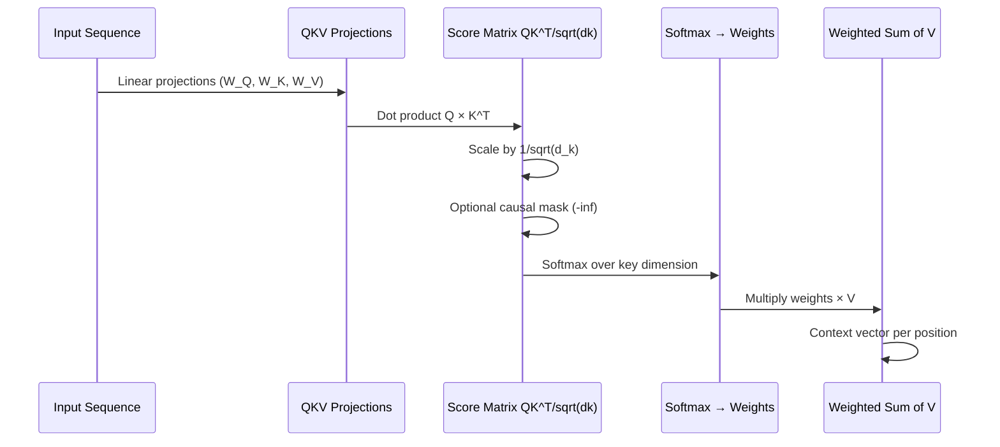

# 🔦 Attention Mechanism

> [!abstract] TL;DR
> Attention lets a model focus on the most relevant parts of an input sequence when producing each output element. Scaled dot-product attention computes relevance scores between a **query** and all **keys**, scales them to prevent softmax saturation, then uses those scores to take a weighted sum of **values**. Multi-head attention runs this in parallel across multiple subspaces. This single idea is the engine of every modern LLM.

---

## Intuition — Analogy First

You're in a **massive library** trying to answer a specific question (your *query*). Every book has a title on its spine (its *key*). You glance at spines, identify the most relevant books, then actually read those books (the *values*) — spending more time on the most relevant ones.

Crucially:
- **Query**: "What do I want to know?" (e.g., the current word being decoded)
- **Keys**: "What does each position advertise about itself?" (compressed labels for all input positions)
- **Values**: "What is the actual information at each position?" (the rich content to retrieve)

The **attention score** between a query and a key is like a relevance match. Softmax turns raw scores into a probability distribution (attention weights), and the weighted sum over values is your answer — a mixture tilted toward the most relevant sources.

**Self-attention** means the library is the *same sequence you're reading* — each word looks at every other word to gather context. This is why "bank" in "river bank" attends to "river" more than to "money".

---

## How It Works — Mechanics

### Scaled Dot-Product Attention
1. Compute similarity scores: $\text{scores} = QK^\top$ — matrix of dot products between every query and every key.
2. Scale by $1/\sqrt{d_k}$ — prevents large dot products from saturating softmax (explained in math section).
3. Apply optional **causal mask** (decoder: block future positions by setting their scores to $-\infty$).
4. Softmax → attention weights (sum to 1 per query row).
5. Weighted sum of values → output.

### Self-Attention vs Cross-Attention
- **Self-attention**: Q, K, V all come from the *same* sequence. Each position contextualises itself using the whole sequence.
- **Cross-attention**: Q from one sequence (decoder), K and V from another (encoder). Used in encoder-decoder models for translation.

### Multi-Head Attention
Instead of one set of Q/K/V projections:
1. Project Q, K, V into `h` different lower-dimensional subspaces (heads).
2. Run scaled dot-product attention independently in each head.
3. Concatenate all head outputs, project back to model dimension.

Different heads learn to attend to different types of relationships: syntactic dependencies, coreference, positional proximity, semantic similarity — simultaneously.



---

## The Math

### Scaled Dot-Product Attention
$$\text{Attention}(Q, K, V) = \text{softmax}\!\left(\frac{QK^\top}{\sqrt{d_k}}\right) V$$

Where:
- $Q \in \mathbb{R}^{n \times d_k}$: $n$ queries of dimension $d_k$
- $K \in \mathbb{R}^{m \times d_k}$: $m$ keys of dimension $d_k$
- $V \in \mathbb{R}^{m \times d_v}$: $m$ values of dimension $d_v$
- Output $\in \mathbb{R}^{n \times d_v}$: $n$ context vectors

**Why $\sqrt{d_k}$ scaling?**
Dot products grow with dimensionality. For random vectors with unit variance, $Q \cdot K$ has variance $d_k$, so std $= \sqrt{d_k}$. Without scaling, large $d_k$ (e.g., 512) pushes scores into saturation zones of softmax where gradients $\to 0$. Dividing by $\sqrt{d_k}$ normalises variance back to $\approx 1$.

### Multi-Head Attention
$$\text{MultiHead}(Q,K,V) = \text{Concat}(\text{head}_1, \ldots, \text{head}_h)\,W^O$$
$$\text{head}_i = \text{Attention}(QW_i^Q,\; KW_i^K,\; VW_i^V)$$

Where $W_i^Q \in \mathbb{R}^{d_\text{model} \times d_k}$, $d_k = d_v = d_\text{model}/h$.

**Complexity**: $O(n^2 d)$ in time and memory for sequence length $n$ — the quadratic attention bottleneck that motivates FlashAttention, sparse attention, etc.

---

## Code Demo

```python
import torch
import torch.nn as nn
import torch.nn.functional as F
import math

# ----- Manual scaled dot-product attention -----
def scaled_dot_product_attention(Q, K, V, mask=None):
    """
    Args:
        Q: (batch, heads, seq_q, d_k)
        K: (batch, heads, seq_k, d_k)
        V: (batch, heads, seq_k, d_v)
        mask: (batch, 1, seq_q, seq_k) — True where positions are masked
    Returns:
        output: (batch, heads, seq_q, d_v)
        weights: (batch, heads, seq_q, seq_k)
    """
    d_k = Q.size(-1)
    scores = torch.matmul(Q, K.transpose(-2, -1)) / math.sqrt(d_k)  # (B,H,q,k)
    
    if mask is not None:
        scores = scores.masked_fill(mask, float('-inf'))
    
    weights = F.softmax(scores, dim=-1)   # (B, H, q, k) — sums to 1 over k
    weights = torch.nan_to_num(weights)   # handle -inf rows → all-zero after softmax
    output = torch.matmul(weights, V)     # (B, H, q, d_v)
    return output, weights

# ----- Multi-Head Attention from scratch -----
class MultiHeadAttention(nn.Module):
    def __init__(self, d_model, n_heads, dropout=0.1):
        super().__init__()
        assert d_model % n_heads == 0
        self.d_k = d_model // n_heads
        self.n_heads = n_heads
        
        self.W_q = nn.Linear(d_model, d_model, bias=False)
        self.W_k = nn.Linear(d_model, d_model, bias=False)
        self.W_v = nn.Linear(d_model, d_model, bias=False)
        self.W_o = nn.Linear(d_model, d_model, bias=False)
        self.dropout = nn.Dropout(dropout)

    def forward(self, query, key, value, mask=None):
        B, T_q, _ = query.shape
        _, T_k, _ = key.shape

        def split_heads(x, T):
            # (B, T, d_model) → (B, n_heads, T, d_k)
            return x.view(B, T, self.n_heads, self.d_k).transpose(1, 2)

        Q = split_heads(self.W_q(query), T_q)
        K = split_heads(self.W_k(key),   T_k)
        V = split_heads(self.W_v(value), T_k)

        attn_out, weights = scaled_dot_product_attention(Q, K, V, mask)
        
        # (B, n_heads, T_q, d_k) → (B, T_q, d_model)
        attn_out = attn_out.transpose(1, 2).contiguous().view(B, T_q, -1)
        return self.W_o(attn_out), weights

# ----- Test -----
d_model, n_heads, seq_len, batch = 512, 8, 100, 4
mha = MultiHeadAttention(d_model, n_heads)

x = torch.randn(batch, seq_len, d_model)
out, attn_weights = mha(x, x, x)          # self-attention
print(out.shape)          # torch.Size([4, 100, 512])
print(attn_weights.shape) # torch.Size([4, 8, 100, 100])

# ----- Visualising attention weights for one head -----
import matplotlib
matplotlib.use("Agg")
import matplotlib.pyplot as plt

fig, ax = plt.subplots(figsize=(8, 8))
head_0_weights = attn_weights[0, 0].detach().numpy()  # (100, 100)
im = ax.imshow(head_0_weights, cmap="viridis", aspect="auto")
ax.set_xlabel("Key position (what is attended to)")
ax.set_ylabel("Query position (what is doing the attending)")
ax.set_title("Attention weights — head 0")
plt.colorbar(im, ax=ax)
plt.tight_layout()
# plt.savefig("attention_weights.png")

# ----- Causal mask (for autoregressive decoding) -----
def causal_mask(seq_len, device="cpu"):
    """Upper-triangular mask: True = masked (cannot attend to future)"""
    mask = torch.triu(torch.ones(seq_len, seq_len, device=device), diagonal=1).bool()
    return mask.unsqueeze(0).unsqueeze(0)  # (1, 1, T, T)

mask = causal_mask(seq_len)
out_masked, _ = mha(x, x, x, mask=mask)
print("Causal output:", out_masked.shape)  # same shape

# ----- PyTorch built-in (recommended for production) -----
mha_builtin = nn.MultiheadAttention(d_model, n_heads, batch_first=True)
out_builtin, weights_builtin = mha_builtin(x, x, x)
print("Built-in MHA output:", out_builtin.shape)  # torch.Size([4, 100, 512])
```

---

## Real-World Example

**Attention is the core of GPT, BERT, LLaMA, Whisper, DALL-E — every major modern AI system.**

Specifically, the attention mechanism (and its extension, Transformer self-attention) was THE breakthrough:
- **BERT's masked language model** — each masked token attends to all other tokens in both directions to predict its value. Attention lets "bank" in "I deposited money at the bank" attend to "money" and "deposited" to infer financial sense.
- **GPT autoregressive generation** — each new token is generated by attending to all previous tokens (causal mask), accumulating context. A 128k token context window means 128,000 positions can influence each output token.
- **Whisper (speech recognition)** — cross-attention between audio encoder states (keys/values) and text decoder (queries) enables the model to align audio frames with transcript tokens.

---

## Trade-offs

| Property | Attention | RNN/LSTM | CNN |
|---|---|---|---|
| Long-range dependencies | Excellent (O(1) path between any two positions) | Poor–Good | Poor–Medium |
| Parallelisable training | Yes | No (sequential) | Yes |
| Memory complexity | O(n²) | O(n) | O(n) |
| Compute complexity | O(n²d) | O(nd²) | O(nkd²) |
| Fixed vs dynamic context | Dynamic (content-based) | Fixed window (sliding) | Fixed window (kernel) |
| Position awareness | Requires positional encoding | Built-in via recurrence | Built-in via locality |

---

## When to Use vs Avoid

**Use attention (Transformers) when:**
- Input sequences where distant tokens interact (NLP, long-range document understanding).
- Full sequence available at inference (not streaming real-time).
- Large data and compute available — attention benefits more from scale than RNNs.

**Consider alternatives when:**
- Sequence length is very long (>32k) and you can't use FlashAttention — quadratic memory becomes a problem.
- Real-time streaming inference (RNNs have O(1) per-step cost; attention recalculates all keys/values).
- Extremely memory-constrained edge devices.

---

## Common Pitfalls

1. **`batch_first` inconsistency** — `nn.MultiheadAttention` defaults to `(seq, batch, features)` unless `batch_first=True`. Always set explicitly.
2. **Wrong mask convention** — PyTorch's MHA uses `True = masked (ignored)` for `attn_mask` in additive form, but a boolean key_padding_mask also uses `True = pad`. These are *different* arguments; conflating them silently corrupts attention.
3. **Not scaling** — implementing attention without $\sqrt{d_k}$ is a frequent tutorial bug; gradients collapse at initialisation.
4. **Head dimension confusion** — reshaping `(B, T, d_model)` to `(B, T, n_heads, d_k)` then transposing is easy to get wrong. Use `.view()` + `.transpose()` in the right order and verify shapes immediately.
5. **Attending to padding tokens** — must pass `key_padding_mask` (or equivalent) so padded positions don't contribute to attention — otherwise padding tokens receive non-zero attention weight, distorting representations.

---

## Related Concepts

- [[_MOC_Deep_Learning|↑ Section MOC]]

- [[Transformer_Architecture]] — the full encoder-decoder stack built on multi-head attention
- [[RNN_and_LSTM]] — the architecture attention was designed to replace/complement
- [[Positional_Encoding]] — attention is permutation-invariant; this encodes order
- [[Attention_Is_All_You_Need]] — the 2017 paper that introduced transformers
- [[Flash_Attention]] — IO-aware exact attention that reduces memory from O(n²) to O(n)

---

## Review Questions

1. Why is the $\sqrt{d_k}$ scaling factor needed in scaled dot-product attention? What goes wrong without it, especially as $d_k$ grows large?
2. In multi-head attention with `d_model=512, n_heads=8`, what is `d_k` for each head, and how many total trainable parameters are in the four projection matrices ($W^Q, W^K, W^V, W^O$)?
3. What is the difference between self-attention and cross-attention? Give a concrete example of where each is used in a machine translation system.

---

## Sources

- Bahdanau, Cho & Bengio (2014) — "Neural Machine Translation by Jointly Learning to Align and Translate" (original additive attention)
- Vaswani et al. (2017) — "Attention Is All You Need" (scaled dot-product + multi-head attention; arXiv:1706.03762)
- Illustrated Transformer — Jay Alammar (jalammar.github.io — canonical visual explanation)
- Dao et al. (2022) — "FlashAttention: Fast and Memory-Efficient Exact Attention with IO-Awareness"

#attention #self-attention #multi-head-attention #transformers #nlp #query-key-value #deep-learning
