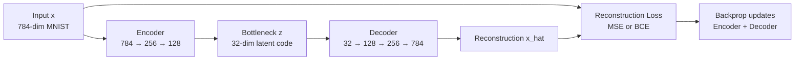
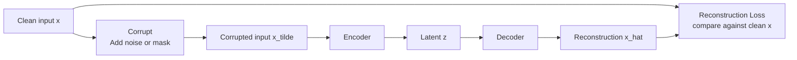

# Autoencoders

> [!abstract] TL;DR
> An autoencoder compresses an input to a compact latent code (encoder) then reconstructs the original from that code (decoder), learning representations without labels. Variants — denoising (DAE), sparse (SAE), contractive (CAE), variational (VAE), vector-quantized (VQ-VAE) — each add different constraints to make the latent space more useful than a mere identity mapping.

---

## Intuition — Analogy First

**Analogy:** Think of an autoencoder as a very lossy telephone game played by a bilingual pair. Alice speaks English (the input), translates into a brief cipher message (the latent code), hands it to Bob, and Bob must reconstruct Alice's original sentence from only that cipher. The pair is scored on reconstruction quality, so they are forced to agree on a cipher that preserves the most important information. The cipher they invent *is* the learned representation.

The compression bottleneck is the forcing function. Without it, the network would just copy the input byte-for-byte and learn nothing. With it, the network must distill structure — the geometry of the cipher space reveals what the data "really" is about.

---

## How It Works

### Core Mechanics

1. **Encoder** — a neural network $f_\phi$ maps the input $x$ to a latent code $z = f_\phi(x)$. The architecture contracts the spatial/feature dimensions progressively (dense layers, strided convolutions).
2. **Bottleneck** (latent space) — $z$ lives in a lower-dimensional space than $x$. The dimensionality ratio determines the compression pressure.
3. **Decoder** — a neural network $g_\theta$ maps $z$ back to a reconstruction $\hat{x} = g_\theta(z)$. Architecture mirrors the encoder with transposed convolutions or upsampling.
4. **Reconstruction loss** — measures how close $\hat{x}$ is to $x$:
   - **MSE** (continuous inputs, e.g., natural images): $\mathcal{L} = \|x - \hat{x}\|_2^2$
   - **BCE** (binary/pixel-level outputs, e.g., MNIST): $\mathcal{L} = -\sum_i [x_i \log \hat{x}_i + (1-x_i)\log(1-\hat{x}_i)]$

Backpropagation flows from the reconstruction loss through decoder and encoder jointly — no labels required.

### Undercomplete vs Overcomplete

| Type | Bottleneck size | Risk | Remedy |
|------|----------------|------|--------|
| **Undercomplete** | `dim(z) < dim(x)` | Too small → lossy but limited capacity | Choose bottleneck size empirically |
| **Overcomplete** | `dim(z) ≥ dim(x)` | Identity mapping — trivial solution | Regularize: sparsity, noise, Jacobian penalty |

An undercomplete autoencoder cannot learn the identity function unless its capacity is very large, so compression itself acts as regularization. An overcomplete one *can* memorize every input; you must add external constraints to force meaningful structure.

### Flow / Architecture



---

## Autoencoder Variants

### Denoising Autoencoder (DAE)

**Core idea:** corrupt the input, train to reconstruct the clean original.

- At each training step, apply a corruption function $\tilde{x} = C(x)$: Gaussian noise, random dropout of pixels, or masked patches.
- The encoder sees $\tilde{x}$; the loss compares decoder output against the *uncorrupted* $x$.
- The model cannot memorize the input because the corrupted version changes each step. It must learn features stable under corruption — which are exactly the semantically meaningful ones.

**Why it works:** the optimal denoiser for a family of corruptions is the score function of the data distribution — so DAEs implicitly learn the data manifold geometry.

**Connection to modern ML:** BERT's masked-token prediction is a denoising autoencoder in token space. Diffusion model training is also a sequence of denoising steps learned by a DAE-like objective.



### Sparse Autoencoder (SAE)

**Core idea:** allow an overcomplete bottleneck but add an L1 penalty that forces most activations to be zero for any given input.

$$\mathcal{L} = \|x - \hat{x}\|^2 + \lambda \|z\|_1$$

- Most neurons in the bottleneck are inactive (zero) for any given example — only a small subset "fires."
- Sparsity prevents the identity mapping: the network cannot route every input feature through its own dedicated neuron without incurring the L1 cost.
- Each active neuron becomes responsible for a specific, interpretable concept.

**Mechanistic interpretability of LLMs:** This is the most active current use case. Large language models are hypothesized to store more features than they have neurons via *superposition* — multiple concepts are encoded as overlapping linear combinations across the same neurons (polysemanticity). Sparse autoencoders trained on internal activations of an LLM decompress these superpositions into monosemantic, human-interpretable directions. Anthropic's research has used SAEs to identify thousands of features inside Claude's residual stream, including features for specific cities, emotions, and logical relationships. This connects to [[SHAP]]-style interpretability but operates at the representation level rather than the input attribution level.

### Contractive Autoencoder (CAE)

**Core idea:** penalize the sensitivity of the encoder's output to small changes in the input.

$$\mathcal{L} = \|x - \hat{x}\|^2 + \lambda \left\| \frac{\partial f_\phi(x)}{\partial x} \right\|_F^2$$

The Frobenius norm of the Jacobian of the hidden layer activations with respect to the input is minimized. This forces the encoder to be locally insensitive — small perturbations of $x$ produce negligible changes in $z$. The latent space is "flat" around each training example, which is a robust, manifold-aligned representation. CAEs achieve similar robustness to DAEs but through an analytic penalty rather than stochastic corruption.

### Variational Autoencoder (VAE)

The VAE transforms the bottleneck from a deterministic point into a probability distribution — the encoder outputs a mean vector $\mu$ and log-variance $\log\sigma^2$ instead of $z$ directly. Sampling uses the reparameterization trick $z = \mu + \sigma \cdot \varepsilon$ where $\varepsilon \sim \mathcal{N}(0, I)$, which keeps gradients flowing through $\mu$ and $\sigma$.

Training maximizes the Evidence Lower BOund (ELBO):
$$\text{ELBO} = \underbrace{\mathbb{E}[\log p(x|z)]}_{\text{reconstruction}} - \underbrace{D_{KL}(q(z|x) \| p(z))}_{\text{regularization toward } \mathcal{N}(0,I)}$$

The KL term pulls all posteriors toward a standard Gaussian prior, creating a continuous, well-populated latent space from which you can sample new data points. See [[VAE]] for the full treatment.

### VQ-VAE (Vector Quantized VAE)

**Core idea:** replace the continuous latent code with a *discrete* index into a learned codebook.

1. The encoder maps $x$ to a continuous vector $z_e$.
2. Find the nearest codebook entry: $k = \arg\min_j \|z_e - e_j\|_2$
3. The decoder receives the discrete embedding $e_k$ (not $z_e$ directly).
4. **Straight-through estimator:** since argmin is not differentiable, the gradient of the decoder loss is copied through to the encoder unchanged (as if $e_k = z_e$). The codebook entries are updated via an exponential moving average of the encoder outputs assigned to them.

```mermaid
graph LR
    A[Input x] --> B[Encoder\nCNN]
    B --> C[Continuous vector z_e]
    C --> D[Nearest neighbor lookup\nin codebook E]
    D --> E[Discrete code index k\nand embedding e_k]
    E --> F[Decoder\nCNN]
    F --> G[Reconstruction x_hat]
    E --> H[Codebook loss\n||sg_z_e - e_k||^2\ncommitment loss\n||z_e - sg_e_k||^2]
    G --> I[Reconstruction loss]
```

**Why discrete codes matter:** language models naturally work over discrete token vocabularies. VQ-VAE makes images similarly tokenizable — each image becomes a sequence of discrete indices, enabling transformers and autoregressive models to generate images token-by-token. DALL-E 1 used VQ-VAE to encode images as 1024 discrete tokens, then GPT-like generation over those tokens. The latent space of Stable Diffusion (via [[Stable_Diffusion]]) compresses images to 8x smaller spatial resolution using a VAE-derived quantized compression.

---

## Code Demo

```python
import torch
import torch.nn as nn
import torch.nn.functional as F
from torch.utils.data import DataLoader
from torchvision import datasets, transforms

# ============================================================
# 1. Basic Undercomplete Autoencoder (MNIST, 784 → 32 → 784)
# ============================================================
class Autoencoder(nn.Module):
    def __init__(self, input_dim=784, hidden_dim=256, latent_dim=32):
        super().__init__()
        self.encoder = nn.Sequential(
            nn.Linear(input_dim, hidden_dim),
            nn.ReLU(),
            nn.Linear(hidden_dim, latent_dim),
            nn.ReLU(),
        )
        self.decoder = nn.Sequential(
            nn.Linear(latent_dim, hidden_dim),
            nn.ReLU(),
            nn.Linear(hidden_dim, input_dim),
            nn.Sigmoid(),   # output in [0,1] to match MNIST pixel range
        )

    def encode(self, x):
        return self.encoder(x.view(-1, 784))

    def decode(self, z):
        return self.decoder(z)

    def forward(self, x):
        z = self.encode(x)
        return self.decode(z), z


# ============================================================
# 2. Denoising Autoencoder — same architecture, corrupt input
# ============================================================
def add_gaussian_noise(x, std=0.3):
    """Corrupt input with Gaussian noise, clamp to valid range."""
    return torch.clamp(x + std * torch.randn_like(x), 0.0, 1.0)

def add_masking_noise(x, mask_prob=0.5):
    """Randomly zero out pixels (dropout noise)."""
    mask = torch.bernoulli(torch.ones_like(x) * (1 - mask_prob))
    return x * mask


# ============================================================
# 3. Sparse Autoencoder — L1 penalty on latent activations
# ============================================================
class SparseAutoencoder(nn.Module):
    def __init__(self, input_dim=784, latent_dim=512, sparsity_lambda=1e-4):
        super().__init__()
        # Overcomplete: latent_dim (512) > input_dim would need feature dim < 512
        # Typical SAE: latent_dim >> input_dim to allow feature superposition to decompose
        self.sparsity_lambda = sparsity_lambda
        self.encoder = nn.Sequential(
            nn.Linear(input_dim, latent_dim),
            nn.ReLU(),  # ReLU naturally gives non-negative sparse activations
        )
        self.decoder = nn.Linear(latent_dim, input_dim)

    def forward(self, x):
        x_flat = x.view(-1, 784)
        z = self.encoder(x_flat)
        x_hat = self.decoder(z)
        return x_hat, z

    def loss(self, x, x_hat, z):
        recon_loss = F.mse_loss(x_hat, x.view(-1, 784), reduction='mean')
        sparsity_loss = self.sparsity_lambda * z.abs().mean()
        return recon_loss + sparsity_loss, recon_loss.item(), sparsity_loss.item()


# ============================================================
# Training loop (works for basic AE and DAE with noise_fn)
# ============================================================
def train_autoencoder(model, loader, epochs=20, noise_fn=None, lr=1e-3):
    device = torch.device("cuda" if torch.cuda.is_available() else "cpu")
    model = model.to(device)
    optimizer = torch.optim.Adam(model.parameters(), lr=lr)

    for epoch in range(epochs):
        model.train()
        total_loss = 0.0
        for images, _ in loader:
            images = images.to(device)
            # For DAE: corrupt input, but compute loss against clean images
            inputs = noise_fn(images) if noise_fn is not None else images

            optimizer.zero_grad()
            x_hat, z = model(inputs)

            if hasattr(model, 'loss'):
                loss, _, _ = model.loss(images, x_hat, z)   # SAE uses its own loss
            else:
                # BCE for standard AE on MNIST (pixel-wise binary targets)
                loss = F.binary_cross_entropy(x_hat, images.view(-1, 784), reduction='mean')

            loss.backward()
            optimizer.step()
            total_loss += loss.item()
        print(f"Epoch {epoch+1:02d} | Loss: {total_loss / len(loader):.4f}")

    return model


# ============================================================
# Run it
# ============================================================
transform = transforms.Compose([transforms.ToTensor()])
train_data = datasets.MNIST("data/", train=True, download=True, transform=transform)
loader = DataLoader(train_data, batch_size=256, shuffle=True, num_workers=2)

# Basic AE
ae = train_autoencoder(Autoencoder(), loader, epochs=20)

# Denoising AE (same model, different training)
dae = train_autoencoder(Autoencoder(), loader, epochs=20, noise_fn=add_gaussian_noise)

# Sparse AE
sae = train_autoencoder(SparseAutoencoder(), loader, epochs=20)

# Encode test images and inspect latent space
ae.eval()
test_imgs = next(iter(DataLoader(
    datasets.MNIST("data/", train=False, download=True, transform=transform),
    batch_size=64, shuffle=False
)))[0]
with torch.no_grad():
    z = ae.encode(test_imgs)    # z.shape: [64, 32] — the latent codes
    reconstructed, _ = ae(test_imgs)

# Anomaly detection: reconstruction error as anomaly score
def anomaly_score(model, x):
    model.eval()
    with torch.no_grad():
        x_hat, _ = model(x)
        score = F.mse_loss(x_hat, x.view(-1, 784), reduction='none').mean(dim=1)
    return score   # high score = anomaly

scores = anomaly_score(ae, test_imgs)
print(f"Normal digit reconstruction error stats: mean={scores.mean():.4f}, std={scores.std():.4f}")
```

---

## Real-World Example

> **Example: Anomaly detection in manufacturing (AWS Lookout for Equipment).** Industrial sensors produce thousands of time-series signals per machine. Autoencoders are trained on normal operating data — the model learns to reconstruct healthy sensor patterns. During inference, reconstruction error spikes when the machine deviates from learned norms (early bearing failure, overheating). Because the model was trained only on normal data (no labeled anomaly examples), it generalizes to novel failure modes that were never seen during training — unlike supervised classifiers.

> **Example: Anthropic's Sparse Autoencoder interpretability research.** Anthropic trains sparse autoencoders on the residual stream activations of Claude. The SAE's latent dimensions (features) are found to correspond to single human-interpretable concepts — a feature for the word "banana", a feature for "deceptive intent", a feature for "San Francisco". This technique, scaling sparse dictionary learning, is a core tool in the mechanistic interpretability program for understanding what computations happen inside LLMs.

> **Example: Stable Diffusion's latent compression.** The LDM (Latent Diffusion Model) behind Stable Diffusion uses a KL-regularized autoencoder (close relative of VAE) to compress 512×512 RGB images to 64×64×4 latent tensors — an 8× spatial compression. The diffusion denoising process runs in this 4096-dimensional latent space rather than the 786,432-dimensional pixel space, making training and inference dramatically cheaper. See [[Stable_Diffusion]] for details.

---

## Autoencoders vs PCA

| Dimension | Autoencoder | PCA |
|-----------|-------------|-----|
| Transformation | Non-linear (arbitrary depth) | Strictly linear |
| Objective | Reconstruction loss (MSE/BCE) | Maximize explained variance |
| Principal components | Implicit, non-orthogonal | Explicit, orthogonal eigenvectors |
| Interpretability | Black-box latent | Loadings directly inspectable |
| Scalability | Needs GPU for large inputs | Exact SVD O(d³); randomized for large d |
| When better | Non-linear manifolds, images, text | Linear structure, tabular data, whitening |

PCA is a linear autoencoder with a single hidden layer, no activation function, and tied weights — proven mathematically. The non-linear generalization that autoencoders provide is what makes them powerful for images and audio, where the data manifold is highly curved.

---

## Autoencoders vs GANs vs Diffusion Models

| Criterion | Autoencoder | GAN | Diffusion |
|-----------|-------------|-----|-----------|
| Training objective | Reconstruction | Adversarial minimax | Denoising (predict noise) |
| Generative capability | Only with prior (VAE/VQ-VAE) | Yes (sample noise → image) | Yes (iterative denoising) |
| Sample quality | Low–medium (blurry) | High (StyleGAN) | State of the art |
| Training stability | Stable | Fragile (mode collapse) | Very stable |
| Latent structure | Explicit bottleneck | Implicit (Z space) | None (iterative process) |
| Inference speed | Fast (one forward pass) | Fast | Slow (50–1000 steps) |
| Encoding inputs | Yes (explicit encoder) | Rarely (GAN inversion needed) | Yes (DDIM inversion) |
| Primary role today | Compression, interpretability, components | Perceptual loss training | Image/video generation |

The relationship: VAE and VQ-VAE are components *inside* Stable Diffusion — the autoencoder compresses images and the diffusion model generates in that compressed latent space. [[GAN]] loss functions are used to sharpen the VAE decoder output. These paradigms are complementary, not competing.

---

## Trade-offs

| Aspect | Basic AE | Denoising AE (DAE) | Sparse AE (SAE) | VQ-VAE |
|--------|----------|-------------------|-----------------|--------|
| Latent space | Deterministic continuous | Deterministic continuous | Sparse continuous | Discrete codebook |
| Generative (sample new data) | No (no prior) | No | No | Yes (with autoregressive prior) |
| Reconstruction quality | High | High | High | High |
| Representation quality | Medium | High (noise-robust) | High (interpretable) | High (discrete structure) |
| Training complexity | Simple | Simple (add noise step) | Moderate (L1 tuning) | Complex (straight-through) |
| Anomaly detection | Excellent | Excellent | Good | Good |
| Interpretability | Low | Low | Very high (monosemantic) | Medium (codebook) |
| LLM interpretability use | No | No (BERT analog) | Yes (primary tool) | No |

---

## When to Use vs Avoid

**Use when:**
- You need unsupervised feature learning without labels.
- Anomaly detection: train on normal data, flag high reconstruction errors.
- Dimensionality reduction for non-linear manifolds (images, spectrograms).
- Compression: store latent code instead of full input.
- Denoising: DAE for signal recovery from corrupted inputs.
- Mechanistic interpretability: SAE to decompose LLM activations.
- Image tokenization for generative models: VQ-VAE.

**Avoid when:**
- You need sharp, photorealistic image generation — use Diffusion or GAN instead.
- Your data structure is approximately linear — PCA is faster and more interpretable.
- You want controlled sampling over a well-defined prior without the blurriness tradeoff of VAE — use VQ-VAE or Diffusion.
- Labeled data is available and task is discriminative — a supervised model will outperform representation learning followed by a head.

---

## Common Pitfalls

- **Identity mapping in overcomplete AEs** — If the bottleneck dimension exceeds the input or if encoder/decoder have skip connections, the network learns to copy input trivially, achieving zero loss with zero understanding. Fix: enforce undercomplete bottleneck, or add sparsity / noise constraints.

- **Reconstruction loss blurriness** — MSE optimizes for the mean of plausible reconstructions, producing blurry outputs when the model is uncertain. Fix: use perceptual (feature-level) loss, adversarial loss on the decoder, or switch to VQ-VAE with a powerful prior.

- **Choosing bottleneck size without validation** — Too small → too lossy for downstream tasks; too large without regularization → overfitting. Fix: sweep over bottleneck dimensions, monitor downstream task performance (not just reconstruction loss) and anomaly detection AUC.

- **Using autoencoder latents as drop-in features** — Autoencoder representations are optimized for reconstruction, not for classification or retrieval. They may discard label-relevant information that is easy to reconstruct (e.g., class information encoded in high-frequency textures). Fix: use a task-relevant auxiliary loss, or prefer contrastive/self-supervised methods (SimCLR, DINO) for discriminative features.

- **Not detaching in VQ-VAE** — The straight-through estimator requires carefully stopping gradients (sg[·] = detach) in the commitment and codebook losses. Forgetting to detach causes incorrect gradient flow and codebook collapse (all codes become the same embedding).

- **Sparsity coefficient tuning in SAEs** — λ too high → all activations dead (dying ReLU at scale); λ too low → no sparsity, no interpretability. Fix: monitor fraction of dead neurons and average L0 norm of activations during training; anneal λ or use auxiliary reconstruction loss per neuron.

---

## Related Concepts

- [[_MOC_Deep_Learning|Section MOC]]

- [[VAE]] — probabilistic extension: encoder outputs distribution, reparameterization trick, ELBO loss; enables proper generative sampling
- [[GAN]] — adversarial alternative for generation; often used alongside autoencoders (perceptual/adversarial loss on VAE decoder)
- [[Diffusion_Models]] — denoising-based generation; DAE is the conceptual ancestor; Stable Diffusion runs diffusion inside a VAE latent space
- [[Stable_Diffusion]] — VQ-VAE/KL-AE compresses images to 64×64 latent tensors; diffusion generates in that space
- [[PCA]] — linear special case of an undercomplete autoencoder; autoencoders generalize PCA to non-linear manifolds
- [[Neural_Network_Basics]] — encoder and decoder are standard feedforward or convolutional networks
- [[Loss_Functions]] — MSE and BCE reconstruction losses; ELBO for VAE; L1 sparsity for SAE; Jacobian Frobenius for CAE
- [[Backpropagation]] — gradients flow jointly through encoder and decoder; straight-through estimator is a specialized backprop trick for VQ-VAE
- [[SHAP]] — both are interpretability tools; SAEs operate at the representation level (what does the network encode?), SHAP at the attribution level (which input features drive a prediction?)

---

## Review Questions

1. An autoencoder with no activation functions, a single hidden layer, and tied weights (decoder weights = encoder weights transposed) is equivalent to PCA. What does this reveal about what a standard nonlinear autoencoder is actually learning relative to PCA?

2. You train a denoising autoencoder on clean manufacturing sensor data and then apply it in production. A novel machine failure type occurs that was never in training. Will the anomaly detection approach still work? Why or why not, and what failure modes could fool it?

3. Sparse autoencoders used in LLM interpretability are overcomplete — the latent dimension is far larger than the residual stream dimension. Why does sparsity prevent the identity mapping, and why does overcomplete + sparse beat undercomplete for finding interpretable features?

4. Compare VQ-VAE and VAE from the perspective of downstream generative modeling. What does using discrete codes enable that a continuous Gaussian latent does not, and what does it sacrifice?

---

## Sources

- [Auto-Encoding Variational Bayes (Kingma & Welling, 2013)](https://arxiv.org/abs/1312.6114)
- [Extracting and Composing Robust Features with Denoising Autoencoders (Vincent et al., 2008)](https://www.cs.toronto.edu/~larocheh/publications/icml-2008-denoising-autoencoders.pdf)
- [Neural Discrete Representation Learning / VQ-VAE (van den Oord et al., 2017)](https://arxiv.org/abs/1711.00937)
- [Contractive Auto-Encoders (Rifai et al., 2011)](https://icml.cc/2011/papers/455_icmlpaper.pdf)
- [Measuring Monosemanticity: SAEs for LLM Interpretability (Bricken et al., Anthropic 2023)](https://transformer-circuits.pub/2023/monosemantic-features/index.html)
- [Scaling Monosemanticity: Extracting Interpretable Features from Claude (Templeton et al., Anthropic 2024)](https://transformer-circuits.pub/2024/scaling-monosemanticity/index.html)
- [High-Resolution Image Synthesis with Latent Diffusion Models (Rombach et al., 2022)](https://arxiv.org/abs/2112.10752)
- [Reducing the Dimensionality of Data with Neural Networks (Hinton & Salakhutdinov, 2006)](https://www.science.org/doi/10.1126/science.1127647)

---

#autoencoders #representation-learning #unsupervised #generative-models #deep-learning #sparse-autoencoder #denoising #VQ-VAE #interpretability
