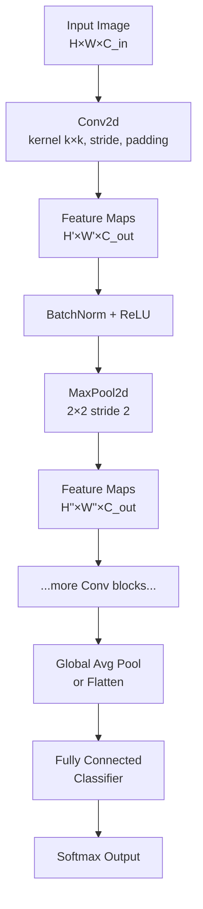

# 🔭 CNN Fundamentals

> [!abstract] TL;DR
> Convolutional Neural Networks apply learned filters (kernels) that slide across spatial input to detect local patterns. Parameter sharing makes them dramatically more efficient than fully-connected layers for image data, and stacking layers builds a hierarchy of features from edges → textures → objects.

---

## Intuition — Analogy First

Imagine a **photographer who switches lenses** to reveal different details of a scene:
- A wide-angle lens (large kernel) captures overall shapes and context.
- A macro lens (small kernel) detects fine edges and textures.
- A polarizing lens (depthwise filter) isolates colour channels.

Each convolution kernel *is* that lens. It slides over the image and at every position asks: "how much does this patch look like what I'm tuned to detect?" The answer becomes one value in a **feature map**. Use 64 different kernels and you get 64 feature maps, each encoding a different pattern.

The crucial insight: **the same lens works anywhere in the photo**. A vertical-edge detector useful in the top-left corner is equally useful in the bottom-right. This is **weight sharing** — the kernel's weights are reused at every spatial position, cutting parameters enormously compared to a fully-connected layer.

---

## How It Works — Mechanics

### Convolution Operation
A 2-D convolution slides kernel $g$ (size $k \times k$) over input $f$ (size $H \times W$):
- At each position $(i, j)$ the element-wise product is summed → one scalar output.
- A **bias** is added; an **activation** (usually ReLU) follows.
- The result across all positions is one **feature map**.

### Stride
Moving the kernel by `stride > 1` downsamples the output:
- `stride=1` → dense output, preserves spatial resolution.
- `stride=2` → halves spatial dimensions, common in downsampling stages.

### Padding
- **Valid** padding: no padding, output shrinks.
- **Same** padding: zero-pad input so output matches input size (at `stride=1`).

### Pooling
Reduces spatial size while keeping the dominant signal:
- **Max pooling** (2×2, stride 2): takes the maximum in each 2×2 window → detects *if* a feature is present anywhere in the patch.
- **Average pooling**: smoother, used in global average pooling (GAP) for classification heads.

### Receptive Field
The region of the original input that influences one neuron deeper in the network. Stacking convolutions exponentially increases receptive field without adding many parameters.

### Channels
- Input: $C_{in}$ channels (3 for RGB).
- Each kernel has shape $k \times k \times C_{in}$.
- With $C_{out}$ kernels you get $C_{out}$ feature maps → the new "channel" depth.



---

## The Math

**Discrete 2-D convolution:**
$$
(f * g)[i, j] = \sum_{m}\sum_{n} f[m, n] \cdot g[i - m,\, j - n]
$$

In practice, CNNs use **cross-correlation** (no kernel flip), but the term "convolution" stuck.

**Output spatial size:**
$$
O = \left\lfloor \frac{I + 2P - K}{S} \right\rfloor + 1
$$
where $I$ = input size, $K$ = kernel size, $P$ = padding, $S$ = stride.

**Parameter count for one Conv layer:**
$$
\text{Params} = (K \times K \times C_{in} + 1) \times C_{out}
$$
vs. a fully-connected layer: $(H \cdot W \cdot C_{in}) \times (H' \cdot W' \cdot C_{out})$ — orders of magnitude more.

---

## Code Demo

```python
import torch
import torch.nn as nn
import torch.optim as optim
from torchvision import datasets, transforms
from torch.utils.data import DataLoader

# ----- Minimal CNN for MNIST -----
class MiniCNN(nn.Module):
    def __init__(self):
        super().__init__()
        # Block 1: 1 → 32 channels, 28×28 → 14×14
        self.block1 = nn.Sequential(
            nn.Conv2d(in_channels=1, out_channels=32,
                      kernel_size=3, stride=1, padding=1),  # 'same' padding
            nn.BatchNorm2d(32),
            nn.ReLU(),
            nn.MaxPool2d(kernel_size=2, stride=2),           # 28→14
        )
        # Block 2: 32 → 64 channels, 14×14 → 7×7
        self.block2 = nn.Sequential(
            nn.Conv2d(32, 64, kernel_size=3, padding=1),
            nn.BatchNorm2d(64),
            nn.ReLU(),
            nn.MaxPool2d(2, 2),                              # 14→7
        )
        self.classifier = nn.Sequential(
            nn.Flatten(),            # 64 × 7 × 7 = 3136
            nn.Linear(64 * 7 * 7, 128),
            nn.ReLU(),
            nn.Dropout(0.5),
            nn.Linear(128, 10),     # 10 MNIST classes
        )

    def forward(self, x):
        x = self.block1(x)
        x = self.block2(x)
        return self.classifier(x)

# ----- Quick output shape verification -----
model = MiniCNN()
dummy = torch.randn(8, 1, 28, 28)   # batch=8, grayscale 28×28
print(model(dummy).shape)            # → torch.Size([8, 10])

# Count parameters
total = sum(p.numel() for p in model.parameters())
print(f"Parameters: {total:,}")      # ~200k vs. ~3M for FC equivalent

# ----- Training on MNIST (abbreviated) -----
device = torch.device("cuda" if torch.cuda.is_available() else "cpu")
model = model.to(device)

transform = transforms.Compose([transforms.ToTensor(),
                                 transforms.Normalize((0.1307,), (0.3081,))])
train_loader = DataLoader(datasets.MNIST(".", train=True,
                          download=True, transform=transform),
                          batch_size=64, shuffle=True)

criterion = nn.CrossEntropyLoss()
optimizer = optim.Adam(model.parameters(), lr=1e-3)

for epoch in range(1):
    model.train()
    for imgs, labels in train_loader:
        imgs, labels = imgs.to(device), labels.to(device)
        optimizer.zero_grad()
        loss = criterion(model(imgs), labels)
        loss.backward()
        optimizer.step()
    print(f"Epoch {epoch+1} done, last loss: {loss.item():.4f}")
```

---

## Real-World Example

**Phone cameras use CNNs end-to-end:**
- *Auto-focus*: a CNN scores sharpness across image patches to find focus plane.
- *Portrait mode*: semantic segmentation CNNs (DeepLab family) distinguish subject from background in real time at 30 fps.
- *Computational photography*: RAW-to-RGB pipelines (e.g., Google HDR+) use CNNs to denoise and enhance.
- *Medical imaging*: FDA-cleared tools for diabetic retinopathy screening (Google's DeepMind system) use ResNet-backed CNNs to flag pathology in retinal photos with specialist-level accuracy.

---

## Trade-offs

| Property | CNN | Fully-Connected | ViT (Transformer) |
|---|---|---|---|
| Parameter efficiency | High (weight sharing) | Low | Medium–High |
| Inductive bias | Strong (locality, translation equivariance) | None | Weak (needs data) |
| Handles long-range dependencies | Poor (shallow nets) | Good | Excellent |
| Data requirements | Medium | High | High |
| Speed on GPU | Excellent | Good | Good (with FlashAttn) |
| Interpretability | Medium (feature vis works) | Low | Low |

---

## When to Use vs Avoid

**Use CNNs when:**
- Input has grid structure with local correlations (images, audio spectrograms, video frames).
- Data is limited — CNNs' inductive bias compensates.
- Inference latency is critical (CNNs still beat ViTs on edge devices).
- Tasks: classification, detection, segmentation, style transfer, super-resolution.

**Avoid CNNs when:**
- Input has no spatial locality (tabular data, molecular graphs — use GNNs).
- You need long-range global context from the start (ViTs or hybrid architectures may win).
- Sequence data with variable length (use RNNs/Transformers).

---

## Common Pitfalls

1. **Wrong padding in output-size formula** — always verify with a dummy forward pass before full training.
2. **Forgetting BatchNorm before activation** — especially in deep nets; omitting it causes slow convergence.
3. **Max pooling too early** — destroys spatial information needed for dense prediction tasks (segmentation, detection). Use stride-2 conv instead.
4. **Not normalising inputs** — pixel values in [0, 255] cause wildly different gradient magnitudes. Always normalise to ~zero mean, unit variance.
5. **Kernel size 1×1 confusion** — 1×1 conv does not look at neighbours; it's a channel-wise linear transform / bottleneck (used in ResNet, Inception).
6. **Channels last vs channels first** — PyTorch defaults to NCHW; some ops expect NHWC. Be explicit with `memory_format`.

---

## Related Concepts

- [[_MOC_Deep_Learning|↑ Section MOC]]

- [[Famous_CNN_Architectures]] — AlexNet through EfficientNet, the evolutionary story
- [[Attention_Mechanism]] — attention as an alternative to convolution for feature aggregation
- [[Batch_Normalization]] — the normalisation trick that made deep CNNs trainable
- [[Vision_Transformer_ViT]] — the transformer applied to image patches
- [[PyTorch_Training_Loop]] — the training harness that wraps this model

---

## Review Questions

1. A Conv2d layer has `in_channels=3, out_channels=64, kernel_size=3, padding=1, stride=1`. How many trainable parameters does it have? What is the output spatial size for a 224×224 input?
2. Why does max pooling provide translation invariance, and when is this property harmful rather than helpful?
3. Explain why parameter sharing in CNNs is valid for images but would be a poor assumption for, say, a spreadsheet of financial data.

---

## Sources

- LeCun et al. (1998) — "Gradient-Based Learning Applied to Document Recognition" (original LeNet)
- CS231n Stanford — Convolutional Neural Networks for Visual Recognition ([cs231n.github.io](https://cs231n.github.io))
- PyTorch docs — `torch.nn.Conv2d` ([pytorch.org/docs](https://pytorch.org/docs))
- Dumoulin & Visin (2016) — "A guide to convolution arithmetic for deep learning" (arXiv:1603.07285)

#cnn #convolution #deep-learning #computer-vision #feature-maps #pooling #weight-sharing
