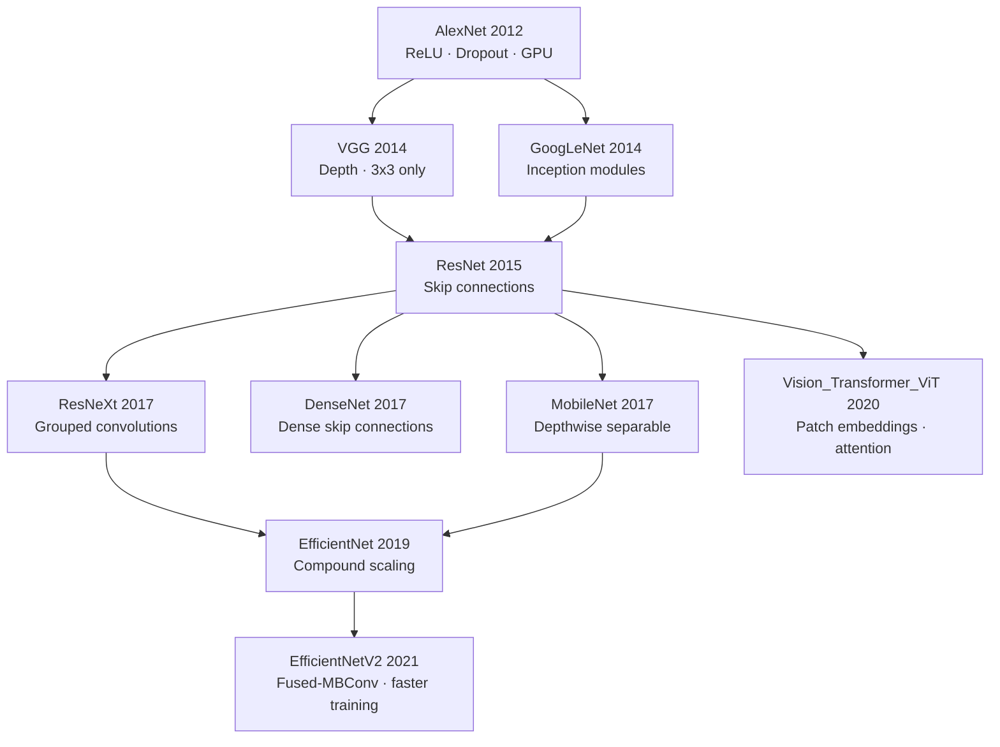

# 🏛️ Famous CNN Architectures

> [!abstract] TL;DR
> The CNN architecture story is one of progressive solutions: AlexNet proved deep learning works at scale, VGG showed depth matters, ResNet solved vanishing gradients with skip connections (the single most important idea), Inception showed parallel multi-scale processing, and EfficientNet showed you should scale all dimensions together. Each model still lives in production code today.

---

## Intuition — Analogy First

Think of it as the **evolution of a skyscraper**:
- **AlexNet (2012)** — someone proved you could build a 8-floor building on GPU hardware. The world was astonished.
- **VGG (2014)** — let's go deeper with 19 floors, keep every floor identical (3×3 bricks only). Clean and systematic.
- **ResNet (2015)** — "the staircase": add elevator shafts (skip connections) so workers can bypass any floor. Now you can build 152 floors without the structure collapsing (vanishing gradients).
- **Inception (2014–2016)** — each floor has multiple rooms in parallel: one for panoramas (7×7), one for detail (1×1), one for medium shots (3×3). Best-of-all-worlds per layer.
- **EfficientNet (2019)** — instead of just adding floors, scale *width*, *depth*, and *resolution* together according to a compound formula. The smart architect.
- **MobileNet (2017)** — build a lightweight prefab structure: swap each layer's brick with a cheaper factorised version (depthwise separable convolutions). Fast enough for a phone.

---

## How It Works — Architecture by Architecture

### AlexNet (2012) — ImageNet breakthrough
Key innovations:
- **ReLU** instead of tanh/sigmoid → faster convergence, no saturation.
- **Dropout** (p=0.5) in FC layers → regularisation at scale.
- **Data augmentation** (flips, crops) + **GPU training** (dual GTX 580s).
- First deep net to win ImageNet by a large margin (top-5 error: 15.3% vs 26.2% runner-up).

### VGG (2014) — Depth through uniformity
- Only uses **3×3 kernels everywhere** (two stacked 3×3 = one 5×5 receptive field, fewer params).
- VGG-16 (16 weight layers), VGG-19 — very deep but very uniform.
- Limitation: 138M parameters, expensive; FC layers are the bottleneck.

### ResNet (2015) — Skip connections as the core idea
The single most influential architecture idea in deep learning:

$$
\mathbf{y} = \mathcal{F}(\mathbf{x}, \{W_i\}) + \mathbf{x}
$$

If the residual block learns nothing ($\mathcal{F} = 0$), the identity is preserved. This means gradients can flow directly through the skip connection — no vanishing. ResNet-152 won ImageNet 2015 (top-5 error: 3.57%).

Variants: ResNet-18/34 (basic blocks), ResNet-50/101/152 (bottleneck blocks with 1×1 projections).

### Inception / GoogLeNet (2014)
- **Inception module**: parallel convolutions of different kernel sizes (1×1, 3×3, 5×5) + 3×3 max pool, all concatenated along channel dim.
- **1×1 conv bottlenecks** reduce channel count before expensive 3×3/5×5 ops.
- v3/v4 added batch norm and residual connections; InceptionResNet-v2 merged both ideas.

### EfficientNet (2019) — Compound scaling
- Observation: naively scaling depth *or* width *or* resolution independently is suboptimal.
- Compound coefficient $\phi$ scales all three: depth $\propto 1.2^\phi$, width $\propto 1.1^\phi$, resolution $\propto 1.15^\phi$.
- EfficientNet-B0 → B7 cover the full compute budget range; EfficientNet-B7 matched ResNet-50 accuracy with 8.4× fewer params.

### MobileNet (2017/2019)
- **Depthwise separable convolution**: split standard conv into depthwise (per-channel spatial) + pointwise (1×1 cross-channel). Reduces FLOPs by $\approx 8-9\times$.
- MobileNetV2 adds inverted residuals (expand → depthwise → project).
- MobileNetV3 uses neural architecture search (NAS) and hard-swish activation.



---

## The Math

**Residual block (ResNet bottleneck):**
$$
\mathbf{y} = \text{ReLU}\bigl(\mathcal{F}(\mathbf{x}) + W_s \mathbf{x}\bigr)
$$
- $\mathcal{F}$: 1×1 → 3×3 → 1×1 conv sequence (the bottleneck path).
- $W_s$: 1×1 projection when dimensions change; identity otherwise.
- Gradient of loss w.r.t. $\mathbf{x}$: $\frac{\partial L}{\partial \mathbf{x}} = \frac{\partial L}{\partial \mathbf{y}}\left(1 + \frac{\partial \mathcal{F}}{\partial \mathbf{x}}\right)$ — the `1` term guarantees gradient magnitude $\geq 1$ in the skip path.

**Depthwise separable conv FLOPs (MobileNet):**
$$
\text{Standard conv FLOPs} = H \cdot W \cdot C_{in} \cdot C_{out} \cdot k^2
$$
$$
\text{Depthwise-sep FLOPs} = H \cdot W \cdot C_{in} \cdot (k^2 + C_{out})
$$
Ratio $\approx \frac{1}{C_{out}} + \frac{1}{k^2} \approx \frac{1}{9}$ for $k=3, C_{out}=256$.

---

## Code Demo

```python
import torch
import torchvision.models as models
from torchvision.models import ResNet50_Weights, EfficientNet_B0_Weights

# ----- Load pretrained models -----
resnet50 = models.resnet50(weights=ResNet50_Weights.IMAGENET1K_V2)
efficientnet = models.efficientnet_b0(weights=EfficientNet_B0_Weights.IMAGENET1K_V1)
mobilenet = models.mobilenet_v3_small(pretrained=True)

# ----- Transfer learning: swap the head -----
NUM_CLASSES = 10  # e.g., CIFAR-10

# ResNet-50 fine-tune
resnet50.fc = torch.nn.Linear(resnet50.fc.in_features, NUM_CLASSES)

# EfficientNet-B0 fine-tune
efficientnet.classifier[1] = torch.nn.Linear(
    efficientnet.classifier[1].in_features, NUM_CLASSES)

# ----- Freeze backbone, train head only (stage 1) -----
def freeze_backbone(model, head_name="fc"):
    for name, param in model.named_parameters():
        if not name.startswith(head_name):
            param.requires_grad = False

freeze_backbone(resnet50, head_name="fc")
trainable = sum(p.numel() for p in resnet50.parameters() if p.requires_grad)
total = sum(p.numel() for p in resnet50.parameters())
print(f"Trainable: {trainable:,} / {total:,}")  # ~2k / 25M

# ----- Inspect ResNet skip connection -----
# ResNet Bottleneck block lives at:
block = resnet50.layer1[0]
print(type(block))           # torchvision.models.resnet.Bottleneck
print(block.downsample)      # None at layer1[0] — identity skip
print(resnet50.layer2[0].downsample)  # Linear projection at dim-change

# ----- Parameter counts -----
for name, m in [("ResNet-50", resnet50), ("EfficientNet-B0", efficientnet),
                ("MobileNetV3-S", mobilenet)]:
    n = sum(p.numel() for p in m.parameters()) / 1e6
    print(f"{name:20s}: {n:.1f}M params")
# ResNet-50     : 25.6M
# EfficientNet-B0: 5.3M
# MobileNetV3-S : 2.5M
```

---

## Real-World Example

**ResNet-50 as the universal backbone:**
- Facebook's photo tagger, Google Photos' object recognition, and Pinterest's visual search all use ResNet backbones.
- Detectron2 (Meta's object detection framework) uses ResNet as the default backbone; swapping to EfficientNet or Swin Transformer is a one-line config change.
- In medical imaging, ResNet-50 pretrained on ImageNet remains the default starting point for classification and segmentation tasks, even with only hundreds of labelled scans (transfer learning benefits).

**EfficientNet on mobile devices:**
- Google Lens runs EfficientNet-B0/B1 on Android hardware — it fits in ~30MB and runs at ~10ms per frame on a mid-range phone.

---

## Trade-offs

| Architecture | Params | Top-1 Acc (ImageNet) | Inference Speed | Key Advantage |
|---|---|---|---|---|
| AlexNet | 61M | 57.1% | Fast | Historical; first deep CNN |
| VGG-16 | 138M | 73.4% | Slow | Uniform; easy to understand |
| ResNet-50 | 25.6M | 80.9% | Fast | Skip connections; universal backbone |
| ResNet-152 | 60.2M | 82.0% | Medium | Deeper ResNet |
| InceptionV3 | 27.2M | 79.7% | Medium | Multi-scale per layer |
| EfficientNet-B0 | 5.3M | 77.7% | Very fast | Best accuracy/param ratio |
| EfficientNet-B7 | 66M | 84.3% | Slow | SOTA before ViT era |
| MobileNetV3-S | 2.5M | 67.7% | Fastest | Edge deployment |

---

## When to Use vs Avoid

**Use ResNet-50** when:
- General-purpose vision backbone needed; maximum community support.
- Transfer learning starting point for custom tasks.
- Backbone in detection/segmentation (Mask R-CNN, etc.).

**Use EfficientNet-B0/B1** when:
- Accuracy per FLOP matters (latency-constrained serving).
- Moderate dataset sizes.

**Use MobileNetV3** when:
- Deploying on mobile/edge (Android, iOS, Raspberry Pi).
- Real-time inference at 30fps required.

**Avoid VGG** for anything new — purely for understanding or legacy code.

---

## Common Pitfalls

1. **Forgetting to unfreeze layers for fine-tuning stage 2** — freezing the backbone for stage 1 is correct, but training *only* the head forever leaves accuracy on the table; gradually unfreeze after a few epochs.
2. **Using ImageNet normalisation wrongly** — pretrained models expect `mean=[0.485, 0.456, 0.406], std=[0.229, 0.224, 0.225]`. Wrong normalisation completely defeats transfer learning.
3. **Comparing parameter counts without counting FLOPs** — MobileNet has fewer params but EfficientNet often has better accuracy/FLOP. Use `fvcore` or `thop` to get FLOPs.
4. **Wrong layer to replace for fine-tuning** — in EfficientNet the classification head is `classifier[1]`, not `fc` like ResNet. Always check `model` printout.
5. **Skip connections require matching dimensions** — when writing custom ResNets, the projection shortcut (`1×1 conv`) must match channels and stride of the main path.

---

## Related Concepts

- [[_MOC_Deep_Learning|↑ Section MOC]]

- [[CNN_Fundamentals]] — the convolution mechanics underlying all architectures above
- [[Batch_Normalization]] — essential enabler of deep ResNets
- [[Vision_Transformer_ViT]] — the transformer-based successor that overtook CNNs at scale
- [[PyTorch_Training_Loop]] — how to train/fine-tune these models
- [[Transfer_Learning]] — the strategy that makes pretrained CNNs broadly useful

---

## Review Questions

1. ResNet skip connections help with vanishing gradients. Write the gradient equation for a residual block and explain which term prevents the gradient from vanishing.
2. Why does using only 3×3 kernels (VGG style) with multiple stacked layers achieve the same receptive field as a single 7×7 kernel, but with fewer parameters?
3. EfficientNet's compound scaling uses a fixed ratio to scale depth, width, and resolution. Why is scaling all three simultaneously better than scaling one dimension at a time?

---

## Sources

- Krizhevsky et al. (2012) — "ImageNet Classification with Deep Convolutional Neural Networks" (AlexNet)
- Simonyan & Zisserman (2014) — "Very Deep Convolutional Networks for Large-Scale Image Recognition" (VGG)
- He et al. (2015) — "Deep Residual Learning for Image Recognition" (ResNet)
- Szegedy et al. (2014) — "Going Deeper with Convolutions" (Inception)
- Tan & Le (2019) — "EfficientNet: Rethinking Model Scaling for CNNs" (arXiv:1905.11946)
- Howard et al. (2017) — "MobileNets: Efficient CNNs for Mobile Vision Applications"

#cnn #resnet #efficientnet #mobilenet #vgg #alexnet #inception #transfer-learning #computer-vision #deep-learning
