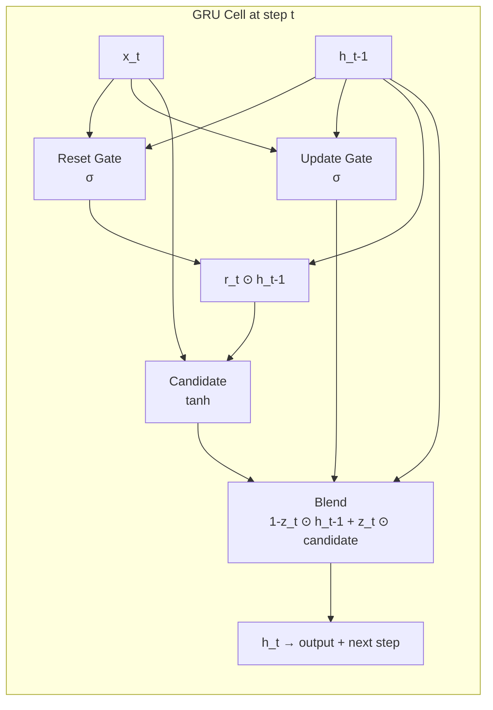

# ⚡ GRU — Gated Recurrent Unit

> [!abstract] TL;DR
> GRU simplifies LSTM by merging the cell state and hidden state into one, and replacing three gates with two (reset, update). It uses fewer parameters, trains faster, and achieves comparable performance on most tasks — the pragmatic default when you need a recurrent model without the full LSTM complexity.

---

## Intuition — Analogy First

LSTM is a **full cockpit** — cell state, hidden state, forget gate, input gate, output gate, five separate controls. Powerful but complex.

GRU is the **same aircraft redesigned for simplicity**: the engineer asked "do we really need a separate cell state *and* hidden state?" and realised they could be fused. Two controls instead of three, one memory stream instead of two. Most flights land just as safely.

- **Reset gate** ($r_t$): "how much of my *past* memory should influence what I'm computing now?" Low reset = the new candidate ignores the past. High reset = the past matters fully.
- **Update gate** ($z_t$): "what fraction of my new candidate memory should replace the old?" It acts as both forget AND input simultaneously — if $z_t = 1$, completely overwrite old state with new candidate; if $z_t = 0$, keep old state entirely.

The update gate pulling double duty is the key conceptual difference from LSTM.

---

## How It Works — Mechanics

### GRU vs LSTM at a Glance

| Aspect | LSTM | GRU |
|---|---|---|
| Memory streams | Cell state $C_t$ + hidden state $h_t$ | Only hidden state $h_t$ |
| Number of gates | 3 (forget, input, output) | 2 (reset, update) |
| Parameters (hidden=H) | $4 \times (H^2 + IH + H)$ | $3 \times (H^2 + IH + H)$ |
| Separate "long-term" vs "working" memory | Yes | No (merged) |

### Gate Mechanics
1. **Reset gate** computes from $[h_{t-1}, x_t]$ via sigmoid — a mask on the previous hidden state.
2. Applying the reset gate: $r_t \odot h_{t-1}$ — this *partially erased* past is fed into the candidate computation.
3. **Candidate hidden state** $\tilde{h}_t$ is computed using the (possibly forgotten) past.
4. **Update gate** blends old hidden state with new candidate: final $h_t$ is a weighted interpolation.



---

## The Math

**Reset gate:**
$$r_t = \sigma(W_r \cdot [h_{t-1},\, x_t] + b_r)$$

**Update gate:**
$$z_t = \sigma(W_z \cdot [h_{t-1},\, x_t] + b_z)$$

**Candidate hidden state** (using partially-forgotten past):
$$\tilde{h}_t = \tanh\bigl(W_h \cdot [r_t \odot h_{t-1},\, x_t] + b_h\bigr)$$

**New hidden state** (convex combination):
$$h_t = (1 - z_t) \odot h_{t-1} + z_t \odot \tilde{h}_t$$

Note how the update gate $z_t$ subsumes both the forget gate and input gate of LSTM into a single term. When $z_t \to 0$: $h_t \approx h_{t-1}$ (preserve everything). When $z_t \to 1$: $h_t \approx \tilde{h}_t$ (replace with new).

---

## Code Demo

```python
import torch
import torch.nn as nn

# ----- Side-by-side GRU vs LSTM comparison -----
VOCAB_SIZE = 10000
EMBED_DIM  = 128
HIDDEN_DIM = 256
N_LAYERS   = 2
SEQ_LEN    = 100
BATCH      = 32

class SequenceClassifier(nn.Module):
    def __init__(self, rnn_type="GRU"):
        super().__init__()
        self.embedding = nn.Embedding(VOCAB_SIZE, EMBED_DIM, padding_idx=0)
        RNNClass = nn.GRU if rnn_type == "GRU" else nn.LSTM
        self.rnn = RNNClass(
            EMBED_DIM, HIDDEN_DIM,
            num_layers=N_LAYERS,
            batch_first=True,
            dropout=0.3,
            bidirectional=True,
        )
        self.fc = nn.Linear(HIDDEN_DIM * 2, 1)  # ×2 for bidirectional
        self.rnn_type = rnn_type

    def forward(self, x):
        emb = self.embedding(x)  # (B, T, E)
        if self.rnn_type == "LSTM":
            out, (h_n, c_n) = self.rnn(emb)
        else:
            out, h_n = self.rnn(emb)  # GRU: no separate cell state!
        # h_n: (n_layers * 2, B, H) — take top layer, both directions
        last = torch.cat((h_n[-2], h_n[-1]), dim=1)  # (B, 2H)
        return self.fc(last).squeeze(1)

gru_model  = SequenceClassifier("GRU")
lstm_model = SequenceClassifier("LSTM")

tokens = torch.randint(1, VOCAB_SIZE, (BATCH, SEQ_LEN))
print(gru_model(tokens).shape)   # torch.Size([32])
print(lstm_model(tokens).shape)  # torch.Size([32])

def count_params(m):
    return sum(p.numel() for p in m.parameters())

print(f"GRU  params: {count_params(gru_model):,}")
print(f"LSTM params: {count_params(lstm_model):,}")
# GRU  params: ~4.6M
# LSTM params: ~5.5M  (≈20% more)

# ----- Training with gradient clipping -----
device = torch.device("cuda" if torch.cuda.is_available() else "cpu")
model = gru_model.to(device)
optimizer = torch.optim.Adam(model.parameters(), lr=2e-3)
criterion = nn.BCEWithLogitsLoss()

model.train()
optimizer.zero_grad()
preds = model(tokens.to(device))
labels = torch.zeros(BATCH).to(device)
loss = criterion(preds, labels)
loss.backward()
torch.nn.utils.clip_grad_norm_(model.parameters(), 1.0)
optimizer.step()
print(f"Loss: {loss.item():.4f}")

# ----- Manual GRU cell (educational) -----
class ManualGRUCell(nn.Module):
    def __init__(self, input_size, hidden_size):
        super().__init__()
        # Each gate: weights for input + weights for hidden state
        self.W_r = nn.Linear(input_size + hidden_size, hidden_size)
        self.W_z = nn.Linear(input_size + hidden_size, hidden_size)
        self.W_h = nn.Linear(input_size + hidden_size, hidden_size)

    def forward(self, x, h_prev):
        combined = torch.cat([x, h_prev], dim=-1)
        r = torch.sigmoid(self.W_r(combined))              # reset gate
        z = torch.sigmoid(self.W_z(combined))              # update gate
        h_cand = torch.tanh(self.W_h(torch.cat([x, r * h_prev], dim=-1)))
        h_new = (1 - z) * h_prev + z * h_cand             # blend
        return h_new

cell = ManualGRUCell(EMBED_DIM, HIDDEN_DIM)
h = torch.zeros(BATCH, HIDDEN_DIM)
x_step = torch.randn(BATCH, EMBED_DIM)
h_next = cell(x_step, h)
print(h_next.shape)  # torch.Size([32, 256])
```

---

## Real-World Example

**Edge and mobile sequence models** predominantly use GRUs rather than LSTMs:
- Wake-word detection (e.g., "Hey Siri", "OK Google") runs on always-on microcontrollers with milliwatt power budgets. A single GRU layer (hidden=64) processes 16kHz audio spectrograms frame-by-frame in real time — LSTM would use 25% more memory and compute.
- Industrial IoT anomaly detection on PLCs (Programmable Logic Controllers) — streaming sensor data with constrained RAM. GRU's single hidden state fits in shared SRAM.
- Baidu's 2016 Deep Speech 2 system used stacked bidirectional GRUs as the core acoustic model — the predecessor to their current CTC/Transformer hybrids.

---

## Trade-offs

| Property | GRU | LSTM | Notes |
|---|---|---|---|
| Parameters | ~25% fewer | Baseline | Advantage grows with hidden size |
| Training speed | ~15-20% faster | Baseline | Fewer matrix multiplications |
| Long-range memory | Good | Slightly better | LSTM advantage only on very long sequences (>200 steps) |
| Task performance | Comparable | Comparable | No consistent winner; dataset-dependent |
| Memory footprint | Lower | Higher | Key for edge deployment |
| Conceptual simplicity | Simpler | More complex | Easier to debug and reason about |

---

## When to Use vs Avoid

**Use GRU when:**
- You need a recurrent model and want the most practical default — try GRU first.
- Deployment on memory/compute-constrained devices.
- Sequences of moderate length (~50–300 steps) where LSTM's extra cell state rarely helps.
- Time series forecasting, audio keyword spotting, character-level language models.

**Prefer LSTM when:**
- Tasks explicitly require distinguishing long-term vs. working memory (some formal language tasks, slot-filling with long dependencies).
- Empirical tuning has shown LSTM outperforms GRU on your specific dataset.

**Avoid both when:**
- Sequences are long (>500 tokens) and parallelism matters — use Transformers.
- You have large data and sufficient compute — attention-based models will outperform both.

---

## Common Pitfalls

1. **Forgetting GRU returns `(output, h_n)` not `(output, (h_n, c_n))`** — a common bug when porting LSTM code to GRU. Tuple unpacking will fail silently if you don't check.
2. **Same learning rate as LSTM** — GRU can sometimes tolerate slightly higher learning rates due to fewer parameters; experiment with 2×–3× the LR you use for LSTM.
3. **Assuming GRU always wins on speed** — on modern GPUs with cuDNN, the speed difference between GRU and LSTM is negligible because cuDNN has fused kernel implementations for both. The real advantage is at inference on CPU/edge.
4. **Not using `batch_first=True`** — same pitfall as LSTM; PyTorch default is `(seq, batch, features)`.
5. **Dropout between layers vs. on output** — `dropout=0.3` in `nn.GRU` only applies between layers (not after the last layer). Explicitly wrap with `nn.Dropout` for the output.

---

## Related Concepts

- [[_MOC_Deep_Learning|↑ Section MOC]]

- [[RNN_and_LSTM]] — the LSTM predecessor and the vanishing gradient problem that motivated gated units
- [[Attention_Mechanism]] — the mechanism that largely replaced GRUs/LSTMs by enabling parallel training
- [[Transformer_Architecture]] — the current dominant architecture for sequence tasks
- [[Gradient_Clipping]] — still essential for GRU stability

---

## Review Questions

1. The GRU update gate equation is $h_t = (1 - z_t) \odot h_{t-1} + z_t \odot \tilde{h}_t$. What values of $z_t$ correspond to "copy the past unchanged" and "replace entirely with new info"? How does this subsume both the forget and input gates of LSTM?
2. On a 3-layer bidirectional GRU with hidden size 512 and input size 128, how many total parameters are in the GRU layers alone (excluding embedding and FC)? Compare with the equivalent LSTM.
3. Given a task involving sentiment analysis on tweets (avg. 15 tokens), would you expect GRU or LSTM to perform better? What about parsing long legal documents (avg. 2000 tokens)?

---

## Sources

- Cho et al. (2014) — "Learning Phrase Representations using RNN Encoder-Decoder for Statistical Machine Translation" (introduces GRU)
- Chung et al. (2014) — "Empirical Evaluation of Gated Recurrent Neural Networks on Sequence Modeling" (systematic GRU vs LSTM comparison)
- Greff et al. (2017) — "LSTM: A Search Space Odyssey" (extensive LSTM/GRU variant comparison)
- PyTorch docs — `torch.nn.GRU`

#gru #rnn #sequence-modeling #nlp #gates #reset-gate #update-gate #deep-learning #edge-inference
