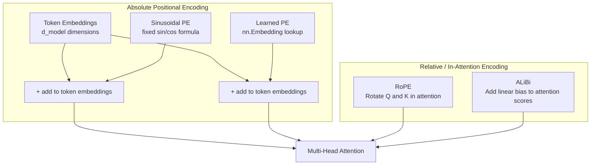

# 📍 Positional Encoding

> [!abstract] TL;DR
> Attention is permutation-invariant — "cat sat mat" and "mat sat cat" produce identical attention outputs without position information. Positional encoding injects order into token representations. Sinusoidal PE (original Transformer) uses fixed sin/cos functions; learned PE (GPT-2) is simpler but doesn't extrapolate; RoPE (LLaMA) encodes positions via rotation matrices and extrapolates well; ALiBi adds a linear bias to attention scores and generalises to lengths beyond training.

---

## Intuition — Analogy First

Imagine a book where every page has **identical content** but the **page number** tells you the order. The words on each page are the token embeddings (meaning), and the page number is the positional encoding (order).

Without page numbers, you can still read each page, but if the pages are shuffled you'd have no way to reconstruct the narrative. Attention, applied to token embeddings alone, faces exactly this problem — it cannot distinguish "I love you" from "you love I" because it only sees the *content* of each token, not its position.

Different encoding approaches are like different numbering systems:
- **Sinusoidal**: use a fixed formula to stamp each page with a unique pattern (like a QR code derived from the page number).
- **Learned positional**: train the model to learn the best "stamp" for each position.
- **RoPE**: encode relative distance between pages by *rotating* the content vector based on position. Page 5 is always "5 steps clockwise from page 1."
- **ALiBi**: don't modify the content at all — instead, add a fixed penalty to attention scores based on how far apart two tokens are (nearby words pay less penalty; distant words pay more).

---

## How It Works — Mechanics

### Sinusoidal Positional Encoding (Vaswani et al., 2017)
- Fixed (not learned) — same encoding at training and inference.
- Each dimension of the embedding is a sinusoid at a different frequency.
- Even dimensions: $\sin$; odd dimensions: $\cos$.
- Different frequencies allow the model to attend to relative positions (via trigonometric identities).
- Limitation: does not generalise well beyond training sequence length.

### Learned Positional Embeddings (GPT-2, BERT)
- A simple embedding table: `nn.Embedding(max_seq_len, d_model)`.
- Trained end-to-end with the model.
- Simpler and often comparable to sinusoidal in practice.
- Hard limitation: cannot handle sequences longer than `max_seq_len` at inference.

### RoPE — Rotary Position Embedding (Su et al., 2021)
Used in: LLaMA 2, LLaMA 3, Mistral, Falcon, Qwen, PaLM 2.
- Encodes position by rotating Q and K vectors in 2D subspaces.
- Key property: the dot product $\langle \mathbf{q}_m, \mathbf{k}_n \rangle$ depends only on the *relative distance* $m - n$, not absolute positions.
- Extrapolates beyond training length with YaRN/rope scaling tricks.
- Applied directly to Q and K inside attention (not added to embeddings).

### ALiBi — Attention with Linear Biases (Press et al., 2021)
Used in: BLOOM, MPT, some LLaMA variants.
- Does not modify token embeddings at all.
- Adds $-\lambda \cdot |i - j|$ to attention score between positions $i$ and $j$.
- Each head has a different $\lambda$ (geometric sequence of slopes).
- Naturally penalises distant attention — nearby tokens are "cheaper" to attend.
- Strong extrapolation: models trained at 1024 tokens generalise to 4096 tokens.



---

## The Math

### Sinusoidal Encoding
For position $\text{pos}$ and embedding dimension index $i$ (where $d = d_\text{model}$):

$$\text{PE}(\text{pos},\, 2i) = \sin\!\left(\frac{\text{pos}}{10000^{2i/d}}\right)$$

$$\text{PE}(\text{pos},\, 2i+1) = \cos\!\left(\frac{\text{pos}}{10000^{2i/d}}\right)$$

The denominator $10000^{2i/d}$ creates wavelengths from $2\pi$ (shortest: fine-grained) to $2\pi \times 10000$ (longest: coarse position). Final token representation: $\mathbf{x}_\text{pos} = \mathbf{e}_\text{token} + \text{PE}(\text{pos})$.

**Key property**: $\text{PE}(\text{pos}+k)$ can be written as a linear function of $\text{PE}(\text{pos})$ (rotation matrix), so the model can learn relative positions.

### RoPE
For a 2D subspace, position $m$ is encoded as a rotation by angle $m\theta$:

$$\mathbf{q}_m^{(2i:2i+1)} = R(m\theta_i)\, \mathbf{q}^{(2i:2i+1)}, \quad \theta_i = \frac{1}{10000^{2i/d}}$$

The attention score between positions $m$ and $n$:
$$\langle \mathbf{q}_m, \mathbf{k}_n \rangle = \langle R(m\theta)\mathbf{q},\; R(n\theta)\mathbf{k} \rangle = \langle \mathbf{q},\; R((n-m)\theta)\mathbf{k} \rangle$$

This depends only on $n - m$ — relative position — not absolute positions $m$ or $n$ individually.

---

## Code Demo

```python
import torch
import torch.nn as nn
import math
import matplotlib
matplotlib.use("Agg")
import matplotlib.pyplot as plt

# ===== 1. Sinusoidal Positional Encoding =====
class SinusoidalPositionalEncoding(nn.Module):
    def __init__(self, d_model: int, max_len: int = 5000, dropout: float = 0.1):
        super().__init__()
        self.dropout = nn.Dropout(dropout)

        # Build the encoding matrix (max_len, d_model)
        pe = torch.zeros(max_len, d_model)
        pos = torch.arange(0, max_len).unsqueeze(1).float()          # (max_len, 1)
        div = torch.exp(torch.arange(0, d_model, 2).float()
                        * (-math.log(10000.0) / d_model))             # (d_model/2,)
        pe[:, 0::2] = torch.sin(pos * div)   # even dims: sin
        pe[:, 1::2] = torch.cos(pos * div)   # odd dims:  cos
        pe = pe.unsqueeze(0)                  # (1, max_len, d_model) — broadcastable
        self.register_buffer("pe", pe)        # not a parameter, but saved with model

    def forward(self, x: torch.Tensor) -> torch.Tensor:
        # x: (batch, seq_len, d_model)
        x = x + self.pe[:, :x.size(1), :]
        return self.dropout(x)

# Visualise the encoding matrix
d_model, seq_len = 128, 100
sin_pe = SinusoidalPositionalEncoding(d_model, max_len=seq_len, dropout=0.0)
pe_matrix = sin_pe.pe.squeeze(0).numpy()  # (seq_len, d_model)

fig, ax = plt.subplots(figsize=(14, 5))
im = ax.imshow(pe_matrix.T, aspect="auto", cmap="RdBu_r", origin="lower",
               vmin=-1, vmax=1)
ax.set_xlabel("Position (token index)")
ax.set_ylabel("Embedding dimension")
ax.set_title("Sinusoidal Positional Encoding — note increasing wavelengths")
plt.colorbar(im, ax=ax)
plt.tight_layout()
# plt.savefig("sinusoidal_pe.png")

# ===== 2. Learned Positional Embedding =====
class LearnedPositionalEmbedding(nn.Module):
    def __init__(self, d_model: int, max_len: int = 1024, dropout: float = 0.1):
        super().__init__()
        self.pos_emb = nn.Embedding(max_len, d_model)
        self.dropout = nn.Dropout(dropout)

    def forward(self, x: torch.Tensor) -> torch.Tensor:
        B, T, _ = x.shape
        positions = torch.arange(T, device=x.device).unsqueeze(0)  # (1, T)
        return self.dropout(x + self.pos_emb(positions))

# ===== 3. RoPE — Rotary Position Embedding =====
def precompute_freqs_cis(d: int, seq_len: int, theta: float = 10000.0):
    """Precompute complex frequency tensors for RoPE."""
    freqs = 1.0 / (theta ** (torch.arange(0, d, 2).float() / d))  # (d/2,)
    t = torch.arange(seq_len).float()                               # (seq_len,)
    freqs_outer = torch.outer(t, freqs)                             # (seq_len, d/2)
    freqs_cis = torch.polar(torch.ones_like(freqs_outer), freqs_outer)  # complex
    return freqs_cis  # (seq_len, d/2) complex

def apply_rotary_emb(x: torch.Tensor, freqs_cis: torch.Tensor) -> torch.Tensor:
    """Apply RoPE to query or key tensor."""
    # x: (B, n_heads, T, d)
    x_ = torch.view_as_complex(x.float().reshape(*x.shape[:-1], -1, 2))
    freqs_cis_expanded = freqs_cis[:x.shape[2]].unsqueeze(0).unsqueeze(0)
    x_out = torch.view_as_real(x_ * freqs_cis_expanded).flatten(-2)
    return x_out.type_as(x)

# Demo
B, n_heads, T, d_k = 2, 8, 64, 64
q = torch.randn(B, n_heads, T, d_k)
k = torch.randn(B, n_heads, T, d_k)
freqs = precompute_freqs_cis(d_k, T)
q_rope = apply_rotary_emb(q, freqs)
k_rope = apply_rotary_emb(k, freqs)
print("Q after RoPE:", q_rope.shape)  # (2, 8, 64, 64) — same shape

# ===== Integration example =====
batch, seq, d_model = 4, 50, 256
tokens = torch.randn(batch, seq, d_model)
sin_out = SinusoidalPositionalEncoding(d_model)(tokens)
lear_out = LearnedPositionalEmbedding(d_model)(tokens)
print(sin_out.shape, lear_out.shape)  # both (4, 50, 256)
```

---

## Real-World Example

**LLaMA 2 and LLaMA 3 use RoPE** — this is what gives them strong extrapolation behaviour:
- LLaMA 3 was trained with a 8192-token context window using RoPE with $\theta = 500{,}000$ (increased from $10{,}000$ to stretch the wavelengths, enabling longer contexts without fine-tuning).
- Meta's long-context extension technique (YaRN) further interpolates RoPE frequencies to extend to 128k tokens.

**BERT and GPT-2 use learned positional embeddings** — simple `nn.Embedding(512, 768)` tables. Hard cap at 512/1024 tokens respectively; anything longer requires truncation or positional interpolation hacks.

**BLOOM (176B) uses ALiBi** — it was trained on 2048-token sequences but can process 4096+ tokens at inference without any modification, purely because the linear bias extrapolates gracefully to longer relative distances.

---

## Trade-offs

| Method | Extrapolation | Relative Positions | Modifies Embeddings | Used In |
|---|---|---|---|---|
| Sinusoidal | Poor | Via trig identities | Yes (+) | Original Transformer, T5 (variant) |
| Learned PE | None (hard cap) | No | Yes (+) | GPT-2, BERT, ViT |
| RoPE | Good (with tuning) | Naturally relative | No (applied in attn) | LLaMA, Mistral, Falcon, Qwen |
| ALiBi | Excellent | Naturally relative | No (bias to scores) | BLOOM, MPT |

---

## When to Use vs Avoid

**Use sinusoidal PE when:**
- Implementing a Transformer from scratch for learning — it's conceptually clean.
- You need a fixed encoding without trainable parameters.

**Use learned PE when:**
- Sequence length is fixed and well-known (BERT-style fine-tuning at 512 tokens).
- Simplicity and direct compatibility with HuggingFace models.

**Use RoPE when:**
- Training a new LLM or long-context model (it's the modern standard).
- You want relative position sensitivity built into attention.

**Use ALiBi when:**
- Sequence length at inference is unpredictable or longer than training.
- You want simplicity (no modification to embeddings, no position IDs needed).

---

## Common Pitfalls

1. **Forgetting to add PE before the first layer, not each layer** — PE is added to the token embeddings once at the start; it does not get re-added at every block.
2. **Sinusoidal PE and gradient flow** — sinusoidal PE is a `register_buffer`, not a parameter. Calling `.parameters()` won't include it; that's correct and intentional.
3. **RoPE applied to wrong dimension** — RoPE must be applied to Q and K in each attention head (not to the full d_model, but to the d_k subspace). Applying it after projecting is correct; applying it before or to V is wrong.
4. **Sequence length > max_len at inference with learned PE** — results in an index-out-of-bounds error. Always set `max_len` conservatively larger than needed.
5. **ALiBi slopes must match n_heads** — the geometric sequence of slopes is fixed: $2^{-8/n}$ to $2^{-8}$ for $n$ heads. Using the wrong number of heads silently produces incorrect biases.

---

## Related Concepts

- [[_MOC_Deep_Learning|↑ Section MOC]]

- [[Attention_Mechanism]] — positional encoding is only needed because attention is permutation-invariant
- [[Transformer_Architecture]] — where PE is integrated into the full model
- [[LLM_Architecture_Deep_Dive]] — how modern LLMs like LLaMA implement RoPE with YaRN extensions

---

## Review Questions

1. Why is attention permutation-invariant, and why does this necessitate positional encoding? Give a concrete example where the model would fail without it.
2. What property of sinusoidal encoding allows the model to learn relative positions? (Hint: think about the trig identity for $\sin(a+b)$.)
3. RoPE encodes positions by rotating Q and K vectors. Why does this mean the attention score depends only on the *relative* distance between positions, not absolute positions? Show the key step in the math.

---

## Sources

- Vaswani et al. (2017) — "Attention Is All You Need" (sinusoidal PE; arXiv:1706.03762)
- Su et al. (2021) — "RoFormer: Enhanced Transformer with Rotary Position Embedding" (RoPE; arXiv:2104.09864)
- Press, Smith & Lewis (2021) — "Train Short, Test Long: Attention with Linear Biases Enables Input Length Extrapolation" (ALiBi; arXiv:2108.12409)
- Peng et al. (2023) — "YaRN: Efficient Context Window Extension of LLMs" (RoPE extension)
- Touvron et al. (2023) — "LLaMA 2: Open Foundation and Fine-Tuned Chat Models" (RoPE in practice)

#positional-encoding #rope #alibi #sinusoidal #transformers #nlp #llm #attention #deep-learning
