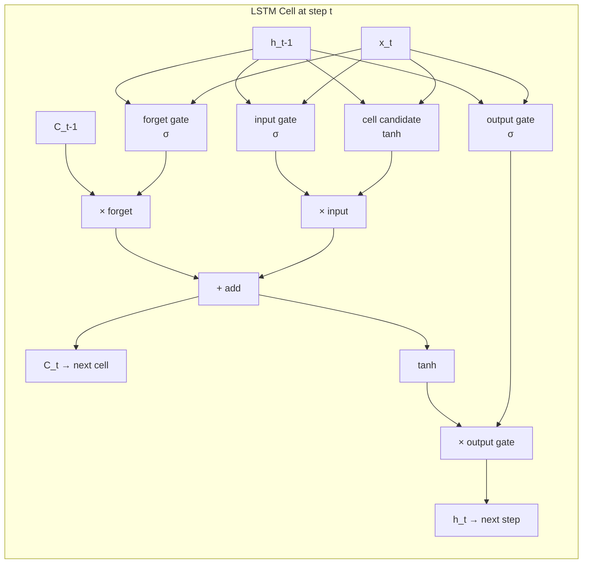

# 🔄 RNN and LSTM

> [!abstract] TL;DR
> RNNs process sequences by passing a hidden state step-by-step, but suffer from vanishing/exploding gradients on long sequences. LSTM solves this with a **cell state** (long-term memory conveyor belt) and three gates (forget, input, output) that learn *what to remember, what to write, and what to read* at each step.

---

## Intuition — Analogy First

**Vanilla RNN** = a person passing a sticky note through a telephone chain. By the time the note reaches person 100, the original message from person 1 has been rewritten so many times it's unrecognisable (vanishing gradient).

**LSTM** = a **conveyor belt with sticky notes** in a factory:
- The **cell state** is the conveyor belt — it runs the full length of the sequence with minimal modification.
- The **forget gate** is a worker deciding: "should this old sticky note stay on the belt, or should I remove it?"
- The **input gate** is a worker deciding: "should I add a new sticky note from this step?"
- The **output gate** is a worker deciding: "which sticky notes on the belt should I show to the next department (hidden state)?"

The key insight: the cell state can carry information across hundreds of steps almost unchanged, while gates are learnable — the network discovers which information is long-range-relevant during training.

---

## How It Works — Mechanics

### Vanilla RNN
At each time step $t$:
$$
h_t = \tanh(W_h \cdot h_{t-1} + W_x \cdot x_t + b)
$$
- $h_t$: hidden state (memory) passed to next step.
- Both $W_h$ and $W_x$ are shared across all time steps (weight sharing in time).

**Vanishing gradient** problem: backpropagating through $T$ time steps multiplies by $W_h^T$. If $|W_h| < 1$, gradients vanish; if $|W_h| > 1$, they explode. Gradients from 50 steps ago are numerically zero.

### LSTM Cell
Three gates control information flow:

| Gate | Controls | Activation |
|---|---|---|
| Forget $f_t$ | What to erase from cell state | sigmoid (0=erase, 1=keep) |
| Input $i_t$ | What new info to add to cell state | sigmoid (0=ignore, 1=add) |
| Output $o_t$ | What portion of cell state to expose as $h_t$ | sigmoid |

The cell-state update is **additive** (not multiplicative) — this is why gradients can flow far back: the chain rule derivative through an addition is 1.

### Bidirectional LSTM
Runs two LSTMs: one forward, one backward. Concatenates hidden states. Useful when the full sequence is available (not real-time): classifying sentiment, named entity recognition.

### Stacked LSTM
Multiple LSTM layers where the hidden state of layer $l$ becomes the input of layer $l+1$. Deeper = more abstract representations.



---

## The Math

**Forget gate** — what fraction of old cell state to keep:
$$f_t = \sigma(W_f \cdot [h_{t-1}, x_t] + b_f)$$

**Input gate + candidate cell value** — what new info to write:
$$i_t = \sigma(W_i \cdot [h_{t-1}, x_t] + b_i)$$
$$\tilde{C}_t = \tanh(W_C \cdot [h_{t-1}, x_t] + b_C)$$

**Cell state update** — additive combination:
$$C_t = f_t \odot C_{t-1} + i_t \odot \tilde{C}_t$$

**Output gate + hidden state:**
$$o_t = \sigma(W_o \cdot [h_{t-1}, x_t] + b_o)$$
$$h_t = o_t \odot \tanh(C_t)$$

Where $\odot$ = element-wise multiplication. The gradient of $C_t$ w.r.t. $C_{t-1}$ is simply $f_t$ (element-wise) — a learned, adaptive gate rather than a fixed matrix power.

---

## Code Demo

```python
import torch
import torch.nn as nn
from torch.utils.data import DataLoader, TensorDataset

# ----- Sentiment classification with LSTM -----
class LSTMSentiment(nn.Module):
    def __init__(self, vocab_size, embed_dim, hidden_dim, n_layers,
                 dropout=0.3, bidirectional=True):
        super().__init__()
        self.embedding = nn.Embedding(vocab_size, embed_dim, padding_idx=0)
        self.lstm = nn.LSTM(
            input_size=embed_dim,
            hidden_size=hidden_dim,
            num_layers=n_layers,
            batch_first=True,       # input shape: (batch, seq_len, features)
            dropout=dropout if n_layers > 1 else 0,
            bidirectional=bidirectional,
        )
        direction_factor = 2 if bidirectional else 1
        self.fc = nn.Linear(hidden_dim * direction_factor, 1)
        self.dropout = nn.Dropout(dropout)

    def forward(self, x):
        # x: (batch, seq_len) — token ids
        embedded = self.dropout(self.embedding(x))  # (B, T, E)
        
        # lstm output: all hidden states; h_n: final hidden; c_n: final cell
        output, (h_n, c_n) = self.lstm(embedded)
        
        # For classification: use last hidden state from all directions/layers
        # h_n shape: (num_layers * num_directions, batch, hidden_dim)
        # Take last layer, both directions
        if self.lstm.bidirectional:
            last_hidden = torch.cat((h_n[-2], h_n[-1]), dim=1)  # (B, 2*H)
        else:
            last_hidden = h_n[-1]  # (B, H)
        
        return self.fc(self.dropout(last_hidden)).squeeze(1)  # (B,)

# ----- Quick test -----
vocab_size, embed_dim, hidden_dim, n_layers = 10000, 128, 256, 2
model = LSTMSentiment(vocab_size, embed_dim, hidden_dim, n_layers)

# Simulate a batch of token sequences
batch_tokens = torch.randint(1, vocab_size, (32, 100))  # (batch=32, seq_len=100)
logits = model(batch_tokens)
print(logits.shape)  # → torch.Size([32])

# ----- Training snippet -----
device = torch.device("cuda" if torch.cuda.is_available() else "cpu")
model = model.to(device)

criterion = nn.BCEWithLogitsLoss()
optimizer = torch.optim.Adam(model.parameters(), lr=1e-3)

# Gradient clipping — essential for RNN/LSTM stability
for epoch in range(3):
    model.train()
    # ... (DataLoader iteration) ...
    optimizer.zero_grad()
    predictions = model(batch_tokens.to(device))
    labels = torch.randint(0, 2, (32,)).float().to(device)
    loss = criterion(predictions, labels)
    loss.backward()
    torch.nn.utils.clip_grad_norm_(model.parameters(), max_norm=1.0)  # KEY
    optimizer.step()

# ----- Inspecting LSTM internals -----
lstm_cell = nn.LSTM(input_size=10, hidden_size=20, batch_first=True)
print(lstm_cell.weight_ih_l0.shape)  # (4*hidden, input) = (80, 10) — 4 weight matrices packed
print(lstm_cell.weight_hh_l0.shape)  # (4*hidden, hidden) = (80, 20)
# The 4 blocks correspond to: input gate, forget gate, cell gate, output gate
```

---

## Real-World Example

**Google's Neural Machine Translation (GNMT, 2016)** used an 8-layer stacked bidirectional LSTM encoder and an 8-layer LSTM decoder with attention. It was the system translating Google Translate's 100+ language pairs before being superseded by Transformers. GNMT reduced translation errors by 55–85% vs. the previous phrase-based system.

**Modern residual uses**: LSTMs still power speech recognition backends on low-resource devices (e.g., keyword spotting on microcontrollers where Transformers are too large) and time-series anomaly detection in industrial IoT systems.

---

## Trade-offs

| Property | Vanilla RNN | LSTM | GRU | Transformer |
|---|---|---|---|---|
| Long-range memory | Poor | Good | Good | Excellent |
| Parameters | Fewest | Most (among RNN family) | Fewer than LSTM | Many |
| Training speed | Fast | Slower | Faster than LSTM | Very fast (parallelisable) |
| Parallelisable training | No (sequential) | No | No | Yes |
| Interpretability | Medium | Medium | Medium | Low (attn maps help) |
| Edge / real-time | Good | Good | Better | Usually too large |

---

## When to Use vs Avoid

**Use LSTM when:**
- Sequence data where order and long-range dependencies matter (text, time series, audio).
- Real-time/streaming inference where Transformers' full-sequence attention is infeasible.
- Limited data — LSTMs generalise better than Transformers on small datasets.

**Avoid LSTM when:**
- Sequence length > ~500 tokens and full-sequence processing is acceptable — Transformers handle long range better.
- Training speed is critical — LSTMs are inherently sequential, non-parallelisable.
- Modern NLP tasks — Transformers (BERT, GPT) are strictly better with enough data.

---

## Common Pitfalls

1. **Forgetting `batch_first=True`** — PyTorch's `nn.LSTM` defaults to `(seq, batch, features)`; most code expects `(batch, seq, features)`. Mismatching causes shape errors or silent transposition bugs.
2. **Not clipping gradients** — `clip_grad_norm_(params, 1.0)` before `optimizer.step()` is non-optional for LSTM stability. Skipping it causes NaN losses on long sequences.
3. **Using `h_n` vs `output` incorrectly** — `output` contains all hidden states for every step; `h_n` is only the *final* hidden state. For sequence labelling use `output`; for classification use `h_n[-1]`.
4. **Dropout placement in multilayer LSTM** — `dropout` in `nn.LSTM` only applies *between* layers, not on the last layer's output. Add an explicit `nn.Dropout` after.
5. **Packing variable-length sequences** — use `torch.nn.utils.rnn.pack_padded_sequence` / `pad_packed_sequence` to avoid computing on padding tokens; omitting this wastes compute and distorts gradients.

---

## Related Concepts

- [[_MOC_Deep_Learning|↑ Section MOC]]

- [[GRU]] — LSTM's streamlined sibling with two gates and no separate cell state
- [[Attention_Mechanism]] — the mechanism that largely replaced LSTM for sequence-to-sequence tasks
- [[Gradient_Clipping]] — the essential companion technique for RNN training stability
- [[Transformer_Architecture]] — the architecture that superseded LSTMs for most NLP tasks
- [[Positional_Encoding]] — how Transformers encode order without recurrence

---

## Review Questions

1. Explain in one paragraph why the LSTM cell state update $C_t = f_t \odot C_{t-1} + i_t \odot \tilde{C}_t$ helps mitigate the vanishing gradient problem compared to the vanilla RNN update.
2. If you have a batch of sequences with lengths [100, 87, 43, 12], should you use `pack_padded_sequence`? What happens to your loss if you don't?
3. When would you choose a bidirectional LSTM over a unidirectional one, and what tasks make bidirectionality *impossible*?

---

## Sources

- Hochreiter & Schmidhuber (1997) — "Long Short-Term Memory" (Neural Computation)
- Graves, Mohamed & Hinton (2013) — "Speech Recognition with Deep Recurrent Neural Networks"
- Wu et al. (2016) — "Google's Neural Machine Translation System" (arXiv:1609.08144)
- Olah (2015) — "Understanding LSTM Networks" (colah.github.io — the canonical visual explainer)
- PyTorch docs — `torch.nn.LSTM`

#rnn #lstm #sequence-modeling #nlp #vanishing-gradient #hidden-state #gates #deep-learning
