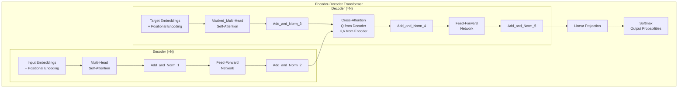

# 🤖 Transformer Architecture

> [!abstract] TL;DR
> The Transformer replaces recurrence with **multi-head self-attention**, enabling full parallelism during training. An encoder block applies self-attention + feed-forward with residuals and layer norm. A decoder adds causal self-attention and cross-attention to the encoder. Encoder-only (BERT), decoder-only (GPT), and encoder-decoder (T5) variants dominate their respective tasks. Scaling laws show performance improves predictably with compute, data, and parameters.

---

## Intuition — Analogy First

An RNN processes a sentence like a **telephone game**: person 1 whispers to person 2, who whispers to person 3... By the time person 20 speaks, the original message may be garbled.

A Transformer is a **meeting room where everyone can talk to everyone simultaneously**. Word 1 can directly query Word 20 in a single step. "The bank near the river flooded" — "bank" immediately attends to "river" and "flooded" to establish its sense. No telephone chains, no information decay.

This is not just faster — it fundamentally changes *what the model can learn*. Long-range dependencies that LSTMs struggled with become easy; parallelism during training cuts wall-clock time from days to hours.

---

## How It Works — Architecture

### Building Blocks

**Layer Normalisation** (applied *before* sublayers in modern implementations — Pre-LN):
$$\text{LayerNorm}(x + \text{Sublayer}(x))$$

**Feed-Forward Network (FFN)** — applied identically to each position:
$$\text{FFN}(x) = \text{ReLU}(xW_1 + b_1)W_2 + b_2$$
Typically expands to $4 \times d_\text{model}$ then projects back.

**Encoder Block** (stacked $N$ times):
1. Multi-head self-attention (all positions attend to all positions).
2. Add & Norm (residual connection + layer norm).
3. Feed-forward network.
4. Add & Norm.

**Decoder Block** (stacked $N$ times):
1. Masked multi-head self-attention (causal — each position only attends to previous positions).
2. Add & Norm.
3. Multi-head cross-attention (queries from decoder, keys + values from encoder).
4. Add & Norm.
5. Feed-forward network.
6. Add & Norm.

### Transformer Variants

| Variant | Architecture | Examples | Best for |
|---|---|---|---|
| Encoder-only | Bidirectional encoder | BERT, RoBERTa, DeBERTa | Classification, NER, extraction |
| Decoder-only | Autoregressive decoder | GPT-2/3/4, LLaMA, Mistral | Generation, chat, code |
| Encoder-Decoder | Full encoder + decoder | T5, BART, mT5 | Translation, summarisation, QA |



---

## The Math

**Complete encoder block (pre-LN formulation):**
$$\hat{x} = x + \text{MHA}(\text{LN}(x), \text{LN}(x), \text{LN}(x))$$
$$x' = \hat{x} + \text{FFN}(\text{LN}(\hat{x}))$$

**Decoder cross-attention:**
$$x_\text{dec} = \text{MHA}(Q=\text{LN}(x_\text{dec}),\; K=\text{LN}(x_\text{enc}),\; V=\text{LN}(x_\text{enc}))$$

**Scaling laws (Kaplan et al., OpenAI):**
$$L(N) \approx \left(\frac{N_c}{N}\right)^{\alpha_N}, \quad \alpha_N \approx 0.076$$
Loss decreases as a power law in number of parameters $N$. Similar laws hold for compute $C$ and data $D$. Chinchilla (Hoffmann et al.) revised the optimal data-to-parameter ratio to roughly $20 \times$ tokens per parameter.

---

## Code Demo

```python
import torch
import torch.nn as nn
import math

# ----- Complete Transformer Encoder in PyTorch -----

class TransformerEncoderLayer(nn.Module):
    """Single encoder block: self-attention + FFN + residuals + layer norm."""
    def __init__(self, d_model=512, n_heads=8, d_ff=2048, dropout=0.1):
        super().__init__()
        self.self_attn = nn.MultiheadAttention(d_model, n_heads,
                                               dropout=dropout, batch_first=True)
        self.ffn = nn.Sequential(
            nn.Linear(d_model, d_ff),
            nn.ReLU(),
            nn.Dropout(dropout),
            nn.Linear(d_ff, d_model),
        )
        self.norm1 = nn.LayerNorm(d_model)
        self.norm2 = nn.LayerNorm(d_model)
        self.dropout = nn.Dropout(dropout)

    def forward(self, x, src_key_padding_mask=None):
        # Pre-LN (more stable than original post-LN)
        attn_out, _ = self.self_attn(
            self.norm1(x), self.norm1(x), self.norm1(x),
            key_padding_mask=src_key_padding_mask,
        )
        x = x + self.dropout(attn_out)   # residual
        x = x + self.dropout(self.ffn(self.norm2(x)))  # residual
        return x

class SimpleLanguageModel(nn.Module):
    """Decoder-only (GPT-style) language model."""
    def __init__(self, vocab_size=50257, d_model=512, n_heads=8,
                 n_layers=6, d_ff=2048, max_seq=1024, dropout=0.1):
        super().__init__()
        self.token_emb = nn.Embedding(vocab_size, d_model)
        self.pos_emb   = nn.Embedding(max_seq, d_model)  # learned positional
        self.dropout   = nn.Dropout(dropout)
        
        encoder_layer = nn.TransformerEncoderLayer(
            d_model=d_model, nhead=n_heads, dim_feedforward=d_ff,
            dropout=dropout, batch_first=True, norm_first=True,  # Pre-LN
        )
        self.transformer = nn.TransformerEncoder(encoder_layer, num_layers=n_layers)
        self.ln_final = nn.LayerNorm(d_model)
        self.lm_head  = nn.Linear(d_model, vocab_size, bias=False)
        # Weight tying: share embedding and LM head weights
        self.lm_head.weight = self.token_emb.weight

        self._init_weights()

    def _init_weights(self):
        for module in self.modules():
            if isinstance(module, nn.Linear):
                nn.init.normal_(module.weight, std=0.02)
                if module.bias is not None:
                    nn.init.zeros_(module.bias)
            elif isinstance(module, nn.Embedding):
                nn.init.normal_(module.weight, std=0.02)

    def forward(self, token_ids, attention_mask=None):
        B, T = token_ids.shape
        device = token_ids.device
        
        positions = torch.arange(T, device=device).unsqueeze(0)  # (1, T)
        x = self.dropout(self.token_emb(token_ids) + self.pos_emb(positions))
        
        # Causal mask: prevent attending to future tokens
        causal_mask = nn.Transformer.generate_square_subsequent_mask(T, device=device)
        
        x = self.transformer(x, mask=causal_mask,
                             src_key_padding_mask=attention_mask,
                             is_causal=True)
        x = self.ln_final(x)
        logits = self.lm_head(x)   # (B, T, vocab_size)
        return logits

# ----- Usage -----
model = SimpleLanguageModel(vocab_size=50257, d_model=512, n_heads=8, n_layers=6)
total_params = sum(p.numel() for p in model.parameters()) / 1e6
print(f"Parameters: {total_params:.1f}M")  # ~85M — GPT-2 small scale

token_ids = torch.randint(0, 50257, (2, 128))   # batch=2, seq_len=128
logits = model(token_ids)
print(logits.shape)   # torch.Size([2, 128, 50257])

# ----- Cross-entropy language modelling loss -----
criterion = nn.CrossEntropyLoss()
# Predict next token: shift inputs right by 1
inputs  = token_ids[:, :-1]    # (B, T-1)
targets = token_ids[:, 1:]     # (B, T-1) — labels are next tokens
logits_shifted = model(inputs) # (B, T-1, vocab_size)
loss = criterion(logits_shifted.reshape(-1, 50257), targets.reshape(-1))
print(f"Loss: {loss.item():.4f}")  # ~ln(50257) ≈ 10.8 at random init

# ----- Using HuggingFace Transformers (production) -----
# from transformers import GPT2LMHeadModel, BertModel
# gpt2  = GPT2LMHeadModel.from_pretrained("gpt2")      # decoder-only
# bert  = BertModel.from_pretrained("bert-base-uncased")  # encoder-only
```

---

## Real-World Example

**Every major language model is a Transformer:**
- **GPT-4** (OpenAI): decoder-only, estimated >1T parameters, powers ChatGPT.
- **LLaMA 3** (Meta): decoder-only, open-weights, 8B–70B parameters, RoPE positional encoding, grouped query attention (GQA) for efficient inference.
- **BERT** (Google, 2018): encoder-only, 110M/340M parameters, still the backbone of production search ranking at major tech companies.
- **Whisper** (OpenAI): encoder-decoder — audio encoder processes spectrogram frames; text decoder autoregressively generates transcripts. Cross-attention aligns audio states with text generation.
- **AlphaFold 2** (DeepMind): Transformer with specialised pair-representation modules — predicted 200M protein structures with near-experimental accuracy.

---

## Trade-offs

| Property | Transformer | RNN/LSTM | CNN |
|---|---|---|---|
| Training parallelism | Full | Sequential (time bottleneck) | Full |
| Long-range modelling | Excellent | Poor–Good | Poor |
| Memory | O(n²) attention | O(n) | O(n) |
| Inductive bias | None (position via PE) | Strong (order via recurrence) | Strong (locality) |
| Data efficiency | Low (needs lots of data) | Higher | Higher |
| Scalability | Exceptional (scaling laws) | Poor (saturates) | Good |

---

## When to Use vs Avoid

**Use Transformers when:**
- You have sufficient data and compute (>10k examples minimum for fine-tuning).
- Tasks with long-range dependencies (NLP, code, long documents, multi-modal).
- You want to leverage pretrained weights (virtually all SOTA models are Transformers).

**Consider alternatives when:**
- Streaming/real-time generation with strict latency requirements — consider state-space models (Mamba) or RNNs.
- Very long sequences (>100k tokens) without efficient attention variants — memory becomes prohibitive.
- Small datasets with limited compute — CNNs/RNNs have more useful inductive bias.

---

## Common Pitfalls

1. **Post-LN vs Pre-LN** — the original paper uses Post-LN (norm after sublayer), which requires careful LR warmup. Modern practice uses Pre-LN (norm before sublayer) — more stable, less sensitive to LR. Always check which variant your implementation uses.
2. **Causal mask shape/dtype mismatch** — `generate_square_subsequent_mask` returns an additive float mask (−inf for masked); `key_padding_mask` expects bool. Mixing them causes silent errors.
3. **Forgetting weight tying** — in language models, tying input embedding weights to the LM head (`lm_head.weight = embedding.weight`) is standard and improves performance.
4. **Not using gradient clipping** — Transformers are prone to gradient explosion early in training. `clip_grad_norm_(params, 1.0)` is standard practice.
5. **Ignoring `is_causal=True`** in PyTorch 2.x — modern PyTorch `scaled_dot_product_attention` can use FlashAttention internally when `is_causal=True` is set, dramatically reducing memory. Omitting it wastes resources.

---

## Related Concepts

- [[_MOC_Deep_Learning|↑ Section MOC]]

- [[Attention_Mechanism]] — the core sublayer inside every Transformer block
- [[Positional_Encoding]] — how order information is injected (sinusoidal, learned, RoPE)
- [[Layer_Normalization]] — the normalisation used in Transformers (vs BatchNorm in CNNs)
- [[BERT]] — encoder-only Transformer for understanding tasks
- [[GPT_Family]] — decoder-only Transformer for generation
- [[Flash_Attention]] — efficient exact attention reducing O(n²) memory to O(n)

---

## Review Questions

1. Why does the Transformer use layer normalisation rather than batch normalisation, and what problem does the residual connection solve?
2. Explain the difference between the three attention operations in a full encoder-decoder Transformer: encoder self-attention, decoder masked self-attention, and decoder cross-attention. What mask is applied to each, and why?
3. The GPT family (decoder-only) and BERT (encoder-only) both use Transformer blocks, but they differ in one crucial training objective and masking strategy. Explain both differences and why each is suitable for its task.

---

## Sources

- Vaswani et al. (2017) — "Attention Is All You Need" (arXiv:1706.03762)
- Devlin et al. (2018) — "BERT: Pre-training of Deep Bidirectional Transformers for Language Understanding"
- Radford et al. (2019) — "Language Models are Unsupervised Multitask Learners" (GPT-2)
- Kaplan et al. (2020) — "Scaling Laws for Neural Language Models" (OpenAI)
- Hoffmann et al. (2022) — "Training Compute-Optimal Large Language Models" (Chinchilla; arXiv:2203.15556)
- The Illustrated Transformer — Jay Alammar (jalammar.github.io)

#transformer #self-attention #encoder-decoder #gpt #bert #llm #scaling-laws #deep-learning #nlp
