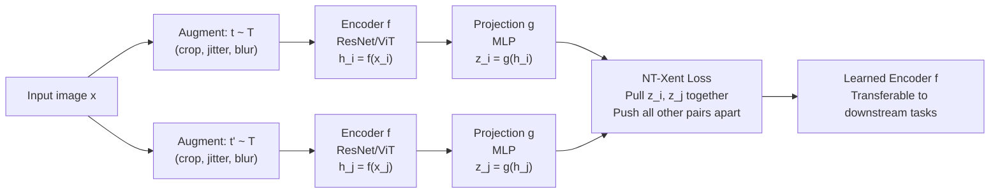

# Contrastive Learning

> [!abstract] TL;DR
> Contrastive learning teaches a model to produce similar representations for augmented views of the same data point (positives) and dissimilar representations for different data points (negatives) — without any labels. SimCLR and MoCo are the landmark frameworks; NT-Xent (InfoNCE) is the loss. Contrastive learning is mathematically grounded in mutual information maximization, and its representations transfer powerfully to downstream tasks.

---

## Intuition — Analogy First

**Analogy:** Imagine you are learning to recognize faces from a photo album with no name labels. Your strategy: two photos of the same person (different lighting, angle, expression) should map to similar "mental impressions." Two photos of different people should map to very different ones. You don't need to know anyone's name — just the rule "same person → similar impression, different person → different impression."

This is contrastive learning. The "photos of the same person" are **augmented views** of the same image (crop, color jitter, blur). The model learns to pull views of the same image close in embedding space and push views of different images apart — purely from the structure of the augmentations, no labels needed.

The result: a representation space where semantically similar things cluster together, ready for any downstream task.

---

## How It Works

### Core Components

1. **Data augmentation pipeline** — Create two "views" of each input by applying random augmentations (crops, flips, color jitter, grayscale, blur). These become the positive pair.
2. **Encoder** $f$ — Maps each view to a representation $h = f(x)$. Typically a ResNet or ViT backbone.
3. **Projection head** $g$ — A small MLP that maps $h$ to the contrastive embedding space $z = g(h)$. Used only during contrastive training; discarded at fine-tuning time.
4. **Contrastive loss** — Pulls positive pairs together; pushes negative pairs apart.

### SimCLR Framework

SimCLR (Chen et al., 2020) is the canonical contrastive learning framework:



### NT-Xent Loss (Normalized Temperature-Scaled Cross Entropy)

Given a mini-batch of $N$ images, each augmented twice → $2N$ views. For positive pair $(i, j)$:

$$\ell_{i,j} = -\log \frac{\exp(\text{sim}(z_i, z_j) / \tau)}{\sum_{k=1}^{2N} \mathbb{1}_{[k \neq i]}\exp(\text{sim}(z_i, z_k) / \tau)}$$

$$\mathcal{L}_\text{NT-Xent} = \frac{1}{2N}\sum_{k=1}^{N}\left[\ell_{2k-1,2k} + \ell_{2k,2k-1}\right]$$

Where:
- $\text{sim}(u, v) = \frac{u^\top v}{\|u\|\|v\|}$ — cosine similarity
- $\tau$ — **temperature** hyperparameter (typical values: 0.07–0.5)
- The denominator sums over all $2N-1$ other views as negatives

**The temperature $\tau$:**
- Low $\tau$ (e.g., 0.07): sharpens the distribution → focuses on the hardest negatives; can be unstable
- High $\tau$ (e.g., 0.5): smooths the distribution → easier optimization but weaker representation

### MoCo: Memory-Augmented Contrastive Learning

SimCLR's limitation: it needs very large batch sizes (4096–8192) because negatives come from the same batch.

MoCo (He et al., 2020) uses a **momentum encoder** and a **queue** to decouple batch size from negative count:

| Component | Role |
|-----------|------|
| **Online encoder** $f_q$ | Encodes query; updated by gradients |
| **Momentum encoder** $f_k$ | Encodes keys; updated by exponential moving average of $f_q$ |
| **Queue** | FIFO buffer of recent encoded keys; provides many negatives without large batch |

Momentum update: $\theta_k \leftarrow m\theta_k + (1-m)\theta_q$ where $m \approx 0.999$

This allows training with batch size 256 while having 65,536 negatives in the queue — combining the stability of large negative count with efficient memory usage.

### Connection to Mutual Information (InfoNCE)

The NT-Xent / InfoNCE loss is a lower bound on the mutual information between the two views:

$$\mathcal{L}_\text{InfoNCE} = -\mathbb{E}\!\left[\log\frac{f(x, x^+)}{\sum_{x' \in \mathcal{N}} f(x, x')}\right] \leq -I(X; X^+)$$

where $f(x, x^+) = \exp(\text{sim}(z, z^+)/\tau)$.

**Implication:** Minimizing InfoNCE loss = maximizing a lower bound on the mutual information between different views of the same datum. The encoder learns representations that preserve information shared between views (semantic content) while discarding information that varies across views (augmentation artifacts like color and crop position).

---

## The Math

### Why Contrastive Loss Works: Alignment and Uniformity

Wang & Isola (2020) decompose representation quality into two terms:

**Alignment** (positive pairs should be close):
$$\mathcal{L}_\text{align} = \mathbb{E}_{(x, x^+)}\!\left[\|f(x) - f(x^+)\|^2\right]$$

**Uniformity** (representations should spread uniformly on the hypersphere):
$$\mathcal{L}_\text{uniform} = \log \mathbb{E}_{(x, y)}\!\left[e^{-2\|f(x) - f(y)\|^2}\right]$$

Contrastive loss balances both: pulling positives together (alignment) while preventing all embeddings from collapsing to the same point (uniformity via the negative terms).

### Dimensional Collapse

Without negative pairs (or alternative mechanisms), the encoder degenerates: it maps everything to the same point, achieving zero positive loss trivially. This is called **representation collapse** or **dimensional collapse**.

Solutions:
- **Negative pairs** (SimCLR, MoCo): explicitly push different representations apart
- **Stop-gradient + EMA** (BYOL): architectural asymmetry prevents collapse without negatives
- **Redundancy reduction** (Barlow Twins): decorrelate embedding dimensions

---

## Code Demo

```python
import torch
import torch.nn as nn
import torch.nn.functional as F
from torchvision import models, transforms
from torch.utils.data import DataLoader

# ── NT-Xent Loss ─────────────────────────────────────────────────────────────
class NTXentLoss(nn.Module):
    """
    Normalized Temperature-Scaled Cross Entropy loss (SimCLR loss).
    Input: embeddings from two augmented views of the same batch.
    """
    def __init__(self, temperature: float = 0.5, device: str = "cpu"):
        super().__init__()
        self.temperature = temperature
        self.device = device

    def forward(self, z_i: torch.Tensor, z_j: torch.Tensor) -> torch.Tensor:
        """
        z_i, z_j: (batch_size, embedding_dim) — L2-normalized embeddings
        """
        batch_size = z_i.size(0)
        N = 2 * batch_size

        # Concatenate all embeddings: [z_i; z_j] → (2N, dim)
        z = torch.cat([z_i, z_j], dim=0)

        # Cosine similarity matrix (2N x 2N)
        sim = F.cosine_similarity(z.unsqueeze(1), z.unsqueeze(0), dim=2)
        sim = sim / self.temperature

        # Positive pairs: (i, i+N) and (i+N, i)
        # Create labels: sample i's positive is i+N; sample i+N's positive is i
        labels = torch.arange(batch_size, device=self.device)
        labels = torch.cat([labels + batch_size, labels])  # (2N,)

        # Mask out self-similarity (diagonal)
        mask = torch.eye(N, dtype=torch.bool, device=self.device)
        sim = sim.masked_fill(mask, -1e9)

        loss = F.cross_entropy(sim, labels)
        return loss


# ── SimCLR Model ─────────────────────────────────────────────────────────────
class SimCLR(nn.Module):
    def __init__(self, encoder_name: str = "resnet18", projection_dim: int = 128):
        super().__init__()
        # Encoder: ResNet backbone without classification head
        backbone = models.__dict__[encoder_name](weights=None)
        self.encoder_dim = backbone.fc.in_features
        backbone.fc = nn.Identity()  # remove classification head
        self.encoder = backbone

        # Projection head: 2-layer MLP
        self.projector = nn.Sequential(
            nn.Linear(self.encoder_dim, self.encoder_dim),
            nn.ReLU(),
            nn.Linear(self.encoder_dim, projection_dim),
        )

    def forward(self, x: torch.Tensor) -> tuple:
        h = self.encoder(x)          # representation (before projection)
        z = self.projector(h)        # projection (used in contrastive loss)
        z = F.normalize(z, dim=1)    # L2 normalize onto unit hypersphere
        return h, z


# ── SimCLR Augmentation Pipeline ─────────────────────────────────────────────
def get_simclr_augmentations(image_size: int = 32) -> transforms.Compose:
    """Standard SimCLR augmentation: random crop + color jitter + grayscale + blur."""
    return transforms.Compose([
        transforms.RandomResizedCrop(image_size, scale=(0.2, 1.0)),
        transforms.RandomHorizontalFlip(p=0.5),
        transforms.RandomApply([
            transforms.ColorJitter(brightness=0.4, contrast=0.4, saturation=0.4, hue=0.1)
        ], p=0.8),
        transforms.RandomGrayscale(p=0.2),
        transforms.ToTensor(),
        transforms.Normalize(mean=[0.485, 0.456, 0.406], std=[0.229, 0.224, 0.225]),
    ])


# ── Training Step ─────────────────────────────────────────────────────────────
def simclr_train_step(
    model: SimCLR,
    x: torch.Tensor,          # raw batch of images (B, C, H, W)
    augment: callable,
    criterion: NTXentLoss,
    optimizer: torch.optim.Optimizer,
) -> float:
    """One SimCLR training step: create two views, compute NT-Xent, backprop."""
    # Create two augmented views of the same batch
    x_i = torch.stack([augment(img) for img in x])
    x_j = torch.stack([augment(img) for img in x])

    optimizer.zero_grad()
    _, z_i = model(x_i)
    _, z_j = model(x_j)

    loss = criterion(z_i, z_j)
    loss.backward()
    optimizer.step()
    return loss.item()


# ── Temperature Sensitivity Demo ─────────────────────────────────────────────
def temperature_effect_demo():
    """Illustrate how temperature changes the loss landscape."""
    z_i = F.normalize(torch.randn(8, 64), dim=1)
    z_j = F.normalize(torch.randn(8, 64), dim=1)
    # Make z_j slightly correlated with z_i (simulate positives)
    z_j = F.normalize(z_i + 0.3 * torch.randn(8, 64), dim=1)

    for tau in [0.07, 0.2, 0.5, 1.0]:
        criterion = NTXentLoss(temperature=tau)
        loss = criterion(z_i, z_j)
        print(f"Temperature τ={tau:.2f} → NT-Xent loss = {loss.item():.4f}")

temperature_effect_demo()
```

---

## Real-World Example

> **CLIP (OpenAI, 2021):** CLIP uses a contrastive objective between image and text embeddings. Given 400M (image, caption) pairs, it trains an image encoder and a text encoder such that matching pairs have high cosine similarity and non-matching pairs have low similarity — exactly the InfoNCE loss across the batch. The result: image representations that align with natural language, enabling zero-shot classification by comparing image embeddings to text embeddings of class names. CLIP representations transfer to virtually every vision task without any labels, achieving competitive performance with fully supervised ImageNet models.

---

## Trade-offs

| Aspect | Pro | Con |
|--------|-----|-----|
| Labels | Zero labels required — self-supervised | Needs large batches or a queue for sufficient negatives |
| Representations | Transferable to many tasks; often superior to supervised | Training is slower than supervised (requires many epochs) |
| Augmentations | Augmentation defines what's invariant — gives control | Poorly chosen augmentations cause representation collapse |
| vs Generative (VAE/GAN) | Discriminative representations; better for classification | Doesn't learn to generate data; no density model |
| Negative pairs | Hard negatives improve quality significantly | False negatives (same class in the batch) hurt learning |

---

## When to Use vs Avoid

**Use contrastive learning when:**
- Labels are scarce or expensive — pretrain with contrastive, fine-tune with few labels
- You need general-purpose representations that transfer across many downstream tasks
- Data has natural augmentation structure (images, text, audio, time series)
- You want features that are robust to nuisance variation (lighting, crop position)

**Avoid when:**
- You have abundant labels and a specific single task — supervised learning is simpler and faster
- Augmentation design is unclear (structured tabular data rarely has natural views)
- Your dataset is very small (< 10K samples) — contrastive learning benefits from scale

---

## Common Pitfalls

- **Insufficient negatives** — SimCLR requires batch sizes of 4096+ for good performance. On a single GPU, use MoCo's queue or BYOL (no negatives needed) instead.
- **False negatives** — Two different augmentations of two examples from the same class will be treated as negatives, hurting representation quality. Mitigation: dequeue same-class items (if labels are available for filtering), or use SimCSE-style supervised contrastive loss.
- **Forgetting to normalize** — L2-normalizing embeddings to the unit hypersphere is critical. Without it, the loss is dominated by magnitude differences, not angular similarity.
- **Weak augmentations** — If augmentations are too mild (e.g., just normalization), the task is trivial and the representations don't generalize. Color jitter and random cropping are essential for image contrastive learning.
- **Using projection head embeddings for downstream tasks** — The projection head $g$ maps to the contrastive space, which discards task-relevant information. Always use the encoder $f$ output (before the projection head) for downstream fine-tuning.

---

## Related Concepts

- [[_MOC_Deep_Learning|↑ Section MOC]]

- [[Information_Theory]] — the InfoNCE loss is a lower bound on mutual information between views; contrastive learning maximizes I(view1; view2)
- [[Self_Supervised_Learning]] — contrastive learning is one paradigm of self-supervised learning alongside masked modeling and generative approaches
- [[Autoencoders]] — both learn compressed representations; autoencoders use reconstruction loss while contrastive learning uses similarity loss
- [[Loss_Functions]] — NT-Xent is a cross-entropy variant; understanding it requires familiarity with cross-entropy and temperature scaling
- [[Transformer_Architecture]] — modern contrastive learning (DINO, MAE, CLIP) uses Vision Transformers as the encoder backbone

---

## Review Questions

1. SimCLR's NT-Xent loss is structurally identical to a classification cross-entropy loss. Identify what plays the role of "class logits" and what plays the role of "label" in this analogy. Why does a larger batch size improve contrastive learning performance?

2. The connection between InfoNCE and mutual information shows that contrastive learning maximizes $I(\text{view}_1; \text{view}_2)$. Explain intuitively why maximizing this mutual information produces representations that transfer well to downstream classification tasks.

3. Compare contrastive learning (SimCLR/MoCo) against masked autoencoding (BERT/MAE) as self-supervised pretraining strategies. When would you prefer each, and what kind of downstream tasks does each produce better representations for?

---

## Sources

- Chen, T., Kornblith, S., Norouzi, M., & Hinton, G. (2020). *A Simple Framework for Contrastive Learning of Visual Representations (SimCLR)*. ICML 2020. [arXiv:2002.05709](https://arxiv.org/abs/2002.05709)
- He, K., Fan, H., Wu, Y., Xie, S., & Girshick, R. (2020). *Momentum Contrast for Unsupervised Visual Representation Learning (MoCo)*. CVPR 2020. [arXiv:1911.05722](https://arxiv.org/abs/1911.05722)
- Oord, A., Li, Y., & Vinyals, O. (2018). *Representation Learning with Contrastive Predictive Coding (InfoNCE)*. [arXiv:1807.03748](https://arxiv.org/abs/1807.03748)
- Wang, T., & Isola, P. (2020). *Understanding Contrastive Representation Learning through Alignment and Uniformity on the Hypersphere*. ICML 2020. [arXiv:2005.10242](https://arxiv.org/abs/2005.10242)

#contrastive-learning #self-supervised-learning #simclr #moco #infonce #representation-learning #deep-learning
