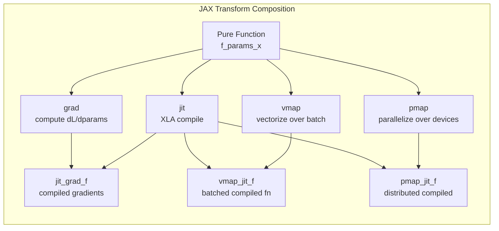

# ⚡ JAX and Flax

> [!abstract] TL;DR
> JAX is NumPy + XLA JIT compilation + functional autodiff. Its four core transforms (`jit`, `grad`, `vmap`, `pmap`) compose freely to produce optimised, vectorised, distributed code. Flax is the neural network library built on top of JAX. The key mental shift: **pure functions, explicit state, no side effects** — the model itself is a stateless function; parameters are passed explicitly.

---

## Intuition — Analogy First

PyTorch is like a **stateful calculator** — it remembers previous operations, holds internal state (weights in `nn.Module`), and lets you modify things in-place.

JAX is like a **pure mathematician**: every function must produce the same output for the same inputs — no hidden state, no side effects. "Here are the parameters. Here is the input. Here is the output. I'm not remembering anything."

This seems restrictive but is extremely powerful because:
- **JIT compilation** (`jit`): since there are no side effects, JAX can trace your function, compile it to XLA (Google's ML compiler), and run it on TPUs/GPUs at peak hardware efficiency.
- **Vectorisation** (`vmap`): a function that works on one sample automatically becomes a function that works on a batch — no explicit batch dimensions needed in your logic.
- **Parallelism** (`pmap`): a function that works on one device automatically runs on N devices — no distributed training boilerplate.
- **Higher-order derivatives** (`grad(grad(f))`): since `grad` is just a function transform, you can differentiate through differentiation itself — critical for meta-learning, second-order optimisation.

---

## How It Works — Mechanics

### The Four Core Transforms

| Transform | What it does | Example use |
|---|---|---|
| `jit` | JIT-compile a function via XLA | Any function you call repeatedly |
| `grad` | Compute gradient of scalar output w.r.t. first arg | `grad(loss_fn)(params, x)` |
| `vmap` | Vectorise over a batch dimension | Apply per-sample gradient computation |
| `pmap` | Parallelise across devices (one call per device) | Multi-GPU/TPU training |

### Key Mental Model: Pytrees
JAX operates on **pytrees** — nested Python containers (dicts, lists, tuples, NamedTuples) of arrays. Model parameters are a pytree: `{"layer1": {"w": array, "b": array}, ...}`. JAX traverses these transparently — `grad`, `jit`, `vmap` all accept pytrees.

### Explicit State (the biggest adjustment from PyTorch)
In PyTorch: `model.forward(x)` uses `self.weight` (stored internally).
In JAX/Flax: `model.apply(params, x)` — you pass parameters explicitly. The model is a pure function of `(params, x)`.

This means:
- Random number generation is explicit: you pass and update a `PRNGKey`.
- Optimiser state is explicit: stored as a separate pytree, updated via pure functions.



---

## The Math

JAX's `grad` implements **reverse-mode automatic differentiation** (same as PyTorch autograd) but as a pure function transform:

$$\texttt{grad}(f)(x) = \frac{\partial f}{\partial x}\bigg|_{x}$$

For $f : \mathbb{R}^n \to \mathbb{R}$, `grad(f)(x)` returns the gradient vector $\nabla_x f$.

For higher-order derivatives: `grad(grad(f))(x)` returns the Hessian diagonal. This is first-class in JAX; in PyTorch it requires explicit `.create_graph=True` and is fragile.

`vmap` implements **vectorised map** — it transforms a function that processes one sample into one that processes a batch without explicit loop. Under the hood, it batches the XLA operations, not loops:
$$\texttt{vmap}(f)(x_\text{batch}) = \big[f(x_1), f(x_2), \ldots, f(x_B)\big]$$

---

## Code Demo

```python
import jax
import jax.numpy as jnp
from jax import grad, jit, vmap, pmap, random
import flax.linen as nn
import optax  # JAX optimiser library
from flax.training import train_state
from typing import Sequence
import numpy as np

# ===== 1. JAX Basics — Pure Functions =====
def relu(x):
    return jnp.maximum(0, x)

def mse_loss(params, x, y):
    """Pure function: same inputs → same output, no side effects."""
    w, b = params
    pred = x @ w + b
    return jnp.mean((pred - y) ** 2)

# JIT compile: traces on first call, compiled on subsequent calls
mse_jit = jit(mse_loss)

# grad: differentiates w.r.t. first argument (params) by default
grad_fn = grad(mse_loss)
value_and_grad_fn = jax.value_and_grad(mse_loss)  # returns (loss, grads) tuple

# ----- Demo -----
key = random.PRNGKey(0)
N, D = 100, 10
key, k1, k2, k3 = random.split(key, 4)

X = random.normal(k1, (N, D))
y = random.normal(k2, (N,))
w = random.normal(k3, (D,)) * 0.01
b = jnp.zeros(())
params = (w, b)

loss_val, grads = value_and_grad_fn(params, X, y)
print(f"Loss: {loss_val:.4f}")
print(f"dL/dw shape: {grads[0].shape}")  # (D,)

# Simple gradient descent step
lr = 0.01
updated_params = jax.tree_util.tree_map(lambda p, g: p - lr * g, params, grads)

# ===== 2. vmap — Per-Sample Gradients =====
def per_sample_grad(params, x_single, y_single):
    """Gradient for ONE sample."""
    return grad(mse_loss)(params, x_single.reshape(1, -1), y_single.reshape(1,))

# vmap over samples in X and y
batch_per_sample_grads = vmap(per_sample_grad, in_axes=(None, 0, 0))
# None: don't batch params; 0: batch over first axis of x and y
psgrads = batch_per_sample_grads(params, X, y)
print(f"Per-sample grad shape: {psgrads[0].shape}")  # (N, D)

# ===== 3. Flax — Neural Networks =====
class MLP(nn.Module):
    features: Sequence[int]

    @nn.compact
    def __call__(self, x, training: bool = False):
        for feat in self.features[:-1]:
            x = nn.Dense(feat)(x)
            x = nn.relu(x)
            x = nn.Dropout(0.3, deterministic=not training)(x)
        return nn.Dense(self.features[-1])(x)

# ===== 4. Flax Training with Optax =====
class TrainState(train_state.TrainState):
    """Extends TrainState to hold dropout RNG."""
    pass

def create_train_state(rng, model, dummy_input, learning_rate=1e-3):
    """Initialise model parameters and optimiser state."""
    variables = model.init(rng, dummy_input, training=False)  # init params
    params = variables["params"]
    tx = optax.adam(learning_rate)  # JAX optimiser (Optax)
    return TrainState.create(apply_fn=model.apply, params=params, tx=tx)

@jit
def train_step(state, batch, dropout_rng):
    """Single training step — pure function, JIT compiled."""
    x, y = batch
    dropout_rng, new_rng = random.split(dropout_rng)

    def loss_fn(params):
        logits = state.apply_fn(
            {"params": params}, x, training=True,
            rngs={"dropout": dropout_rng}
        )
        loss = optax.softmax_cross_entropy_with_integer_labels(logits, y).mean()
        return loss, logits

    (loss, logits), grads = jax.value_and_grad(loss_fn, has_aux=True)(state.params)
    state = state.apply_gradients(grads=grads)  # updates params and opt state
    accuracy = (logits.argmax(-1) == y).mean()
    return state, new_rng, {"loss": loss, "accuracy": accuracy}

@jit
def eval_step(state, batch):
    x, y = batch
    logits = state.apply_fn({"params": state.params}, x, training=False)
    loss = optax.softmax_cross_entropy_with_integer_labels(logits, y).mean()
    accuracy = (logits.argmax(-1) == y).mean()
    return {"loss": loss, "accuracy": accuracy}

# ----- Run -----
model = MLP(features=[128, 64, 10])
key = random.PRNGKey(42)
key, init_key, dropout_key = random.split(key, 3)

dummy = jnp.ones((1, 784))  # MNIST-shaped
state = create_train_state(init_key, model, dummy, learning_rate=1e-3)

# Training loop (synthetic data)
total_params = sum(p.size for p in jax.tree_util.tree_leaves(state.params))
print(f"Total parameters: {total_params:,}")

# Simulate one batch
X_batch = random.normal(key, (64, 784))
y_batch = random.randint(key, (64,), 0, 10)
state, dropout_key, metrics = train_step(state, (X_batch, y_batch), dropout_key)
print(f"Loss: {metrics['loss']:.4f}, Accuracy: {metrics['accuracy']:.3f}")

# ===== 5. pmap — Multi-Device Training (skeleton) =====
# Requires multiple devices; shown as reference
"""
n_devices = jax.device_count()
state_replicated = jax.device_put_replicated(state, jax.devices())

@pmap
def distributed_train_step(state, batch, dropout_rng):
    # Same as train_step but runs on each device with its own batch shard
    ...
    # Sync gradients across devices:
    grads = jax.lax.pmean(grads, axis_name="batch")
    ...
"""
```

---

## Real-World Example

**DeepMind's AlphaFold 2** (Nature 2021 — predicted structures of virtually all human proteins) is implemented in JAX. The specific advantages:
- `vmap` for vectorised structure computations over residue pairs.
- `pmap` for data-parallel training across hundreds of TPU chips.
- XLA JIT for the custom attention variants and invariant point attention (IPA) module.
- Higher-order differentiation for geometry loss terms.

**Google's large-scale LLM training** (PaLM, Gemini family) uses JAX + TPU via XLA. Training PaLM-540B required ~6000 TPU chips — JAX's `pmap`/SPMD model handles this naturally.

---

## Trade-offs

| Property | JAX | PyTorch |
|---|---|---|
| Debugging | Harder (traced functions; error msgs cryptic) | Excellent (native Python) |
| Ecosystem | Growing (HuggingFace supports both) | Dominant |
| TPU support | Native (Google's JAX+TPU is first-class) | Growing (PyTorch XLA) |
| Functional purity | Enforced (explicit state) | Not enforced (mutable modules) |
| Higher-order derivatives | First-class (`grad(grad(f))`) | Possible but complex |
| Per-sample gradients | Trivial (`vmap(grad(f))`) | Requires `functorch` / PyTorch 2.0 |
| Compilation overhead | JIT tracing (large models = slow first call) | `torch.compile()` similar |
| Multi-device | Natural (`pmap`) | Requires DDP/FSDP setup |

---

## When to Use vs Avoid

**Use JAX/Flax when:**
- Training on Google TPUs (natural fit; PyTorch XLA exists but is secondary).
- Research requiring per-sample gradients, higher-order derivatives, or meta-learning.
- DeepMind / Google Brain collaboration (their codebase is JAX-first).
- Custom CUDA-equivalent kernels via `jax.lax` primitives.

**Use PyTorch when:**
- Industry standard ML engineering; HuggingFace ecosystem; most tutorials.
- Debugging-intensive research or rapid prototyping.
- Deploying to mobile (PyTorch Mobile) or ONNX-based serving.
- Team familiarity — the ecosystem and community are much larger.

---

## Common Pitfalls

1. **Side effects inside `jit`-compiled functions** — `print()`, mutations, global state all break under `jit`. Only pure operations allowed. Use `jax.debug.print` instead.
2. **Retracing on every call** — `jit` traces based on array shapes and Python types. Changing shapes between calls causes recompilation. Keep shapes consistent or use `static_argnums` for non-array arguments.
3. **In-place mutations** — `jnp` arrays are immutable. `x[0] = 5` is forbidden. Use `x.at[0].set(5)` (out-of-place update).
4. **Forgetting to update PRNGKey** — in JAX, `random.normal(key, shape)` is deterministic for the same key. Always split: `key, subkey = random.split(key)` before each use.
5. **Confusing `None` vs `0` in `vmap(in_axes=...)`** — `None` means "broadcast this argument (don't batch)", `0` means "batch over the first axis". Easy to swap, causes silent shape errors.

---

## Related Concepts

- [[_MOC_Deep_Learning|↑ Section MOC]]

- [[PyTorch_Fundamentals]] — the PyTorch equivalent; compare functional vs OOP paradigms
- [[Distributed_Training_Overview]] — how `pmap` compares to PyTorch DDP/FSDP

---

## Review Questions

1. JAX requires pure functions for `jit` to work correctly. What does "pure function" mean, and why does it enable XLA compilation when side effects would not?
2. `vmap(grad(loss_fn))(params, X_batch, y_batch)` computes per-sample gradients. Explain what `vmap` is doing here and why this is difficult (or impossible) to express cleanly in vanilla PyTorch.
3. In Flax, model parameters are passed explicitly to `model.apply({"params": params}, x)`. Why does JAX enforce this pattern, and what problem does it solve compared to PyTorch's implicit `self.weight`?

---

## Sources

- Bradbury et al. (2018) — "JAX: composable transformations of Python+NumPy programs" (github.com/google/jax)
- Flax documentation — flax.readthedocs.io
- Optax documentation — github.com/google-deepmind/optax
- Jumper et al. (2021) — "Highly accurate protein structure prediction with AlphaFold" (Nature; JAX implementation)
- Weng (2022) — "JAX Tutorial" (lilianweng.github.io)

#jax #flax #functional-programming #autodiff #vmap #pmap #jit #tpu #deep-learning #framework
