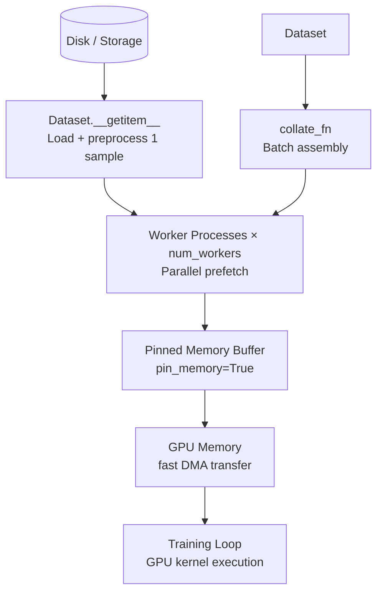

# 📦 PyTorch DataLoader

> [!abstract] TL;DR
> `Dataset` defines *how to load one sample*; `DataLoader` handles *batching, shuffling, and parallel prefetching* of those samples. Implement `__len__` and `__getitem__` in your `Dataset` subclass — that's the entire contract. The DataLoader then wraps it with batching, multi-process workers, and GPU pin_memory for maximum throughput.

---

## Intuition — Analogy First

Think of a **restaurant kitchen**:

- **`Dataset`** is the **ingredient list and recipe** — it knows exactly where every ingredient is stored and how to fetch+prep one portion.
- **`DataLoader`** is the **prep station** — it takes orders from the chef (the training loop) and efficiently:
  - Groups multiple portions into a *batch*.
  - *Shuffles* the order each epoch so the chef doesn't memorise presentation order.
  - Runs multiple *prep workers* in parallel so the chef always has ingredients ready (`num_workers`).
  - Pre-loads ingredients to the chef's hot counter (`pin_memory`) so GPU transfer is instant.

The chef (GPU/training loop) never waits for ingredients. The prep station runs ahead, always keeping the counter stocked.

---

## How It Works — Mechanics

### The Dataset Contract
Two methods are required:
- `__len__()`: returns the total number of samples.
- `__getitem__(idx)`: returns one (input, label) pair for index `idx`.

Everything else is optional — transforms, caching, lazy loading.

### DataLoader Parameters
| Parameter | Effect | Typical Values |
|---|---|---|
| `batch_size` | Samples per batch | 16–512 |
| `shuffle` | Randomise sample order each epoch | `True` for train, `False` for val/test |
| `num_workers` | Parallel subprocess data workers | 0–8 (OS/task dependent) |
| `pin_memory` | Allocate in pinned (page-locked) RAM for fast GPU transfer | `True` if using CUDA |
| `drop_last` | Drop the final incomplete batch | `True` for training if batch norm is used |
| `collate_fn` | Custom function to combine samples into a batch | Custom for variable-length data |

### num_workers Tuning
- `num_workers=0`: all loading done in the main process (simplest, slowest).
- `num_workers=4`: 4 subprocesses prefetch data while GPU runs. Sweet spot for most setups.
- Too many workers: overhead from process spawning + memory contention exceeds benefit.
- Rule of thumb: `num_workers = number_of_CPU_cores // 2`.

### `collate_fn` — Handling Variable-Length Inputs
When samples have different lengths (e.g., text sequences), the default collate (stack) fails. Provide a custom `collate_fn` to pad sequences:
```python
from torch.nn.utils.rnn import pad_sequence
def text_collate(batch):
    seqs, labels = zip(*batch)
    padded = pad_sequence(seqs, batch_first=True, padding_value=0)
    return padded, torch.tensor(labels)
```



---

## Code Demo

```python
import os
import torch
import torch.nn as nn
from torch.utils.data import Dataset, DataLoader, random_split, WeightedRandomSampler
from torchvision import transforms
from PIL import Image
import pandas as pd
import numpy as np
import time

# ===== 1. Minimal Custom Dataset =====
class TensorDataset(Dataset):
    """In-memory dataset for tabular data."""
    def __init__(self, X: torch.Tensor, y: torch.Tensor):
        assert len(X) == len(y)
        self.X = X
        self.y = y

    def __len__(self):
        return len(self.X)

    def __getitem__(self, idx):
        return self.X[idx], self.y[idx]

# ===== 2. Image Dataset with Transforms =====
class ImageFolderCSV(Dataset):
    """
    Custom image dataset reading paths from a CSV:
    CSV columns: [filepath, label]
    """
    def __init__(self, csv_path: str, img_root: str, transform=None):
        self.df = pd.read_csv(csv_path)
        self.img_root = img_root
        self.transform = transform

    def __len__(self):
        return len(self.df)

    def __getitem__(self, idx):
        row = self.df.iloc[idx]
        img_path = os.path.join(self.img_root, row["filepath"])
        image = Image.open(img_path).convert("RGB")

        if self.transform:
            image = self.transform(image)

        label = int(row["label"])
        return image, label


# Standard ImageNet transforms
train_transform = transforms.Compose([
    transforms.RandomResizedCrop(224),
    transforms.RandomHorizontalFlip(),
    transforms.ColorJitter(brightness=0.2, contrast=0.2),
    transforms.ToTensor(),
    transforms.Normalize(mean=[0.485, 0.456, 0.406],
                         std=[0.229, 0.224, 0.225]),
])

val_transform = transforms.Compose([
    transforms.Resize(256),
    transforms.CenterCrop(224),
    transforms.ToTensor(),
    transforms.Normalize(mean=[0.485, 0.456, 0.406],
                         std=[0.229, 0.224, 0.225]),
])

# ===== 3. DataLoader Configuration =====
# Synthetic dataset for demo
X = torch.randn(10000, 128)
y = torch.randint(0, 10, (10000,))
full_ds = TensorDataset(X, y)

train_size = int(0.8 * len(full_ds))
val_size   = len(full_ds) - train_size
train_ds, val_ds = random_split(full_ds, [train_size, val_size],
                                 generator=torch.Generator().manual_seed(42))

# device-aware DataLoader config
device = torch.device("cuda" if torch.cuda.is_available() else "cpu")
loader_kwargs = {
    "num_workers": min(4, os.cpu_count()),
    "pin_memory": device.type == "cuda",
    "persistent_workers": True,  # keep workers alive between epochs (PyTorch 1.7+)
}

train_loader = DataLoader(train_ds, batch_size=64, shuffle=True,
                          drop_last=True, **loader_kwargs)
val_loader   = DataLoader(val_ds,   batch_size=128, shuffle=False,
                          **loader_kwargs)

print(f"Train batches: {len(train_loader)}, Val batches: {len(val_loader)}")
# Iterate one batch
x_batch, y_batch = next(iter(train_loader))
print(f"Batch: {x_batch.shape}, Labels: {y_batch.shape}")

# ===== 4. Handling Class Imbalance with WeightedRandomSampler =====
# Suppose class 0 has 9000 samples, class 1 has 1000 samples
labels_for_sampler = y[:train_size]
class_counts = torch.bincount(labels_for_sampler)
class_weights = 1.0 / class_counts.float()
sample_weights = class_weights[labels_for_sampler]

sampler = WeightedRandomSampler(
    weights=sample_weights,
    num_samples=len(sample_weights),
    replacement=True,
)
balanced_loader = DataLoader(train_ds, batch_size=64, sampler=sampler,
                             **loader_kwargs)
# Note: shuffle=True cannot be used with sampler= — sampler handles ordering

# ===== 5. Custom collate_fn for variable-length sequences =====
from torch.nn.utils.rnn import pad_sequence

def variable_length_collate(batch):
    """Collate function for batches of (sequence_tensor, label) pairs."""
    sequences, labels = zip(*batch)
    # sequences: list of tensors with different lengths
    padded = pad_sequence(sequences, batch_first=True, padding_value=0)
    lengths = torch.tensor([len(s) for s in sequences])
    labels  = torch.tensor(labels)
    return padded, lengths, labels

# Simulated variable-length dataset
class SeqDataset(Dataset):
    def __init__(self, n=100, vocab=500):
        self.samples = [(torch.randint(1, vocab, (torch.randint(10, 100, ()).item(),)),
                         torch.randint(0, 2, ()).item()) for _ in range(n)]
    def __len__(self): return len(self.samples)
    def __getitem__(self, idx): return self.samples[idx]

seq_loader = DataLoader(SeqDataset(), batch_size=16, shuffle=True,
                        collate_fn=variable_length_collate)
padded, lengths, labels = next(iter(seq_loader))
print(f"Padded sequences: {padded.shape}, Lengths: {lengths[:5]}")

# ===== 6. Benchmarking num_workers =====
def benchmark_loader(num_workers, n_batches=50):
    loader = DataLoader(train_ds, batch_size=64, shuffle=True,
                        num_workers=num_workers, pin_memory=False)
    t0 = time.time()
    for i, _ in enumerate(loader):
        if i >= n_batches:
            break
    return (time.time() - t0) / n_batches * 1000  # ms per batch

for nw in [0, 1, 2, 4]:
    ms = benchmark_loader(nw)
    print(f"num_workers={nw}: {ms:.1f} ms/batch")
```

---

## Real-World Example

**All production ML training uses DataLoader patterns:**
- HuggingFace `datasets` library wraps its Arrow-backed datasets with a custom PyTorch `Dataset` that streams from disk — the DataLoader handles batching. Training LLaMA-3-8B on 15 trillion tokens streams data through this pattern.
- PyTorch's `IterableDataset` (used by WebDataset) enables training on datasets stored as `.tar` files on S3, streaming directly to GPU without downloading the entire dataset. Used for training models on internet-scale image datasets.
- NVIDIA's DALI (Data Augmentation Library) replaces the CPU DataLoader with GPU-side augmentation — same `__getitem__` contract, but transforms run on GPU instead of CPU workers.

---

## Trade-offs

| Pattern | Throughput | Memory | Complexity | When |
|---|---|---|---|---|
| `num_workers=0` | Low | Low | Simplest | Debugging; small datasets |
| `num_workers=4` | High | Medium | Low | Standard training |
| `pin_memory=True` | Higher (GPU) | Higher (RAM) | None | Always when using CUDA |
| `IterableDataset` | Very high | Low | Medium | Streaming from cloud storage |
| DALI / GPU augmentation | Highest | Higher (VRAM) | High | Throughput-critical vision |
| `persistent_workers=True` | Higher | Medium | None | Multi-epoch training |

---

## When to Use vs Avoid

**Always use DataLoader when:**
- Training any PyTorch model on more than a trivial dataset.
- You want shuffling, batching, or multi-process loading.

**Use IterableDataset when:**
- Dataset is too large for RAM (TBs of text, billion-scale image datasets).
- Streaming from network storage (S3, GCS).
- Generating data on-the-fly (simulation environments, online data augmentation).

**Avoid complex custom collate when:**
- You can pad at the Dataset level instead — simpler and equally correct.
- All sequences have the same length (use default collate).

---

## Common Pitfalls

1. **`num_workers > 0` with CUDA initialised in main process** — on some systems, CUDA in the main process and forked subprocesses conflict. Use `multiprocessing_context='spawn'` or init CUDA only inside the training function.
2. **Not setting `drop_last=True` for BatchNorm** — a batch of 1 sample causes BatchNorm to fail (variance = 0, NaN output). `drop_last=True` prevents this.
3. **Slow `__getitem__` from disk** — if every `__getitem__` reads from disk separately, workers help but only so much. Pre-convert to HDF5, LMDB, or memory-mapped files for large image datasets.
4. **Forgetting `shuffle=False` for validation** — while it doesn't affect accuracy metrics, shuffled validation batches make per-batch loss curves noisy and hard to compare across runs.
5. **`WeightedRandomSampler` + `shuffle=True`** — mutually exclusive; passing both raises an error. The sampler *replaces* shuffling.
6. **Windows `num_workers > 0`** — on Windows, multiprocessing uses "spawn" not "fork"; you must wrap your main script in `if __name__ == "__main__":` or workers will deadlock.

---

## Related Concepts

- [[_MOC_Deep_Learning|↑ Section MOC]]

- [[PyTorch_Training_Loop]] — the loop that consumes DataLoader batches
- [[PyTorch_Fundamentals]] — tensors and device management that DataLoader produces

---

## Review Questions

1. What are the two mandatory methods to implement in a `Dataset` subclass? What should each return?
2. You have a dataset of 1001 samples and `drop_last=True, batch_size=64`. How many batches does the DataLoader yield, and why is `drop_last` useful when BatchNorm is present?
3. When would you use `IterableDataset` instead of `Dataset`, and what key method do you override instead of `__getitem__`?

---

## Sources

- PyTorch docs — `torch.utils.data` (Dataset, DataLoader, WeightedRandomSampler)
- PyTorch tutorials — "Writing Custom Datasets, DataLoaders and Transforms"
- WebDataset library — efficient streaming dataset for large-scale training
- NVIDIA DALI documentation — GPU-accelerated data loading

#pytorch #dataloader #dataset #data-pipeline #batching #transforms #num-workers #deep-learning
