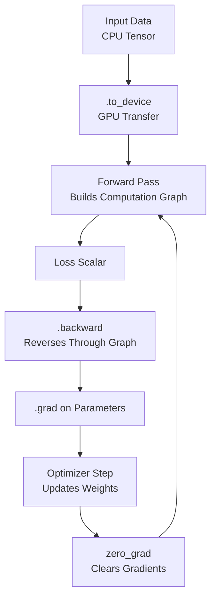

# 🔥 PyTorch Fundamentals

> [!abstract] TL;DR
> PyTorch is GPU-accelerated NumPy with automatic differentiation. Three core ideas: **tensors** (n-dimensional arrays that live on CPU or GPU), **autograd** (automatically computes gradients via dynamic computation graphs), and **nn.Module** (composable building blocks for neural networks). Understanding these three concepts lets you implement any deep learning model.

---

## Intuition — Analogy First

PyTorch is **NumPy with superpowers**:
- Same array-thinking: index, slice, reshape, broadcast — identical mental model.
- Superpower 1 — **GPU**: `tensor.to("cuda")` moves data to GPU memory; all operations run on the GPU transparently. No GPU-specific code needed.
- Superpower 2 — **Autograd**: every arithmetic operation on a tensor with `requires_grad=True` is recorded in a computation graph. Call `.backward()` and PyTorch walks the graph backwards, accumulating gradients. You get derivatives of any computation for free.
- Superpower 3 — **Dynamic graphs (define-by-run)**: unlike TensorFlow 1.x, the graph is built as Python executes. `if`, `for`, Python functions — all work naturally. Debugging is just regular Python debugging.

Think of it as: you write math the way you'd write it on paper; PyTorch secretly builds a gradient machine behind the scenes.

---

## How It Works — Mechanics

### Tensors
- Core data structure: an n-dimensional array with a `dtype` and `device`.
- GPU tensors and CPU tensors cannot be mixed in operations — always move to the same device first.
- Tensor operations are differentiable when `requires_grad=True`.

### Autograd and Computation Graph
- Each tensor with `requires_grad=True` tracks operations in a `grad_fn`.
- `.backward()` on a scalar triggers reverse-mode automatic differentiation.
- Gradients accumulate in `.grad` attributes.
- `with torch.no_grad()`: disables gradient tracking (evaluation, inference).
- `optimizer.zero_grad()`: clears accumulated gradients before each backward pass.

### nn.Module
- Base class for all neural network layers and models.
- Subclass it, define `__init__` (layers as attributes) and `forward`.
- `.parameters()` recursively collects all leaf parameters.
- `.train()` and `.eval()` switch behaviour for Dropout/BatchNorm.



---

## The Math

Autograd implements **reverse-mode automatic differentiation** (backpropagation). For a composed function $L = f(g(x))$:

$$\frac{\partial L}{\partial x} = \frac{\partial L}{\partial f} \cdot \frac{\partial f}{\partial g} \cdot \frac{\partial g}{\partial x}$$

PyTorch stores $\frac{\partial L}{\partial \text{output}}$ at each node and multiplies by the local Jacobian to get $\frac{\partial L}{\partial \text{input}}$ — the "vector-Jacobian product" (VJP).

For a weight matrix $W$ in a linear layer ($y = Wx$), given upstream gradient $\frac{\partial L}{\partial y}$:
$$\frac{\partial L}{\partial W} = \frac{\partial L}{\partial y} \cdot x^\top, \quad \frac{\partial L}{\partial x} = W^\top \cdot \frac{\partial L}{\partial y}$$

---

## Code Demo

```python
import torch
import torch.nn as nn
import torch.optim as optim

# ===== 1. Tensor Creation =====
# From Python / NumPy
t1 = torch.tensor([[1.0, 2.0], [3.0, 4.0]])    # from list
t2 = torch.zeros(3, 4)                           # zeros
t3 = torch.randn(2, 3, 4)                        # random normal
t4 = torch.arange(10).float().reshape(2, 5)      # range → reshape

print(t3.shape)   # torch.Size([2, 3, 4])
print(t3.dtype)   # torch.float32
print(t3.device)  # cpu

# ===== 2. Device Management =====
device = torch.device("cuda" if torch.cuda.is_available() else "cpu")
print(f"Using: {device}")

t_gpu = t1.to(device)         # move to GPU (no-op on CPU)
t_back = t_gpu.cpu()          # back to CPU
t_numpy = t_back.detach().numpy()  # to NumPy (must be CPU + detached)

# ===== 3. Autograd — Computing Gradients =====
x = torch.tensor([2.0], requires_grad=True)
y = x ** 3 + 2 * x            # y = x³ + 2x
y.backward()                   # dy/dx = 3x² + 2 = 14 at x=2
print(x.grad)                  # tensor([14.])

# Multiple variables
a = torch.tensor(3.0, requires_grad=True)
b = torch.tensor(4.0, requires_grad=True)
c = a ** 2 + b ** 2            # c = a² + b²
c.backward()
print(a.grad, b.grad)          # 2a=6, 2b=8

# Gradient accumulation pitfall — always zero_grad!
for _ in range(3):
    y = x ** 2
    y.backward(retain_graph=True)
print(x.grad)  # Accumulated! 3 × 4.0 = 12.0 (not 4.0)
x.grad.zero_()  # Clear manually

# Context manager: no gradient tracking
with torch.no_grad():
    z = x * 2
print(z.requires_grad)  # False — no graph built

# ===== 4. nn.Module — Custom Layer and Model =====
class LinearBlock(nn.Module):
    """A reusable building block: Linear → BatchNorm → ReLU → Dropout."""
    def __init__(self, in_features, out_features, dropout=0.3):
        super().__init__()
        self.layers = nn.Sequential(
            nn.Linear(in_features, out_features),
            nn.BatchNorm1d(out_features),
            nn.ReLU(),
            nn.Dropout(dropout),
        )

    def forward(self, x):
        return self.layers(x)

class MLP(nn.Module):
    def __init__(self, input_dim, hidden_dim, output_dim):
        super().__init__()
        self.net = nn.Sequential(
            LinearBlock(input_dim, hidden_dim),
            LinearBlock(hidden_dim, hidden_dim),
            nn.Linear(hidden_dim, output_dim),  # no dropout on output
        )

    def forward(self, x):
        return self.net(x)

model = MLP(input_dim=784, hidden_dim=256, output_dim=10).to(device)

# Inspect parameters
total_params = sum(p.numel() for p in model.parameters())
trainable = sum(p.numel() for p in model.parameters() if p.requires_grad)
print(f"Total params: {total_params:,}, Trainable: {trainable:,}")

# ===== 5. Forward Pass + Gradient Flow =====
x_batch = torch.randn(32, 784).to(device)     # batch of 32
y_batch = torch.randint(0, 10, (32,)).to(device)

model.train()                                  # enables Dropout, BatchNorm in train mode
logits = model(x_batch)                        # forward pass
print(logits.shape)                            # (32, 10)

criterion = nn.CrossEntropyLoss()
optimizer = optim.Adam(model.parameters(), lr=1e-3)

loss = criterion(logits, y_batch)
print(f"Loss: {loss.item():.4f}")

optimizer.zero_grad()    # ← always before backward
loss.backward()          # compute gradients

# Check a gradient
for name, param in model.named_parameters():
    if param.grad is not None:
        print(f"{name:40s} grad norm: {param.grad.norm():.4f}")
        break

optimizer.step()         # update weights

# ===== 6. Saving and Loading =====
torch.save(model.state_dict(), "model.pt")
model_loaded = MLP(784, 256, 10)
model_loaded.load_state_dict(torch.load("model.pt", map_location="cpu"))
model_loaded.eval()

# eval mode: Dropout passes through, BatchNorm uses running stats
with torch.no_grad():
    preds = model_loaded(x_batch.cpu())
print("Loaded model output:", preds.shape)
```

---

## Real-World Example

**PyTorch powers the majority of ML research and much of production ML:**
- Meta uses PyTorch for all its AI systems — LLaMA, Segment Anything, ImageBind.
- OpenAI's GPT-3/4 training used PyTorch (confirmed by multiple researchers).
- Google Brain's internal projects increasingly use PyTorch alongside JAX.
- HuggingFace's entire ecosystem (Transformers, Diffusers, PEFT) is PyTorch-first.
- Academic benchmark: >70% of papers at NeurIPS 2023 used PyTorch.

---

## Trade-offs

| Property | PyTorch | TensorFlow/Keras | JAX |
|---|---|---|---|
| Debugging | Excellent (standard Python debugger) | Medium (graph mode harder) | Hard (functional; tracing errors cryptic) |
| Research flexibility | Excellent | Good | Excellent |
| Production deployment | Good (TorchScript, ONNX) | Excellent (TF Serving, TFLite) | Medium (JAX → ONNX via jax2tf) |
| Mobile | Medium (PyTorch Mobile) | Excellent (TFLite) | Poor |
| Ecosystem (HuggingFace, etc.) | Dominant | Large but secondary | Growing |
| Speed (raw compute) | Excellent (+ compile()) | Excellent | Excellent (XLA JIT) |

---

## When to Use vs Avoid

**Use PyTorch when:**
- Research, experimentation, prototyping — the standard choice.
- Fine-tuning pretrained models from HuggingFace.
- Any NLP, CV, or generative AI work.

**Consider TF/Keras when:**
- Deploying to mobile (TFLite is more mature than PyTorch Mobile).
- Existing TF-based infrastructure/team.

**Consider JAX when:**
- Training on Google TPUs.
- Research needing advanced autodiff (higher-order, per-sample gradients via `vmap`).

---

## Common Pitfalls

1. **Not calling `zero_grad()`** — gradients accumulate by default. Missing `optimizer.zero_grad()` gives wrong gradients. Always call it before `loss.backward()`.
2. **`.item()` vs tensor arithmetic** — `.item()` extracts a Python scalar; accumulating a tensor in a loop (e.g., `total_loss += loss`) keeps the whole computation graph alive. Use `loss.item()`.
3. **In-place operations on leaf tensors** — `x += 1` on a `requires_grad=True` leaf breaks the graph. Use `x = x + 1`.
4. **Forgetting `model.eval()` and `torch.no_grad()` at inference** — Dropout still randomly drops neurons; BatchNorm uses batch statistics instead of running stats. Always use both for evaluation.
5. **Device mismatch** — mixing CPU and GPU tensors raises a RuntimeError. Use `tensor.to(device)` and store `device = next(model.parameters()).device` to always match.

---

## Related Concepts

- [[_MOC_Deep_Learning|↑ Section MOC]]

- [[PyTorch_Training_Loop]] — the complete training loop that assembles these primitives
- [[PyTorch_DataLoader]] — how to feed data into the training loop
- [[CNN_Fundamentals]] — example of nn.Module in practice
- [[NumPy_Fundamentals]] — the conceptual predecessor to PyTorch tensors

---

## Review Questions

1. Why does PyTorch require calling `optimizer.zero_grad()` before every backward pass? What happens if you forget it?
2. A tensor `x` has `requires_grad=True`. You compute `y = x.sum()` and call `y.backward()`. What does `x.grad` contain, and what does the computation graph look like?
3. What is the difference between `model.train()` and `model.eval()`, and which two layer types change behaviour between modes?

---

## Sources

- PyTorch official documentation (pytorch.org/docs)
- Paszke et al. (2019) — "PyTorch: An Imperative Style, High-Performance Deep Learning Library" (NeurIPS)
- "Deep Learning with PyTorch" (book) — Viehmann, Stevens et al.
- PyTorch tutorials — `pytorch.org/tutorials`

#pytorch #tensors #autograd #nn-module #deep-learning #framework #gpu #gradients
