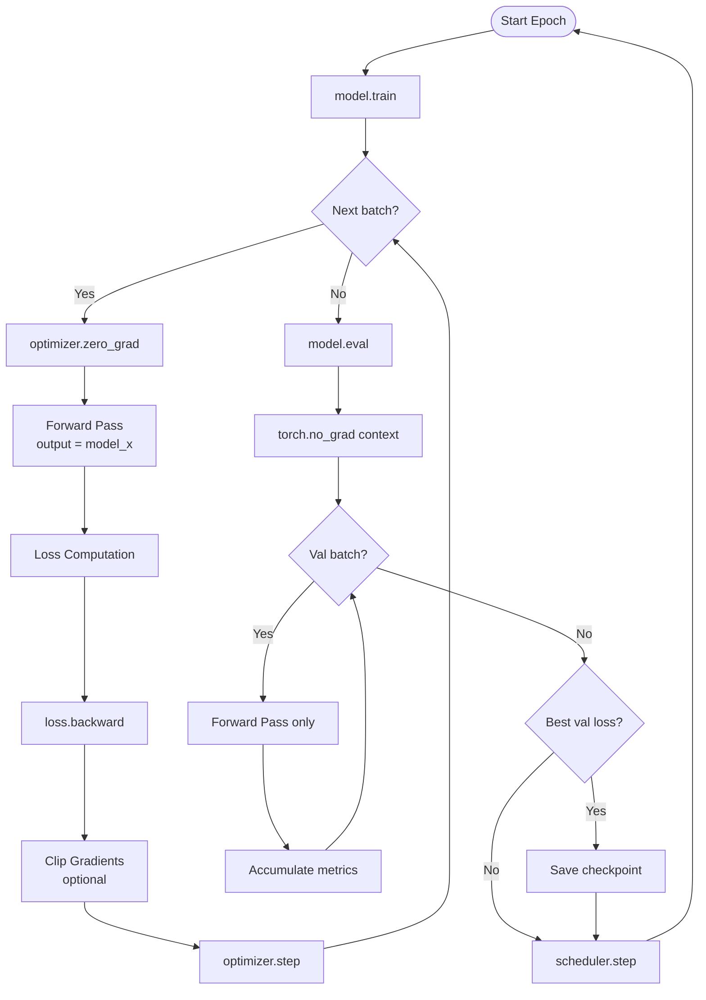

# 🏭 PyTorch Training Loop

> [!abstract] TL;DR
> Every PyTorch model follows the same training loop skeleton: `model.train()` → `zero_grad()` → forward pass → loss → `backward()` → gradient clipping → `optimizer.step()` → validation with `model.eval()` + `torch.no_grad()` → checkpoint saving. Internalise this pattern once; it never changes.

---

## Intuition — Analogy First

Think of training as a **factory assembly line with quality control**:

1. **`zero_grad()`** — Clear the conveyor belt before starting a new batch. (Accumulated leftover parts from the last run would corrupt the current product.)
2. **Forward pass** — Build the product (the model's prediction).
3. **Loss computation** — Quality inspector measures how bad the product is.
4. **`backward()`** — The inspector traces back through the assembly line to find *which stations* caused the defect and by *how much*.
5. **Gradient clipping** — Safety valve: if the fault measurement is absurdly large (exploding gradients), cap it before it breaks the machinery.
6. **`optimizer.step()`** — Each station adjusts its process slightly to reduce future defects.
7. **Validation** — At end of shift, run the line with the *guard rails up* (`no_grad`) to measure true quality on unseen products — no adjustments made.
8. **Checkpoint** — Photograph the best factory state so you can revert if tomorrow's run is worse.

---

## How It Works — Mechanics

### The Five Non-Negotiable Steps (per batch)
```
optimizer.zero_grad()    # 1. Clear old gradients
output = model(x)        # 2. Forward pass
loss = criterion(output, y)  # 3. Compute loss
loss.backward()          # 4. Backprop
optimizer.step()         # 5. Update weights
```

### Training vs Evaluation Mode
| Aspect | `model.train()` | `model.eval()` |
|---|---|---|
| Dropout | Active (random neuron drop) | Disabled (full network) |
| BatchNorm | Uses batch stats | Uses running mean/var |
| Gradient computation | Expected | Disable with `no_grad` |

Always switch modes. Forgetting `eval()` during validation gives artificially noisy metrics.

### Gradient Accumulation
When batch size is limited by GPU memory, simulate larger batches by accumulating gradients over $k$ steps before calling `optimizer.step()`:
```python
# Simulate effective batch_size = batch_size × accumulation_steps
for i, (x, y) in enumerate(loader):
    loss = criterion(model(x), y) / accumulation_steps
    loss.backward()
    if (i + 1) % accumulation_steps == 0:
        optimizer.step()
        optimizer.zero_grad()
```

### Learning Rate Scheduling
Adjusting LR during training is standard — warm-up then decay or cosine annealing:
```python
scheduler = torch.optim.lr_scheduler.CosineAnnealingLR(optimizer, T_max=num_epochs)
# After each epoch:
scheduler.step()
```



---

## Code Demo

```python
import torch
import torch.nn as nn
import torch.optim as optim
from torch.utils.data import DataLoader, TensorDataset
import copy
import time

# ===== Complete, production-ready training loop =====

def train_epoch(model, loader, criterion, optimizer, device, clip_grad=1.0,
                accumulation_steps=1):
    """Single training epoch. Returns average loss."""
    model.train()
    total_loss = 0.0
    correct = 0
    total = 0

    optimizer.zero_grad()  # zero at start (handles gradient accumulation start)

    for step, (inputs, targets) in enumerate(loader):
        inputs, targets = inputs.to(device), targets.to(device)

        outputs = model(inputs)
        loss = criterion(outputs, targets)

        # Gradient accumulation: scale loss
        (loss / accumulation_steps).backward()

        if (step + 1) % accumulation_steps == 0:
            if clip_grad is not None:
                torch.nn.utils.clip_grad_norm_(model.parameters(), clip_grad)
            optimizer.step()
            optimizer.zero_grad()

        # Track metrics (use .item() to detach from graph)
        total_loss += loss.item()
        preds = outputs.argmax(dim=1)
        correct += (preds == targets).sum().item()
        total += targets.size(0)

    avg_loss = total_loss / len(loader)
    accuracy = correct / total
    return avg_loss, accuracy


@torch.no_grad()  # decorator form — equivalent to with torch.no_grad() block
def evaluate(model, loader, criterion, device):
    """Validation / test evaluation. Returns loss and accuracy."""
    model.eval()
    total_loss = 0.0
    correct = 0
    total = 0

    for inputs, targets in loader:
        inputs, targets = inputs.to(device), targets.to(device)
        outputs = model(inputs)
        loss = criterion(outputs, targets)
        total_loss += loss.item()
        preds = outputs.argmax(dim=1)
        correct += (preds == targets).sum().item()
        total += targets.size(0)

    return total_loss / len(loader), correct / total


def save_checkpoint(model, optimizer, epoch, val_loss, path):
    torch.save({
        "epoch": epoch,
        "model_state_dict": model.state_dict(),
        "optimizer_state_dict": optimizer.state_dict(),
        "val_loss": val_loss,
    }, path)


def load_checkpoint(path, model, optimizer=None, device="cpu"):
    ckpt = torch.load(path, map_location=device)
    model.load_state_dict(ckpt["model_state_dict"])
    if optimizer is not None:
        optimizer.load_state_dict(ckpt["optimizer_state_dict"])
    return ckpt["epoch"], ckpt["val_loss"]


def fit(model, train_loader, val_loader, n_epochs=10, lr=1e-3,
        patience=5, checkpoint_path="best_model.pt"):
    """High-level training function with early stopping."""
    device = torch.device("cuda" if torch.cuda.is_available() else "cpu")
    model = model.to(device)

    optimizer = optim.AdamW(model.parameters(), lr=lr, weight_decay=1e-2)
    scheduler = optim.lr_scheduler.CosineAnnealingLR(optimizer, T_max=n_epochs)
    criterion = nn.CrossEntropyLoss()

    best_val_loss = float("inf")
    patience_counter = 0
    history = {"train_loss": [], "val_loss": [], "train_acc": [], "val_acc": []}

    for epoch in range(1, n_epochs + 1):
        t0 = time.time()

        train_loss, train_acc = train_epoch(
            model, train_loader, criterion, optimizer, device)
        val_loss, val_acc = evaluate(model, val_loader, criterion, device)

        scheduler.step()

        history["train_loss"].append(train_loss)
        history["val_loss"].append(val_loss)
        history["train_acc"].append(train_acc)
        history["val_acc"].append(val_acc)

        elapsed = time.time() - t0
        current_lr = scheduler.get_last_lr()[0]
        print(f"Epoch {epoch:3d}/{n_epochs} | "
              f"Train Loss: {train_loss:.4f} Acc: {train_acc:.3f} | "
              f"Val Loss: {val_loss:.4f} Acc: {val_acc:.3f} | "
              f"LR: {current_lr:.2e} | {elapsed:.1f}s")

        # Checkpoint on best val loss
        if val_loss < best_val_loss:
            best_val_loss = val_loss
            patience_counter = 0
            save_checkpoint(model, optimizer, epoch, val_loss, checkpoint_path)
            print(f"  ✓ Saved checkpoint (val_loss={val_loss:.4f})")
        else:
            patience_counter += 1
            if patience_counter >= patience:
                print(f"Early stopping at epoch {epoch}")
                break

    # Restore best model
    load_checkpoint(checkpoint_path, model, optimizer, device)
    return history


# ===== Demo with synthetic data =====
X = torch.randn(1000, 20)
y = torch.randint(0, 5, (1000,))
dataset = TensorDataset(X, y)
n_train = 800
train_ds, val_ds = torch.utils.data.random_split(dataset, [n_train, 200])
train_loader = DataLoader(train_ds, batch_size=32, shuffle=True)
val_loader   = DataLoader(val_ds,   batch_size=64, shuffle=False)

model = nn.Sequential(
    nn.Linear(20, 64), nn.ReLU(), nn.Dropout(0.3),
    nn.Linear(64, 64), nn.ReLU(), nn.Dropout(0.3),
    nn.Linear(64, 5),
)

history = fit(model, train_loader, val_loader, n_epochs=20, lr=3e-3, patience=5)
print(f"Best val loss: {min(history['val_loss']):.4f}")
```

---

## Real-World Example

**Every production PyTorch model follows this exact pattern.** The HuggingFace `Trainer` class is a sophisticated wrapper around exactly this loop — it adds distributed training, mixed precision (`torch.amp`), gradient checkpointing, and logging, but the core five-step sequence is identical.

A typical fine-tuning run of LLaMA-7B on a single A100:
- `accumulation_steps=8` to simulate a batch of 64 with 8 samples per GPU step.
- `clip_grad_norm=1.0` — standard for transformer training.
- AdamW with linear warmup + cosine decay schedule.
- `torch.cuda.amp.autocast()` for mixed-precision (FP16) forward pass.
- Checkpoint every 500 steps, best kept by validation perplexity.

---

## Trade-offs

| Practice | Benefit | Cost / Risk |
|---|---|---|
| Gradient clipping | Prevents exploding gradients, stable training | Slightly reduces effective gradient signal |
| Gradient accumulation | Larger effective batch size on limited GPU RAM | Slower iteration (multiple forward passes) |
| LR warmup | Prevents early training instability | Requires scheduler tuning |
| Early stopping | Prevents overfitting, saves compute | May stop prematurely if val set is noisy |
| Mixed precision (AMP) | 2× speed, half memory | Potential numerical instability if `loss_scale` not tuned |

---

## When to Use vs Avoid

This pattern applies **universally** to all supervised PyTorch training. Variations:
- **Unsupervised / generative**: same loop but loss is reconstruction error, KL, etc.
- **Reinforcement learning**: `loss.backward()` on policy gradient loss; same primitives.
- **Meta-learning (MAML)**: nested loops, but inner loop is the same 5-step pattern.

There is no scenario where you'd avoid this pattern in PyTorch — it's the fundamental interface.

---

## Common Pitfalls

1. **Missing `zero_grad()`** — most common beginner bug; gradients silently accumulate, model never converges.
2. **Logging `loss` tensor instead of `loss.item()`** — holds the entire computation graph in memory; training crashes with OOM after many batches.
3. **Forgetting `model.eval()` + `torch.no_grad()` together** — `model.eval()` alone doesn't stop gradient computation; `torch.no_grad()` alone doesn't fix Dropout/BatchNorm. Need both.
4. **Calling `scheduler.step()` at the wrong time** — for epoch-level schedulers, call after the epoch; for step-level schedulers (e.g., `OneCycleLR`), call inside the batch loop. Check the docs.
5. **Saving only `model.state_dict()`** — if you want to resume training (not just inference), you must also save `optimizer.state_dict()` and `epoch` number.
6. **Validation leak** — computing metrics on the train set and calling them "validation". Always use a held-out set that the model never trains on.

---

## Related Concepts

- [[_MOC_Deep_Learning|↑ Section MOC]]

- [[PyTorch_Fundamentals]] — tensors, autograd, nn.Module — the building blocks of this loop
- [[PyTorch_DataLoader]] — the DataLoader that feeds batches into this loop
- [[Optimizers]] — Adam, AdamW, SGD — what happens in `optimizer.step()`
- [[Gradient_Descent_Variants]] — the theory behind the update rule

---

## Review Questions

1. Write the five mandatory steps of a training batch loop in order. What happens to convergence if you omit `zero_grad()`?
2. You have a batch size of 16 but want an effective batch size of 128. How do you implement gradient accumulation, and what do you need to change about the loss value before calling `.backward()`?
3. Explain the difference between `torch.save(model.state_dict(), ...)` and `torch.save(model, ...)`. Which is preferred for production checkpoints and why?

---

## Sources

- PyTorch tutorials — "Training a Classifier" (pytorch.org/tutorials)
- PyTorch docs — `torch.optim`, `torch.nn.utils.clip_grad_norm_`
- HuggingFace Trainer source — `transformers/trainer.py` (canonical production example)
- "Deep Learning with PyTorch" (Manning) — Ch. 5-8

#pytorch #training-loop #backpropagation #optimizer #gradient-clipping #checkpoint #early-stopping #deep-learning
