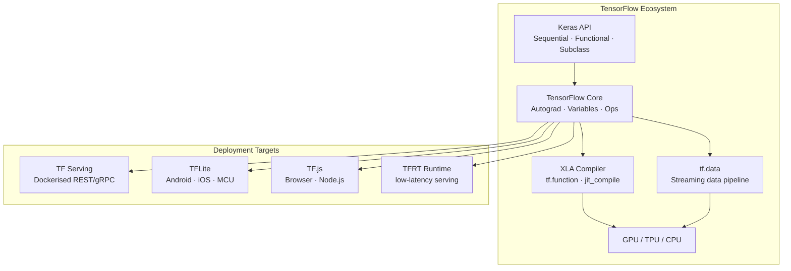

# 🟠 TensorFlow & Keras

> [!abstract] TL;DR
> Keras is the high-level API for defining models (Sequential, Functional, subclassing); TensorFlow is the execution engine underneath. `@tf.function` compiles Python to an XLA-optimised computation graph. The TF ecosystem excels at deployment: TF Serving for microservices, TFLite for mobile/edge, TF.js for browsers. Despite PyTorch's research dominance, TF/Keras remains the standard in production mobile and web ML.

---

## Intuition — Analogy First

**Keras is the friendly car dashboard; TensorFlow is the engine.**

When you drive, you don't think about combustion ratios — you steer and press pedals. Keras is the steering wheel: `model.compile()`, `model.fit()`, `model.evaluate()`. You describe *what* you want, not *how* the GPU executes it.

TensorFlow is the engine underneath: XLA compilation, kernel fusion, TPU/GPU scheduling. Most of the time you never see it directly.

The analogy extends to the full ecosystem:
- **TF Serving** = shipping the car to a factory that mass-produces it at scale.
- **TFLite** = a miniaturised version of the engine that fits in a phone.
- **TF.js** = converting the engine to run in a web browser (JavaScript).

---

## How It Works — Mechanics

### Three Ways to Build Models in Keras

**1. Sequential API** — simplest, for linear stacks only:
```python
model = tf.keras.Sequential([
    tf.keras.layers.Dense(64, activation="relu"),
    tf.keras.layers.Dense(10),
])
```

**2. Functional API** — for branching, multi-input/output models:
```python
inputs = tf.keras.Input(shape=(784,))
x = tf.keras.layers.Dense(64, activation="relu")(inputs)
outputs = tf.keras.layers.Dense(10)(x)
model = tf.keras.Model(inputs, outputs)
```

**3. Subclassing** — maximum flexibility, like PyTorch's `nn.Module`:
```python
class MyModel(tf.keras.Model):
    def __init__(self):
        super().__init__()
        self.dense = tf.keras.layers.Dense(64, activation="relu")
    def call(self, x, training=False):
        return self.dense(x)
```

### `@tf.function` — Graph Execution
- By default in TF2, code runs eagerly (like PyTorch).
- Decorating with `@tf.function` traces the function → compiles to a static graph → runs via XLA.
- Dramatically improves performance for training steps.
- Caveat: Python side effects inside `@tf.function` (print, external mutations) only execute during tracing, not every call.

### tf.data Pipeline
- Lazy, streaming data pipeline with transforms.
- Key operations: `map`, `batch`, `shuffle`, `prefetch`, `cache`, `filter`.
- `prefetch(tf.data.AUTOTUNE)` — pipeline GPU computation and data preprocessing to overlap.



---

## The Math

Keras implements the same gradient descent as PyTorch under the hood. The key TF-specific formula is for **mixed precision loss scaling** (used in production to prevent FP16 underflow):

$$\hat{L} = L \times S$$

where $S$ is the loss scale factor (e.g., $2^{15}$). Gradients are computed for $\hat{L}$, then divided by $S$ before the parameter update:

$$\nabla_\theta L = \frac{\nabla_\theta \hat{L}}{S}$$

The loss scaler increases $S$ periodically and decreases it whenever it detects gradient overflow (Inf/NaN) — automatically managed by `tf.keras.mixed_precision.LossScaleOptimizer`.

---

## Code Demo

```python
import tensorflow as tf
import numpy as np

# ===== 1. Sequential API — Simple Classifier =====
sequential_model = tf.keras.Sequential([
    tf.keras.layers.Input(shape=(784,)),
    tf.keras.layers.Dense(256, activation="relu"),
    tf.keras.layers.BatchNormalization(),
    tf.keras.layers.Dropout(0.3),
    tf.keras.layers.Dense(128, activation="relu"),
    tf.keras.layers.Dropout(0.3),
    tf.keras.layers.Dense(10, activation="softmax"),
], name="mlp_classifier")

sequential_model.compile(
    optimizer=tf.keras.optimizers.Adam(learning_rate=1e-3),
    loss="sparse_categorical_crossentropy",
    metrics=["accuracy"],
)
sequential_model.summary()

# ===== 2. Functional API — ResNet-style skip connection =====
def residual_block(x, units):
    shortcut = x
    x = tf.keras.layers.Dense(units, activation="relu")(x)
    x = tf.keras.layers.BatchNormalization()(x)
    x = tf.keras.layers.Dense(units)(x)
    x = tf.keras.layers.Add()([x, shortcut])  # skip connection
    return tf.keras.layers.Activation("relu")(x)

inputs = tf.keras.Input(shape=(512,))
x = tf.keras.layers.Dense(256, activation="relu")(inputs)
x = residual_block(x, 256)
x = residual_block(x, 256)
outputs = tf.keras.layers.Dense(10, activation="softmax")(x)
functional_model = tf.keras.Model(inputs, outputs, name="res_mlp")

# ===== 3. Custom Model Subclass =====
class TransformerBlock(tf.keras.layers.Layer):
    def __init__(self, d_model, n_heads, dff, dropout=0.1):
        super().__init__()
        self.attn = tf.keras.layers.MultiHeadAttention(
            num_heads=n_heads, key_dim=d_model // n_heads, dropout=dropout)
        self.ffn = tf.keras.Sequential([
            tf.keras.layers.Dense(dff, activation="relu"),
            tf.keras.layers.Dense(d_model),
        ])
        self.norm1 = tf.keras.layers.LayerNormalization(epsilon=1e-6)
        self.norm2 = tf.keras.layers.LayerNormalization(epsilon=1e-6)
        self.drop1 = tf.keras.layers.Dropout(dropout)
        self.drop2 = tf.keras.layers.Dropout(dropout)

    def call(self, x, training=False):
        attn_out = self.attn(x, x, training=training)
        x = self.norm1(x + self.drop1(attn_out, training=training))
        ffn_out = self.ffn(x)
        return self.norm2(x + self.drop2(ffn_out, training=training))

# ===== 4. tf.data Pipeline =====
# Generate synthetic dataset
def make_dataset(n=5000, n_classes=10, input_dim=784, batch_size=64):
    X = np.random.randn(n, input_dim).astype(np.float32)
    y = np.random.randint(0, n_classes, n).astype(np.int32)
    ds = tf.data.Dataset.from_tensor_slices((X, y))
    ds = ds.shuffle(buffer_size=1000, seed=42)
    ds = ds.batch(batch_size)
    ds = ds.prefetch(tf.data.AUTOTUNE)  # overlap preprocessing and model execution
    return ds

# Generator-based dataset (streaming, memory-efficient)
def data_generator():
    for _ in range(1000):
        x = np.random.randn(784).astype(np.float32)
        y = np.random.randint(0, 10)
        yield x, y

streaming_ds = tf.data.Dataset.from_generator(
    data_generator,
    output_signature=(
        tf.TensorSpec(shape=(784,), dtype=tf.float32),
        tf.TensorSpec(shape=(), dtype=tf.int32),
    )
).batch(64).prefetch(tf.data.AUTOTUNE)

# ===== 5. Custom Training Loop with @tf.function =====
optimizer = tf.keras.optimizers.Adam(1e-3)
loss_fn = tf.keras.losses.SparseCategoricalCrossentropy(from_logits=True)

train_loss = tf.keras.metrics.Mean(name="train_loss")
train_acc  = tf.keras.metrics.SparseCategoricalAccuracy(name="train_acc")

@tf.function  # ← compiles this function to a graph; first call traces, subsequent calls are fast
def train_step(x, y):
    with tf.GradientTape() as tape:
        logits = sequential_model(x, training=True)
        loss = loss_fn(y, logits)
    gradients = tape.gradient(loss, sequential_model.trainable_variables)
    optimizer.apply_gradients(zip(gradients, sequential_model.trainable_variables))
    train_loss.update_state(loss)
    train_acc.update_state(y, logits)

@tf.function
def val_step(x, y):
    logits = sequential_model(x, training=False)
    loss = loss_fn(y, logits)
    return loss

# ===== 6. Training with callbacks (model.fit) =====
train_ds = make_dataset(4000, batch_size=64)
val_ds   = make_dataset(1000, batch_size=128)

callbacks = [
    tf.keras.callbacks.EarlyStopping(patience=5, restore_best_weights=True),
    tf.keras.callbacks.ReduceLROnPlateau(factor=0.5, patience=3, min_lr=1e-6),
    tf.keras.callbacks.ModelCheckpoint("best_model.keras", save_best_only=True),
    tf.keras.callbacks.TensorBoard(log_dir="./logs"),
]

history = sequential_model.fit(
    train_ds, epochs=20, validation_data=val_ds, callbacks=callbacks, verbose=1
)

# ===== 7. Save / Load / Convert =====
# SavedModel format (recommended)
sequential_model.save("saved_model/")
loaded = tf.keras.models.load_model("saved_model/")

# Convert to TFLite (mobile deployment)
converter = tf.lite.TFLiteConverter.from_saved_model("saved_model/")
converter.optimizations = [tf.lite.Optimize.DEFAULT]  # 8-bit quantisation
tflite_model = converter.convert()
with open("model_quantised.tflite", "wb") as f:
    f.write(tflite_model)
print(f"TFLite model size: {len(tflite_model) / 1024:.1f} KB")

# Mixed precision (FP16 training — 2× speed on modern GPUs)
tf.keras.mixed_precision.set_global_policy("mixed_float16")
```

---

## Real-World Example

**Google's production ML stack is TensorFlow-first:**
- **Google Search**: the RankBrain model (2015, deep neural net for query understanding) runs on TF Serving handling billions of queries daily.
- **Waymo**: autonomous driving perception models trained in TF and served via TFLite-like runtime on custom hardware in vehicles.
- **Android (TFLite)**: Google Lens, Live Translate, Smart Reply in Gmail — all run TFLite models (typically 1–10MB) on-device for privacy and latency.
- **TF.js**: RunwayML and Teachable Machine (Google's no-code ML tool) both use TF.js — users train image classifiers in the browser without any server.

---

## Trade-offs

| Property | TF/Keras | PyTorch | JAX |
|---|---|---|---|
| Mobile deployment | Excellent (TFLite) | Good (PyTorch Mobile) | Poor |
| Browser deployment | Excellent (TF.js) | Poor | Poor |
| Serving infrastructure | Excellent (TF Serving) | Good (TorchServe) | Poor |
| Research ecosystem | Smaller (mostly PyTorch) | Dominant | Growing |
| Debugging experience | Medium (eager ok; graph hard) | Excellent | Hard |
| High-level API | Excellent (Keras) | Medium (Lightning helps) | Manual |
| Production maturity | Excellent | Good | Developing |

---

## When to Use vs Avoid

**Use TF/Keras when:**
- Deploying to **mobile** (Android/iOS) — TFLite is the most mature mobile inference runtime.
- Deploying in **browsers** — TF.js has no equivalent in PyTorch.
- Enterprise environments with existing TF infrastructure (TF Serving, Vertex AI).
- Projects that heavily use Google's cloud (Vertex AI, Cloud TPU — native TF/JAX).
- You want the high-level `model.fit()` API with callbacks and no boilerplate.

**Avoid TF/Keras when:**
- New research project — PyTorch community, papers, and HuggingFace ecosystem dwarf TF.
- Team is PyTorch-fluent — no reason to switch for non-mobile tasks.
- Fine-tuning HuggingFace models — most are PyTorch-native (TF versions often lag).

---

## Common Pitfalls

1. **TF1 vs TF2 API confusion** — legacy code uses `tf.Session()`, `placeholder`, `feed_dict`. These are TF1 patterns; TF2 uses eager execution and Keras. Mixing them causes cryptic errors.
2. **`@tf.function` Python side effects** — code inside `@tf.function` runs during tracing (first call), not every invocation. `print()`, `assert`, Python `if` on tensor values are all problematic. Use `tf.print()` and `tf.debugging.assert_*`.
3. **Variable creation inside `@tf.function`** — variables (model weights) must be created *before* the function is traced. Creating them inside `@tf.function` causes retracing and bugs.
4. **`model.fit()` vs custom training loop** — `model.fit()` is great for standard workflows; for custom losses, multiple optimisers, or unusual architectures, switch to `GradientTape`.
5. **TFLite quantisation accuracy drop** — 8-bit post-training quantisation can drop accuracy by 1–3% on some models. Always evaluate TFLite model accuracy before shipping; use quantisation-aware training (QAT) if accuracy matters.

---

## Related Concepts

- [[_MOC_Deep_Learning|↑ Section MOC]]

- [[PyTorch_Fundamentals]] — the PyTorch equivalent for comparison
- [[Model_Serving_Overview]] — TF Serving, TFLite, ONNX in the broader serving landscape

---

## Review Questions

1. What is the difference between `model.fit()` and a custom training loop using `tf.GradientTape`? When would you choose the custom loop?
2. `@tf.function` accelerates training by compiling to a graph. What are two things you *cannot* do inside a `@tf.function`-decorated function that you can do in regular Python?
3. You have a Keras model you want to deploy to an Android app. What steps do you take to convert it, and what optimisation does `tf.lite.Optimize.DEFAULT` apply?

---

## Sources

- TensorFlow documentation — tensorflow.org/guide
- Chollet, F. (2021) — "Deep Learning with Python" 2nd edition (the Keras book)
- TFLite guide — tensorflow.org/lite/guide
- TF Serving documentation — tensorflow.org/tfx/guide/serving
- TF.js documentation — tensorflow.org/js

#tensorflow #keras #tflite #tfjs #tf-serving #deployment #mobile #deep-learning #framework
