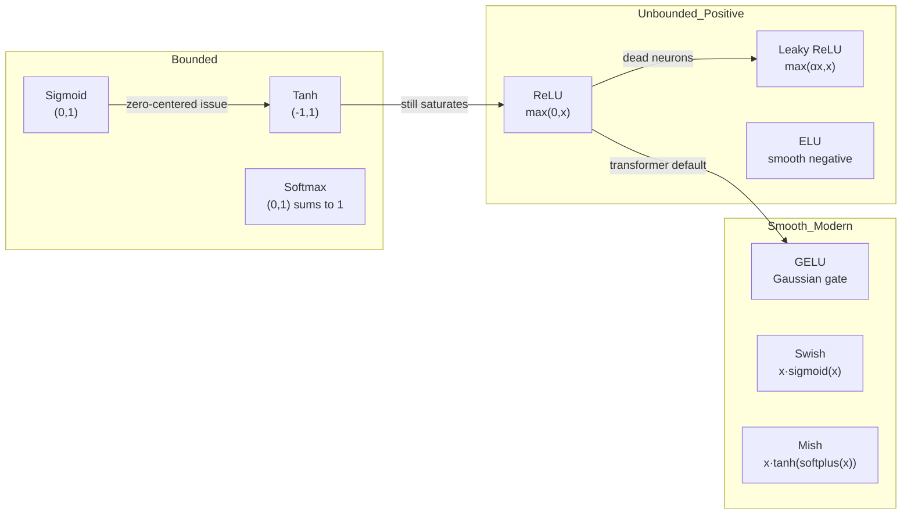

# ⚡ Activation Functions

> [!abstract] TL;DR
> Activation functions inject non-linearity between linear layers so that stacked layers can represent complex functions. Without them, any depth collapses to one linear transformation. Key choices: **ReLU** for CNNs (fast, sparse, dead neuron risk), **GELU** for transformers (smooth, probabilistic interpretation), **Softmax** for multi-class output heads, **Sigmoid/Tanh** are largely legacy except for gates in LSTMs.

## Intuition — Analogy First

Imagine three light controls:

- **Sigmoid** is like a **push-button dimmer** that slowly transitions from full-off to full-on but spends most of its range stuck near the extremes — useful, but sluggish to adjust.
- **Linear** is like a **simple rheostat** (a plain dial): output scales exactly with input, no "decision" is made.
- **ReLU** is like a **one-way valve**: below zero, nothing flows; above zero, flow passes through unchanged. Decisive and fast, but once it shuts off it can stay shut (dead neuron problem).

The point of an activation function is to introduce a *threshold* or *curve* so that each neuron can make a non-linear decision — "does this combination of features exceed some threshold?" Without that, every layer is a linear transformation and composing them yields only linear functions of the input.

## How It Works

### Why Non-Linearity is Necessary

Any composition of linear functions is linear. Activation functions break this:

$$f^{(L)} \circ \cdots \circ f^{(2)} \circ f^{(1)}(x) \quad \text{with } f^{(k)}(x) = \sigma(W^{(k)}x + b^{(k)})$$

is only a universal approximator because $\sigma$ is non-linear.



### Function-by-Function Breakdown

| Function | Formula | Range | Key Property | When to Use |
|----------|---------|-------|-------------|-------------|
| Sigmoid | $1/(1+e^{-x})$ | (0, 1) | Saturates at extremes → vanishing grad | Binary output, LSTM gates |
| Tanh | $(e^x - e^{-x})/(e^x + e^{-x})$ | (-1, 1) | Zero-centered (sigmoid is not) | RNN hidden states |
| ReLU | $\max(0, x)$ | $[0, \infty)$ | Sparse, fast; dead neurons at x<0 | CNNs, MLPs (default choice) |
| Leaky ReLU | $\max(\alpha x, x)$, $\alpha$=0.01 | $(-\infty, \infty)$ | Fixes dead neurons | Drop-in ReLU replacement |
| ELU | $x$ if $x>0$; $\alpha(e^x-1)$ if $x \le 0$ | $(-\alpha, \infty)$ | Smooth negative → mean closer to 0 | Alternative to Leaky ReLU |
| GELU | $x \cdot \Phi(x)$ | $\approx(-0.17, \infty)$ | Smooth, stochastic interpretation | Transformers (BERT, GPT) |
| Swish | $x \cdot \sigma(\beta x)$ | $\approx(-0.28, \infty)$ | Self-gated, smooth | EfficientNet, MobileNetV3 |
| Softmax | $e^{x_i}/\sum_j e^{x_j}$ | (0, 1) each, sum=1 | Probability distribution over classes | Multi-class output layer |

## The Math

### Sigmoid and Its Derivative

$$\sigma(x) = \frac{1}{1 + e^{-x}}$$

$$\sigma'(x) = \sigma(x)(1 - \sigma(x))$$

Maximum derivative is 0.25 (at x=0). For deep nets, multiplying many values $\le 0.25$ causes **vanishing gradients**.

### Tanh

$$\tanh(x) = \frac{e^x - e^{-x}}{e^x + e^{-x}} = 2\sigma(2x) - 1$$

$$\tanh'(x) = 1 - \tanh^2(x)$$

Maximum derivative is 1 (at x=0) — better than sigmoid but still saturates.

### ReLU

$$\text{ReLU}(x) = \max(0, x)$$

$$\text{ReLU}'(x) = \begin{cases} 1 & x > 0 \\ 0 & x < 0 \end{cases}$$

Sub-gradient is used at x=0 (usually set to 0). **Dead neuron**: if pre-activation is always negative, gradient is always 0 — weight never updates.

### GELU

$$\text{GELU}(x) = x \cdot \Phi(x) = x \cdot \frac{1}{2}\left[1 + \text{erf}\!\left(\frac{x}{\sqrt{2}}\right)\right]$$

Approximation used in practice:

$$\text{GELU}(x) \approx 0.5x\left(1 + \tanh\!\left[\sqrt{2/\pi}\left(x + 0.044715x^3\right)\right]\right)$$

**Stochastic interpretation**: GELU(x) = x · P(X ≤ x) where X ~ N(0,1). The neuron gates its own output by the probability that it exceeds a random Gaussian noise threshold.

### Softmax

$$\text{Softmax}(x_i) = \frac{e^{x_i}}{\sum_{j=1}^{K} e^{x_j}}$$

**Numerically stable version** (subtract max before exponentiation):

$$\text{Softmax}(x_i) = \frac{e^{x_i - \max(x)}}{\sum_j e^{x_j - \max(x)}}$$

## Code Demo

```python
import torch
import torch.nn as nn
import torch.nn.functional as F
import matplotlib.pyplot as plt
import numpy as np

# ── Define all activations ────────────────────────────────────────────────────
activations = {
    "Sigmoid":    torch.sigmoid,
    "Tanh":       torch.tanh,
    "ReLU":       F.relu,
    "Leaky ReLU": lambda x: F.leaky_relu(x, 0.1),
    "ELU":        F.elu,
    "GELU":       F.gelu,
    "Swish":      lambda x: x * torch.sigmoid(x),
}

x = torch.linspace(-4, 4, 500, requires_grad=True)

# ── Plot activations and their gradients ─────────────────────────────────────
fig, axes = plt.subplots(2, len(activations), figsize=(20, 6))
for col, (name, fn) in enumerate(activations.items()):
    y = fn(x.clone().detach().requires_grad_(True))
    y_vals = y.detach().numpy()

    # Gradient via autograd
    y.sum().backward()
    grad_vals = x.grad.detach().numpy() if x.grad is not None else np.zeros_like(y_vals)
    x.grad = None  # reset

    axes[0, col].plot(x.detach(), y_vals, color="steelblue")
    axes[0, col].set_title(name, fontsize=9)
    axes[0, col].axhline(0, color="gray", linewidth=0.5)
    axes[0, col].axvline(0, color="gray", linewidth=0.5)
    axes[0, col].set_ylim(-2, 2)

    axes[1, col].plot(x.detach(), grad_vals, color="tomato")
    axes[1, col].axhline(0, color="gray", linewidth=0.5)
    axes[1, col].set_ylim(-0.5, 1.5)

axes[0, 0].set_ylabel("f(x)", fontsize=9)
axes[1, 0].set_ylabel("f'(x)", fontsize=9)
plt.suptitle("Activation Functions and Their Derivatives", y=1.01)
plt.tight_layout()
plt.savefig("activation_functions.png", dpi=120, bbox_inches="tight")

# ── PyTorch module versions ───────────────────────────────────────────────────
activations_module = {
    "ReLU":       nn.ReLU(),
    "LeakyReLU":  nn.LeakyReLU(0.1),
    "ELU":        nn.ELU(),
    "GELU":       nn.GELU(),
    "Sigmoid":    nn.Sigmoid(),
    "Tanh":       nn.Tanh(),
    "Softmax":    nn.Softmax(dim=-1),
}

# ── Demonstrate dead neuron issue with ReLU ───────────────────────────────────
layer = nn.Linear(100, 50)
nn.init.normal_(layer.weight, mean=0, std=10)  # large init → large negative pre-acts
x_demo = torch.randn(128, 100)
pre_act = layer(x_demo)
post_act = F.relu(pre_act)
dead_fraction = (post_act == 0).float().mean().item()
print(f"Dead neuron fraction with large init: {dead_fraction:.1%}")  # often >50%

nn.init.kaiming_normal_(layer.weight)  # proper init
pre_act = layer(x_demo)
post_act = F.relu(pre_act)
dead_fraction = (post_act == 0).float().mean().item()
print(f"Dead neuron fraction with Kaiming init: {dead_fraction:.1%}")  # ~50% expected

# ── GELU vs ReLU: smoothness demo ────────────────────────────────────────────
x_val = torch.tensor([-0.5, 0.0, 0.5, 1.0])
print(f"ReLU:  {F.relu(x_val)}")
print(f"GELU:  {F.gelu(x_val)}")  # GELU is non-zero for slightly negative values
```

## Real-World Example

**BERT and GPT** (and virtually every modern transformer) use **GELU** as their feedforward activation. The original transformer paper used ReLU, but BERT (2018) switched to GELU and found consistent improvement across NLP benchmarks. The smooth, probabilistic nature of GELU seems to act as a mild form of regularization — the network can learn to suppress certain activations partially rather than hard-zeroing them. Most CNNs (ResNet, EfficientNet, ConvNeXt) continue to use ReLU or Swish variants because the discrete thresholding nature of ReLU produces useful feature sparsity for spatial patterns.

## Trade-offs

| Activation | Vanishing Grad | Dead Neurons | Zero-Centered | Computation | Best Use Case |
|-----------|----------------|--------------|----------------|-------------|---------------|
| Sigmoid | Yes (severe) | No | No | Medium | Gates, binary output |
| Tanh | Mild | No | Yes | Medium | RNN hidden, legacy |
| ReLU | No | Yes (~10–50%) | No | Fast | CNNs, default |
| Leaky ReLU | No | No | No | Fast | Drop-in ReLU |
| ELU | No | No | Near-zero mean | Slower | Competitive with LReLU |
| GELU | No | No | No | Medium | Transformers |
| Swish | No | No | No | Medium | EfficientNet family |
| Softmax | — | — | — | Medium | Multi-class output only |

## When to Use vs Avoid

**ReLU** — default for CNNs and MLPs. Simple, fast, works well with Kaiming init. Avoid when dead neuron fraction is high (monitor with hooks).

**GELU** — default for transformer feedforward blocks. Use in any attention-based architecture. Slight computational overhead over ReLU is worth the smoothness.

**Sigmoid** — only for binary classification output heads or gating mechanisms (LSTM/GRU). Never use in intermediate layers of deep networks due to vanishing gradients.

**Tanh** — acceptable for RNN hidden states (zero-centered helps). Avoid in very deep networks.

**Softmax** — exclusively for multi-class probability output. Never in hidden layers (suppresses information between classes). Do not apply manually if using `nn.CrossEntropyLoss` — it includes log-softmax internally.

## Common Pitfalls

1. **Applying softmax + CrossEntropyLoss**: PyTorch's `nn.CrossEntropyLoss` expects raw logits; it applies log-softmax internally. Adding softmax beforehand computes log(softmax(x)), distorting gradients.
2. **ReLU at the output layer**: for regression tasks, ReLU constrains predictions to be non-negative — appropriate only if your target is always ≥ 0.
3. **Ignoring dead neuron monitoring**: with poor initialization or large learning rates, >50% of ReLU neurons can die silently. Use forward hooks to track activation sparsity.
4. **Sigmoid saturation in deep nets**: gradients through a 10-layer sigmoid network are multiplied by ≤ 0.25 ten times — that's a factor of ≤ 1e-6. The network barely trains.
5. **Not using `inplace=True` correctly**: `nn.ReLU(inplace=True)` modifies the input tensor in-place, which breaks gradient computation if you need the pre-activation value in a residual connection.
6. **Confusing activation range with loss compatibility**: using tanh output [-1,1] with BCE loss (expects [0,1]) causes NaN losses.

## Related Concepts

- [[_MOC_Deep_Learning|↑ Section MOC]]

- [[Neural_Network_Basics]] — the framework that activation functions plug into
- [[Backpropagation]] — how activation derivatives flow backward as gradients
- [[Weight_Initialization]] — initialization must be paired with the correct activation (Kaiming for ReLU, Xavier for tanh/sigmoid)
- [[Transformer_Architecture]] — GELU and its role in feedforward sublayers
- [[Batch_Normalization]] — works synergistically with ReLU; normalize pre-activation then activate
- [[Loss_Functions]] — the output activation must be compatible with the loss function

## Review Questions

1. **Why does sigmoid cause vanishing gradients in deep networks, and why does ReLU avoid this problem? At what point does ReLU fail and what activation would you substitute?**

2. **GELU has a stochastic interpretation: `GELU(x) = x · P(X ≤ x)` where X ~ N(0,1). Explain intuitively why this is a useful inductive bias for natural language token representations.**

3. **You are building a 5-class classifier. Your last hidden layer outputs a (batch, 5) tensor of logits. Should you apply softmax before passing to `nn.CrossEntropyLoss`? What about `nn.NLLLoss`? Explain the difference.**

## Sources

- Nair, V., Hinton, G. E. (2010). Rectified linear units improve restricted Boltzmann machines. *ICML*.
- Hendrycks, D., Gimpel, K. (2016). Gaussian error linear units (GELUs). *arXiv:1606.08415*.
- Ramachandran, P., Zoph, B., Le, Q. V. (2017). Searching for activation functions. *arXiv:1710.05941*.
- Devlin, J., et al. (2018). BERT: Pre-training of deep bidirectional transformers. *arXiv:1810.04805*.
- Goodfellow, I., Bengio, Y., Courville, A. (2016). *Deep Learning*. MIT Press. Chapter 6.3.

#activation-functions #relu #gelu #sigmoid #tanh #softmax #deep-learning #non-linearity
