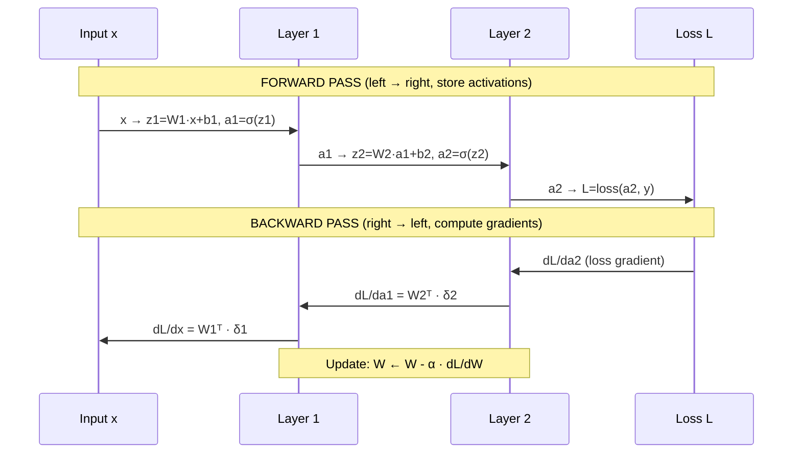

# 🔄 Backpropagation

> [!abstract] TL;DR
> Backpropagation is the chain rule applied systematically to a computation graph. The forward pass computes the loss (storing intermediate activations); the backward pass propagates gradients from loss back to each weight using ∂L/∂w = ∂L/∂a · ∂a/∂z · ∂z/∂w. PyTorch's autograd engine implements this automatically. The two failure modes — vanishing gradients (sigmoid deep nets) and exploding gradients (deep RNNs) — are solved by activation choice, initialization, normalization, and gradient clipping.

## Intuition — Analogy First

Imagine a **blame-assignment problem**: your company's pipeline produced a bad product, and the CEO (loss function) is furious. How do you figure out which employee (weight) is most responsible?

You work *backward*: the CEO blames the final assembly team proportionally to each person's contribution. The assembly team blames the fabrication team with the same logic. The fabrication team blames the raw material suppliers. Each step assigns blame proportional to how much that worker's output affected the next stage.

That proportional blame assignment *is* the gradient. "How much did this weight contribute to the final error?" Backprop traces the causal chain in reverse — from loss to output, from output through each layer back to every weight — computing each weight's share of the blame.

The **chain rule** is the mathematical formulation of this proportional blame. If output y depends on z, which depends on x, then how much a tiny change in x shifts y is: (how much x shifts z) × (how much z shifts y).

## How It Works

### Forward Pass — Store Everything

The forward pass computes the loss AND caches intermediate values needed for the backward pass:

1. For each layer $l = 1, \ldots, L$:
   - $z^{(l)} = W^{(l)} a^{(l-1)} + b^{(l)}$ — cache $a^{(l-1)}$ and $z^{(l)}$
   - $a^{(l)} = \sigma(z^{(l)})$ — cache $a^{(l)}$
2. Compute loss: $\mathcal{L} = \text{loss}(a^{(L)}, y)$

### Backward Pass — Propagate Gradients

Starting from $\frac{\partial \mathcal{L}}{\partial a^{(L)}}$ (derivative of loss w.r.t. network output), propagate backward:

$$\delta^{(l)} = \frac{\partial \mathcal{L}}{\partial z^{(l)}} = \frac{\partial \mathcal{L}}{\partial a^{(l)}} \odot \sigma'(z^{(l)})$$

$$\frac{\partial \mathcal{L}}{\partial W^{(l)}} = \delta^{(l)} \left(a^{(l-1)}\right)^\top$$

$$\frac{\partial \mathcal{L}}{\partial b^{(l)}} = \delta^{(l)}$$

$$\frac{\partial \mathcal{L}}{\partial a^{(l-1)}} = \left(W^{(l)}\right)^\top \delta^{(l)}$$



### Computation Graph

Any operation (add, multiply, sigmoid, matmul) is a node. Edges are data dependencies. The backward pass reverses the edges and multiplies local Jacobians.

```
    x ──┐
        matmul → z → sigmoid → a → MSE_loss → L
    W ──┘             ↑cache↑
```

### Vanishing Gradients

With sigmoid activation, the maximum derivative is 0.25. In a 10-layer sigmoid network:

$$\left|\frac{\partial \mathcal{L}}{\partial W^{(1)}}\right| \leq 0.25^{10} \approx 10^{-6}$$

Weights in early layers receive near-zero gradients and effectively do not learn. This is why sigmoid was abandoned for hidden layers in favor of ReLU.

### Exploding Gradients

In deep RNNs, gradients can compound multiplicatively through many time steps. If weight matrices have spectral radius > 1, gradients grow exponentially. Solution: gradient clipping (see [[Gradient_Clipping]]).

## The Math

### Chain Rule (Single Variable)

If $y = f(g(x))$:

$$\frac{dy}{dx} = \frac{dy}{dg} \cdot \frac{dg}{dx}$$

### Chain Rule (Multivariate — Jacobian)

For vector-valued functions: $\frac{\partial \mathcal{L}}{\partial \mathbf{x}} = \mathbf{J}^\top \frac{\partial \mathcal{L}}{\partial \mathbf{y}}$

where $\mathbf{J}_{ij} = \frac{\partial y_i}{\partial x_j}$ is the Jacobian matrix.

### Full Derivation for One Layer

Given $z = Wx + b$, $a = \sigma(z)$, $\mathcal{L} = \text{loss}(a)$:

$$\frac{\partial \mathcal{L}}{\partial W} = \frac{\partial \mathcal{L}}{\partial a} \cdot \frac{\partial a}{\partial z} \cdot \frac{\partial z}{\partial W}$$

Component by component:

$$\frac{\partial a}{\partial z} = \sigma'(z) \quad \text{(element-wise)}$$

$$\frac{\partial z}{\partial W_{ij}} = x_j \quad \Rightarrow \quad \frac{\partial \mathcal{L}}{\partial W} = \delta \cdot x^\top$$

where $\delta = \frac{\partial \mathcal{L}}{\partial z} = \frac{\partial \mathcal{L}}{\partial a} \odot \sigma'(z)$ is the "error signal" at layer $l$.

### Memory Cost of Backprop

Backprop stores all intermediate activations from the forward pass. For a network with $L$ layers and batch size $B$, memory is $O(B \cdot L \cdot n)$ where $n$ is the layer width. **Gradient checkpointing** trades compute for memory by recomputing activations during the backward pass instead of storing them.

## Code Demo

```python
import torch
import torch.nn as nn
import numpy as np

# ── PART 1: Manual backprop for a 2-layer network (no autograd) ──────────────

def sigmoid(x):
    return 1 / (1 + np.exp(-x))

def sigmoid_derivative(x):
    s = sigmoid(x)
    return s * (1 - s)

def manual_backprop():
    np.random.seed(42)
    # Tiny dataset: 4 samples, 3 features, 1 output
    X = np.array([[0,0,1],[0,1,1],[1,0,1],[1,1,1]], dtype=float)
    y = np.array([[0],[1],[1],[0]], dtype=float)  # XOR-like

    # Init weights
    W1 = np.random.randn(3, 4) * 0.1   # (3 in → 4 hidden)
    W2 = np.random.randn(4, 1) * 0.1   # (4 hidden → 1 out)

    lr = 0.5
    losses = []
    for epoch in range(5000):
        # ── Forward pass ─────────────────────────────────────────────────────
        z1 = X @ W1          # (4, 4)
        a1 = sigmoid(z1)     # (4, 4) — cache z1, a1
        z2 = a1 @ W2         # (4, 1)
        a2 = sigmoid(z2)     # (4, 1) — predictions

        loss = np.mean((a2 - y) ** 2)
        losses.append(loss)

        # ── Backward pass ─────────────────────────────────────────────────────
        # dL/da2
        dL_da2 = 2 * (a2 - y) / len(y)          # (4, 1)
        # dL/dz2 = dL/da2 * sigmoid'(z2)
        dL_dz2 = dL_da2 * sigmoid_derivative(z2) # (4, 1)
        # dL/dW2 = a1.T @ dL_dz2
        dL_dW2 = a1.T @ dL_dz2                  # (4, 1)
        # dL/da1 = dL_dz2 @ W2.T
        dL_da1 = dL_dz2 @ W2.T                  # (4, 4)
        # dL/dz1 = dL/da1 * sigmoid'(z1)
        dL_dz1 = dL_da1 * sigmoid_derivative(z1) # (4, 4)
        # dL/dW1 = X.T @ dL_dz1
        dL_dW1 = X.T @ dL_dz1                   # (3, 4)

        # ── Gradient update ───────────────────────────────────────────────────
        W1 -= lr * dL_dW1
        W2 -= lr * dL_dW2

        if epoch % 1000 == 0:
            print(f"Epoch {epoch:5d}  Loss: {loss:.6f}")

    return losses

losses = manual_backprop()

# ── PART 2: PyTorch autograd — same network, automatic backprop ──────────────

class TwoLayerSigmoid(nn.Module):
    def __init__(self):
        super().__init__()
        self.fc1 = nn.Linear(3, 4)
        self.fc2 = nn.Linear(4, 1)

    def forward(self, x):
        return torch.sigmoid(self.fc2(torch.sigmoid(self.fc1(x))))

X_t = torch.tensor([[0,0,1],[0,1,1],[1,0,1],[1,1,1]], dtype=torch.float32)
y_t = torch.tensor([[0],[1],[1],[0]], dtype=torch.float32)

model = TwoLayerSigmoid()
optimizer = torch.optim.SGD(model.parameters(), lr=0.5)
loss_fn = nn.MSELoss()

for epoch in range(5000):
    optimizer.zero_grad()
    pred = model(X_t)
    loss = loss_fn(pred, y_t)
    loss.backward()   # ← PyTorch runs backprop here
    optimizer.step()
    if epoch % 1000 == 0:
        print(f"Epoch {epoch:5d}  Loss: {loss.item():.6f}")

# ── PART 3: Inspect gradients and detect vanishing/exploding ─────────────────
def check_gradient_health(model, loss):
    """Compute and report gradient norms per layer."""
    loss.backward(retain_graph=True)
    for name, param in model.named_parameters():
        if param.grad is not None:
            grad_norm = param.grad.norm().item()
            print(f"{name:20s}  grad_norm={grad_norm:.6f}")
        else:
            print(f"{name:20s}  NO GRADIENT")

print("\n── Gradient norms ──")
loss = loss_fn(model(X_t), y_t)
check_gradient_health(model, loss)

# ── PART 4: Register backward hooks to inspect gradient flow ─────────────────
gradients = {}
def make_hook(name):
    def hook(grad):
        gradients[name] = grad.clone()
    return hook

for name, param in model.named_parameters():
    param.register_hook(make_hook(name))

loss = loss_fn(model(X_t), y_t)
loss.backward()
for name, grad in gradients.items():
    print(f"{name:20s}  |grad|={grad.abs().mean().item():.8f}")
```

## Real-World Example

**PyTorch's autograd engine** is an implementation of reverse-mode automatic differentiation (which backprop is a special case of). PyTorch builds a **dynamic computation graph** (define-by-run) — the graph is constructed during the forward pass by tracing all tensor operations, then `.backward()` traverses the graph in reverse, calling each operation's `backward()` function. This is in contrast to TensorFlow v1's static graph (define-then-run). The dynamic approach enables variable-length sequences, conditional computation (if-else in the forward pass), and easier debugging — critical for NLP models like LSTMs and Transformers where sequence length varies per sample.

## Trade-offs

| Aspect | Backprop Strength | Backprop Limitation |
|--------|-------------------|---------------------|
| Gradient computation | Exact, efficient (O(n) not O(n²)) | Requires storing all activations (memory) |
| Implementation | Fully automatic with autograd | Graph must be differentiable everywhere |
| Scalability | Scales to billions of parameters | Memory bottleneck for very deep nets |
| Numerical stability | Usually stable | Vanishing/exploding gradients in deep nets |
| Alternative | None practical at scale | Gradient checkpointing for memory savings |

## When to Use vs Avoid

Backprop is the *only practical* method for training deep networks — there is no real alternative for the general case. The relevant choices are:

- **Gradient checkpointing** (`torch.utils.checkpoint`): when model is too deep to fit activations in memory. Recomputes activations during backward pass; 30–40% more compute, much less memory.
- **Mixed precision** (FP16/BF16): gradients are computed in lower precision; use gradient scaling to prevent underflow.
- **Stop gradients** (`tensor.detach()`): useful in RL (stop gradient from value head to policy head), contrastive learning (momentum encoder), or any case where you want to prevent gradient flow through a branch.

## Common Pitfalls

1. **Forgetting `optimizer.zero_grad()`**: PyTorch accumulates gradients by default. Omitting this causes gradient accumulation across batches — training diverges mysteriously.
2. **Calling `.backward()` twice**: the computation graph is freed after the first `.backward()`. Use `retain_graph=True` only if you need multiple backward passes (e.g., GANs).
3. **In-place operations on leaf tensors**: `x += 1` on a tensor requiring grad corrupts the graph. Use `x = x + 1`.
4. **Gradient accumulation confusion**: intentional gradient accumulation (for large effective batch sizes) requires `optimizer.step()` only every N batches — ensure the accumulation counter is correct.
5. **NaN gradients from log(0)**: common with BCE loss when predictions are exactly 0 or 1. Use `nn.BCEWithLogitsLoss` instead of `nn.BCELoss` for numerical stability.
6. **Detaching at the wrong point**: detaching from the graph too early prevents gradients from flowing to parameters that need them; too late wastes memory by retaining unnecessary graph nodes.

## Related Concepts

- [[_MOC_Deep_Learning|↑ Section MOC]]

- [[Calculus_for_ML]] — chain rule, Jacobians, directional derivatives
- [[Neural_Network_Basics]] — the computation graph that backprop operates on
- [[Gradient_Clipping]] — solving exploding gradients in RNNs and transformers
- [[Weight_Initialization]] — proper init prevents vanishing/exploding from the start
- [[Optimizers]] — what consumes the gradients that backprop produces
- [[Batch_Normalization]] — mitigates vanishing gradients by normalizing pre-activations

## Review Questions

1. **Derive ∂L/∂W₁ for a 2-layer network with sigmoid activations and MSE loss. Show every step of the chain rule. Where does the vanishing gradient appear in your derivation?**

2. **PyTorch builds a dynamic computation graph. What does this mean, and what advantage does it provide over TensorFlow v1's static graph approach? Give a concrete example where dynamic graphs are necessary.**

3. **Gradient checkpointing trades compute for memory. Explain exactly what is saved vs. recomputed, and estimate the memory savings for a 48-layer transformer with hidden size 4096 and batch size 32.**

## Sources

- Rumelhart, D. E., Hinton, G. E., Williams, R. J. (1986). Learning representations by back-propagating errors. *Nature*, 323, 533–536.
- LeCun, Y. (1988). A theoretical framework for back-propagation. *Connectionist Models Summer School*, 21–28.
- Goodfellow, I., Bengio, Y., Courville, A. (2016). *Deep Learning*. MIT Press. Chapter 6.5.
- Baydin, A. G., et al. (2018). Automatic differentiation in machine learning: a survey. *JMLR*, 18, 1–43.
- PyTorch autograd documentation: https://pytorch.org/docs/stable/autograd.html

#backpropagation #chain-rule #autograd #vanishing-gradients #exploding-gradients #deep-learning #optimization
