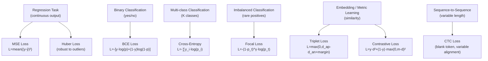

# 🎯 Loss Functions

> [!abstract] TL;DR
> The loss function translates a model's prediction error into a single scalar that backprop can minimize. The task determines the loss: **MSE** for regression, **BCE** for binary classification, **cross-entropy** for multi-class, **focal loss** for severe class imbalance, **triplet/contrastive** for embedding learning. Choosing the wrong loss (e.g., MSE for classification) leads to poor convergence and miscalibrated probabilities. The loss function is a modeling decision as important as architecture.

## Intuition — Analogy First

A loss function is a **scorecard designed for the specific game you're playing**.

- A soccer referee scoring a basketball game (using the wrong loss) — technically counts something, but misses all the important signals.
- A food critic scoring on overall taste (MSE on classification) — averages out what matters: was the dish edible or not?
- A judge in figure skating (cross-entropy for classification) — gives partial credit for being closer to the right answer, penalizes overconfidence, and scales penalties appropriately.

Every task has a natural "game" — regression, binary decision, multi-class assignment, ranking, embedding similarity — and each game has a scoring system (loss function) designed to provide the right gradient signal for learning.

## How It Works



### Mean Squared Error (MSE) — Regression

Penalizes the squared difference between prediction and target. Large errors are penalized disproportionately (quadratic scaling).

### Binary Cross-Entropy (BCE) — Binary Classification

Derived from the negative log-likelihood of a Bernoulli distribution. Provides proper probability calibration — unlike MSE, it penalizes confident wrong predictions very heavily.

### Categorical Cross-Entropy — Multi-class Classification

Extends BCE to K classes. With one-hot targets $y$, only the log-probability of the correct class contributes to the loss.

### Focal Loss — Class Imbalance

Modulates cross-entropy by a factor $(1 - p_t)^\gamma$ that down-weights easy negatives (where the model is already confident) and focuses training on hard, misclassified examples.

### Triplet Loss — Embedding Learning

Pulls anchor-positive pairs closer and pushes anchor-negative pairs farther apart, with a margin to prevent collapse.

### Huber Loss — Robust Regression

Behaves like MSE for small errors (smooth gradient) and like MAE for large errors (bounded gradient, robust to outliers).

## The Math

### Mean Squared Error

$$\mathcal{L}_{\text{MSE}} = \frac{1}{n} \sum_{i=1}^n (y_i - \hat{y}_i)^2$$

**Gradient**: $\frac{\partial \mathcal{L}}{\partial \hat{y}_i} = -\frac{2}{n}(y_i - \hat{y}_i)$

### Binary Cross-Entropy

$$\mathcal{L}_{\text{BCE}} = -\frac{1}{n} \sum_{i=1}^n \left[ y_i \log(\hat{p}_i) + (1 - y_i) \log(1 - \hat{p}_i) \right]$$

**Why log?** Information theory: $-\log(p)$ is the surprise (self-information) of observing an event with probability $p$. Minimizing BCE = maximizing the log-likelihood of the true labels under the model.

### Categorical Cross-Entropy

$$\mathcal{L}_{\text{CE}} = -\frac{1}{n} \sum_{i=1}^n \sum_{k=1}^K y_{ik} \log(\hat{p}_{ik})$$

For one-hot targets (only one $y_{ik} = 1$ per sample), this simplifies to:

$$\mathcal{L}_{\text{CE}} = -\frac{1}{n} \sum_{i=1}^n \log(\hat{p}_{i, y_i})$$

### Focal Loss

$$\mathcal{L}_{\text{focal}} = -\frac{1}{n} \sum_i \alpha_t (1 - p_t)^\gamma \log(p_t)$$

where $p_t = p$ if $y=1$, else $1-p$. Parameters: $\gamma$ (focusing, typically 2.0), $\alpha_t$ (class weight, typically 0.25 for rare class).

**Effect**: when $p_t = 0.9$ (easy example): $(1-0.9)^2 = 0.01$ — reduces contribution by 100×. When $p_t = 0.1$ (hard example): $(1-0.1)^2 = 0.81$ — minimal reduction.

### Huber Loss

$$\mathcal{L}_{\delta}(y, \hat{y}) = \begin{cases} \frac{1}{2}(y - \hat{y})^2 & \text{if } |y - \hat{y}| \leq \delta \\ \delta\left(|y - \hat{y}| - \frac{1}{2}\delta\right) & \text{otherwise} \end{cases}$$

### Triplet Loss

$$\mathcal{L}_{\text{triplet}} = \frac{1}{N} \sum_i \max\!\left(0,\ d(a_i, p_i) - d(a_i, n_i) + \text{margin}\right)$$

where $a$ = anchor, $p$ = positive (same class), $n$ = negative (different class), $d$ = distance metric (usually L2).

## Code Demo

```python
import torch
import torch.nn as nn
import torch.nn.functional as F

# ── MSE Loss ──────────────────────────────────────────────────────────────────
y_pred_reg = torch.tensor([2.5, 0.0, 2.0, 8.0])
y_true_reg = torch.tensor([3.0, -0.5, 2.0, 7.0])

mse = nn.MSELoss()(y_pred_reg, y_true_reg)
mae = nn.L1Loss()(y_pred_reg, y_true_reg)
huber = nn.HuberLoss(delta=1.0)(y_pred_reg, y_true_reg)
print(f"MSE: {mse:.4f}  MAE: {mae:.4f}  Huber: {huber:.4f}")

# ── BCE Loss — binary classification ─────────────────────────────────────────
# Use BCEWithLogitsLoss (numerically stable — applies sigmoid internally)
logits_binary = torch.tensor([2.0, -1.5, 0.5, -2.0])   # raw logits
y_binary = torch.tensor([1.0, 0.0, 1.0, 0.0])

bce_loss = nn.BCEWithLogitsLoss()(logits_binary, y_binary)
print(f"BCE with logits: {bce_loss:.4f}")

# Equivalent to:
probs = torch.sigmoid(logits_binary)
bce_manual = nn.BCELoss()(probs, y_binary)
print(f"BCE manual:      {bce_manual:.4f}")

# ── Cross-Entropy — multi-class classification ────────────────────────────────
# nn.CrossEntropyLoss expects RAW LOGITS (not softmax'd)
logits_multi = torch.tensor([
    [2.0, 1.0, 0.1],   # sample 1
    [0.5, 2.5, 0.3],   # sample 2
    [0.1, 0.3, 3.0],   # sample 3
])
y_labels = torch.tensor([0, 1, 2])   # integer class labels

ce_loss = nn.CrossEntropyLoss()(logits_multi, y_labels)
print(f"Cross-Entropy: {ce_loss:.4f}")

# With class weights (for imbalanced datasets)
class_weights = torch.tensor([1.0, 2.0, 1.5])  # up-weight class 1
ce_weighted = nn.CrossEntropyLoss(weight=class_weights)(logits_multi, y_labels)
print(f"Weighted CE:   {ce_weighted:.4f}")

# Label smoothing (regularizes by preventing overconfidence)
ce_smooth = nn.CrossEntropyLoss(label_smoothing=0.1)(logits_multi, y_labels)
print(f"Label-smoothed CE: {ce_smooth:.4f}")

# ── Focal Loss — imbalanced classification ────────────────────────────────────
class FocalLoss(nn.Module):
    def __init__(self, gamma: float = 2.0, alpha: float = 0.25):
        super().__init__()
        self.gamma = gamma
        self.alpha = alpha

    def forward(self, logits: torch.Tensor, targets: torch.Tensor) -> torch.Tensor:
        # logits: (N,) binary logits, targets: (N,) in {0,1}
        probs = torch.sigmoid(logits)
        p_t = probs * targets + (1 - probs) * (1 - targets)
        alpha_t = self.alpha * targets + (1 - self.alpha) * (1 - targets)
        focal_weight = (1 - p_t) ** self.gamma
        bce = F.binary_cross_entropy_with_logits(logits, targets, reduction='none')
        loss = alpha_t * focal_weight * bce
        return loss.mean()

focal = FocalLoss(gamma=2.0, alpha=0.25)
loss_focal = focal(logits_binary, y_binary)
print(f"Focal Loss: {loss_focal:.4f}")

# ── Triplet Loss — embedding learning ────────────────────────────────────────
# TripletMarginLoss expects embeddings (N, D)
triplet_loss_fn = nn.TripletMarginLoss(margin=1.0, p=2.0)
anchor   = torch.randn(16, 128)   # 16 anchors, 128-dim embeddings
positive = anchor + 0.1 * torch.randn(16, 128)   # close to anchor
negative = torch.randn(16, 128)                   # far from anchor

loss_triplet = triplet_loss_fn(anchor, positive, negative)
print(f"Triplet Loss: {loss_triplet:.4f}")

# ── KL Divergence — distribution matching (VAEs, distillation) ───────────────
log_probs_p = F.log_softmax(torch.randn(4, 10), dim=-1)  # model distribution (log)
probs_q     = F.softmax(torch.randn(4, 10), dim=-1)      # target distribution

kl = nn.KLDivLoss(reduction='batchmean')(log_probs_p, probs_q)
print(f"KL Divergence: {kl:.4f}")
```

## Real-World Example

**RetinaNet** (Lin et al., 2017) is a one-stage object detector that introduced **focal loss** to solve the extreme class imbalance problem inherent to dense anchor-based detection. In a single image, a detector might evaluate 100,000 anchor boxes — but only ~100 contain objects. Without focal loss, the overwhelming majority of easy negative anchors (empty background with probability 0.99) dominate the gradient, preventing the model from learning to detect rare, hard positive examples. Focal loss with γ=2 reduces the contribution of easy negatives by ~100×, allowing the model to focus on the few hard examples that actually need learning.

**FaceNet** by Google used **triplet loss** to train face embedding networks that power face recognition. Each training triplet consists of an anchor face, a positive (same person, different photo), and a negative (different person). The loss trains embeddings such that same-person pairs are close in L2 space and different-person pairs are separated by a margin. The embedding space learned this way generalizes to unseen identities at test time.

## Trade-offs

| Loss | Task | Sensitivity to Outliers | Class Imbalance Handling | Calibration |
|------|------|------------------------|--------------------------|-------------|
| MSE | Regression | High (quadratic) | N/A | Poor for classification |
| MAE | Regression | Low | N/A | — |
| Huber | Regression | Low (δ controls) | N/A | — |
| BCE | Binary classif. | Medium | Poor (need weighting) | Good |
| Cross-Entropy | Multi-class | Medium | Poor (need weighting) | Good |
| Focal | Imbalanced | Medium | Excellent (built-in) | Moderate |
| Triplet | Embeddings | Medium | N/A (pair-level) | N/A |
| CTC | Sequences | Low | N/A | N/A |

## When to Use vs Avoid

**MSE**: use for regression when errors are approximately Gaussian and outliers are not a concern. Avoid for classification — it treats class outputs as continuous values, producing poorly calibrated probabilities.

**BCE / Cross-Entropy**: always use for classification tasks. Use `BCEWithLogitsLoss` (not `BCELoss`) for numerical stability. Cross-entropy naturally provides probability calibration and penalizes confident wrong predictions appropriately.

**Focal Loss**: use when positive-to-negative ratio is extreme (< 1:100). Object detection, fraud detection, medical anomaly detection. Requires tuning γ (start with 2.0) and α.

**Huber**: use for regression when your labels contain outliers (e.g., sensor noise, annotation errors). Tune δ to the scale of your expected normal errors.

**Triplet Loss**: use for metric/similarity learning where you want a meaningful distance space. Requires careful triplet mining (random triplets are mostly uninformative after a few epochs; mine hard negatives).

## Common Pitfalls

1. **Applying softmax before CrossEntropyLoss**: PyTorch's `nn.CrossEntropyLoss` already applies log-softmax internally. Applying softmax beforehand computes `log(softmax(x))` — wrong gradients and loss values.
2. **Using MSE for binary classification**: gradient of MSE near the decision boundary (σ(0)=0.5) is very small. Cross-entropy has much stronger gradients near 0.5, where learning matters most.
3. **Not using loss reduction carefully**: `reduction='mean'` divides by batch size; `reduction='sum'` does not. Mixing the two across losses (e.g., main loss + auxiliary loss) causes scale mismatches.
4. **NaN loss from log(0)**: occurs when model probabilities exactly hit 0 or 1 (common early in training with bad init). Use `BCEWithLogitsLoss` (built-in stability), or add epsilon clipping.
5. **Triplet collapse**: trivially satisfied triplets (all distances zero after network converges) provide no gradient. Implement hard-negative mining — mine the hardest negative within each batch.
6. **Ignoring class frequencies with cross-entropy**: standard cross-entropy treats all classes equally. For imbalanced datasets, use `weight=` parameter in `CrossEntropyLoss` or switch to focal loss.

## Related Concepts

- [[_MOC_Deep_Learning|↑ Section MOC]]

- [[Classification_Metrics]] — loss measures training signal; metrics (F1, AUC) measure actual performance
- [[Regression_Metrics]] — MAE, RMSE, R² as evaluation metrics vs. MSE as training loss
- [[Information_Theory]] — cross-entropy and KL divergence have information-theoretic interpretations
- [[Logistic_Regression]] — BCE is derived from logistic regression's log-likelihood
- [[Neural_Network_Basics]] — the loss is the terminal node in the computation graph
- [[Backpropagation]] — the gradient of the loss drives all parameter updates

## Review Questions

1. **Derive binary cross-entropy loss from first principles using the log-likelihood of a Bernoulli distribution. Why does minimizing BCE maximize the log-likelihood of the data under the model?**

2. **In object detection with 100,000 anchor boxes per image, 99.9% are background negatives. Without focal loss, why does standard cross-entropy fail? How does the $(1-p_t)^\gamma$ factor solve this, and what does γ control?**

3. **When training a triplet loss model, you find that loss reaches zero within the first few epochs and training stalls. Diagnose what happened and describe two mining strategies to fix it.**

## Sources

- Lin, T. Y., et al. (2017). Focal loss for dense object detection. *ICCV*. (RetinaNet)
- Schroff, F., Kalenichenko, D., Philbin, J. (2015). FaceNet: A unified embedding for face recognition. *CVPR*.
- Graves, A., et al. (2006). Connectionist temporal classification. *ICML*.
- Goodfellow, I., Bengio, Y., Courville, A. (2016). *Deep Learning*. MIT Press. Chapter 6.2.
- PyTorch loss functions: https://pytorch.org/docs/stable/nn.html#loss-functions

#loss-functions #cross-entropy #mse #focal-loss #triplet-loss #bce #deep-learning #optimization
