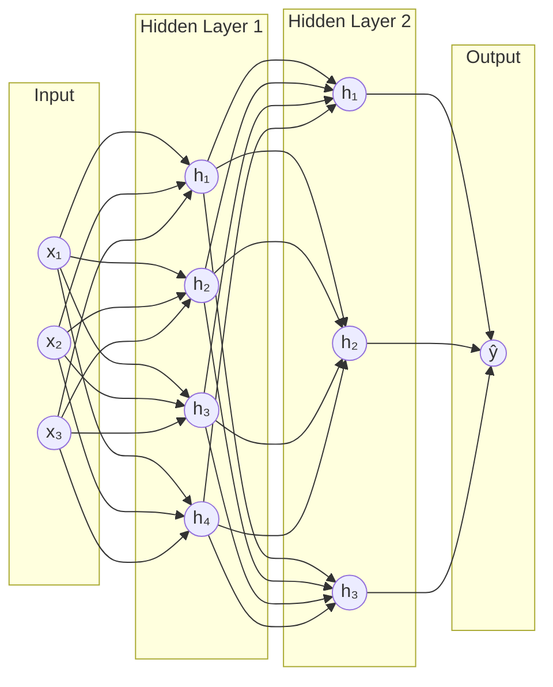

# 🧠 Neural Network Basics

> [!abstract] TL;DR
> A neural network is a stack of parameterized linear transformations separated by non-linear activation functions. Each layer computes `a = σ(Wx + b)`. Stacking layers lets the network learn increasingly abstract representations. The universal approximation theorem guarantees that even a single hidden layer (with enough neurons) can approximate any continuous function — but depth makes this practical.

## Intuition — Analogy First

Think of a neural network as a **series of increasingly sophisticated filters** applied to raw data.

When a CNN looks at an image of a cat:
- **Layer 1** fires on edges and color gradients
- **Layer 2** assembles edges into corners, circles, and curves
- **Layer 3** composes those shapes into ears, eyes, and whiskers
- **Layer 4** recognizes "this arrangement of parts = cat"

Each filter is a layer. The raw pixels go in one end; the abstract concept emerges at the other. The network learns *which* filters are useful by adjusting millions of small numerical knobs (weights and biases) during training.

A single neuron is just a **weighted vote**: it multiplies each incoming signal by how much it trusts that signal, adds them all up, adds a bias, and passes the result through an activation function to decide how strongly to fire.

## How It Works

### The Single Neuron

A neuron receives inputs **x₁, x₂, ..., xₙ**, computes a weighted sum, adds a bias, and applies an activation:

```
z = w₁x₁ + w₂x₂ + ... + wₙxₙ + b
a = σ(z)
```

### Layer Types

| Layer | Role |
|-------|------|
| Input layer | Raw features — no computation, just passthrough |
| Hidden layer(s) | Learned representations; where all the work happens |
| Output layer | Task-specific head (softmax for classification, linear for regression) |

### Forward Pass

Computation flows left-to-right: each layer's activations become the next layer's inputs. No cycles — this is a **feedforward** network.

### Universal Approximation Theorem

A single hidden layer with a sufficient number of neurons and a non-linear activation can approximate any continuous function on a compact subset of ℝⁿ to arbitrary precision. This justifies using neural networks as general function approximators. In practice, **depth beats width** — it takes exponentially more neurons to achieve the same function with one layer versus many shallow layers.

### Depth vs Width

- **Width** (neurons per layer): captures parallel features at the same abstraction level
- **Depth** (number of layers): enables hierarchical composition of features
- Deep nets generalize better with fewer total parameters for most real-world data



## The Math

### Layer Output

For layer $l$ with weight matrix $W^{(l)}$, bias vector $b^{(l)}$, and input $a^{(l-1)}$:

$$z^{(l)} = W^{(l)} a^{(l-1)} + b^{(l)}$$

$$a^{(l)} = \sigma\!\left(z^{(l)}\right)$$

### Parameter Count

For a dense layer with $n_{in}$ inputs and $n_{out}$ outputs:

$$\text{params} = n_{in} \times n_{out} + n_{out}$$

(weights + biases)

For a network with layers [784, 512, 256, 10]:
- Layer 1: 784 × 512 + 512 = **401,920**
- Layer 2: 512 × 256 + 256 = **131,328**
- Layer 3: 256 × 10 + 10 = **2,570**
- **Total: 535,818 parameters**

### Why Non-Linearity is Essential

Without activation functions, any stack of linear layers collapses to a single linear transformation:

$$W^{(2)}(W^{(1)}x + b^{(1)}) + b^{(2)} = (W^{(2)}W^{(1)})x + (W^{(2)}b^{(1)} + b^{(2)}) = W'x + b'$$

No matter how many layers — still just a linear function. Non-linear activations break this collapse.

## Code Demo

```python
import torch
import torch.nn as nn
import torch.optim as optim

# ── Simple 2-layer feedforward network ──────────────────────────────────────
class TwoLayerNet(nn.Module):
    def __init__(self, input_dim: int, hidden_dim: int, output_dim: int):
        super().__init__()
        self.net = nn.Sequential(
            nn.Linear(input_dim, hidden_dim),   # z = Wx + b
            nn.ReLU(),                           # a = max(0, z)
            nn.Linear(hidden_dim, output_dim),  # output logits
        )

    def forward(self, x: torch.Tensor) -> torch.Tensor:
        return self.net(x)

# ── Instantiate ──────────────────────────────────────────────────────────────
model = TwoLayerNet(input_dim=784, hidden_dim=256, output_dim=10)
print(f"Total parameters: {sum(p.numel() for p in model.parameters()):,}")

# ── Count parameters per layer ───────────────────────────────────────────────
for name, param in model.named_parameters():
    print(f"{name:30s}  shape={str(param.shape):20s}  params={param.numel():,}")

# ── Single forward pass ──────────────────────────────────────────────────────
x = torch.randn(32, 784)   # batch of 32 flattened MNIST images
logits = model(x)
print(f"Input shape:  {x.shape}")
print(f"Output shape: {logits.shape}")  # (32, 10)

# ── Inspect intermediate activations ─────────────────────────────────────────
class TwoLayerNetVerbose(nn.Module):
    def __init__(self, input_dim, hidden_dim, output_dim):
        super().__init__()
        self.fc1 = nn.Linear(input_dim, hidden_dim)
        self.relu = nn.ReLU()
        self.fc2 = nn.Linear(hidden_dim, output_dim)

    def forward(self, x):
        z1 = self.fc1(x)
        a1 = self.relu(z1)
        z2 = self.fc2(a1)
        return z2, a1  # return logits and hidden activations

model_v = TwoLayerNetVerbose(784, 256, 10)
logits, hidden = model_v(x)
print(f"Hidden activations shape: {hidden.shape}")   # (32, 256)
print(f"Hidden sparsity (ReLU zeros): {(hidden == 0).float().mean():.1%}")
```

## Real-World Example

**Google Translate** uses a deep neural network (specifically a Transformer, which is a specialized deep net) to translate between 100+ language pairs. The model processes a sequence of token embeddings through many layers of attention and feedforward sublayers. Each sublayer computes exactly `a = σ(Wx + b)` (with more complex attention machinery mixed in), stacked 6–96 layers deep. The earliest layers learn syntactic features (word order, agreement); the deepest layers encode semantic meaning sufficient for translation. Without depth, the model could not disentangle surface form from meaning.

## Trade-offs

| Aspect | Shallow (1–2 layers) | Deep (many layers) |
|--------|----------------------|--------------------|
| Expressiveness | Limited; needs exponentially more neurons | Compositional; efficient representation |
| Training difficulty | Easy to optimize | Vanishing gradients, needs careful init |
| Sample efficiency | Lower | Higher (reuses features) |
| Interpretability | Slightly easier | Very hard |
| Inference cost | Fast | Scales with depth |
| Overfitting risk | Lower (fewer params) | Higher (needs regularization) |

## When to Use vs Avoid

**Use neural networks when:**
- Data is high-dimensional (images, text, audio, video)
- The input-output relationship is highly non-linear
- You have large amounts of labeled or unlabeled data
- Hand-engineered features are infeasible or insufficient
- A pre-trained model can be fine-tuned (transfer learning)

**Avoid / reconsider when:**
- Data is small (< a few thousand samples) — classical ML may generalize better
- Features are already well-understood and linear relationships dominate
- Interpretability is a hard requirement (regulated domains)
- Compute budget is severely constrained
- You need calibrated uncertainty estimates without extra machinery

## Common Pitfalls

1. **Forgetting to call `model.eval()`** before inference — Dropout and BatchNorm behave differently in training vs eval modes, producing inconsistent predictions.
2. **Not normalizing inputs** — neural networks are sensitive to input scale; features with very different magnitudes cause the optimizer to zigzag.
3. **Wrong output activation for the task** — applying sigmoid to multi-class problems, or softmax when using `nn.CrossEntropyLoss` (which already applies log-softmax internally).
4. **Counting parameters wrong** — forgetting biases, or forgetting that embedding tables have `vocab_size × embed_dim` parameters.
5. **Assuming depth always helps** — very deep nets on small datasets overfit catastrophically; match model capacity to data size.
6. **Not checking gradient flow** — a silent zero-gradient bug (e.g., ReLU dying, wrong loss reduction) trains without error but the model never learns.

## Related Concepts

- [[_MOC_Deep_Learning|↑ Section MOC]]

- [[Activation_Functions]] — the non-linearities that make depth meaningful
- [[Backpropagation]] — how gradients flow backward to update weights
- [[Loss_Functions]] — the objective function the network minimizes
- [[Calculus_for_ML]] — the mathematical foundation (chain rule, Jacobians)
- [[Weight_Initialization]] — how we set weights before training starts
- [[Batch_Normalization]] — stabilizes training of deep networks
- [[Dropout]] — regularization by randomly zeroing neurons

## Review Questions

1. **Why does stacking two linear layers without an activation function give you no more expressive power than a single linear layer? Prove it algebraically.**

2. **A network has layers [128, 64, 32, 16, 1]. How many total trainable parameters does it have? How does this change if you add a BatchNorm layer after each hidden layer?**

3. **The universal approximation theorem says one hidden layer is enough. Why do practitioners use many layers in practice? What does depth buy that width does not?**

## Sources

- Goodfellow, I., Bengio, Y., Courville, A. (2016). *Deep Learning*. MIT Press. Chapter 6.
- Cybenko, G. (1989). Approximation by superpositions of a sigmoidal function. *Mathematics of Control, Signals, and Systems*, 2(4), 303–314.
- Hornik, K. (1991). Approximation capabilities of multilayer feedforward networks. *Neural Networks*, 4(2), 251–257.
- LeCun, Y., Bengio, Y., Hinton, G. (2015). Deep learning. *Nature*, 521(7553), 436–444.
- PyTorch documentation: https://pytorch.org/docs/stable/nn.html

#neural-networks #deep-learning #fundamentals #feedforward #mlp #universal-approximation
