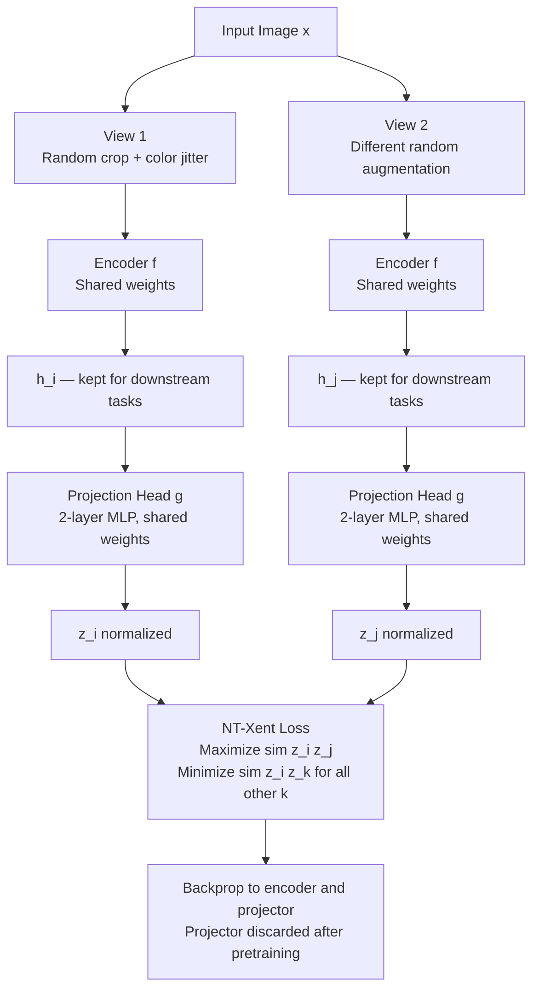

# 🧩 Self-Supervised Learning

> [!abstract] TL;DR
> Self-supervised learning (SSL) creates free supervision from the structure of unlabeled data — masking tokens, reconstructing hidden patches, or contrasting augmented views — to pretrain encoders that transfer powerfully to downstream tasks. It is the engine behind every modern foundation model: BERT, GPT, MAE, DINO, and wav2vec 2.0.

---

## Intuition

**Analogy:** Think of a child learning to read by filling in blanks — "The cat sat on the ___." No teacher writes labels; the surrounding words constrain what the missing word must be. The language itself provides the curriculum.

SSL applies this principle to every modality at scale. In text: predict masked words or the next token. In images: reconstruct hidden patches, or learn that two different crops of the same photo should "feel similar" in representation space. In audio: predict future speech frames from past context. Labels are harvested free of charge from the data's own structure.

This matters because **labeled data is expensive and scarce; unlabeled data is essentially unlimited.** A model pretrained on billions of unlabeled images or tokens starts any downstream task from a far richer position than one trained from scratch on a few thousand labeled examples.

---

## How It Works

### Core Insight: Three Properties Enable Free Supervision

1. **Context predicts content.** Surrounding tokens constrain the missing word; surrounding patches constrain the hidden region. Solving this requires semantic understanding.
2. **Views share identity.** Two augmentations of the same image — different crop, brightness, rotation — share semantic content while differing in low-level pixels. An encoder that maps both to the same region must capture semantics, not surface statistics.
3. **Temporal order is informative.** Future audio or video frames are physically constrained by past frames; predicting them correctly requires learned structure about the world.

---

### Paradigm 1 — Generative (Masked / Reconstructive)

The model receives corrupted input and must reconstruct the original. Supervision is implicit in the data.

**SSL for NLP:**

| Method | Pretext Task | Masking Strategy | Architecture |
|---|---|---|---|
| MLM — BERT | Predict randomly masked tokens | 15% tokens: 80% → `[MASK]`, 10% → random, 10% unchanged | Bidirectional encoder |
| CLM — GPT | Predict next token | Causal mask — each position sees only left context | Autoregressive decoder |
| Span Corruption — T5 | Reconstruct masked text spans | Variable-length spans replaced by a single sentinel token | Encoder-decoder |
| NSP — BERT | Is sentence B the actual next sentence after A? | Sentence-level structure | Encoder (removed in RoBERTa) |

The 15% BERT masking rule with 10% random + 10% unchanged is deliberate: it prevents the model from learning to predict only when it sees an explicit `[MASK]` token, which would fail at fine-tuning time when no masks appear.

**SSL for Vision:**

| Method | Pretext Task | Masking Ratio | Key Design |
|---|---|---|---|
| MAE | Reconstruct masked patches in pixel space | 75% | Encoder sees only 25% visible patches → efficient; lightweight decoder |
| SimMIM | Predict raw pixel values of masked patches | 60% | Swin Transformer backbone |
| BEiT | Predict discrete visual tokens (dVAE codebook) | 40% | Token prediction avoids pixel noise |
| Rotation Prediction | Predict 0°/90°/180°/270° rotation applied to image | N/A | Proxy for understanding object orientation |
| Colorization | Predict full color from grayscale input | N/A | Forces learning of object semantics for color assignment |

MAE's 75% masking ratio is deliberately aggressive. A lower ratio (e.g., 25%) would let the decoder copy nearby pixels — the pretext task would be too easy to force semantic learning. At 75%, the model must reason about the global structure of the image.

**SSL for Audio and Video:**

| Method | Modality | Pretext Task |
|---|---|---|
| wav2vec 2.0 | Audio | Contrastive: identify true future quantized speech unit from distractors |
| HuBERT | Audio | Predict k-means cluster assignment of masked audio frames (offline targets) |
| VideoMAE | Video | Reconstruct masked spatiotemporal patches at 90–95% masking ratio |

VideoMAE requires a higher masking ratio than image MAE because video frames are temporally redundant — at 75%, the decoder can copy from neighboring frames. At 90–95%, genuine spatiotemporal reasoning is forced.

---

### Paradigm 2 — Contrastive Learning

The network learns by comparison: pull representations of related inputs together, push unrelated inputs apart. No reconstruction needed.

**SimCLR — Simple Contrastive Learning (Chen et al., 2020):**

1. Take one image; apply two independent random augmentations → views $x_i$ and $x_j$
2. Both views pass through the **same encoder** $f$ (shared weights)
3. A 2-layer **projection head** $g$ maps to a 128-dimensional comparison space
4. **NT-Xent loss** maximizes cosine similarity of $(z_i, z_j)$ from the same image while minimizing similarity against all $2(N-1)$ other projections in the batch

$$\mathcal{L}_{\text{NT-Xent}} = -\log \frac{\exp(\text{sim}(z_i, z_j)/\tau)}{\sum_{k=1}^{2N} \mathbf{1}_{[k \ne i]} \exp(\text{sim}(z_i, z_k)/\tau)}$$

**Critical:** The projection head $z$ is discarded after pretraining. Downstream tasks use the encoder output $h = f(x)$, not $z$. Using $z$ hurts performance by 10–15% because it is overfit to the contrastive objective.

**Weakness:** Requires batch size 4096+ for enough in-batch negatives. Memory prohibitive on small clusters.

---

**MoCo — Momentum Contrast (He et al., 2020):**

Decouples the number of negatives from batch size with two components:

- **Momentum encoder** (key encoder): A copy of the query encoder updated by EMA — $\theta_k \leftarrow m\theta_k + (1-m)\theta_q$ with $m = 0.999$. Provides stable, slowly-evolving key representations.
- **Queue of negatives**: A FIFO queue stores ~65,536 recent key representations from past batches. The queue replaces the need for a large batch — negatives accumulate across iterations.

MoCo v2 added SimCLR's projection head and stronger augmentations. MoCo v3 adapted to ViT backbones with a stabilizing stop-gradient trick.

---

**BYOL — Bootstrap Your Own Latent (Grill et al., 2020):**

Eliminates negative pairs entirely:

- **Online network**: encoder $f_\theta$ + projection head $g_\theta$ + **predictor** $q_\theta$ (extra MLP)
- **Target network**: encoder $f_\xi$ + projection head $g_\xi$ only; updated by EMA ($\xi \leftarrow \tau\xi + (1-\tau)\theta$)
- Loss: $\mathcal{L} = \|\bar{q}_\theta(z_\theta) - \bar{z}_\xi\|^2$ where $\bar{\cdot}$ denotes L2 normalization
- **Stop-gradient on the target branch is non-negotiable** — gradients flow only through the online network

Why does BYOL avoid collapse without negatives? The asymmetry — predictor exists only on the online branch, not the target — combined with EMA stabilization prevents the trivial all-zeros solution. The predictor must learn to "undo" the moving average lag, which forces meaningful representation learning.

---

**SimSiam — Simple Siamese Networks (Chen & He, 2021):**

Removes the EMA entirely from BYOL: shared encoder, one predictor on one branch, stop-gradient on the other. Shows that collapse prevention requires only architectural asymmetry + stop-gradient — not negative pairs, not EMA, not a momentum encoder.

---

### Flow / Architecture



---

### Downstream Fine-Tuning: Linear Probing vs Full Fine-Tuning

After pretraining, two evaluation protocols measure representation quality:

| Protocol | What is Trained | When to Use | Accuracy vs Supervised |
|---|---|---|---|
| **Linear Probing** | Only a linear layer on frozen encoder | Measures raw representation quality | 5–15% lower |
| **Full Fine-Tuning** | Entire encoder + task head | Maximum downstream performance | <1–3% gap in practice |
| **k-NN Evaluation** | Nothing — nearest-neighbor in feature space | Quick diagnostic, no training required | Varies; good for dense retrieval |

Linear probing is the stricter benchmark: if a frozen SSL representation can be linearly classified, the representations are semantically linearly separable. Full fine-tuning narrows the gap to supervised almost completely. The choice matters primarily when compute or labeled data is constrained.

---

## Code Demo

```python
import torch
import torch.nn as nn
import torch.nn.functional as F
import torchvision.transforms as T
from torchvision.models import resnet50

# Two stochastic views of each image — the core of SimCLR data loading
simclr_transform = T.Compose([
    T.RandomResizedCrop(224, scale=(0.2, 1.0)),
    T.RandomHorizontalFlip(),
    T.RandomApply([T.ColorJitter(0.4, 0.4, 0.4, 0.1)], p=0.8),
    T.RandomGrayscale(p=0.2),
    T.GaussianBlur(kernel_size=23, sigma=(0.1, 2.0)),
    T.ToTensor(),
    T.Normalize(mean=[0.485, 0.456, 0.406], std=[0.229, 0.224, 0.225]),
])


class TwoViewTransform:
    """Apply the same stochastic transform twice → two independent views."""
    def __init__(self, transform):
        self.transform = transform

    def __call__(self, x):
        return self.transform(x), self.transform(x)


class ProjectionHead(nn.Module):
    """2-layer MLP projection head. Discarded after pretraining; use encoder h, not z."""
    def __init__(self, in_dim: int = 2048, hidden_dim: int = 2048, out_dim: int = 128):
        super().__init__()
        self.net = nn.Sequential(
            nn.Linear(in_dim, hidden_dim),
            nn.BatchNorm1d(hidden_dim),
            nn.ReLU(inplace=True),
            nn.Linear(hidden_dim, out_dim),
        )

    def forward(self, x: torch.Tensor) -> torch.Tensor:
        return self.net(x)


class SimCLR(nn.Module):
    """SimCLR encoder + projection head for contrastive self-supervised pretraining."""
    def __init__(self, projection_dim: int = 128):
        super().__init__()
        backbone = resnet50(weights=None)
        # Remove the ImageNet classification head — keep the 2048-dim pooled features
        self.encoder = nn.Sequential(*list(backbone.children())[:-1])  # output: (N, 2048, 1, 1)
        self.projector = ProjectionHead(2048, 2048, projection_dim)

    def forward(self, x: torch.Tensor):
        h = self.encoder(x).flatten(1)   # (N, 2048) — the representation used downstream
        z = self.projector(h)             # (N, projection_dim) — used only during pretraining
        return h, z


def nt_xent_loss(z_i: torch.Tensor, z_j: torch.Tensor, temperature: float = 0.5) -> torch.Tensor:
    """
    NT-Xent (Normalized Temperature-scaled Cross Entropy) loss — the SimCLR objective.

    For a batch of N images, each with two views:
      Positive pair: (z_i[k], z_j[k]) — same image, different augmentation
      Negatives:     all other 2(N-1) projections in the concatenated (2N) batch

    Args:
        z_i: (N, D) projected representations from view 1
        z_j: (N, D) projected representations from view 2
        temperature: tau — lower = sharper distribution, harder negatives

    Returns:
        Scalar contrastive loss.
    """
    N = z_i.shape[0]
    device = z_i.device

    # L2 normalize — makes dot product equivalent to cosine similarity
    z_i = F.normalize(z_i, dim=-1)
    z_j = F.normalize(z_j, dim=-1)

    # Concatenate into one (2N, D) representation matrix
    z = torch.cat([z_i, z_j], dim=0)

    # Pairwise cosine similarity matrix scaled by temperature: (2N, 2N)
    sim = torch.mm(z, z.T) / temperature

    # Mask self-similarity (diagonal) — (i, i) is not a valid negative
    self_mask = torch.eye(2 * N, dtype=torch.bool, device=device)
    sim.masked_fill_(self_mask, float('-inf'))

    # Positive pair locations:
    #   For row i (view 1, i in [0, N)):   positive is at index i + N (view 2)
    #   For row i+N (view 2, i in [N, 2N)): positive is at index i (view 1)
    labels = torch.cat([
        torch.arange(N, 2 * N, device=device),   # rows 0..N-1  → positives at N..2N-1
        torch.arange(N, device=device),           # rows N..2N-1 → positives at 0..N-1
    ])

    return F.cross_entropy(sim, labels)


# Pretraining loop — labels from the dataloader are completely ignored
def pretrain_simclr(
    model: SimCLR,
    dataloader,
    optimizer: torch.optim.Optimizer,
    device: str = 'cuda',
    temperature: float = 0.5,
) -> float:
    model.train()
    total_loss = 0.0

    for (x_i, x_j), _ in dataloader:   # _ = class labels; unused in SSL
        x_i, x_j = x_i.to(device), x_j.to(device)

        _, z_i = model(x_i)   # only projections needed for loss
        _, z_j = model(x_j)

        loss = nt_xent_loss(z_i, z_j, temperature)

        optimizer.zero_grad()
        loss.backward()
        optimizer.step()
        total_loss += loss.item()

    return total_loss / len(dataloader)


# Downstream: linear probing on the frozen encoder
def build_linear_probe(pretrained_encoder: nn.Module, feature_dim: int, num_classes: int):
    """Freeze all encoder parameters; add a trainable linear classifier on top."""
    for param in pretrained_encoder.parameters():
        param.requires_grad = False
    classifier = nn.Linear(feature_dim, num_classes)
    return classifier


# Usage sketch
if __name__ == "__main__":
    device = "cuda" if torch.cuda.is_available() else "cpu"
    model = SimCLR(projection_dim=128).to(device)
    optimizer = torch.optim.Adam(model.parameters(), lr=3e-4, weight_decay=1e-4)

    # After pretraining, linear probe uses the encoder h (not projector z)
    probe = build_linear_probe(model.encoder, feature_dim=2048, num_classes=10).to(device)
    probe_optimizer = torch.optim.Adam(probe.parameters(), lr=1e-3)
    print("Encoder parameters frozen:", all(not p.requires_grad for p in model.encoder.parameters()))
```

---

## Real-World Example

> **Example:** Meta's **DINOv2** (2023) and OpenAI's **Whisper** (2022) are the clearest production demonstrations of SSL's value. DINOv2 trained a ViT on 142 million curated images with zero labels using self-distillation. The frozen features beat supervised ResNets on depth estimation, segmentation, and image retrieval tasks — a linear layer on top is sufficient. Whisper combined SSL pretraining on 680,000 hours of weakly labeled audio (far more data than any fully supervised corpus) with supervised fine-tuning to produce a speech recognizer robust across 99 languages and accents. In both cases, the SSL pretraining phase reduced labeled data requirements by 10–100x and produced more general representations than supervised pretraining on ImageNet or a single-language ASR dataset.

---

## Trade-offs

| Aspect | Pro | Con |
|---|---|---|
| Label cost | Zero labels for pretraining; scales to any unlabeled corpus | Downstream task still needs some labeled data; pretraining compute is high |
| Feature universality | One pretrained encoder transfers to many tasks | In-domain supervised models outperform SSL on narrow tasks with abundant labels |
| SimCLR contrastive | Conceptually simple; strong results at scale | Requires batch size 4096+ for sufficient negatives; impractical on small GPU clusters |
| MoCo contrastive | Works with small batches via queue; memory efficient | Queue key staleness at long training; more hyperparameters to tune |
| BYOL / SimSiam | No negative sampling; small-batch compatible; no queue | Collapse-sensitive: stop-gradient and architectural asymmetry are non-negotiable |
| Masked modeling (MAE, BERT) | Stable training; no collapse risk; works with any batch size | Reconstruction loss may overfit to low-level texture; slower to converge than contrastive |

---

## SSL vs Supervised vs Transfer Learning

| Dimension | Supervised | Transfer Learning | Self-Supervised |
|---|---|---|---|
| Labels required | All training data labeled | Source task labeled; target may be small | None for pretraining |
| Data scale | Limited by annotation cost | Limited by source task dataset | Unlimited — entire internet is usable |
| Generalization | Task-specific | Better if domains align | Broad general-purpose representations |
| Compute profile | Moderate training | Low (fine-tune only) | High pretraining; low fine-tuning |
| Representative example | ResNet trained on ImageNet labels | ImageNet ResNet → chest X-ray fine-tune | BERT → any NLP task; DINOv2 → any vision task |

---

## When to Use vs Avoid

**Use SSL when:**
- You have large unlabeled data but few labels — SSL pretraining unlocks the unlabeled pool
- You need one encoder to serve multiple downstream tasks (avoids retraining from scratch per task)
- Your domain lacks a public pretrained model (satellite imagery, histopathology, proprietary code)
- Annotation budget is limited — SSL pretraining can 10x label efficiency on the fine-tuning set

**Avoid SSL when:**
- Abundant labeled data exists for your specific task — fine-tuning a public SSL checkpoint beats pretraining from scratch in 99% of cases
- Downstream task is narrow and labeled data is plentiful — supervised fine-tuning will win
- You cannot afford pretraining compute — SSL pretraining from scratch needs hundreds to thousands of GPU-hours
- You need a quick baseline — start with a public SSL checkpoint (DINOv2, BERT, wav2vec 2.0), not custom pretraining

---

## Common Pitfalls

- **Mode collapse in non-contrastive methods** — BYOL and SimSiam collapse silently if stop-gradient is omitted or the predictor is applied symmetrically to both branches. Symptom: loss goes to zero but representation standard deviation collapses to near zero. Fix: verify stop-gradient is applied only on the target branch; monitor std of batch representations during training.
- **Batch size sensitivity in SimCLR** — Performance degrades sharply below batch size 512 because there are too few in-batch negatives. With 64 negatives, the InfoNCE gradient signal is negligible. Fix: gradient accumulation, or switch to MoCo which decouples negatives from batch size.
- **Augmentation design is not optional** — In contrastive SSL, augmentations define what invariances the model learns. Too weak: model shortcuts on low-level texture (color histograms, JPEG artifacts). Too strong: augmentation destroys semantic content. Safe standard set: random resized crop + color jitter + grayscale + Gaussian blur + horizontal flip.
- **Using the projection head for downstream tasks** — The projection head $z$ is overfit to the contrastive or reconstruction objective. Downstream tasks must use the encoder output $h$, not $z$. This mistake consistently degrades accuracy by 10–15% and can be invisible without ablation.
- **Wrong masking ratio for the modality** — 75% works for images (MAE); 15% works for text (BERT); 90% is needed for video (VideoMAE due to temporal redundancy). Choosing too low a ratio makes the pretext task trivially solvable by copying context; too high destroys enough signal that the decoder cannot learn.
- **Linear probe as the only evaluation** — A low linear probe accuracy does not prove the representations are bad; they may encode information non-linearly. Always report both linear probe and full fine-tuning accuracy together to separate representation quality from linear separability.

---

## Related Concepts

- [[_MOC_Deep_Learning|↑ Section MOC]]

- [[BERT]] — masked language modeling is generative SSL applied to text; the canonical SSL model for NLP encoders
- [[GPT_Family]] — causal language modeling (next-token prediction) is SSL; GPT pretraining is SSL at decoder scale
- [[Pretraining]] — SSL is the dominant pretraining strategy for all modern foundation models; covers infrastructure and data pipelines
- [[DINO]] — self-distillation with no labels; teacher-student SSL for vision without negatives; produces emergent segmentation
- [[CLIP]] — contrastive SSL using text-image pairs; aligns visual and semantic representations; complementary to pure visual SSL
- [[Transformer_Architecture]] — the architecture underlying BERT (encoder SSL), GPT (decoder SSL), and MAE (ViT SSL)
- [[Word_Embeddings]] — Word2Vec skip-gram is a proto-SSL method that predicts context words from a center word; directly precedes BERT
- [[LLM_Architecture_Deep_Dive]] — modern LLMs are decoder-only transformers pretrained entirely with SSL (next-token prediction)
- [[Neural_Network_Basics]] — SSL uses the same forward pass and backpropagation as supervised learning; only the label source differs
- [[Loss_Functions]] — NT-Xent, cross-entropy, and MSE reconstruction are the building blocks of SSL objectives
- [[T5_and_Encoder_Decoder]] — T5's span corruption is a generative SSL task; the encoder-decoder learns by reconstructing masked text spans

---

## Review Questions

1. BYOL trains without any negative pairs yet produces representations competitive with SimCLR. The stop-gradient operation on the target branch is described as the single most critical implementation detail. Explain precisely what goes wrong — and why — if stop-gradient is removed, and why the EMA teacher alone does not prevent collapse.
2. A team wants to pretrain a medical imaging model with MAE. They propose a 25% masking ratio instead of the standard 75%, arguing it preserves more context for the decoder. Predict what happens to the learned representations, and explain why the higher ratio is better despite making reconstruction harder.
3. You have 10 million unlabeled pathology slides and 5,000 labeled slides. Compare two strategies: (a) train a supervised ResNet on the 5,000 labeled slides from scratch; (b) SSL-pretrain on all 10M unlabeled slides then fine-tune on the 5,000 labeled slides. What outcome do you predict, and which SSL paradigm — contrastive or masked modeling — would you choose for histopathology and why?

---

## Sources

- [SimCLR: A Simple Framework for Contrastive Learning of Visual Representations (Chen et al., 2020)](https://arxiv.org/abs/2002.05709)
- [MoCo: Momentum Contrast for Unsupervised Visual Representation Learning (He et al., 2020)](https://arxiv.org/abs/1911.05722)
- [MoCo v2: Improved Baselines with Momentum Contrastive Learning (Chen et al., 2020)](https://arxiv.org/abs/2003.04297)
- [BYOL: Bootstrap Your Own Latent (Grill et al., 2020)](https://arxiv.org/abs/2006.07733)
- [SimSiam: Exploring Simple Siamese Representation Learning (Chen & He, 2021)](https://arxiv.org/abs/2011.10566)
- [MAE: Masked Autoencoders Are Scalable Vision Learners (He et al., 2021)](https://arxiv.org/abs/2111.06377)
- [wav2vec 2.0: A Framework for Self-Supervised Learning of Speech Representations (Baevski et al., 2020)](https://arxiv.org/abs/2006.11477)
- [VideoMAE: Masked Autoencoders are Data-Efficient Learners for Self-Supervised Video Pre-Training (Tong et al., 2022)](https://arxiv.org/abs/2203.12602)
- [A Cookbook of Self-Supervised Learning (Balestriero et al., 2023)](https://arxiv.org/abs/2304.12210)

---

#self-supervised-learning #SSL #contrastive-learning #pretraining #deep-learning #representation-learning #masked-modeling #advanced
