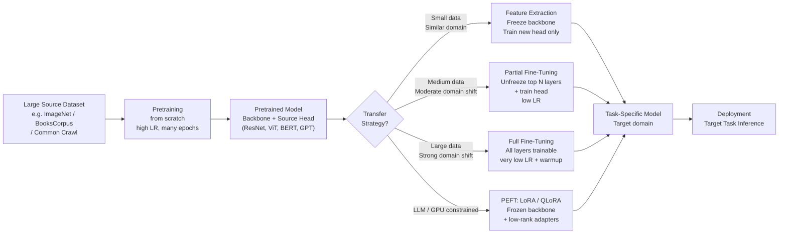

# Transfer Learning

> [!abstract] TL;DR
> Transfer learning reuses a model trained on one task (source) as the starting point for a different task (target), exploiting the fact that lower layers learn universal features while higher layers learn task-specific ones. It is the dominant paradigm in modern AI: virtually every production model — from ResNet on medical images to GPT-4 on legal Q&A — begins with a pretrained backbone rather than random weights.

---

## Intuition — Analogy First

**Analogy:** A medical student who already holds a chemistry degree does not re-learn the periodic table before studying pharmacology. They transfer their chemical knowledge and build specialised domain expertise on top of it. Training from scratch would be absurd.

Neural networks work the same way. A ResNet trained on 1.2 million ImageNet photos has already learned to detect edges, textures, curves, and object parts in its early layers. A ViT pretrained on the web has already encoded spatial relationships between patches. An LLM pretrained on trillions of tokens already understands grammar, facts, and reasoning patterns. Transfer learning says: start there, not from random noise.

The further analogy holds when the domains differ: a chemistry graduate studying art history is possible (general reasoning transfers) but harder than studying biochemistry (closer domain). The degree of difficulty predicts how much fine-tuning you need.

---

## How It Works — Mechanics

### Why Transfer Learning Works: The Feature Hierarchy

Deep networks learn features at increasing levels of abstraction:

| Layer depth | CNN features | NLP features |
|---|---|---|
| Early layers | Edges, colour blobs, Gabor filters | Character n-grams, simple patterns |
| Middle layers | Textures, parts, curves, shapes | Syntax, named entities, simple relations |
| Late layers | Object detectors, class-specific features | Semantic meaning, discourse, task-specific logic |

Early layers are **general** — an edge detector is useful whether you're classifying cats or tumours. Later layers are **task-specific** — the "golden retriever detector" is useless for radiology. Transfer learning reuses the general layers and replaces or adapts the specific ones.

This was empirically confirmed by Yosinski et al. (2014) who measured layer transferability: layers 1–4 of a CNN transfer almost perfectly; layers 5–7 become increasingly task-specific.

### Transfer Learning Taxonomy

There are two primary strategies, with a spectrum between them:

**1. Feature Extraction (frozen backbone)**
- Freeze all pretrained weights.
- Remove the original classification head.
- Add a new task-specific head (one or more linear layers).
- Train only the new head.
- The pretrained model acts as a fixed feature extractor — forward pass only, no gradients through the backbone.
- Best for: small datasets, domain similar to pretraining, limited compute.

**2. Fine-Tuning (unfreeze layers)**
- Partial fine-tuning: unfreeze the last N layers of the backbone and train them alongside the new head. Lower layers stay frozen.
- Full fine-tuning: unfreeze the entire model; update all parameters at a low learning rate.
- Best for: medium-to-large datasets, domain shift from pretraining, higher quality requirements.

**3. Parameter-Efficient Fine-Tuning (PEFT)**
- Keep the backbone frozen but inject small trainable modules (LoRA adapters, adapter layers).
- A modern refinement for LLMs where full fine-tuning is prohibitively expensive.

### When to Freeze vs Fine-Tune

| Scenario | Strategy | Rationale |
|---|---|---|
| <1K labelled examples, similar domain | Feature extraction (full freeze) | Too few examples to avoid overfitting; backbone features are already good |
| 1K–50K examples, similar domain | Partial fine-tune (top 1–2 blocks) | Backbone mostly reusable; slight adaptation helps |
| 50K–1M examples, different domain | Full fine-tune, low LR (1e-5 to 3e-5) | Enough data to adapt all layers without severe forgetting |
| LLM, any size, GPU-constrained | LoRA / QLoRA (PEFT) | Full fine-tune costs 14 bytes/param; LoRA costs ~2 bytes/param |
| Pre-ImageNet era or tiny model | Train from scratch | Transfer gains minimal when model is tiny or domain is radically different (e.g., satellite multi-spectral with 8+ bands) |

---

## Flow / Architecture



---

## Code Demo

```python
import torch
import torch.nn as nn
from torch.utils.data import DataLoader
from torchvision import datasets, transforms, models
from torchvision.models import ResNet50_Weights

# ── 1. ImageNet-standard normalisation — CRITICAL for pretrained models ──
IMAGENET_MEAN = [0.485, 0.456, 0.406]
IMAGENET_STD  = [0.229, 0.224, 0.225]

train_transform = transforms.Compose([
    transforms.RandomResizedCrop(224),
    transforms.RandomHorizontalFlip(),
    transforms.ColorJitter(brightness=0.2, contrast=0.2, saturation=0.2),
    transforms.ToTensor(),
    transforms.Normalize(IMAGENET_MEAN, IMAGENET_STD),
])
val_transform = transforms.Compose([
    transforms.Resize(256),
    transforms.CenterCrop(224),
    transforms.ToTensor(),
    transforms.Normalize(IMAGENET_MEAN, IMAGENET_STD),
])

# ── 2. Custom dataset (e.g., medical images with ImageFolder layout) ──
# Expects: data/train/<class_name>/*.jpg, data/val/<class_name>/*.jpg
train_dataset = datasets.ImageFolder("data/train", transform=train_transform)
val_dataset   = datasets.ImageFolder("data/val",   transform=val_transform)

train_loader = DataLoader(train_dataset, batch_size=64, shuffle=True,  num_workers=4)
val_loader   = DataLoader(val_dataset,   batch_size=64, shuffle=False, num_workers=4)

NUM_CLASSES = len(train_dataset.classes)
DEVICE = torch.device("cuda" if torch.cuda.is_available() else "cpu")

# ── 3. Load ImageNet-pretrained ResNet-50 ──
model = models.resnet50(weights=ResNet50_Weights.IMAGENET1K_V2)

# ── 4. Replace classification head (1000 ImageNet classes → NUM_CLASSES) ──
in_features = model.fc.in_features          # 2048 for ResNet-50
model.fc = nn.Sequential(
    nn.Dropout(p=0.3),                      # regularise new head
    nn.Linear(in_features, NUM_CLASSES),
)
model = model.to(DEVICE)

# ── 5. Stage 1 — Feature Extraction: freeze backbone, train head only ──
def set_backbone_requires_grad(model: nn.Module, requires_grad: bool) -> None:
    for name, param in model.named_parameters():
        if not name.startswith("fc"):
            param.requires_grad = requires_grad

set_backbone_requires_grad(model, requires_grad=False)

trainable = sum(p.numel() for p in model.parameters() if p.requires_grad)
total     = sum(p.numel() for p in model.parameters())
print(f"Stage 1 — trainable: {trainable:,} / {total:,} params")
# Stage 1 — trainable: 629,760 / 25,629,760 params

optimizer_stage1 = torch.optim.AdamW(
    filter(lambda p: p.requires_grad, model.parameters()),
    lr=1e-3,
    weight_decay=0.01,
)
criterion = nn.CrossEntropyLoss(label_smoothing=0.1)

def run_epoch(model, loader, optimizer, criterion, training: bool):
    model.train() if training else model.eval()
    total_loss, correct, n = 0.0, 0, 0
    with torch.set_grad_enabled(training):
        for imgs, labels in loader:
            imgs, labels = imgs.to(DEVICE), labels.to(DEVICE)
            logits = model(imgs)
            loss   = criterion(logits, labels)
            if training:
                optimizer.zero_grad()
                loss.backward()
                optimizer.step()
            total_loss += loss.item() * len(labels)
            correct    += (logits.argmax(1) == labels).sum().item()
            n          += len(labels)
    return total_loss / n, correct / n

print("\n--- Stage 1: Head-only training (5 epochs) ---")
for epoch in range(5):
    tr_loss, tr_acc = run_epoch(model, train_loader, optimizer_stage1, criterion, True)
    vl_loss, vl_acc = run_epoch(model, val_loader,   optimizer_stage1, criterion, False)
    print(f"Epoch {epoch+1}: train={tr_acc:.3f}  val={vl_acc:.3f}")

# ── 6. Stage 2 — Partial Fine-Tuning: unfreeze layer4 + fc ──
# Unfreeze only the last residual block and head; keep layer1-3 frozen.
set_backbone_requires_grad(model, requires_grad=False)    # re-freeze all
for name, param in model.named_parameters():
    if name.startswith("layer4") or name.startswith("fc"):
        param.requires_grad = True

trainable = sum(p.numel() for p in model.parameters() if p.requires_grad)
print(f"\nStage 2 — trainable: {trainable:,} / {total:,} params")

# Use a lower learning rate to avoid overwriting pretrained representations
optimizer_stage2 = torch.optim.AdamW(
    filter(lambda p: p.requires_grad, model.parameters()),
    lr=1e-4,                                # 10x lower than stage 1
    weight_decay=0.01,
)
# Cosine decay scheduler over stage 2 epochs
scheduler = torch.optim.lr_scheduler.CosineAnnealingLR(
    optimizer_stage2, T_max=10, eta_min=1e-6
)

print("\n--- Stage 2: Partial fine-tuning (10 epochs) ---")
for epoch in range(10):
    tr_loss, tr_acc = run_epoch(model, train_loader, optimizer_stage2, criterion, True)
    vl_loss, vl_acc = run_epoch(model, val_loader,   optimizer_stage2, criterion, False)
    scheduler.step()
    lr = scheduler.get_last_lr()[0]
    print(f"Epoch {epoch+1}: train={tr_acc:.3f}  val={vl_acc:.3f}  lr={lr:.2e}")

torch.save(model.state_dict(), "resnet50_finetuned.pth")
```

---

## CV Transfer Learning

ImageNet-pretrained CNNs become universal computer vision starting points. The standard workflow:

1. Pick a backbone calibrated to your compute budget (ResNet-50 for general use, EfficientNet-B0 for latency-critical, ViT-L for max accuracy with data).
2. Strip the 1000-class head.
3. Stage 1: train only the new head (1–5 epochs at LR~1e-3).
4. Stage 2: unfreeze the last 1–2 blocks and train at LR~1e-4 with cosine decay.

**Medical imaging:** A model pretrained on natural images still learns useful low-level detectors (edges, textures). CheXNet (Rajpurkar et al.) fine-tuned ResNet-121 on chest X-rays and surpassed radiologist performance for pneumonia detection — despite chest X-rays looking nothing like ImageNet photos. The transfer was from texture-detection capability, not semantic knowledge.

**Satellite imagery:** Pretrained weights still help even with 4–8 spectral bands. Common approach: train on RGB channels using ImageNet weights, then fine-tune on multi-spectral data. SAT-1 and similar models show 10–15 point mAP gains over training from scratch.

**Few-shot fine-tuning:** With only 50–200 labelled examples (e.g., rare disease classification), feature extraction outperforms full fine-tuning — the frozen backbone provides strong priors that prevent overfitting.

---

## NLP Transfer Learning

The 2018–2019 paradigm shift: ELMo, ULMFiT, then BERT and GPT established that pretraining on large text corpora followed by task-specific fine-tuning dominates hand-crafted feature engineering on every NLP benchmark.

**BERT-style transfer:**
1. Pretrain a bidirectional transformer encoder with Masked Language Modeling (MLM) on BooksCorpus + Wikipedia.
2. Fine-tune on downstream task: add a `[CLS]`-token classification head and fine-tune all layers for 2–5 epochs at LR 2e-5 to 5e-5.
3. Works for: classification, NER, STS, QA.

**GPT-style transfer:**
1. Pretrain a causal (left-to-right) decoder with next-token prediction.
2. Fine-tune for instruction following, summarisation, code generation, etc.
3. The LLM era (GPT-3 onwards) added zero/few-shot prompting as an alternative to gradient-based fine-tuning.

**The dominant recipe (2018–present):**
- Source task: language modelling on massive corpora.
- Transfer method: fine-tune (BERT era) or prompt (GPT-3+ era) or PEFT (2022+).
- Target tasks: nearly every NLP task — classification, generation, translation, QA, summarisation.

---

## LLM-Era Transfer: Instruction Tuning, LoRA, QLoRA

As models scaled past 7B parameters, standard fine-tuning became impractical on a single GPU. Three techniques emerged:

**Instruction Tuning (SFT):** Fine-tune the LLM on `(instruction, response)` pairs — either full fine-tuning (needs multi-GPU) or LoRA. Teaches the model the format of helpfulness without changing its underlying knowledge. FLAN, Alpaca, WizardLM, and LLaMA-Instruct all use this approach.

**LoRA:** Freeze the backbone; inject trainable low-rank matrices ($\Delta W = BA$, rank $r \ll d$) into attention projections. Trains 0.1–1% of parameters. After training, merge adapters into backbone weights for zero inference overhead. The dominant PEFT method for fine-tuning LLMs on consumer hardware.

**QLoRA:** Quantize the frozen backbone to 4-bit (NF4) and apply LoRA adapters in bf16. Enables fine-tuning a 70B model on a single A100 80GB. The combination of quantization and low-rank adaptation achieves full fine-tuning quality with a fraction of the cost.

---

## Domain Adaptation

Domain adaptation is a specific subtype of transfer learning where the source and target **domains differ** but the **task is the same**.

- **Covariate shift:** Input distribution $p(x)$ changes; label distribution $p(y|x)$ stays the same. Example: training on studio photos, deploying on smartphone photos.
- **Label shift:** $p(y)$ changes; $p(x|y)$ stays similar. Example: class imbalance between training and production.
- **Concept drift:** Both $p(x)$ and $p(y|x)$ change over time. Example: language on social media in 2015 vs 2025.

**Mitigation strategies for domain shift:**
- Fine-tune on target domain data (labelled or unlabelled).
- Domain-adversarial training: train a feature extractor to produce domain-invariant representations (DANN).
- Data augmentation that simulates the target domain during pretraining.
- Progressive domain adaptation: intermediate fine-tuning on an in-between domain.

---

## Catastrophic Forgetting

When a pretrained model is fine-tuned on a narrow task dataset, it can **overwrite** the general representations it learned during pretraining. Performance on the original tasks degrades — this is catastrophic forgetting.

**Why it happens:** Gradient descent is locally greedy. Updates that reduce fine-tuning loss modify weights that were carefully calibrated during pretraining. If the learning rate is high or the task is narrow, the gradient pressure overwrites broadly-useful features with task-specific ones.

**Mitigation strategies:**

| Strategy | Mechanism | Cost |
|---|---|---|
| Low learning rate (primary) | Keep updates small; pretrained structure preserved | None — just set LR to 1e-5 |
| Warmup scheduler | Ramp LR gradually; avoid destabilising updates at start | Minimal |
| Early stopping on held-out set | Stop before forgetting accumulates | Requires general validation set |
| Replay / mixed training | Mix 5–10% of pretraining data into fine-tuning batches | Extra data storage |
| Elastic Weight Consolidation (EWC) | Penalise changes to weights important for pretraining task (Fisher info) | Extra computation |
| LoRA / frozen backbone | Backbone never updated; forgetting impossible | PEFT overhead |
| Sequential unfreezing | Start with top layers only; gradually unfreeze | Extra training stages |

The simplest and most effective mitigation is **learning rate**: fine-tuning a 7B LLM at LR=2e-5 rarely causes measurable forgetting; the same model at LR=1e-4 loses general reasoning ability within 1–2 epochs.

---

## Zero-Shot and Few-Shot as Extreme Transfer

The logical endpoint of transfer learning is generalisation with no gradient updates on the target task at all:

- **Zero-shot:** The pretrained model is prompted with a task description and must solve it using only knowledge from pretraining. Example: GPT-3 zero-shot on translation. No fine-tuning samples required.
- **Few-shot (in-context learning):** 2–10 worked examples are placed in the prompt. The model adapts to the pattern without any weight updates. This is "transfer at inference time."

These work because sufficiently large pretrained models implicitly represent many task structures. They represent the limit of transfer capability — if the pretrained model is strong enough, gradient-based adaptation on the target task becomes optional.

The trade-off: zero/few-shot performance is weaker than fine-tuned models for specific tasks, but requires zero task-specific data collection and no training infrastructure.

---

## Multi-Task Learning as a Related Concept

Multi-task learning (MTL) trains a single model on multiple tasks simultaneously, with shared representations and separate task heads. It is complementary to transfer learning:

- **Transfer learning:** sequential — pretrain on task A, then adapt to task B.
- **Multi-task learning:** simultaneous — train on task A and task B jointly, sharing the backbone.

MTL benefits: tasks regularise each other; shared representations capture cross-task knowledge. Example: BERT was pretrained on MLM + NSP (two tasks). T5 frames all NLP tasks as text-to-text and trains jointly. Instruction tuning on diverse task mixtures (FLAN) is multi-task fine-tuning.

The downside: task conflicts (negative transfer) — when gradients from one task contradict another, performance can degrade. Gradient surgery and task weighting address this.

---

## Trade-offs

| Strategy | Trainable Params | GPU Memory | Training Time | Performance | Forgetting Risk |
|---|---|---|---|---|---|
| Feature Extraction (full freeze) | <1% | Low (backbone fp16, no grads) | Very fast | Good for similar domains | None |
| Partial Fine-Tuning (top N layers) | 5–30% | Moderate | Fast | Better than freeze for domain shift | Low |
| Full Fine-Tuning | 100% | ~14 bytes/param | Slow | Highest quality | High without mitigation |
| LoRA (r=8–16) | 0.1–1% | ~2 bytes/param base + adapters | Fast | 90–95% of full FT | Negligible (backbone frozen) |
| QLoRA | 0.1–1% | ~1.5 bytes/param base (4-bit) + adapters | Medium | Matches LoRA | Negligible |

---

## When to Use vs Avoid

**Use transfer learning (always consider it first) when:**
- You have fewer than 1M labelled training examples — almost always.
- Your task domain overlaps with any large pretraining corpus (natural images, text, code, speech).
- You need fast iteration — pretrained backbones reach 70–80% of final performance within 1 epoch of fine-tuning.
- Compute is constrained — feature extraction needs only a fraction of training-from-scratch compute.

**Prefer training from scratch when:**
- Massive domain mismatch and very large dataset: e.g., protein structure from scratch on billions of sequences (ESMFold).
- Input modality has no pretrained model: e.g., raw sensor signals from novel hardware.
- Model must remain tiny (<1M params) where pretrained checkpoints don't exist or transfer overhead dominates.
- Strict data privacy: the pretrained model itself carries implicit knowledge from its training data, which may be a compliance concern.

---

## Common Pitfalls

- **Wrong ImageNet normalisation** — Pretrained CNN models expect inputs normalised to `mean=[0.485, 0.456, 0.406], std=[0.229, 0.224, 0.225]`. Feeding raw [0,1] or [0,255] pixels into a pretrained model completely defeats transfer learning. Always apply the correct normalisation.

- **Too high a learning rate in stage 2** — Using the same LR (e.g., 1e-3) for fine-tuning as for training the new head wipes out pretrained representations within the first epoch. Fine-tuning LR should be 10–100x lower than head-training LR.

- **Forgetting to re-enable gradients after stage 1** — A common bug: `requires_grad = False` is set for stage 1, and the developer forgets to unfreeze before stage 2. Training then appears to continue (the head is still trainable) but the backbone never updates.

- **Using pretrained weights for incompatible input shapes** — A model pretrained on 3-channel RGB cannot be directly applied to 4-channel RGBI satellite images or 1-channel grayscale X-rays without modification. Common fixes: replicate channels, project with a learnable 1×1 conv, or discard the incompatible first layer.

- **Stopping too early after unfreezing** — After unfreezing deeper layers, the model temporarily gets worse as new gradient signals recalibrate the pretrained weights. Many practitioners mistake this transient dip for overfitting and stop training too soon. Use a warmup schedule after each unfreeze phase.

- **Domain shift in the normalisation statistics** — If your target domain has radically different pixel statistics (e.g., thermal images, histology slides), ImageNet normalisation may be counterproductive. Consider computing dataset-specific mean/std for stage 2.

---

## Related Concepts

- [[_MOC_Deep_Learning|↑ Section MOC]]

- [[Famous_CNN_Architectures]] — ResNet, EfficientNet, and MobileNet are the most-used CV backbones for transfer learning; the note covers how to swap classification heads
- [[Vision_Transformer_ViT]] — ViT pretrained on ImageNet-21k or JFT-300M is the modern high-accuracy backbone replacing CNNs for transfer in vision tasks
- [[BERT]] — the canonical example of NLP transfer learning; pretraining on MLM then fine-tuning on downstream tasks defined the 2019–2022 paradigm
- [[GPT_Family]] — GPT-3/4 extends transfer to zero/few-shot without fine-tuning; GPT-style models are the source for instruction tuning
- [[Instruction_Tuning]] — supervised fine-tuning of LLMs on (instruction, response) pairs; the dominant NLP transfer learning strategy post-2022
- [[LoRA]] — the primary PEFT method for LLM transfer; injects low-rank adapters into frozen backbone; essential reading for GPU-constrained fine-tuning
- [[QLoRA]] — LoRA on a 4-bit quantised backbone; enables 70B model fine-tuning on a single GPU
- [[PEFT]] — the broader category of parameter-efficient methods; LoRA, adapters, prefix tuning all belong here
- [[Full_Fine_Tuning]] — the high-compute end of the transfer spectrum; updates all parameters; covers catastrophic forgetting mitigations in depth
- [[Dropout]] — used as regularisation in the new task-specific head to prevent overfitting when the dataset is small
- [[Learning_Rate_Scheduling]] — cosine decay and warmup are essential tools for stable fine-tuning; especially important after unfreezing deeper layers
- [[Pretraining]] — the source phase of transfer learning; understanding what was learned during pretraining informs which layers to freeze or fine-tune
- [[Zero_Shot_and_Few_Shot]] — the extreme of transfer learning: generalisation at inference time without any gradient updates on the target task

---

## Review Questions

1. A ResNet-50 pretrained on ImageNet is being fine-tuned on a chest X-ray classification task with 800 labelled images. Which strategy should you use — feature extraction, partial fine-tuning, or full fine-tuning — and why? How does dataset size and domain similarity factor into the decision?

2. You are fine-tuning a 7B LLM on a customer support dataset. After 2 epochs, you notice the model's performance on general benchmarks (MMLU) has dropped 8 points even though fine-tuning loss is still improving. What is happening and what are three concrete techniques to prevent it?

3. Compare LoRA at rank r=16 versus full fine-tuning for adapting a 13B LLM: estimate the GPU memory difference, explain why LoRA cannot achieve catastrophic forgetting, and describe a scenario where you would still prefer full fine-tuning despite the cost.

---

## Sources

- Yosinski et al. (2014). *How Transferable Are Features in Deep Neural Networks?* [arXiv:1411.1792](https://arxiv.org/abs/1411.1792)
- Howard & Ruder (2018). *Universal Language Model Fine-Tuning for Text Classification* (ULMFiT). [arXiv:1801.06146](https://arxiv.org/abs/1801.06146)
- Devlin et al. (2019). *BERT: Pre-training of Deep Bidirectional Transformers for Language Understanding*. [arXiv:1810.04805](https://arxiv.org/abs/1810.04805)
- Rajpurkar et al. (2017). *CheXNet: Radiologist-Level Pneumonia Detection on Chest X-Rays with Deep Learning*. [arXiv:1711.05225](https://arxiv.org/abs/1711.05225)
- Hu et al. (2021). *LoRA: Low-Rank Adaptation of Large Language Models*. [arXiv:2106.09685](https://arxiv.org/abs/2106.09685)
- Dettmers et al. (2023). *QLoRA: Efficient Finetuning of Quantized LLMs*. [arXiv:2305.14314](https://arxiv.org/abs/2305.14314)
- Wei et al. (2021). *Finetuned Language Models Are Zero-Shot Learners* (FLAN). [arXiv:2109.01652](https://arxiv.org/abs/2109.01652)

#transfer-learning #fine-tuning #pretrained-models #deep-learning #computer-vision #nlp #domain-adaptation #peft
