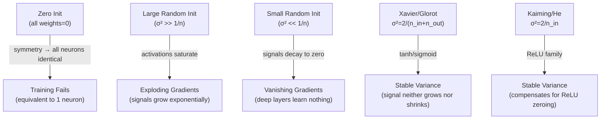

# 🎛️ Weight Initialization

> [!abstract] TL;DR
> Weight initialization determines the starting point for training — get it wrong and gradients vanish (too small) or explode (too large) before a single update is made. **Xavier/Glorot** initialization (`Var(W) = 2/(n_in + n_out)`) targets tanh/sigmoid activations by preserving signal variance across layers. **Kaiming/He** initialization (`Var(W) = 2/n_in`) compensates for ReLU zeroing half its inputs. Zero initialization breaks symmetry and prevents learning. BatchNorm reduces sensitivity to init but does not eliminate it.

## Intuition — Analogy First

Think of weight initialization as **setting a thermostat before heating a room**.

If you start the thermostat too high (large initial weights), the room overheats quickly — activations saturate, gradients explode, and the system takes a long time to stabilize. If you start it too low (near-zero weights), the room stays cold — signals are too weak to propagate, gradients vanish, and layers don't learn.

The goal is to set the thermostat so that as heat flows through the building (signal propagates through layers), each room ends up at roughly the same comfortable temperature (unit variance activations) — neither too hot nor too cold. Xavier and Kaiming initialization are principled ways to compute exactly the right starting temperature for different activation "heating systems."

## How It Works

### Why Zero Initialization Fails — Symmetry Breaking

If all weights are initialized to zero:

$$z^{(l)}_i = \sum_j w_{ij} a^{(l-1)}_j + b_i = 0 \quad \forall i$$

All neurons in a layer compute the same output (zero). Their gradients are identical. After one update, they are still identical. They remain identical forever — the network is equivalent to a single neuron per layer. This is the **symmetry problem**: all neurons must start at *different* positions to break symmetry and learn diverse features.

### Variance Propagation Analysis

Consider a layer with $n_{in}$ inputs, weights $w_{ij} \sim \mathcal{N}(0, \sigma^2_w)$, and inputs $x_j$ with variance $\sigma^2_x$. The output variance is:

$$\text{Var}(z_i) = n_{in} \cdot \sigma^2_w \cdot \sigma^2_x$$

For signal variance to stay constant across $L$ layers, we need:

$$n_{in} \cdot \sigma^2_w = 1 \quad \Rightarrow \quad \sigma^2_w = \frac{1}{n_{in}}$$



### Xavier / Glorot Initialization

**Goal**: preserve signal variance in both forward pass (for activations) and backward pass (for gradients) simultaneously.

**Compromise**: use the average of fan-in and fan-out:

$$\sigma^2_w = \frac{2}{n_{in} + n_{out}}$$

**Uniform variant** (commonly used):

$$w \sim \mathcal{U}\!\left[-\sqrt{\frac{6}{n_{in} + n_{out}}},\ +\sqrt{\frac{6}{n_{in} + n_{out}}}\right]$$

Works well for tanh and sigmoid, which are approximately linear near zero (so the linear variance analysis applies).

### Kaiming / He Initialization

ReLU zeroes out half its inputs on average (the negative half), halving the effective signal variance. Xavier does not account for this.

**Kaiming fix**: double the variance to compensate:

$$\sigma^2_w = \frac{2}{n_{in}}$$

**For fan-out mode** (used when focusing on backward pass):

$$\sigma^2_w = \frac{2}{n_{out}}$$

**Kaiming uniform**:

$$w \sim \mathcal{U}\!\left[-\sqrt{\frac{6}{n_{in}}},\ +\sqrt{\frac{6}{n_{in}}}\right]$$

### Orthogonal Initialization

Weights are initialized as an orthogonal matrix (columns are orthonormal vectors). This preserves the norm of activations exactly (as opposed to in expectation). Particularly useful for RNNs.

### Why Initialization Matters Less with BatchNorm

BatchNorm normalizes activations to zero mean and unit variance within each mini-batch, overriding whatever scale the weights produce. This significantly reduces sensitivity to initialization. However, even with BatchNorm, very large or very small initial weights can cause issues during the first few batches before BatchNorm statistics stabilize.

## The Math

### Xavier Derivation

For a linear layer $z = Wx$ where $w_{ij}$ i.i.d. with $\mathbb{E}[w_{ij}]=0$, $\text{Var}(w_{ij})=\sigma^2_w$, and $x_j$ i.i.d. with $\text{Var}(x_j)=\sigma^2_x$:

$$\text{Var}(z_i) = \sum_j \text{Var}(w_{ij} x_j) = \sum_j \text{Var}(w_{ij})\,\text{Var}(x_j) = n_{in} \cdot \sigma^2_w \cdot \sigma^2_x$$

Forward propagation condition: $\text{Var}(z_i) = \text{Var}(x_j)$, requires $\sigma^2_w = 1/n_{in}$

Backward propagation condition: requires $\sigma^2_w = 1/n_{out}$

**Xavier compromise**:

$$\boxed{\sigma^2_w = \frac{2}{n_{in} + n_{out}}}$$

### Kaiming Derivation

For ReLU, $\mathbb{E}[\text{ReLU}(z)^2] = \frac{1}{2}\text{Var}(z)$ (half the values are zeroed). To maintain $\text{Var}(a^{(l)}) = \text{Var}(a^{(l-1)})$:

$$n_{in} \cdot \sigma^2_w \cdot \text{Var}(a^{(l-1)}) \cdot \frac{1}{2} = \text{Var}(a^{(l-1)})$$

$$\boxed{\sigma^2_w = \frac{2}{n_{in}}}$$

The factor of 2 is the "ReLU correction factor."

### Empirical Effect on Deep Networks

For a 50-layer network with ReLU activations and no BatchNorm:

| Init | Layer 50 Activation StdDev (approximate) |
|------|------------------------------------------|
| Zero init | 0 (symmetry broken) |
| Normal(0, 0.01) | ~10⁻⁵⁰ (vanished) |
| Normal(0, 1.0) | ~10⁵⁰ (exploded) |
| Kaiming Normal | ~1.0 (stable) |

## Code Demo

```python
import torch
import torch.nn as nn
import matplotlib.pyplot as plt

# ── Helper: build a deep network and check activation stats ─────────────────
def check_activation_stats(init_fn, activation=nn.ReLU(), n_layers=20, width=256):
    """Build a deep net, apply init, run a forward pass, report per-layer stats."""
    layers = []
    for i in range(n_layers):
        linear = nn.Linear(width, width, bias=False)
        init_fn(linear.weight)
        layers.extend([linear, activation])
    model = nn.Sequential(*layers)

    x = torch.randn(128, width)
    stds = []
    with torch.no_grad():
        for i, layer in enumerate(model):
            x = layer(x)
            if isinstance(layer, (nn.ReLU, nn.Tanh)):
                stds.append(x.std().item())

    return stds

# ── Compare initializations with ReLU ────────────────────────────────────────
inits = {
    "Zero":            lambda w: nn.init.constant_(w, 0),
    "Normal(0,0.01)":  lambda w: nn.init.normal_(w, std=0.01),
    "Normal(0,1.0)":   lambda w: nn.init.normal_(w, std=1.0),
    "Xavier Uniform":  nn.init.xavier_uniform_,
    "Kaiming Normal":  lambda w: nn.init.kaiming_normal_(w, nonlinearity='relu'),
}

print("Activation StdDev across 20 layers with ReLU:\n")
print(f"{'Init':20s}  {'Layer 1':>8}  {'Layer 5':>8}  {'Layer 10':>9}  {'Layer 20':>9}")
for name, init_fn in inits.items():
    stds = check_activation_stats(init_fn)
    if len(stds) >= 20:
        print(f"{name:20s}  {stds[0]:8.4f}  {stds[4]:8.4f}  {stds[9]:9.4f}  {stds[19]:9.4f}")

# ── PyTorch built-in initialization functions ─────────────────────────────────
model = nn.Linear(512, 256)

# Xavier (Glorot) — for tanh, sigmoid
nn.init.xavier_uniform_(model.weight)
nn.init.xavier_normal_(model.weight)

# Kaiming (He) — for ReLU family
nn.init.kaiming_uniform_(model.weight, nonlinearity='relu')
nn.init.kaiming_normal_(model.weight, nonlinearity='leaky_relu', a=0.1)

# Orthogonal — for RNNs
nn.init.orthogonal_(model.weight)

# Bias is usually zero-initialized
nn.init.zeros_(model.bias)

print(f"\nKaiming weight stats — mean: {model.weight.mean():.4f}, std: {model.weight.std():.4f}")

# ── Apply init to a full model using model.apply() ───────────────────────────
def init_weights(m):
    if isinstance(m, nn.Linear):
        nn.init.kaiming_normal_(m.weight, nonlinearity='relu')
        if m.bias is not None:
            nn.init.zeros_(m.bias)
    elif isinstance(m, nn.Conv2d):
        nn.init.kaiming_normal_(m.weight, mode='fan_out', nonlinearity='relu')
    elif isinstance(m, (nn.BatchNorm2d, nn.LayerNorm)):
        nn.init.ones_(m.weight)
        nn.init.zeros_(m.bias)

network = nn.Sequential(
    nn.Linear(784, 512), nn.ReLU(),
    nn.Linear(512, 256), nn.ReLU(),
    nn.Linear(256, 10),
)
network.apply(init_weights)
print("Applied Kaiming init to all Linear layers.")

# ── Custom gain for different activations ─────────────────────────────────────
# Xavier gain for different nonlinearities:
print(f"\nXavier gain for relu: {nn.init.calculate_gain('relu')}")       # sqrt(2)
print(f"Xavier gain for tanh: {nn.init.calculate_gain('tanh')}")       # 5/3
print(f"Xavier gain for sigmoid: {nn.init.calculate_gain('sigmoid')}") # 1
```

## Real-World Example

**Training ResNets with 100+ layers** was only made practical by Kaiming initialization. The original 2015 paper by He et al. showed that training a 30-layer plain network with Xavier initialization failed completely — the network could not converge, because ReLU's asymmetry caused variance to collapse to zero by layer 30. Switching to Kaiming (He) initialization enabled convergence of 30-layer, 50-layer, and even 1001-layer residual networks. The residual connection helps too (by providing a gradient bypass), but proper initialization is still required for the initial training stability before the network has learned meaningful features.

## Trade-offs

| Method | Target Activation | Fan Formula | Pros | Cons |
|--------|------------------|-------------|------|------|
| Zero | — | — | Simple | Symmetry breaking failure |
| Normal(0, 0.01) | Tanh (shallow) | — | Simple | Vanishes in deep nets |
| Xavier Uniform | Tanh, Sigmoid | 2/(fan_in + fan_out) | Theoretically justified | Not for ReLU |
| Xavier Normal | Tanh, Sigmoid | 2/(fan_in + fan_out) | Same | Not for ReLU |
| Kaiming Normal | ReLU, Leaky ReLU | 2/fan_in | Best for modern nets | Wrong for tanh |
| Kaiming Uniform | ReLU, Leaky ReLU | 2/fan_in | Fast, simple | Wrong for tanh |
| Orthogonal | RNNs | — | Exact norm preservation | Expensive for large layers |

## When to Use vs Avoid

**Kaiming Normal** — default for any network using ReLU or Leaky ReLU. Use `mode='fan_in'` (default) for focusing on forward pass stability; `mode='fan_out'` when backward stability is more critical.

**Xavier Uniform** — use for tanh or sigmoid hidden layers (mostly legacy). Also appropriate for embedding layers and linear output heads.

**Orthogonal** — use for recurrent weight matrices in RNNs/LSTMs to control eigenvalue spectrum.

**Don't worry too much** about initialization when using BatchNorm or LayerNorm throughout — these normalizations absorb scale differences. Focus on initialization correctness for the first and last layers.

## Common Pitfalls

1. **Using Xavier init with ReLU**: underpowers gradients because ReLU halves variance; use Kaiming instead. PyTorch's `xavier_uniform_` does not warn you about this mismatch.
2. **Forgetting bias initialization**: biases should almost always be zero-initialized. Non-zero bias init can cause all neurons in a layer to fire identically at startup, recreating a weaker form of the symmetry problem.
3. **Not accounting for activation in `kaiming_normal_`**: the `nonlinearity` parameter matters. `nonlinearity='relu'` applies a gain of √2; `nonlinearity='leaky_relu'` with `a=0.1` applies a slightly different gain. Using the wrong setting degrades stability.
4. **Ignoring initialization for BatchNorm parameters**: BatchNorm's γ (weight) should be initialized to 1 and β (bias) to 0. PyTorch does this by default, but custom init functions can overwrite this accidentally.
5. **Not re-initializing when loading a backbone**: when fine-tuning a pretrained model, newly added task heads must be initialized correctly (usually Kaiming or Xavier), not left at default random values or copied from the pretrained model.

## Related Concepts

- [[_MOC_Deep_Learning|↑ Section MOC]]

- [[Backpropagation]] — initialization determines gradient magnitudes from the very first update
- [[Batch_Normalization]] — reduces (but does not eliminate) sensitivity to initialization
- [[Neural_Network_Basics]] — the context where initialization operates
- [[Activation_Functions]] — activation choice determines which init formula to use

## Review Questions

1. **Explain why zero initialization fails even though random initialization near zero works. What specific property of backpropagation causes identical weights to remain identical throughout training?**

2. **Derive the Kaiming initialization formula for ReLU. What assumption about ReLU do you need to use, and where exactly in the derivation does the factor of 2 appear?**

3. **You are building a 50-layer fully connected network without BatchNorm. You want to use tanh activations. What initialization should you use, and how would you verify empirically that your choice produces stable activation variance across all 50 layers?**

## Sources

- Glorot, X., Bengio, Y. (2010). Understanding the difficulty of training deep feedforward neural networks. *AISTATS*.
- He, K., Zhang, X., Ren, S., Sun, J. (2015). Delving deep into rectifiers: Surpassing human-level performance on ImageNet. *ICCV*.
- Saxe, A. M., McClelland, J. L., Ganguli, S. (2014). Exact solutions to the nonlinear dynamics of learning in deep linear neural networks. *ICLR*.
- PyTorch init documentation: https://pytorch.org/docs/stable/nn.init.html

#weight-initialization #xavier #kaiming #glorot #he-init #symmetry-breaking #deep-learning
