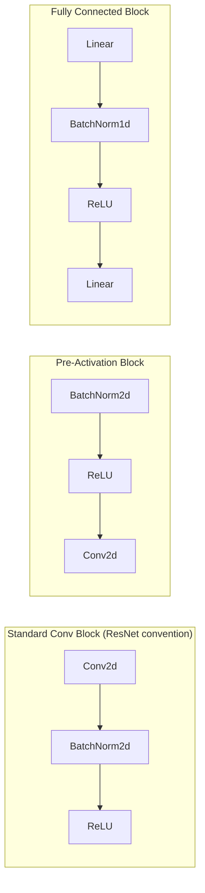

# 📊 Batch Normalization

> [!abstract] TL;DR
> Batch Normalization normalizes each feature across the mini-batch to zero mean and unit variance, then re-scales with learnable parameters γ and β. It reduces internal covariate shift, stabilizes training (allowing higher LR), acts as implicit regularization (reducing Dropout needs), and was the key enabler for training 100+ layer networks. Critical: BN behaves differently in `model.train()` vs `model.eval()` mode — forgetting to switch is a common bug.

## Intuition — Analogy First

Imagine comparing **test scores across different classrooms** (batches of data) before and after a school-wide standardization:

Without normalization: Classroom A's test is hard (mean 60, scores 40–80). Classroom B's test is easy (mean 90, scores 85–100). When the school concatenates results, students from Classroom A look uniformly worse — not because they learned less, but because their distribution shifted.

With batch normalization: You standardize each classroom's scores to mean 0, stddev 1 before comparing. Now the school's network (deep model) sees consistent input distributions at every layer — it doesn't have to constantly re-adapt to shifting input scales. Training is faster, gradients flow better, and the model can use a higher learning rate.

The **internal covariate shift** problem: as weights in lower layers change during training, the distribution of inputs to higher layers keeps shifting — upper layers must perpetually re-adapt to a moving target. BN pins each layer's input distribution, making the optimization landscape much smoother.

## How It Works

### Forward Pass (Training Mode)

Given a mini-batch $\{x_1, \ldots, x_m\}$ for a single feature:

**Step 1**: Compute batch statistics:
$$\mu_B = \frac{1}{m} \sum_{i=1}^m x_i, \quad \sigma^2_B = \frac{1}{m} \sum_{i=1}^m (x_i - \mu_B)^2$$

**Step 2**: Normalize:
$$\hat{x}_i = \frac{x_i - \mu_B}{\sqrt{\sigma^2_B + \epsilon}}$$

**Step 3**: Scale and shift with learnable parameters $\gamma$, $\beta$:
$$y_i = \gamma \hat{x}_i + \beta$$

### Inference Mode

At inference, you don't have a mini-batch. BN uses **running statistics** accumulated during training:

$$\mu_{running} \leftarrow (1 - \alpha)\mu_{running} + \alpha \mu_B \quad \text{(exponential moving average)}$$

$$y_i = \gamma \cdot \frac{x_i - \mu_{running}}{\sqrt{\sigma^2_{running} + \epsilon}} + \beta$$

This makes inference deterministic — same input always produces same output.

### Where to Place BN

Debate: BN before or after activation?

- **Original paper (Ioffe & Szegedy)**: BN → activation (norm the pre-activation)
- **Common practice in ResNets**: Conv → BN → ReLU
- **Pre-activation ResNets (He et al., 2016)**: BN → ReLU → Conv — empirically better for very deep nets



### Why BN Acts as Regularization

BN introduces noise during training (from batch statistics varying with each mini-batch), which acts similarly to Dropout — different training examples see slightly different normalizations depending on which mini-batch they appear in. This implicit stochasticity reduces overfitting. Networks with BN often need less Dropout.

## The Math

### Full Batch Normalization Forward

$$\mu_B = \frac{1}{m}\sum_{i=1}^m x_i$$

$$\sigma^2_B = \frac{1}{m}\sum_{i=1}^m (x_i - \mu_B)^2$$

$$\hat{x}_i = \frac{x_i - \mu_B}{\sqrt{\sigma^2_B + \epsilon}}$$

$$y_i = \gamma\hat{x}_i + \beta$$

Learnable parameters: $\gamma$ (initialized to 1) and $\beta$ (initialized to 0), one per feature channel.

### Gradient Through BN (Backward Pass)

The gradient of the loss w.r.t. the unnormalized input $x_i$ involves both the centering and scaling operations — it is non-trivial because $\mu_B$ and $\sigma_B$ depend on all $x_i$ in the batch:

$$\frac{\partial \mathcal{L}}{\partial x_i} = \frac{\gamma}{m\sigma_B}\left[m\frac{\partial \mathcal{L}}{\partial \hat{x}_i} - \sum_{j=1}^m \frac{\partial \mathcal{L}}{\partial \hat{x}_j} - \hat{x}_i\sum_{j=1}^m \frac{\partial \mathcal{L}}{\partial \hat{x}_j}\hat{x}_j\right]$$

This coupled gradient means BN slightly reduces gradient flow compared to pure whitening — but in practice enables much faster training.

### Why Small Batch Size Breaks BN

For batch size $m=1$: $\sigma^2_B = 0$ → division by $\epsilon$ only → no normalization. For $m=2$: statistics are extremely noisy. BN typically requires $m \geq 8$, ideally $\geq 32$, to produce stable statistics.

## Code Demo

```python
import torch
import torch.nn as nn
import torch.nn.functional as F

# ── BatchNorm1d for fully connected layers ────────────────────────────────────
class MLPWithBN(nn.Module):
    def __init__(self, input_dim=784, hidden_dim=256, output_dim=10):
        super().__init__()
        self.fc1 = nn.Linear(input_dim, hidden_dim)
        self.bn1 = nn.BatchNorm1d(hidden_dim)   # after Linear, before activation
        self.fc2 = nn.Linear(hidden_dim, hidden_dim)
        self.bn2 = nn.BatchNorm1d(hidden_dim)
        self.fc3 = nn.Linear(hidden_dim, output_dim)

    def forward(self, x):
        x = F.relu(self.bn1(self.fc1(x)))
        x = F.relu(self.bn2(self.fc2(x)))
        return self.fc3(x)

model = MLPWithBN()

# ── BatchNorm2d for CNNs ──────────────────────────────────────────────────────
class ConvBlockWithBN(nn.Module):
    def __init__(self, in_channels, out_channels):
        super().__init__()
        self.conv = nn.Conv2d(in_channels, out_channels, kernel_size=3, padding=1, bias=False)
        # bias=False when using BN — BN's beta parameter serves the same role
        self.bn   = nn.BatchNorm2d(out_channels)
        self.relu = nn.ReLU(inplace=True)

    def forward(self, x):
        return self.relu(self.bn(self.conv(x)))

conv_block = ConvBlockWithBN(3, 64)

# ── Inspect BN parameters ─────────────────────────────────────────────────────
bn = nn.BatchNorm1d(256)
print(f"Gamma (weight) shape: {bn.weight.shape}")   # (256,) — one per feature
print(f"Beta (bias) shape:    {bn.bias.shape}")     # (256,)
print(f"Running mean:         {bn.running_mean.shape}")  # (256,)
print(f"Running var:          {bn.running_var.shape}")   # (256,)
print(f"Gamma init (should be 1): {bn.weight.mean():.2f}")
print(f"Beta init (should be 0):  {bn.bias.mean():.2f}")

# ── CRITICAL: train() vs eval() behavior ─────────────────────────────────────
x_train = torch.randn(32, 256)   # batch of 32
x_single = torch.randn(1, 256)   # single sample

model.train()  # uses batch statistics — output varies with batch composition
out_train = model(x_train)
print(f"\nTrain mode output shape: {out_train.shape}")

model.eval()   # uses running statistics — output is deterministic per sample
with torch.no_grad():
    out_single = model(x_single)
print(f"Eval mode single sample output shape: {out_single.shape}")

# ── Demonstrate the eval() bug: wrong mode = wrong predictions ────────────────
model_buggy = MLPWithBN()
# Simulate training with some batches to populate running stats
model_buggy.train()
for _ in range(10):
    _ = model_buggy(torch.randn(32, 784))  # populate running mean/var

# Correct inference
model_buggy.eval()
x_test = torch.randn(32, 784)
with torch.no_grad():
    out_correct = model_buggy(x_test)

# Buggy inference — forgot eval()
model_buggy.train()  # left in training mode!
with torch.no_grad():
    out_buggy = model_buggy(x_test)

diff = (out_correct - out_buggy).abs().mean().item()
print(f"\nOutput difference (correct eval vs buggy train mode): {diff:.4f}")
# This will be non-zero — train mode uses batch stats, eval uses running stats

# ── Manual BN to understand internals ────────────────────────────────────────
def manual_batchnorm(x, gamma, beta, eps=1e-5):
    """Manually compute BatchNorm1d forward pass (training mode)."""
    mean = x.mean(dim=0, keepdim=True)          # (1, D)
    var  = x.var(dim=0, keepdim=True, unbiased=False)  # (1, D)
    x_hat = (x - mean) / (var + eps).sqrt()     # (N, D) normalized
    return gamma * x_hat + beta

x = torch.randn(32, 64)
gamma = torch.ones(64); beta = torch.zeros(64)
y_manual = manual_batchnorm(x, gamma, beta)
y_pytorch = nn.BatchNorm1d(64, affine=False)(x)
print(f"\nManual vs PyTorch BN max diff: {(y_manual - y_pytorch).abs().max():.8f}")  # ~0

# ── Freezing BN during fine-tuning ────────────────────────────────────────────
def freeze_batchnorm(model):
    """Keep BN in eval mode even when model is in train mode (for fine-tuning)."""
    for module in model.modules():
        if isinstance(module, (nn.BatchNorm1d, nn.BatchNorm2d)):
            module.eval()
            for param in module.parameters():
                param.requires_grad_(False)
```

## Real-World Example

**ResNet (He et al., 2015)** uses Batch Normalization after every convolutional layer. Before BN, training networks deeper than ~20 layers was extremely difficult — gradients vanished or exploded, and the network was extremely sensitive to learning rate choice. BN stabilized activations throughout the network, allowing the authors to train ResNets with 50, 101, and 152 layers. The 1001-layer ResNet (pre-activation variant) was only possible because of BN. BN also allowed the use of much higher learning rates (0.1 instead of 0.001), speeding training by 14× according to the original paper.

**EfficientNet, DenseNet, MobileNet** — all major CNN architectures use BatchNorm2d as a standard component. Its pattern of `Conv → BN → ReLU` is so ubiquitous it is sometimes called the "ConvBNReLU block."

## Trade-offs

| Aspect | With BatchNorm | Without BatchNorm |
|--------|----------------|-------------------|
| Training stability | High (tolerates large LR) | Low (needs careful tuning) |
| Training speed | Faster (higher LR usable) | Slower |
| Small batch sizes (< 8) | Breaks down | Works fine |
| Sequential tasks (RNNs) | Problematic (varying seq len) | N/A |
| Variable-length batches | Problematic | Fine |
| Regularization | Implicit (reduces need for Dropout) | Requires explicit regularization |
| Inference determinism | With eval() mode | Always deterministic |
| Memory overhead | Small (running stats) | None |
| Layer interaction (training) | Coupled to batch | Independent |

## When to Use vs Avoid

**Use BatchNorm for**: CNNs (ResNets, EfficientNets, VGGs), MLPs in tabular learning, any feedforward architecture with batch sizes ≥ 8.

**Avoid BatchNorm for**: Transformers (use [[Layer_Normalization]] instead — works with batch size 1, stable for variable-length sequences); RNNs/LSTMs (temporal dependencies make batch statistics problematic); online learning / single-sample inference at training time; any setting where batch composition affects correctness (e.g., contrastive learning with hard negative batches).

**Alternatives**: GroupNorm (works with small batches; batch-independent), InstanceNorm (per-sample per-channel normalization; for style transfer), LayerNorm (transformers).

## Common Pitfalls

1. **Forgetting `model.eval()` before inference**: this is the most common BN bug. In training mode, BN uses batch statistics; in eval mode, it uses running statistics accumulated during training. Predictions in training mode are non-deterministic and batch-size-dependent.
2. **Using bias in conv layers before BN**: `nn.Conv2d(bias=True)` before `nn.BatchNorm2d` wastes parameters — BN's β (beta) already provides a learnable offset. Set `bias=False` in any conv followed immediately by BN.
3. **Very small batch sizes**: BN with batch size 2–4 produces highly noisy running statistics. Use GroupNorm or LayerNorm if batch sizes are constrained.
4. **Not freezing BN when fine-tuning with small datasets**: if you fine-tune a pretrained model with small batches, BN statistics will shift away from the pretrained values. Freeze BN (`module.eval()`) when fine-tuning with < 32 samples per batch.
5. **Accumulating gradients with BN**: if you simulate large batches by accumulating gradients over multiple micro-batches, the BN statistics are computed per micro-batch — they will be noisy and incorrect. Use `SyncBatchNorm` for multi-GPU or consider switching to LayerNorm for gradient accumulation workflows.

## Related Concepts

- [[_MOC_Deep_Learning|↑ Section MOC]]

- [[Layer_Normalization]] — normalizes across features instead of batch; standard for transformers
- [[Neural_Network_Basics]] — BN fits between linear and activation in the standard block
- [[Backpropagation]] — BN's backward pass is complex because mean/var depend on all batch samples
- [[Weight_Initialization]] — BN reduces (but doesn't eliminate) sensitivity to weight init
- [[Dropout]] — BN provides implicit regularization; together they often double-regularize unnecessarily

## Review Questions

1. **Derive why using `model.train()` vs `model.eval()` produces different outputs for a network with BatchNorm. What specific variables change between modes, and why does this matter for deployment?**

2. **BatchNorm breaks when batch size is 1 (single-sample inference). Explain the mathematical reason. Why does GroupNorm avoid this problem, and how does it differ from BatchNorm in what it normalizes?**

3. **You are fine-tuning a pretrained ResNet-50 on a medical imaging dataset with only 200 images and batch size 8. Should you freeze the BatchNorm layers or keep them trainable? Justify your answer and describe the potential failure mode of the alternative choice.**

## Sources

- Ioffe, S., Szegedy, C. (2015). Batch normalization: Accelerating deep network training by reducing internal covariate shift. *ICML*.
- He, K., et al. (2016). Identity mappings in deep residual networks. *ECCV*. (Pre-activation ResNet)
- Santurkar, S., et al. (2018). How does batch normalization help optimization? *NeurIPS*.
- Wu, Y., He, K. (2018). Group normalization. *ECCV*.
- PyTorch BatchNorm docs: https://pytorch.org/docs/stable/generated/torch.nn.BatchNorm2d.html

#batch-normalization #batchnorm #normalization #deep-learning #training #regularization
