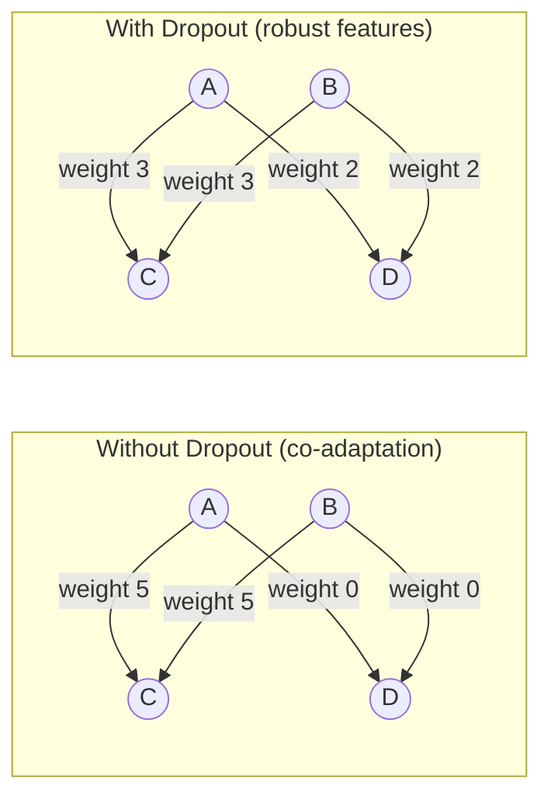

# 🎲 Dropout

> [!abstract] TL;DR
> Dropout randomly zeroes out neurons at rate p during training, forcing the network to learn redundant representations and preventing co-adaptation between neurons — this is equivalent to training an ensemble of 2ⁿ subnetworks. Modern implementation uses **inverted dropout** (scales surviving activations by 1/(1-p) at training time) so inference requires no adjustment. Don't use Dropout after BatchNorm. MC Dropout extends it to uncertainty estimation at inference.

## Intuition — Analogy First

Think of dropout as **training musicians who might be absent for any performance**.

A band that rehearses with all members present might develop an arrangement where each musician plays a critical, irreplaceable part. If the lead guitarist doesn't show up, the performance falls apart. The musicians have become **co-adapted** — over-reliant on each other.

Now force the band to rehearse with a random subset of players each practice session. The drummer can't rely on the bassist to anchor the rhythm — they must be capable of doing it themselves. The pianist can't count on the vocalist — they develop their own melodic line. Each musician learns a more **robust, independent** role.

When the full band performs together, each musician contributes their own solid part — and the combined performance is richer and more reliable. The randomness during rehearsal forced each player to be independently competent.

This is exactly what dropout does to neurons. By randomly silencing 20–50% of neurons each forward pass, no neuron can rely on its neighbors always being present. Every neuron must learn features useful in isolation, not just as part of a co-dependent group.

## How It Works

### Basic Dropout (Training Mode)

For each neuron independently:

$$\text{mask}_i \sim \text{Bernoulli}(1 - p)$$

$$a_i^{drop} = \text{mask}_i \cdot a_i$$

With probability $p$: neuron is zeroed out ("dropped"). With probability $1-p$: neuron passes through unchanged.

### Inverted Dropout (Modern Implementation)

Naive dropout reduces expected activations by factor $(1-p)$ at training time. At inference (no dropout), activations are $(1-p)$ larger than during training — this mismatch hurts performance.

**Fix**: scale surviving activations during training by $1/(1-p)$, preserving expected activation magnitude:

$$a_i^{drop} = \frac{\text{mask}_i}{1 - p} \cdot a_i$$

At inference: use all neurons without any scaling. Train ↔ inference outputs have the same expected scale. This is the standard implementation in PyTorch and all modern frameworks.

### The Ensemble Interpretation

A network with $n$ neurons and dropout can be seen as training an ensemble of $2^n$ different architectures — each corresponding to a different subset of active neurons. At inference, the full network (all neurons active) approximates the geometric mean of all these subnetworks' predictions.

### Where to Apply Dropout

- **After fully connected layers**: high-dimensional activations are most prone to co-adaptation
- **After attention layers in transformers**: GPT uses dropout on attention weights and FFN outputs
- **Avoid after BatchNorm**: BN normalizes activations to unit variance; dropout then randomly zeroes them out, disrupting the statistics BN relies on. Use one or the other, not both in sequence.
- **Not after the final output layer**: you need all information for the final prediction
- **Input dropout**: sometimes applied to inputs directly (denoising autoencoders, input regularization)



### MC Dropout (Monte Carlo Dropout)

Keep dropout **active at inference time** and run multiple forward passes. The variance across passes estimates the model's **epistemic uncertainty** (uncertainty about what the right parameters are):

$$p(y|x) \approx \frac{1}{T}\sum_{t=1}^T f_{\theta}^{(\text{mask}_t)}(x)$$

Mean = prediction, variance = uncertainty. This converts a deterministic network into a Bayesian approximation without retraining.

## The Math

### Expected Value with Inverted Dropout

Training (inverted dropout):

$$\mathbb{E}[a_i^{drop}] = \frac{1}{1-p} \cdot (1-p) \cdot a_i + \frac{1}{1-p} \cdot p \cdot 0 = a_i$$

Inference (no dropout):

$$a_i^{test} = a_i$$

Both have the same expected value — consistent behavior across train/test.

### Dropout Rate Selection

| Layer Position | Typical p | Notes |
|----------------|-----------|-------|
| Fully connected (hidden) | 0.3–0.5 | Classic AlexNet: 0.5 |
| Convolutional | 0.0–0.2 | Spatial features need less dropout; use SpatialDropout |
| Attention weights | 0.1–0.2 | GPT-2: 0.1 |
| Transformer FFN | 0.1–0.2 | BERT: 0.1 |
| Embedding layer | 0.0–0.1 | Low rates for embeddings |
| Input layer | 0.0–0.2 | For denoising or input regularization |

### Variance Analysis

For a neuron with activation $a$ and dropout rate $p$:

$$\mathbb{E}[\tilde{a}] = a$$

$$\text{Var}(\tilde{a}) = \frac{p}{1-p} a^2$$

Higher dropout rate → higher activation variance during training → stronger regularization signal.

## Code Demo

```python
import torch
import torch.nn as nn
import numpy as np

# ── Basic Dropout in PyTorch ──────────────────────────────────────────────────
dropout = nn.Dropout(p=0.5)

x = torch.ones(4, 10)  # all ones for easy inspection

torch.manual_seed(42)
x_train = dropout(x)   # training mode (dropout is active by default)
print("Training mode (p=0.5):")
print(x_train)  # 0s and 2s (scaled by 1/(1-0.5)=2)

dropout.eval()
x_test = dropout(x)    # eval mode (dropout is disabled)
print("\nEval mode (all ones — no dropout):")
print(x_test)

# ── MLP with Dropout ──────────────────────────────────────────────────────────
class MLPWithDropout(nn.Module):
    def __init__(self, input_dim=784, hidden_dim=512, output_dim=10, drop_rate=0.5):
        super().__init__()
        self.net = nn.Sequential(
            nn.Linear(input_dim, hidden_dim),
            nn.ReLU(),
            nn.Dropout(p=drop_rate),      # after activation, before next layer
            nn.Linear(hidden_dim, hidden_dim),
            nn.ReLU(),
            nn.Dropout(p=drop_rate),
            nn.Linear(hidden_dim, output_dim),
            # NO dropout after final layer
        )

    def forward(self, x):
        return self.net(x)

model = MLPWithDropout()

# ── CRITICAL: always toggle train/eval mode ───────────────────────────────────
x = torch.randn(32, 784)

model.train()
out_train = model(x)
print(f"\nTrain mode output mean: {out_train.mean():.4f}")

model.eval()
with torch.no_grad():
    out_eval = model(x)
print(f"Eval mode output mean:  {out_eval.mean():.4f}")
# These will differ — train mode randomly drops neurons

# ── Verify inverted dropout scaling ──────────────────────────────────────────
torch.manual_seed(0)
x_ones = torch.ones(10000, 100)
dropout_test = nn.Dropout(p=0.3)
dropout_test.train()
out = dropout_test(x_ones)
print(f"\nInverted dropout check (p=0.3):")
print(f"  Expected all values to be 0 or 1/(1-0.3)≈1.429")
print(f"  Nonzero mean: {out[out > 0].mean():.4f}")  # should be ~1.429
print(f"  Overall mean: {out.mean():.4f}")            # should be ~1.0

# ── MC Dropout for uncertainty estimation ────────────────────────────────────
class BayesianMLP(nn.Module):
    """Same as MLPWithDropout but designed for MC Dropout inference."""
    def __init__(self, input_dim=20, hidden_dim=64, output_dim=1, drop_rate=0.2):
        super().__init__()
        self.fc1     = nn.Linear(input_dim, hidden_dim)
        self.drop1   = nn.Dropout(p=drop_rate)
        self.fc2     = nn.Linear(hidden_dim, hidden_dim)
        self.drop2   = nn.Dropout(p=drop_rate)
        self.fc3     = nn.Linear(hidden_dim, output_dim)

    def forward(self, x):
        x = torch.relu(self.drop1(self.fc1(x)))
        x = torch.relu(self.drop2(self.fc2(x)))
        return self.fc3(x)

def mc_dropout_predict(model, x, n_samples=100):
    """
    MC Dropout: run T forward passes with dropout active.
    Returns mean (prediction) and std (uncertainty).
    """
    model.train()  # activate dropout — KEY difference from standard inference
    preds = torch.stack([model(x) for _ in range(n_samples)], dim=0)  # (T, N, 1)
    mean  = preds.mean(dim=0)          # (N, 1) — prediction
    std   = preds.std(dim=0)           # (N, 1) — uncertainty
    return mean, std

bay_model = BayesianMLP()
x_query = torch.randn(10, 20)
pred_mean, pred_std = mc_dropout_predict(bay_model, x_query, n_samples=200)
print(f"\nMC Dropout uncertainty estimation:")
print(f"  Prediction mean shape: {pred_mean.shape}")
print(f"  Uncertainty std shape: {pred_std.shape}")
print(f"  Sample uncertainties:  {pred_std.squeeze()[:5].tolist()}")

# ── Dropout vs No Dropout: regularization effect ─────────────────────────────
# Track training vs validation loss to confirm dropout reduces overfitting
def train_and_evaluate(use_dropout: bool, n_epochs=50):
    torch.manual_seed(42)
    # Small dataset to induce overfitting
    X_train = torch.randn(200, 784)
    y_train = torch.randint(0, 10, (200,))
    X_val   = torch.randn(500, 784)
    y_val   = torch.randint(0, 10, (500,))

    model = MLPWithDropout(drop_rate=0.5 if use_dropout else 0.0)
    opt   = torch.optim.Adam(model.parameters(), lr=1e-3)
    ce    = nn.CrossEntropyLoss()

    for epoch in range(n_epochs):
        model.train()
        opt.zero_grad()
        ce(model(X_train), y_train).backward()
        opt.step()

    model.eval()
    with torch.no_grad():
        train_loss = ce(model(X_train), y_train).item()
        val_loss   = ce(model(X_val),   y_val).item()
    return train_loss, val_loss

train_l, val_l = train_and_evaluate(use_dropout=False)
print(f"\nNo dropout  — train: {train_l:.3f}  val: {val_l:.3f}  gap: {val_l-train_l:.3f}")
train_l, val_l = train_and_evaluate(use_dropout=True)
print(f"With dropout — train: {train_l:.3f}  val: {val_l:.3f}  gap: {val_l-train_l:.3f}")
```

## Real-World Example

**AlexNet** (Krizhevsky et al., 2012) was the first major deep learning ImageNet winner and introduced dropout to CNNs. Dropout with p=0.5 was applied after the two fully connected layers (4096 neurons each). Without dropout, the network dramatically overfit to the 1.2M training images. With dropout, the generalization gap closed significantly and AlexNet achieved a top-5 error of 15.3% vs. the second-place 26.2%.

**GPT-2 and GPT-3** use dropout with p=0.1 on attention weights (applied after softmax, before multiplying by values) and on feedforward output projections. The small dropout rate (0.1 vs. the classic 0.5) reflects that large LLMs are data-rich — heavy dropout would throw away too much training signal when you have 300B training tokens.

## Trade-offs

| Aspect | High Dropout (p=0.5) | Low Dropout (p=0.1) | No Dropout |
|--------|----------------------|---------------------|------------|
| Regularization strength | Strong | Weak | None |
| Training speed | Slow (sparse signals) | Fast | Fastest |
| Good when | Small dataset, overfit risk | Large dataset, mild overfit | Large dataset, BN already present |
| Capacity utilization | Low (many neurons masked) | High | Full |
| Uncertainty estimation | Good (MC Dropout) | Moderate | Not applicable |
| Use with BatchNorm | Avoid (conflict) | Avoid | Yes |

## When to Use vs Avoid

**Use Dropout** on fully connected layers in MLPs and classification heads, especially with small datasets. Classic rates: 0.3–0.5 for hidden layers, 0.1–0.2 for transformer layers.

**Use MC Dropout** when you need uncertainty estimates without retraining as a Bayesian model. Simple to implement, computationally cheap (just run multiple forward passes with dropout on).

**Avoid Dropout** immediately after BatchNorm layers — the combination is theoretically inconsistent and empirically harmful. BN normalizes to unit variance, then dropout randomly zeros units, disrupting the distribution. Also avoid heavy dropout (> 0.3) when using large pretrained models — you'll destroy the learned representations.

**Avoid Dropout** on convolutional layers with small spatial dimensions — spatial dropout (drops entire feature maps, not individual neurons) is more appropriate for conv layers.

## Common Pitfalls

1. **Forgetting `model.eval()` at inference**: the most common dropout bug. In training mode, predictions are stochastic (different random mask each call). In eval mode, all neurons are active and predictions are deterministic. Models deployed without `model.eval()` produce inconsistent, degraded predictions.
2. **MC Dropout: calling `model.eval()` instead of `model.train()`**: for MC Dropout uncertainty, you intentionally want dropout active. You must call `model.train()` before MC Dropout inference — but this also activates training-mode BatchNorm. Solution: set only dropout layers to training mode manually.
3. **Using Dropout with BatchNorm in the same block**: as noted, they conflict. In networks with BN (ResNets, EfficientNets), Dropout is typically not used in the residual blocks themselves — only in the final classification head.
4. **Not adjusting Dropout rate when changing dataset size**: a rate of 0.5 that prevents overfitting on 10K samples may be too aggressive for 10M samples. Regularization strength should scale inversely with dataset size.
5. **Spatial dropout for conv layers**: standard `nn.Dropout2d` in PyTorch sets entire channels to zero (this is actually spatial dropout — drops full feature maps, not individual activations). This is correct behavior for conv layers and should be used instead of `nn.Dropout` on 4D tensors.

## Related Concepts

- [[_MOC_Deep_Learning|↑ Section MOC]]

- [[Regularization]] — dropout is one form of regularization; L1/L2 are alternatives
- [[Batch_Normalization]] — the other major normalization technique; use BN OR Dropout, rarely both
- [[Neural_Network_Basics]] — the network context where dropout is applied
- [[Transformer_Architecture]] — where dropout is applied in modern transformers

## Review Questions

1. **Explain inverted dropout: why is activations scaled by `1/(1-p)` during training, and why does this make inference simpler? What was the old (non-inverted) approach, and what problem did it cause?**

2. **Describe the ensemble interpretation of dropout: if a network has 100 neurons and you apply 50% dropout, what is the theoretical size of the ensemble being trained? What does the full network at inference time approximate?**

3. **You want to use MC Dropout to estimate prediction uncertainty in a deployed ResNet-50 that has both BatchNorm and Dropout layers. During MC Dropout inference, should you call `model.train()` or `model.eval()`? What is the problem with each choice, and how would you solve it?**

## Sources

- Srivastava, N., Hinton, G., Krizhevsky, A., Sutskever, I., Salakhutdinov, R. (2014). Dropout: A simple way to prevent neural networks from overfitting. *JMLR*, 15, 1929–1958.
- Krizhevsky, A., Sutskever, I., Hinton, G. E. (2012). ImageNet classification with deep convolutional neural networks. *NeurIPS*.
- Gal, Y., Ghahramani, Z. (2016). Dropout as a Bayesian approximation: Representing model uncertainty in deep learning. *ICML*.
- Li, X., et al. (2019). Understanding the disharmony between dropout and batch normalization. *CVPR*.

#dropout #regularization #mc-dropout #inverted-dropout #deep-learning #training
