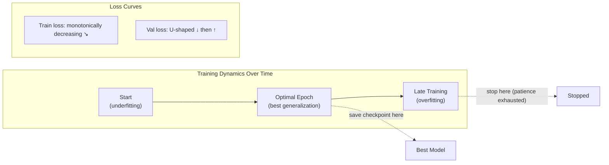

# ⏹️ Early Stopping

> [!abstract] TL;DR
> Early stopping monitors validation loss during training and halts when it stops improving, then restores the model to its best checkpoint. It prevents overfitting (training loss keeps decreasing while validation loss rises), saves compute, and acts as implicit regularization by limiting the number of gradient updates. The key hyperparameter is **patience** — how many epochs to wait for improvement before stopping. Always save the best model checkpoint, not the model at the stopping point.

## Intuition — Analogy First

Think of a chef **tasting a dish as they cook**.

A good chef periodically tastes the food (validation loss) as they add ingredients and adjust seasoning. At some point, the dish reaches peak flavor — perfectly balanced. But if they keep cooking (training), the dish overseasoned, dried out, or burned. The extra cooking time didn't make it better; it made it worse.

Early stopping is the chef deciding: "It tasted great 5 minutes ago — if it doesn't improve in the next 2 minutes of continued cooking, I'll stop and serve the version from 5 minutes ago." The "5 minutes ago" version is the saved best checkpoint.

The insight: **more training is not always better**. Past the optimal point, the model starts memorizing the training data's noise and quirks rather than learning the underlying pattern — the classic overfitting phenomenon.

## How It Works

### The Overfitting Pattern



### Algorithm

```
best_val_loss = infinity
best_epoch = 0
patience_counter = 0

for epoch in range(max_epochs):
    train_model(train_data)
    val_loss = evaluate(val_data)
    
    if val_loss < best_val_loss - min_delta:
        best_val_loss = val_loss
        best_epoch = epoch
        save_checkpoint(model)      ← save the best model
        patience_counter = 0
    else:
        patience_counter += 1
        if patience_counter >= patience:
            print(f"Early stopping at epoch {epoch}")
            break

model = load_checkpoint()           ← restore best model
```

### Key Parameters

| Parameter | Typical Value | Effect |
|-----------|--------------|--------|
| `patience` | 5–20 epochs | Lower = stops sooner (more regularization); higher = gives more time to recover |
| `min_delta` | 0–0.001 | Minimum improvement to count as "better"; prevents stopping on noise |
| `monitor` | `val_loss` | Metric to watch; can also monitor `val_accuracy` or other task metrics |
| `restore_best_weights` | True | Always restore; the model at the stopping point is not the best model |
| `mode` | `min` for loss, `max` for accuracy | Direction of improvement |

### Early Stopping as Regularization

Early stopping limits the total number of gradient updates — equivalent to limiting model complexity. Specifically, for L2-regularized linear regression, early stopping corresponds to L2 regularization with an effective $\lambda$ that decreases as training continues (more updates = less regularization). This is the theoretical justification: early stopping is not just a practical trick but a principled regularization method.

### Train/Val/Test Split Discipline

Early stopping uses the **validation set** to make a training decision (when to stop). This means the validation set has been used to implicitly "fit" the training duration hyperparameter. To get unbiased evaluation:

- **Train set**: gradient updates
- **Validation set**: early stopping, LR scheduling, hyperparameter tuning
- **Test set**: evaluate only once at the very end, after all decisions are finalized

Using the test set for early stopping or model selection is data leakage — your test accuracy will be optimistic.

## The Math

### Early Stopping as L2 Regularization

For gradient descent with step size $\alpha$ and $T$ steps, early stopping in a quadratic loss landscape produces an implicit regularizer approximately equivalent to L2 with:

$$\lambda_{eff} \approx \frac{1}{\alpha T}$$

More training steps ($T$ large) → smaller effective $\lambda$ → weaker regularization.

This provides the theoretical guarantee that early stopping regularizes: it is not merely "we stop early by luck" — there is a principled equivalence.

### Optimal Stopping Time

The optimal stopping epoch $T^*$ satisfies:

$$\frac{d\mathcal{L}_{val}}{dT}\bigg|_{T=T^*} = 0$$

In practice, we approximate this by monitoring and stopping when $\mathcal{L}_{val}$ stops decreasing (within patience).

### Patience Analysis

With patience $k$: we wait $k$ epochs before stopping. If the best validation loss was achieved at epoch $t^*$, we continue until epoch $t^* + k$ before stopping. The final model restored from $t^*$ was trained for the "right" number of steps; the extra $k$ steps were "exploratory" — we hoped the model would improve further.

## Code Demo

```python
import torch
import torch.nn as nn
import copy
import os

# ── EarlyStopping implementation ──────────────────────────────────────────────
class EarlyStopping:
    """
    Stop training when validation loss stops improving.
    Saves the best model checkpoint automatically.
    """
    def __init__(
        self,
        patience:   int   = 7,
        min_delta:  float = 1e-4,
        mode:       str   = "min",     # "min" for loss, "max" for accuracy
        save_path:  str   = "best_model.pt",
        verbose:    bool  = True,
    ):
        self.patience    = patience
        self.min_delta   = min_delta
        self.mode        = mode
        self.save_path   = save_path
        self.verbose     = verbose
        self.counter     = 0
        self.best_score  = None
        self.best_epoch  = 0
        self.best_state  = None
        self.should_stop = False

    def _is_better(self, score: float) -> bool:
        if self.best_score is None:
            return True
        if self.mode == "min":
            return score < self.best_score - self.min_delta
        else:
            return score > self.best_score + self.min_delta

    def __call__(self, score: float, model: nn.Module, epoch: int) -> None:
        if self._is_better(score):
            self.best_score = score
            self.best_epoch = epoch
            self.best_state = copy.deepcopy(model.state_dict())
            self.counter    = 0
            if self.verbose:
                print(f"  Epoch {epoch:3d}: new best {self.mode} = {score:.6f} ✓")
        else:
            self.counter += 1
            if self.verbose and self.counter % max(1, self.patience // 3) == 0:
                print(f"  Epoch {epoch:3d}: no improvement ({self.counter}/{self.patience})")
            if self.counter >= self.patience:
                self.should_stop = True

    def restore_best_weights(self, model: nn.Module) -> None:
        """Restore model to the best checkpoint."""
        if self.best_state is not None:
            model.load_state_dict(self.best_state)
            print(f"Restored best model from epoch {self.best_epoch} "
                  f"(val loss: {self.best_score:.6f})")

# ── Training loop with early stopping ────────────────────────────────────────
def train_with_early_stopping():
    # Synthetic dataset
    torch.manual_seed(42)
    X_train = torch.randn(500, 20)
    y_train = torch.randint(0, 5, (500,))
    X_val   = torch.randn(200, 20)
    y_val   = torch.randint(0, 5, (200,))

    model     = nn.Sequential(nn.Linear(20, 64), nn.ReLU(), nn.Linear(64, 5))
    optimizer = torch.optim.Adam(model.parameters(), lr=1e-3)
    loss_fn   = nn.CrossEntropyLoss()
    stopper   = EarlyStopping(patience=10, min_delta=1e-4, verbose=True)

    print("Training with early stopping (patience=10):\n")
    for epoch in range(1, 201):  # max 200 epochs
        # Train
        model.train()
        optimizer.zero_grad()
        train_loss = loss_fn(model(X_train), y_train)
        train_loss.backward()
        optimizer.step()

        # Validate
        model.eval()
        with torch.no_grad():
            val_loss = loss_fn(model(X_val), y_val).item()

        stopper(val_loss, model, epoch)

        if stopper.should_stop:
            print(f"\nEarly stopping triggered at epoch {epoch}.")
            break

    stopper.restore_best_weights(model)
    return model, stopper

model, stopper = train_with_early_stopping()

# ── Checkpoint-based approach (industry standard) ────────────────────────────
class CheckpointSaver:
    """Save checkpoints with metadata for production use."""
    def __init__(self, save_dir="checkpoints", top_k=3):
        self.save_dir = save_dir
        self.top_k    = top_k
        self.saved    = []   # list of (score, path)
        os.makedirs(save_dir, exist_ok=True)

    def save(self, model, optimizer, epoch, val_loss, extra_meta=None):
        path = os.path.join(self.save_dir, f"epoch_{epoch:04d}_loss_{val_loss:.4f}.pt")
        checkpoint = {
            "epoch":      epoch,
            "val_loss":   val_loss,
            "model":      model.state_dict(),
            "optimizer":  optimizer.state_dict(),
            "meta":       extra_meta or {},
        }
        torch.save(checkpoint, path)
        self.saved.append((val_loss, path))
        # Keep only top-k checkpoints (remove worst)
        self.saved.sort(key=lambda x: x[0])
        while len(self.saved) > self.top_k:
            _, old_path = self.saved.pop()
            if os.path.exists(old_path):
                os.remove(old_path)

    def load_best(self, model, optimizer=None):
        if not self.saved:
            raise ValueError("No checkpoints saved.")
        best_loss, best_path = self.saved[0]
        ckpt = torch.load(best_path)
        model.load_state_dict(ckpt["model"])
        if optimizer is not None:
            optimizer.load_state_dict(ckpt["optimizer"])
        print(f"Loaded best checkpoint: epoch {ckpt['epoch']}, val_loss={ckpt['val_loss']:.4f}")
        return ckpt

# ── Track train vs val loss for overfitting visualization ────────────────────
def demonstrate_overfitting():
    """Show train/val loss divergence — the classic overfitting signal."""
    torch.manual_seed(0)
    # Tiny dataset to force overfitting
    X_train = torch.randn(50, 20)
    y_train = torch.randint(0, 5, (50,))
    X_val   = torch.randn(200, 20)
    y_val   = torch.randint(0, 5, (200,))

    model     = nn.Sequential(nn.Linear(20, 256), nn.ReLU(), nn.Linear(256, 256), nn.ReLU(), nn.Linear(256, 5))
    optimizer = torch.optim.Adam(model.parameters(), lr=1e-3)
    loss_fn   = nn.CrossEntropyLoss()
    train_losses, val_losses = [], []

    for epoch in range(100):
        model.train()
        optimizer.zero_grad()
        tl = loss_fn(model(X_train), y_train)
        tl.backward(); optimizer.step()
        train_losses.append(tl.item())

        model.eval()
        with torch.no_grad():
            val_losses.append(loss_fn(model(X_val), y_val).item())

    best_epoch = val_losses.index(min(val_losses))
    print(f"\nOverfitting demonstration (tiny dataset):")
    print(f"  Best val loss at epoch {best_epoch+1}: {val_losses[best_epoch]:.4f}")
    print(f"  Val loss at epoch 100:                  {val_losses[-1]:.4f}")
    print(f"  Train loss at epoch 100:                {train_losses[-1]:.4f}")
    print(f"  → Train/val gap (overfitting): {val_losses[-1] - train_losses[-1]:.4f}")

demonstrate_overfitting()
```

## Real-World Example

Early stopping is **standard in all production ML training pipelines**. Major examples:

**HuggingFace Trainer** (the most widely used transformer fine-tuning framework) includes early stopping as a built-in callback (`EarlyStoppingCallback`). The default setting monitors `eval_loss` with patience=1, which aggressively stops after any epoch without improvement — often too aggressive for noisy training runs. Practitioners typically use patience=3–10.

**MLflow / Weights & Biases** integrate with early stopping by automatically saving the best checkpoint as an artifact. When training crashes or early stopping triggers, the best model is always persisted and can be retrieved.

**ImageNet training**: most standard ResNet training scripts run for a fixed 90 epochs (no early stopping) because the schedule is well-understood. But in transfer learning and fine-tuning scenarios where the optimal stopping point varies, early stopping is essential.

## Trade-offs

| Aspect | Early Stopping | Fixed Epochs |
|--------|----------------|--------------|
| Overfitting prevention | Automatic | Manual (must choose epoch count) |
| Compute efficiency | Stops early when improvement ceases | Runs fixed duration regardless |
| Reproducibility | Variable epoch count | Fixed epoch count (deterministic) |
| Checkpoint management | Requires saving best ckpt | Saves last ckpt only |
| LR schedule compatibility | Can conflict with cosine decay | Designed for fixed schedules |
| Training noise sensitivity | Patience controls sensitivity | N/A |

## When to Use vs Avoid

**Use early stopping** for:
- Fine-tuning pretrained models (stopping point varies by task)
- Training with limited data (overfitting risk high)
- Long training runs where early stopping saves GPU hours
- Hyperparameter search (automatically limits wasted runs)

**Be careful / avoid when**:
- Using cosine LR schedules with fixed total steps: the LR schedule is designed for a specific number of steps; early stopping at step 40% would leave you with a high LR, making the "best" checkpoint suboptimal. Solution: use patience large enough that early stopping only triggers near the end of the schedule.
- The validation set is very small: validation loss estimates are noisy; use larger patience to avoid stopping on noise.
- Self-supervised or contrastive pretraining: loss curves are noisy and non-monotonic; fixed schedules are more reliable.

## Common Pitfalls

1. **Not restoring best weights**: stopping at epoch 50 because patience is exhausted, but the best model was at epoch 40 — and you forget to `load_state_dict(best_state)`. You deploy the worse model.
2. **Using test data for early stopping**: if you monitor test loss instead of validation loss, you are using test data to make training decisions. The final test accuracy will be optimistically biased.
3. **Too small patience with noisy loss curves**: validation loss can bounce up for 2–3 epochs before resuming its downward trend. Patience=1 or 2 often stops training prematurely. Start with patience=5–10.
4. **Not setting `min_delta`**: without a minimum improvement threshold, early stopping may restart the patience counter when validation loss improves by 0.000001 — trivially small improvements. Set `min_delta=1e-4` or larger.
5. **Inconsistent batch size between train and validation**: if batch size is different at validation time and you use BatchNorm, the running statistics differ. Always use `model.eval()` for validation (this switches BN to use running statistics) and keep validation batch size consistent.
6. **Forgetting to save optimizer state with checkpoint**: if training is resumed from a checkpoint, the optimizer state (momentum, adaptive LR) should also be restored. Restoring weights without optimizer state causes the optimizer to "forget" its history and behave as if training is starting fresh.

## Related Concepts

- [[_MOC_Deep_Learning|↑ Section MOC]]

- [[Bias_Variance_Tradeoff]] — early stopping reduces variance (overfitting) at the cost of slight increase in bias
- [[Cross_Validation]] — related strategy for choosing hyperparameters; k-fold CV can guide patience selection
- [[Regularization]] — early stopping is one form; L1/L2, Dropout are others
- [[Dropout]] — another regularization technique; often combined with early stopping

## Review Questions

1. **Early stopping is considered a form of regularization. Explain the theoretical equivalence between early stopping and L2 regularization for gradient descent on a quadratic loss. What does the number of training steps correspond to in terms of the regularization strength λ?**

2. **You are fine-tuning a BERT model on a sentiment classification task with cosine LR scheduling over 10 epochs, and you are using early stopping with patience=3. Your training stops at epoch 6. What specific problem might have occurred with the LR schedule, and how would you redesign the training procedure to avoid it?**

3. **Describe the train/validation/test split discipline required when using early stopping. Why is the test set "used up" if you evaluate it after each epoch and use those results to decide when to stop? How does this cause optimistic bias in the reported test accuracy?**

## Sources

- Goodfellow, I., Bengio, Y., Courville, A. (2016). *Deep Learning*. MIT Press. Chapter 7.8.
- Yao, Y., Rosasco, L., Caponnetto, A. (2007). On early stopping in gradient descent learning. *Constructive Approximation*.
- Prechelt, L. (1998). Early stopping — but when? *Neural Networks: Tricks of the Trade*. Springer.
- HuggingFace Trainer docs: https://huggingface.co/docs/transformers/main_classes/trainer

#early-stopping #regularization #overfitting #checkpointing #training #deep-learning
