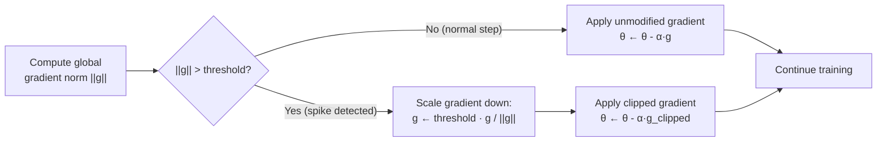

# ✂️ Gradient Clipping

> [!abstract] TL;DR
> Gradient clipping prevents exploding gradients from destabilizing training by capping gradient magnitude. **Clip by norm** (preferred) rescales the entire gradient vector proportionally when its global L2 norm exceeds a threshold, preserving direction. **Clip by value** clamps each element independently, distorting the gradient direction. Gradient clipping is standard in all LLM training (GPT-3, LLaMA clip at 1.0) and essential for RNNs. Monitor gradient norms — sudden spikes indicate instability before it causes NaN losses.

## Intuition — Analogy First

Think of gradient clipping as a **speed limiter on a car**.

During training, the "car" (optimizer) is trying to navigate from the current loss value to the minimum. The gradient is the accelerator — it tells the car how fast and in which direction to move.

Without a speed limiter: if the terrain suddenly drops off a cliff (a steep region in the loss landscape), the car accelerates wildly, flies off the cliff, and crashes (NaN loss, or parameters jumping to ±∞). By the time you notice, training is ruined.

With gradient clipping: the speed limiter caps the maximum velocity. When the gradient spikes (approaching the cliff), the limiter kicks in and says "you may continue in this direction, but at a controlled speed." The car navigates the cliff safely and continues toward the minimum.

Critically, **clip by norm** preserves the *direction* of travel (just slows down). **Clip by value** is like a limiter that works per wheel independently — it changes both speed and direction, which can send the car sideways.

## How It Works

### Exploding Gradients — The Problem

In deep networks, especially RNNs with many time steps, gradients can compound multiplicatively through layers. If the largest singular value of a weight matrix $W$ exceeds 1, then:

$$\left\|\frac{\partial \mathcal{L}}{\partial h_t}\right\| \approx \left\|\frac{\partial \mathcal{L}}{\partial h_T}\right\| \cdot \rho(W)^{T-t}$$

where $\rho(W)$ is the spectral radius of $W$. If $\rho(W) = 1.1$ and $T - t = 100$, the gradient grows by $1.1^{100} \approx 13,780$× — an explosive increase.

### Clip by Value

Clamp each gradient element independently:

$$g_i \leftarrow \text{clip}(g_i, -c, +c)$$

Simple but **bad**: changes the direction of the gradient vector by clipping different elements by different proportions.

### Clip by Norm (Preferred)

Compute the global L2 norm of all gradients, and rescale if it exceeds the threshold:

$$g_i \leftarrow \frac{c}{\max(c, \|g\|_2)} \cdot g_i$$

Or equivalently:

$$\|g\| > c \quad \Rightarrow \quad g \leftarrow c \cdot \frac{g}{\|g\|}$$

**Preserves direction** — the gradient is pointing the same way, just rescaled. This is why clip-by-norm is the universal standard.

### Global Norm Clipping

The "global norm" in PyTorch's `clip_grad_norm_` computes the norm *across all parameters*:

$$\|g\|_{\text{global}} = \sqrt{\sum_{\text{params}} \sum_{\text{elements}} g_{ij}^2}$$

This treats all parameters as a single flat vector — the clipping decision is made collectively, not per layer. This is important: you don't want layer 5 to be clipped while layer 1 is not, which could distort relative gradient scales.



### Why LLMs Always Use Gradient Clipping

Transformers have hundreds of layers of computation. During early training, when the loss is high and parameters are far from good values, gradients can spike dramatically (especially after encountering difficult training examples). A single un-clipped spike can:
- Cause parameter overflow to NaN
- Corrupt optimizer state (m and v in Adam) permanently
- Require training restart from the last checkpoint

Gradient clipping with threshold 1.0 is the minimal safety net.

## The Math

### Clip by Norm Formula

$$g \leftarrow \begin{cases} g & \text{if } \|g\|_2 \leq c \\ c \cdot \dfrac{g}{\|g\|_2} & \text{if } \|g\|_2 > c \end{cases}$$

**Key property**: $\|g_{\text{clipped}}\|_2 = \min(c, \|g\|_2)$

After clipping, the gradient norm is exactly $c$ (if it was over threshold) — not something less than $c$.

### Effect on Parameter Updates

For optimizer SGD with LR $\alpha$:

$$\theta_{t+1} = \theta_t - \alpha \cdot g_{\text{clipped}}$$

If $\|g\| = 100c$ (gradient spike 100× the threshold), then:

$$\|g_{\text{clipped}}\| = c, \quad \|\Delta\theta\| = \alpha \cdot c$$

The update size is bounded by $\alpha \cdot c$, regardless of how large the gradient spike is.

### Interaction with Adam

Adam normalizes gradients by $\sqrt{v_t}$ (second moment), so very large gradient spikes also inflate $v_t$, which would reduce subsequent effective LRs. Gradient clipping is still necessary because:

1. Very large gradients can cause NaN in the update if $v_t$ hasn't yet caught up (early training)
2. Gradient spikes corrupt the exponential moving average of $v_t$ for many subsequent steps

### Choosing the Threshold

Common thresholds in practice:

| Model Type | Typical Threshold | Notes |
|------------|------------------|-------|
| GPT-3 | 1.0 | Standard for large LLMs |
| LLaMA | 1.0 | All sizes |
| BERT fine-tuning | 1.0 | Standard |
| RNN / LSTM | 1.0–5.0 | Higher because recurrent gradients are noisier |
| CNNs | Often unused | Less prone to exploding; BN helps |
| RL training | 0.5–1.0 | Non-stationary targets amplify gradient noise |

## Code Demo

```python
import torch
import torch.nn as nn
import matplotlib.pyplot as plt

# ── Basic usage: clip_grad_norm_ ──────────────────────────────────────────────
model = nn.Sequential(nn.Linear(100, 64), nn.ReLU(), nn.Linear(64, 10))
optimizer = torch.optim.AdamW(model.parameters(), lr=1e-3)
loss_fn   = nn.CrossEntropyLoss()

x = torch.randn(32, 100)
y = torch.randint(0, 10, (32,))

optimizer.zero_grad()
loss = loss_fn(model(x), y)
loss.backward()

# Check gradient norm BEFORE clipping
pre_clip_norm = torch.nn.utils.clip_grad_norm_(model.parameters(), max_norm=float('inf'))
print(f"Gradient norm before clipping: {pre_clip_norm:.4f}")

# Apply gradient clipping (in-place, returns the norm before clipping)
optimizer.zero_grad()
loss = loss_fn(model(x), y)
loss.backward()
grad_norm = torch.nn.utils.clip_grad_norm_(model.parameters(), max_norm=1.0)
print(f"Gradient norm (clipped at 1.0): {min(grad_norm, 1.0):.4f}")
optimizer.step()

# ── Full training loop with gradient clipping ─────────────────────────────────
def train_with_monitoring(model, n_steps=200, max_norm=1.0):
    optimizer = torch.optim.AdamW(model.parameters(), lr=1e-3)
    loss_fn   = nn.CrossEntropyLoss()
    grad_norms = []

    for step in range(n_steps):
        xb = torch.randn(64, 100)
        yb = torch.randint(0, 10, (64,))

        optimizer.zero_grad()
        loss = loss_fn(model(xb), yb)
        loss.backward()

        # Clip and record the gradient norm before clipping
        grad_norm = torch.nn.utils.clip_grad_norm_(model.parameters(), max_norm=max_norm)
        grad_norms.append(grad_norm.item())

        optimizer.step()

    return grad_norms

torch.manual_seed(42)
model = nn.Sequential(nn.Linear(100, 256), nn.ReLU(), nn.Linear(256, 10))
norms = train_with_monitoring(model)
print(f"\nGradient norm stats over {len(norms)} steps:")
print(f"  Mean: {sum(norms)/len(norms):.4f}")
print(f"  Max:  {max(norms):.4f}")
print(f"  Clipping events (>1.0): {sum(1 for n in norms if n > 1.0)}")

# ── Clip by value (for comparison — less recommended) ────────────────────────
model2 = nn.Sequential(nn.Linear(100, 64), nn.ReLU(), nn.Linear(64, 10))
optimizer2 = torch.optim.SGD(model2.parameters(), lr=0.01)
xb = torch.randn(32, 100); yb = torch.randint(0, 10, (32,))
optimizer2.zero_grad()
loss_fn(model2(xb), yb).backward()

# Clip by value (clamps each gradient element to [-0.5, 0.5])
torch.nn.utils.clip_grad_value_(model2.parameters(), clip_value=0.5)
optimizer2.step()
print("\nClip by value applied (each gradient element clamped to [-0.5, 0.5])")

# ── Monitor and alert on gradient norm spikes ─────────────────────────────────
class GradientMonitor:
    """Track gradient norms and alert on spikes."""
    def __init__(self, threshold_multiplier=5.0, window=50):
        self.history = []
        self.threshold_multiplier = threshold_multiplier
        self.window = window

    def check(self, model, step):
        total_norm = torch.sqrt(sum(
            p.grad.norm()**2 for p in model.parameters() if p.grad is not None
        ))
        self.history.append(total_norm.item())

        if len(self.history) >= self.window:
            recent_mean = sum(self.history[-self.window:]) / self.window
            if total_norm.item() > self.threshold_multiplier * recent_mean:
                print(f"  WARNING step {step}: grad norm spike! "
                      f"{total_norm:.2f} vs mean {recent_mean:.2f}")
        return total_norm.item()

monitor = GradientMonitor()
model3 = nn.Sequential(nn.Linear(100, 64), nn.ReLU(), nn.Linear(64, 10))
opt3   = torch.optim.AdamW(model3.parameters(), lr=1e-3)

for step in range(100):
    xb = torch.randn(32, 100); yb = torch.randint(0, 10, (32,))
    opt3.zero_grad()
    loss_fn(model3(xb), yb).backward()
    norm = monitor.check(model3, step)
    torch.nn.utils.clip_grad_norm_(model3.parameters(), max_norm=1.0)
    opt3.step()
```

## Real-World Example

**GPT-3** training used gradient clipping with `max_norm=1.0` throughout the entire training run of 300B tokens. The OpenAI team reported several gradient spike events ("loss spikes") during GPT-3 training where the gradient norm briefly reached 10–100×, which would have caused catastrophic parameter updates without clipping. The clipping allowed training to continue through these instabilities while still making meaningful progress.

**LLaMA 2** (Meta, 2023) also uses gradient clipping at 1.0 for all model sizes (7B to 70B parameters). The LLaMA paper explicitly notes that without gradient clipping, training instabilities appear regularly after a few billion tokens — particularly around transitions in data distribution in the training corpus.

## Trade-offs

| Approach | Direction Preserved | Implementation | When to Use |
|----------|--------------------|--------------------|-------------|
| Clip by norm (global) | Yes | `clip_grad_norm_` | Standard — use this |
| Clip by norm (per-layer) | Yes (per layer) | Manual loop | When per-layer analysis needed |
| Clip by value | No | `clip_grad_value_` | Rarely — legacy code |
| No clipping | — | — | Shallow nets, well-conditioned loss |
| Gradient penalty (WGAN) | — | Add to loss | GANs (different purpose) |

## When to Use vs Avoid

**Always use gradient clipping** for:
- LLM pretraining and fine-tuning (threshold 1.0)
- RNN / LSTM training (threshold 1.0–5.0)
- Any training run that has experienced NaN losses
- Reinforcement learning (non-stationary targets create gradient noise)

**Usually not needed** (but not harmful) for:
- ResNets / EfficientNets with BatchNorm (BN limits gradient scale)
- Short, shallow networks
- Problems where the loss is known to be well-conditioned

**Monitoring best practice**: always log the gradient norm pre-clipping. A norm that is consistently near the threshold (always being clipped) suggests the learning rate is too high. Occasional spikes are normal; constant clipping indicates a configuration problem.

## Common Pitfalls

1. **Calling `clip_grad_norm_` before `loss.backward()`**: gradients must exist before you can clip them. The order is always: `loss.backward()` → `clip_grad_norm_()` → `optimizer.step()`. Reversing clips before any gradients are computed (clips 0 to max_norm — no effect).
2. **Clipping per-layer instead of globally**: if you accidentally clip each parameter separately (loop over parameters, clip each), you distort the relative scale between parameter groups. Use the global norm (pass all parameters at once).
3. **Confusing the return value**: `clip_grad_norm_` returns the **pre-clipping** gradient norm (the actual gradient norm before it was scaled down). It does not return the post-clipping norm. Log this value to monitor training stability.
4. **Using clip by value for transformer training**: `clip_grad_value_` with value=1.0 is not equivalent to `clip_grad_norm_` with max_norm=1.0. Clip by value distorts gradient direction and does not provide the same training stability benefits.
5. **Not saving optimizer state after gradient spikes**: after a large gradient spike that triggered clipping, the Adam optimizer's momentum (m) and variance (v) states contain corrupted values. If you train through several consecutive spikes, consider whether the optimizer state needs resetting or whether the LR needs reduction.

## Related Concepts

- [[_MOC_Deep_Learning|↑ Section MOC]]

- [[Backpropagation]] — exploding gradients are a failure mode of backprop in deep networks
- [[RNN_and_LSTM]] — most prone to exploding gradients due to recurrence through many time steps
- [[Optimizers]] — Adam partially mitigates gradient scale issues but does not prevent NaNs from spikes
- [[Learning_Rate_Scheduling]] — high peak LR amplifies gradient spike impact; warmup helps

## Review Questions

1. **Derive mathematically why gradients explode in an RNN with L time steps when the spectral radius ρ(W) > 1. At what depth does the gradient from the first time step become 1000× larger than the gradient from the last time step when ρ(W) = 1.05?**

2. **Compare clip-by-norm and clip-by-value. Draw gradient vectors before and after each clipping method for a 2D gradient of (3, 4) with threshold 2.0. Which preserves the update direction, and why does this matter for optimization?**

3. **During LLM pretraining you notice the gradient norm reported by `clip_grad_norm_` is consistently equal to your threshold (max_norm=1.0) — meaning gradients are being clipped on almost every step. What does this indicate about your training configuration, and what would you adjust?**

## Sources

- Pascanu, R., Mikolov, T., Bengio, Y. (2013). On the difficulty of training recurrent neural networks. *ICML*.
- Brown, T. B., et al. (2020). Language models are few-shot learners (GPT-3). *NeurIPS*.
- Touvron, H., et al. (2023). LLaMA 2. *arXiv:2307.09288*.
- Goodfellow, I., Bengio, Y., Courville, A. (2016). *Deep Learning*. MIT Press. Chapter 10.11.
- PyTorch docs: https://pytorch.org/docs/stable/generated/torch.nn.utils.clip_grad_norm_.html

#gradient-clipping #exploding-gradients #training-stability #deep-learning #rnn #llm
