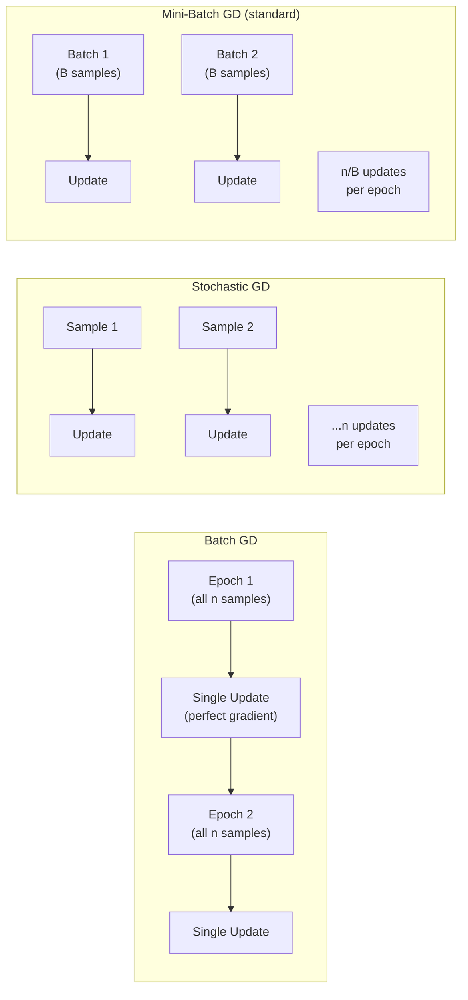

# ⛰️ Gradient Descent Variants

> [!abstract] TL;DR
> Gradient descent minimizes the loss by iteratively stepping in the direction of the negative gradient. Three variants differ in how many samples are used per update: **batch GD** (all data — accurate but slow), **SGD** (1 sample — fast but noisy), **mini-batch GD** (B samples — the practical standard). Mini-batch SGD with B=32–512 strikes the best compute-generalization trade-off. Noise in SGD is a feature: it helps escape sharp local minima and find flat minima that generalize better.

## Intuition — Analogy First

You are a hiker lost in a mountain range in thick fog, trying to reach the lowest valley (minimum loss). You can only see a few meters around you (local gradient information).

- **Batch GD**: Before each step, you somehow consult a perfect topographic map of the entire mountain range. You know exactly which direction descends most steeply. Your steps are perfectly directed — but producing this map takes all day for every single step. Very accurate, very slow.

- **Stochastic GD**: You look at exactly one rock beneath your foot to estimate the slope. You take a step. Then look at one new rock. The direction is noisy — sometimes you briefly go uphill by accident — but you move fast and cover ground quickly. The noise actually helps: it prevents you from getting stuck in a small hollow when the true valley is elsewhere.

- **Mini-batch GD**: You examine a handful of rocks (B of them) and average their slopes. Fast enough to take many steps per day, accurate enough that you're generally heading downhill. This is what everyone uses in practice.

## How It Works

### Batch Gradient Descent

Uses the entire training set $\mathcal{D}$ of $n$ samples to compute each gradient:

$$\theta \leftarrow \theta - \alpha \cdot \frac{1}{n} \sum_{i=1}^n \nabla_\theta \mathcal{L}(\theta; x_i, y_i)$$

Each update uses the true gradient of the full loss — determinstic, low variance, but requires one full pass through all data per step.

### Stochastic Gradient Descent (SGD)

Uses a single randomly sampled example per update:

$$\theta \leftarrow \theta - \alpha \cdot \nabla_\theta \mathcal{L}(\theta; x_i, y_i) \quad \text{(for a randomly drawn } i\text{)}$$

High variance per step, but many more updates per epoch. The noise in gradient estimates acts as implicit regularization.

### Mini-Batch SGD

The standard in practice. Uses a batch of $B$ samples:

$$\theta \leftarrow \theta - \frac{\alpha}{B} \sum_{i \in \mathcal{B}} \nabla_\theta \mathcal{L}(\theta; x_i, y_i)$$

where $\mathcal{B}$ is a random subset of size $B$ (typically 32–512).



### Batch Size Effects

| Batch Size | Gradient Estimate | Memory | Steps/Epoch | Generalization |
|------------|------------------|--------|-------------|----------------|
| 1 (SGD) | Very noisy | Tiny | n | Best (flattest minima) |
| 32–128 | Low noise | Moderate | n/B | Good |
| 512–4096 | Low noise | High | n/B | Degrades (sharp minima) |
| Full batch | Exact | GPU limit | 1 | Poor (sharp minima) |

### Why Noise Helps Generalization

Large-batch training finds **sharp minima** — narrow valleys where small perturbations to weights cause large loss increases. These generalize poorly. Small-batch (noisy) training finds **flat minima** — broad valleys. At a flat minimum, small weight perturbations cause small loss increases. These generalize well because they are robust to the covariate shift between train and test distributions.

**Keskar et al. (2017)** empirically demonstrated that batch sizes > 8192 degrade test accuracy on standard benchmarks even when training loss is the same.

### Learning Rate and Batch Size

When scaling batch size by factor $k$, the "linear scaling rule" says to also scale learning rate by $k$ (to maintain the same effective step):

$$\alpha_{\text{large}} = k \cdot \alpha_{\text{small}}$$

This requires a warmup period at the start — the large LR destabilizes training until the optimizer adapts.

## The Math

### Batch GD

$$\theta_{t+1} = \theta_t - \alpha \cdot \nabla_\theta \mathcal{L}(\theta_t)$$

where $\mathcal{L}(\theta_t) = \frac{1}{n} \sum_{i=1}^n \ell(\theta_t; x_i, y_i)$

Convergence: guaranteed to find a local minimum for smooth convex functions at rate $O(1/t)$.

### Mini-Batch SGD

$$g_t = \frac{1}{B} \sum_{i \in \mathcal{B}_t} \nabla_\theta \ell(\theta_t; x_i, y_i)$$

$$\theta_{t+1} = \theta_t - \alpha \cdot g_t$$

$g_t$ is an unbiased estimator of the true gradient: $\mathbb{E}[g_t] = \nabla_\theta \mathcal{L}(\theta_t)$

Variance: $\text{Var}(g_t) = \frac{\sigma^2}{B}$ — reducing batch size by 4× doubles gradient noise.

### Convergence Analysis

For non-convex loss (typical deep nets), SGD converges to a stationary point where $\nabla \mathcal{L} \approx 0$. Convergence rate depends on:
- Learning rate $\alpha$ (too large: diverge; too small: too slow)
- Batch size $B$ (larger → less noise → faster convergence to region, but potentially worse final solution)
- Loss landscape curvature

## Code Demo

```python
import torch
import torch.nn as nn
from torch.utils.data import DataLoader, TensorDataset
import time

# ── Create a synthetic dataset ────────────────────────────────────────────────
torch.manual_seed(42)
n_samples, n_features = 10_000, 20
X = torch.randn(n_samples, n_features)
y = (X @ torch.randn(n_features) + 0.5 * torch.randn(n_samples)).unsqueeze(1)

dataset = TensorDataset(X, y)

# ── Simple model ──────────────────────────────────────────────────────────────
def make_model():
    return nn.Sequential(
        nn.Linear(20, 64), nn.ReLU(),
        nn.Linear(64, 32), nn.ReLU(),
        nn.Linear(32, 1),
    )

# ── Training loop for a given batch size ─────────────────────────────────────
def train(batch_size: int, epochs: int = 5, lr: float = 0.01):
    model = make_model()
    optimizer = torch.optim.SGD(model.parameters(), lr=lr)
    loss_fn = nn.MSELoss()
    loader = DataLoader(dataset, batch_size=batch_size, shuffle=True)

    start = time.time()
    for epoch in range(epochs):
        epoch_loss = 0.0
        for xb, yb in loader:
            optimizer.zero_grad()
            loss = loss_fn(model(xb), yb)
            loss.backward()
            optimizer.step()
            epoch_loss += loss.item()
        if epoch == epochs - 1:
            avg_loss = epoch_loss / len(loader)

    elapsed = time.time() - start
    return avg_loss, elapsed

# ── Compare batch sizes ───────────────────────────────────────────────────────
print(f"{'Variant':30s}  {'Batch':>6}  {'Loss':>8}  {'Time(s)':>8}  {'Steps/epoch':>12}")
configs = [
    ("Full Batch (Batch GD)",   n_samples),
    ("Large Mini-Batch",        512),
    ("Standard Mini-Batch",     64),
    ("Small Mini-Batch",        16),
    ("SGD (batch=1)",           1),
]
for name, bs in configs:
    loss, t = train(batch_size=bs)
    steps = n_samples // bs
    print(f"{name:30s}  {bs:>6}  {loss:>8.4f}  {t:>8.2f}  {steps:>12,}")

# ── Manual training loop with gradient statistics ─────────────────────────────
model = make_model()
optimizer = torch.optim.SGD(model.parameters(), lr=0.01)
loss_fn = nn.MSELoss()
loader_std = DataLoader(dataset, batch_size=64, shuffle=True)

print("\n── Per-step gradient norms (first 5 steps) ──")
for step, (xb, yb) in enumerate(loader_std):
    if step >= 5:
        break
    optimizer.zero_grad()
    loss = loss_fn(model(xb), yb)
    loss.backward()
    # Compute gradient norm across all parameters
    total_norm = torch.sqrt(sum(p.grad.norm()**2 for p in model.parameters() if p.grad is not None))
    print(f"  Step {step+1}: loss={loss.item():.4f}  ||grad||={total_norm:.4f}")
    optimizer.step()

# ── Demonstrate linear scaling rule ──────────────────────────────────────────
# Base: batch=64, lr=0.01
# Scale: batch=256 (4x), lr=0.04 (4x)
# With warmup for first few steps
model_scaled = make_model()
optimizer_scaled = torch.optim.SGD(model_scaled.parameters(), lr=0.04, momentum=0.9)
scheduler = torch.optim.lr_scheduler.LinearLR(
    optimizer_scaled, start_factor=0.1, end_factor=1.0, total_iters=100
)
loader_large = DataLoader(dataset, batch_size=256, shuffle=True)
print("\nLinear scaling rule: batch=256, lr=0.04 with warmup configured.")
```

## Real-World Example

**BERT** (Google, 2018) was trained with mini-batch SGD using **batch size 256** for 1 million steps (phase 1: 128 tokens, phase 2: 512 tokens). The batch size was selected to maximize GPU utilization while maintaining good generalization. **GPT-3** (OpenAI, 2020) used a batch size of approximately **3.2 million tokens** (very large batch), enabled by a 400K token warmup and cosine LR decay — large batch was necessary to utilize 10,000 GPUs in parallel, with the linear scaling rule applied to adjust the learning rate accordingly. These large batches risk sharp minima; the warmup and cosine decay schedule partially mitigate this.

## Trade-offs

| Property | Batch GD | Mini-Batch SGD | Pure SGD |
|----------|----------|----------------|----------|
| Gradient accuracy | Exact | Low variance | High variance |
| Compute per update | Very high | Low | Very low |
| Hardware efficiency | Poor (no parallelism) | Excellent (GPU batched) | Poor (serial) |
| Memory requirement | Full dataset in memory | Manageable | Minimal |
| Generalization | Poor (sharp minima) | Good | Best (flattest minima) |
| Convergence stability | Stable | Stable | Noisy |
| Practical use | Never in deep learning | Always | Rarely |

## When to Use vs Avoid

**Mini-batch SGD with B=32–256** is the universal default. Start here.

**Larger batches (256–8192)**: use when you need faster wall-clock time and have many GPUs. Must use LR warmup + linear scaling rule. Expect slight generalization degradation at very large batches.

**Gradient accumulation**: if your GPU cannot fit a large batch, accumulate gradients over multiple small batches and step the optimizer every N steps — functionally equivalent to a larger batch.

**Avoid batch GD** for deep learning entirely — modern datasets don't fit in GPU memory, and you'd get only one update per epoch.

## Common Pitfalls

1. **Fixed learning rate with varying batch size**: doubling the batch size halves the effective noise but does not halve the optimal learning rate (you need to increase it). Forgetting the linear scaling rule wastes batch-size gains.
2. **Forgetting to shuffle**: without shuffling, the model sees the same batch ordering every epoch, which can cause it to learn ordering artifacts rather than underlying patterns.
3. **Uneven last batch**: if `drop_last=False` (default), the final batch is smaller and may distort BatchNorm statistics. Use `drop_last=True` when BatchNorm is present.
4. **Confusing epochs and steps**: "steps" = number of gradient updates = `n_samples / batch_size × epochs`. LR schedulers often expect step counts, not epoch counts.
5. **Not zeroing gradients**: PyTorch accumulates gradients — `optimizer.zero_grad()` must be called before each forward pass (or use `optimizer.zero_grad(set_to_none=True)` for slight memory/speed improvement).

## Related Concepts

- [[_MOC_Deep_Learning|↑ Section MOC]]

- [[Optimizers]] — SGD is the base; Adam, RMSProp, etc. build on top of it
- [[Learning_Rate_Scheduling]] — LR schedule is tightly coupled to gradient descent variant
- [[PyTorch_Training_Loop]] — practical implementation of mini-batch SGD
- [[Loss_Functions]] — gradient descent minimizes the loss function

## Review Questions

1. **Explain mathematically why the mini-batch gradient is an unbiased estimator of the full-batch gradient. What is the variance of the mini-batch gradient estimate, and how does it depend on batch size?**

2. **The "linear scaling rule" says to scale the learning rate proportionally with batch size. Intuitively, why is this the correct scaling? Under what conditions does it break down, and how does warmup address the breakdown?**

3. **Large-batch training tends to find sharp minima and generalize worse than small-batch training. Describe two methods (other than using a smaller batch) that practitioners use to improve the generalization of large-batch-trained models.**

## Sources

- Bottou, L., Curtis, F. E., Nocedal, J. (2018). Optimization methods for large-scale machine learning. *SIAM Review*, 60(2), 223–311.
- Keskar, N. S., et al. (2017). On large-batch training for deep learning: Generalization gap and sharp minima. *ICLR*.
- Goyal, P., et al. (2017). Accurate, large minibatch SGD: Training ImageNet in 1 hour. *arXiv:1706.02677*.
- Goodfellow, I., Bengio, Y., Courville, A. (2016). *Deep Learning*. MIT Press. Chapter 8.1.

#gradient-descent #sgd #mini-batch #optimization #deep-learning #training
