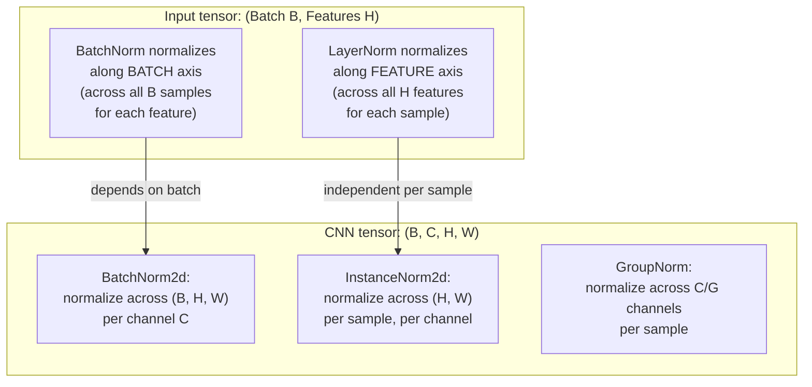

# 🔢 Layer Normalization

> [!abstract] TL;DR
> Layer Normalization normalizes across the **feature dimension** (not the batch dimension), computing mean and variance independently per sample. This makes it batch-size-independent — it works identically with batch size 1 and batch size 1000, and handles variable-length sequences naturally. LayerNorm is the standard for transformers (BERT, GPT, LLaMA) and RNNs; BatchNorm is for CNNs. The placement of LayerNorm (Pre-LN vs Post-LN) significantly affects training stability for deep transformers.

## Intuition — Analogy First

**Batch Normalization** is like a teacher grading all students' papers on a **class-wide curve** — everyone's grade is adjusted relative to how the class did as a whole. The curve shifts depending on which students happen to be in the batch.

**Layer Normalization** is like each student **grading their own paper on a personal scale** — each student normalizes based on their own distribution of answers, independent of what any other student did. If you are student X, your normalization is the same whether you are in a class of 5 or a class of 500.

This self-contained normalization is exactly what you want for a transformer processing a sentence: the normalization for token "cat" should not depend on whether this particular mini-batch happened to include many unusual tokens. Each sample's activations are normalized within themselves.

## How It Works

### Forward Pass

Given an input $x \in \mathbb{R}^{H}$ (one sample, H features):

$$\mu = \frac{1}{H}\sum_{i=1}^H x_i, \quad \sigma^2 = \frac{1}{H}\sum_{i=1}^H (x_i - \mu)^2$$

$$\hat{x}_i = \frac{x_i - \mu}{\sqrt{\sigma^2 + \epsilon}}, \quad y_i = \gamma_i \hat{x}_i + \beta_i$$

Key difference from BatchNorm: $\mu$ and $\sigma^2$ are computed per-sample, across the feature dimension — not across the batch.

### Normalization Axis Comparison



### Comparison of Normalization Methods

| Method | Normalizes Over | Batch-Size Dependent | Sequence-Length Dependent | Use Case |
|--------|----------------|---------------------|--------------------------|----------|
| BatchNorm | Batch dimension (per feature) | Yes | N/A | CNNs |
| LayerNorm | Feature dimension (per sample) | No | No | Transformers, RNNs |
| InstanceNorm | H×W per channel (per sample) | No | N/A | Style transfer |
| GroupNorm | C/G channels per sample | No | N/A | Small-batch CNN |
| RMSNorm | Feature dimension, no mean subtract | No | No | LLaMA, Gemini |

### Pre-LN vs Post-LN

**Post-LN** (original transformer, Vaswani et al. 2017): `x = LayerNorm(x + Sublayer(x))`

**Pre-LN** (GPT-2, GPT-3, LLaMA): `x = x + Sublayer(LayerNorm(x))`

Pre-LN is now universally preferred for deep transformers because:
- Gradients flow directly through the residual connection to early layers (no normalization in the main path)
- Training is more stable for large models (no warmup issues as severe)
- The final pre-LN output still goes through a LayerNorm before the output head

### RMSNorm (Root Mean Square LayerNorm)

Used by LLaMA, Mistral, and other efficient transformers. Removes the mean-centering step (only scales by RMS):

$$\text{RMSNorm}(x)_i = \frac{x_i}{\text{RMS}(x)} \cdot \gamma_i, \quad \text{where } \text{RMS}(x) = \sqrt{\frac{1}{H}\sum_{j=1}^H x_j^2}$$

~10–15% faster than LayerNorm (no mean computation). Empirically matches LayerNorm quality.

## The Math

### LayerNorm in Context of Transformers

In a transformer block with input $\mathbf{x} \in \mathbb{R}^{T \times D}$ (T tokens, D features), LayerNorm normalizes each token independently:

For token $t$: $\mu_t = \frac{1}{D}\sum_{d=1}^D x_{t,d}$, $\sigma^2_t = \frac{1}{D}\sum_{d=1}^D (x_{t,d} - \mu_t)^2$

$$\hat{x}_{t,d} = \frac{x_{t,d} - \mu_t}{\sqrt{\sigma^2_t + \epsilon}}, \quad y_{t,d} = \gamma_d \hat{x}_{t,d} + \beta_d$$

The learnable parameters $\gamma, \beta \in \mathbb{R}^D$ are shared across all token positions — LayerNorm has $2D$ parameters for a model of hidden dimension $D$.

### Why LayerNorm Enables Batch Size 1

BatchNorm's $\mu_B = \frac{1}{m}\sum_{i=1}^m x_i$ — with $m=1$, this is just $x_1$ itself, and $\sigma^2_B = 0$. Normalization produces exactly 0 for all inputs — uninformative. LayerNorm always computes statistics from the $H$-dimensional feature vector, which has $H \gg 1$ even for a single sample.

### Parameter Count

For a transformer with hidden dim $D$ and $L$ layers, each containing 2 LayerNorm operations:

$$\text{LN params} = 2 \times L \times 2D = 4LD$$

For LLaMA 7B ($D=4096$, $L=32$): $4 \times 32 \times 4096 = 524,288$ parameters — less than 0.01% of total model.

## Code Demo

```python
import torch
import torch.nn as nn
import torch.nn.functional as F

# ── Basic LayerNorm ───────────────────────────────────────────────────────────
# normalized_shape is the shape of the last N dimensions to normalize over
ln = nn.LayerNorm(normalized_shape=512)  # normalize over last dim of size 512
x = torch.randn(8, 32, 512)             # (batch, seq_len, d_model)
y = ln(x)
print(f"Input:  mean={x.mean():.3f}  std={x.std():.3f}")
print(f"Output: per-token mean~0: {y.mean(dim=-1).abs().mean():.6f}")  # ~0
print(f"Output: per-token std~1:  {y.std(dim=-1).mean():.6f}")         # ~1

# ── Manual LayerNorm implementation ──────────────────────────────────────────
def layer_norm_manual(x, gamma, beta, eps=1e-5):
    """LayerNorm forward pass: normalize over last dimension."""
    mean = x.mean(dim=-1, keepdim=True)
    var  = x.var(dim=-1, keepdim=True, unbiased=False)
    x_hat = (x - mean) / (var + eps).sqrt()
    return gamma * x_hat + beta

gamma = torch.ones(512); beta = torch.zeros(512)
y_manual = layer_norm_manual(x, gamma, beta)
y_torch  = nn.LayerNorm(512, elementwise_affine=True)(x)
print(f"\nManual vs PyTorch LN max diff: {(y_manual - y_torch).abs().max():.8f}")  # ~0

# ── LayerNorm in a Transformer Block ─────────────────────────────────────────
class TransformerBlock(nn.Module):
    """Pre-LN transformer block (GPT-2 / LLaMA style)."""
    def __init__(self, d_model: int = 512, n_heads: int = 8, d_ff: int = 2048):
        super().__init__()
        self.ln1  = nn.LayerNorm(d_model)   # before self-attention
        self.attn = nn.MultiheadAttention(d_model, n_heads, batch_first=True)
        self.ln2  = nn.LayerNorm(d_model)   # before feedforward
        self.ff   = nn.Sequential(
            nn.Linear(d_model, d_ff),
            nn.GELU(),
            nn.Linear(d_ff, d_model),
        )

    def forward(self, x: torch.Tensor) -> torch.Tensor:
        # Pre-LN: normalize BEFORE sublayer, then add residual
        attn_out, _ = self.attn(self.ln1(x), self.ln1(x), self.ln1(x))
        x = x + attn_out                    # residual connection
        x = x + self.ff(self.ln2(x))       # residual connection
        return x

block = TransformerBlock()
x_seq = torch.randn(4, 16, 512)  # (batch=4, seq_len=16, d_model=512)
out = block(x_seq)
print(f"\nTransformer block: input {x_seq.shape} → output {out.shape}")

# ── Post-LN vs Pre-LN comparison ─────────────────────────────────────────────
class PostLNBlock(nn.Module):
    """Post-LN (original transformer): LayerNorm AFTER residual."""
    def __init__(self, d_model=512, n_heads=8, d_ff=2048):
        super().__init__()
        self.attn = nn.MultiheadAttention(d_model, n_heads, batch_first=True)
        self.ff   = nn.Sequential(nn.Linear(d_model, d_ff), nn.ReLU(), nn.Linear(d_ff, d_model))
        self.ln1  = nn.LayerNorm(d_model)  # AFTER attention + residual
        self.ln2  = nn.LayerNorm(d_model)  # AFTER feedforward + residual

    def forward(self, x):
        attn_out, _ = self.attn(x, x, x)
        x = self.ln1(x + attn_out)   # LayerNorm AFTER residual
        x = self.ln2(x + self.ff(x))
        return x

# ── RMSNorm (used in LLaMA, Mistral, Gemma) ──────────────────────────────────
class RMSNorm(nn.Module):
    def __init__(self, d_model: int, eps: float = 1e-6):
        super().__init__()
        self.eps = eps
        self.weight = nn.Parameter(torch.ones(d_model))  # gamma only, no beta

    def forward(self, x: torch.Tensor) -> torch.Tensor:
        rms = x.pow(2).mean(dim=-1, keepdim=True).add(self.eps).sqrt()
        return x / rms * self.weight

rmsnorm = RMSNorm(512)
y_rms = rmsnorm(x)
print(f"\nRMSNorm output shape: {y_rms.shape}")

# ── Verify: LayerNorm is batch-size independent ───────────────────────────────
ln_test = nn.LayerNorm(512)
x_single = torch.randn(1, 10, 512)    # batch size 1
x_large  = torch.randn(64, 10, 512)   # batch size 64
# Same token at same position: output depends only on that token's 512 features
print(f"\nLN works with batch size 1:  {ln_test(x_single).shape}")
print(f"LN works with batch size 64: {ln_test(x_large).shape}")
```

## Real-World Example

Every transformer architecture — **BERT, GPT-2, GPT-3, T5, LLaMA, Gemini, Claude** — uses LayerNorm. The original 2017 transformer used Post-LN; since GPT-2 (2019), Pre-LN has become the standard because it enables training without warmup instability. **LLaMA** (Meta, 2023) uses **RMSNorm** instead of standard LayerNorm — it removes the mean-centering step (only the RMS scaling), which reduces compute by ~15% with no quality loss, a significant saving at 7B–70B parameter scale. LLaMA's RMSNorm uses `gamma` (weight) but no `beta` (bias), matching the finding that the bias term in LN is generally unnecessary.

## Trade-offs

| Aspect | BatchNorm | LayerNorm | RMSNorm |
|--------|-----------|-----------|---------|
| Normalization axis | Across batch per feature | Across features per sample | Across features per sample |
| Batch size dependency | Yes (breaks at size 1) | No | No |
| Sequence length dependency | N/A | No | No |
| Training mode vs eval mode | Differs (running stats) | Same | Same |
| Parameter count | 2×C | 2×D | 1×D (no bias) |
| Compute cost | Low | Low | Lowest (~15% less than LN) |
| Best for | CNNs | Transformers, RNNs | Efficient transformers |
| Gradient flow | Can block residuals (Post-LN) | Clean with Pre-LN | Clean with Pre-LN |

## When to Use vs Avoid

**LayerNorm** — default for any transformer architecture. Use Pre-LN placement for training stability. Use `normalized_shape=d_model` (last dimension only).

**RMSNorm** — use for large transformers (7B+ parameters) where the 15% compute savings on normalization is worthwhile. The quality difference from LayerNorm is negligible.

**Avoid LayerNorm for CNNs**: LayerNorm normalizes across all channels per spatial position, which is not the right inductive bias for convolutional features — use BatchNorm or GroupNorm.

**Avoid BatchNorm for transformers**: batch-dependent statistics are unstable with variable-length sequences (padding affects statistics), and at inference with single samples batch stats are meaningless.

## Common Pitfalls

1. **Normalizing the wrong dimension**: `nn.LayerNorm(normalized_shape=d_model)` normalizes over the last `len(normalized_shape)` dimensions. If you pass `normalized_shape=(seq_len, d_model)`, it normalizes over both — usually wrong (you want only the feature dimension).
2. **Confusing Pre-LN and Post-LN gradient flow**: Post-LN blocks the direct gradient path through residual connections (LayerNorm is in the path). This causes training instability for very deep models. Pre-LN exposes the clean residual path.
3. **Forgetting LN at the final output**: in Pre-LN transformers, the last layer's output has not been normalized. Always add a final `LayerNorm(x)` before the output projection head.
4. **Initializing gamma to 1 and forgetting it's trainable**: it is trainable by default in PyTorch, but it is sometimes accidentally frozen when using `requires_grad_(False)` on a module that includes LN layers.
5. **RMSNorm in place of LayerNorm with mismatched initialization**: models pretrained with LayerNorm (which has both gamma and beta) cannot be directly loaded into architectures using RMSNorm (which has only gamma) — the checkpoint will not match.

## Related Concepts

- [[_MOC_Deep_Learning|↑ Section MOC]]

- [[Batch_Normalization]] — the counterpart for CNNs; normalizes across the batch dimension
- [[Transformer_Architecture]] — LayerNorm is a core component of every transformer block
- [[Attention_Mechanism]] — attention outputs pass through LayerNorm in the residual path
- [[RNN_and_LSTM]] — LayerNorm also improves RNN training (applied per timestep)

## Review Questions

1. **Explain the fundamental mathematical difference between BatchNorm and LayerNorm by writing out the normalization equations for each. Why does BatchNorm fail at batch size 1 while LayerNorm does not?**

2. **Compare Pre-LN and Post-LN placement in a transformer block. Draw the residual stream gradient path for each. Why do gradients flow more easily through early layers in Pre-LN, and what training stability improvement does this produce?**

3. **LLaMA uses RMSNorm instead of LayerNorm. RMSNorm omits mean subtraction (centering). Under what assumption is mean subtraction unnecessary, and what is the empirical evidence that RMSNorm matches LayerNorm quality?**

## Sources

- Ba, J. L., Kiros, J. R., Hinton, G. E. (2016). Layer normalization. *arXiv:1607.06450*.
- Vaswani, A., et al. (2017). Attention is all you need. *NeurIPS*.
- Radford, A., et al. (2019). Language models are unsupervised multitask learners. (GPT-2 — introduced Pre-LN)
- Xiong, R., et al. (2020). On layer normalization in the transformer architecture. *ICML*. (Pre-LN theory)
- Zhang, B., Sennrich, R. (2019). Root mean square layer normalization. *NeurIPS*. (RMSNorm)
- Touvron, H., et al. (2023). LLaMA: Open and efficient foundation language models. *arXiv:2302.13971*.

#layer-normalization #layernorm #rmsnorm #transformers #normalization #deep-learning
