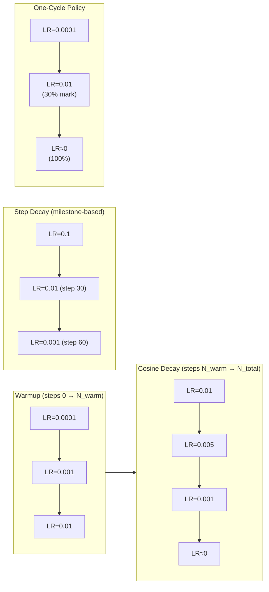

# 📉 Learning Rate Scheduling

> [!abstract] TL;DR
> A fixed learning rate is almost always suboptimal: too large early on causes instability; too small late in training wastes compute. Schedules dynamically adjust the LR during training. **Warmup + cosine decay** is the universal standard for transformer training. **One-cycle policy** is fast.ai's recipe for CNNs. Warmup is critical when using large batch sizes or large initial learning rates — it prevents early training from diverging before gradient statistics stabilize.

## Intuition — Analogy First

Think of learning rate scheduling as **driving on a highway trip**:

1. **Warmup (city driving)**: You start in a busy city. You drive slowly — if you floored it immediately, you'd crash into traffic (unstable gradients, NaN losses). Gradually accelerate as the road clears.

2. **Peak LR (highway cruise)**: You've merged onto the open highway. Cruise at high speed — cover the most ground per unit time. The model is rapidly exploring the loss landscape and making big progress.

3. **Decay (approaching your exit)**: As you near the destination, you slow down — taking large steps would overshoot the exit (optimal minimum). Gradually decelerate so you can fine-tune your position precisely.

4. **Cosine shape**: the transition from fast to slow is smooth — no sudden braking (step decay) that jostles the passengers. Cosine annealing gives a naturally smooth deceleration curve.

## How It Works

### Warmup

Start with a very small LR and linearly (or linearly) ramp up to the target LR over the first N steps.

**Why warmup is necessary:**
- At initialization, gradients are large and noisy — a large LR causes divergence
- Adam's second moment estimate $v_t$ starts at 0; early updates have unreliable adaptive scaling
- Large batch sizes amplify each gradient update's impact; warmup prevents early instability

### Step Decay

Multiply LR by a factor (e.g., 0.1) at fixed milestones. Simple but produces abrupt jumps in training dynamics.

### Cosine Annealing

LR follows a cosine curve from $\alpha_{max}$ to $\alpha_{min}$:

$$\alpha_t = \alpha_{min} + \frac{1}{2}(\alpha_{max} - \alpha_{min})\left(1 + \cos\!\left(\frac{\pi t}{T}\right)\right)$$

Smooth, continuous decay. No hyperparameter choices about when to step.

### Cosine with Warm Restarts (SGDR)

Restarts the cosine cycle periodically, allowing the optimizer to "escape" local minima it has converged into. Each restart can use a longer cycle than the last (multiplicative period increase).

### One-Cycle Policy

Combines warmup and decay in a single cycle:
1. Linearly increase LR from $\alpha_{max}/\text{div\_factor}$ to $\alpha_{max}$ (first 30% of training)
2. Linearly decrease to $\alpha_{max}/(\text{div\_factor} \times \text{final\_div\_factor})$ (remaining 70%)

Also applies the same schedule to momentum (inverted — low momentum at high LR, high momentum at low LR).

### LR Range Test (Smith, 2017)

Run training for a few hundred iterations, increasing LR exponentially from very small to very large. Plot loss vs LR. The optimal LR is just before the loss starts rising — this is the maximum usable LR.



## The Math

### Cosine Annealing

$$\alpha_t = \alpha_{min} + \frac{1}{2}(\alpha_{max} - \alpha_{min})\left(1 + \cos\!\left(\frac{\pi \cdot t}{T_{max}}\right)\right)$$

At $t=0$: $\alpha = \alpha_{max}$. At $t=T_{max}$: $\alpha = \alpha_{min}$.

### Cosine with Warm Restarts

$$\alpha_t = \alpha_{min} + \frac{1}{2}(\alpha_{max} - \alpha_{min})\left(1 + \cos\!\left(\frac{\pi \cdot (t \bmod T_i)}{T_i}\right)\right)$$

where $T_i = T_0 \cdot T_{mult}^i$ is the period of cycle $i$ ($T_{mult}=1$ gives equal cycles, $T_{mult}=2$ doubles each cycle).

### Linear Warmup

$$\alpha_t = \alpha_{target} \cdot \frac{t}{N_{warmup}} \quad \text{for } t < N_{warmup}$$

### LR for Large Batches (Warmup + Linear Scaling)

$$\alpha_{warmup\_t} = \alpha_{base} \cdot \frac{B_{large}}{B_{base}} \cdot \frac{t}{N_{warmup}}$$

where the target LR after warmup is $\alpha_{base} \cdot \frac{B_{large}}{B_{base}}$ (linear scaling rule).

## Code Demo

```python
import torch
import torch.nn as nn
import matplotlib.pyplot as plt
import math

model = nn.Linear(10, 1)
optimizer = torch.optim.AdamW(model.parameters(), lr=1e-3)

# ── 1. Cosine Annealing ───────────────────────────────────────────────────────
cosine_scheduler = torch.optim.lr_scheduler.CosineAnnealingLR(
    optimizer, T_max=100, eta_min=1e-6
)

# ── 2. Cosine with Warm Restarts ──────────────────────────────────────────────
sgdr_scheduler = torch.optim.lr_scheduler.CosineAnnealingWarmRestarts(
    optimizer, T_0=50, T_mult=2, eta_min=1e-6
)

# ── 3. Step Decay ─────────────────────────────────────────────────────────────
step_scheduler = torch.optim.lr_scheduler.MultiStepLR(
    optimizer, milestones=[30, 60, 80], gamma=0.1
)

# ── 4. Linear Decay ───────────────────────────────────────────────────────────
linear_scheduler = torch.optim.lr_scheduler.LinearLR(
    optimizer, start_factor=1.0, end_factor=0.01, total_iters=100
)

# ── 5. One-Cycle Policy (recommended for CNNs) ────────────────────────────────
steps_per_epoch = 100
n_epochs = 10
onecycle_scheduler = torch.optim.lr_scheduler.OneCycleLR(
    optimizer,
    max_lr=0.01,
    steps_per_epoch=steps_per_epoch,
    epochs=n_epochs,
    pct_start=0.3,           # 30% of steps used for LR increase
    div_factor=25.0,         # initial_lr = max_lr / div_factor
    final_div_factor=1e4,    # min_lr = initial_lr / final_div_factor
    anneal_strategy='cos',
)

# ── 6. Custom Warmup + Cosine Decay (manual lambda) ─────────────────────────
def warmup_cosine_schedule(step, warmup_steps=1000, total_steps=10000, min_lr_ratio=0.1):
    """Linear warmup followed by cosine decay to min_lr_ratio * initial_lr."""
    if step < warmup_steps:
        return step / warmup_steps
    progress = (step - warmup_steps) / (total_steps - warmup_steps)
    cosine_decay = 0.5 * (1 + math.cos(math.pi * progress))
    return max(min_lr_ratio, cosine_decay)

lambda_scheduler = torch.optim.lr_scheduler.LambdaLR(
    optimizer, lr_lambda=lambda step: warmup_cosine_schedule(step)
)

# ── 7. Visualize all schedules ────────────────────────────────────────────────
def get_lr_curve(scheduler_cls, scheduler_kwargs, n_steps=100):
    opt = torch.optim.AdamW(nn.Linear(1, 1).parameters(), lr=1e-3)
    sched = scheduler_cls(opt, **scheduler_kwargs)
    lrs = []
    for _ in range(n_steps):
        lrs.append(opt.param_groups[0]['lr'])
        sched.step()
    return lrs

schedules = {
    "Cosine Annealing":   (torch.optim.lr_scheduler.CosineAnnealingLR, {"T_max": 100}),
    "Step Decay":         (torch.optim.lr_scheduler.MultiStepLR, {"milestones": [30,60,80], "gamma": 0.1}),
    "Exponential Decay":  (torch.optim.lr_scheduler.ExponentialLR, {"gamma": 0.97}),
}

plt.figure(figsize=(12, 4))
for name, (cls, kw) in schedules.items():
    lrs = get_lr_curve(cls, kw)
    plt.plot(lrs, label=name)
plt.xlabel("Step"); plt.ylabel("Learning Rate"); plt.legend(); plt.title("LR Schedules")
plt.tight_layout(); plt.savefig("lr_schedules.png", dpi=120)

# ── 8. LR Finder (range test) ─────────────────────────────────────────────────
def lr_range_test(model, loader, loss_fn, start_lr=1e-7, end_lr=10, n_iter=100):
    """Increase LR exponentially and record loss; plot to find optimal LR."""
    opt = torch.optim.SGD(model.parameters(), lr=start_lr)
    mult = (end_lr / start_lr) ** (1 / n_iter)
    sched = torch.optim.lr_scheduler.ExponentialLR(opt, gamma=mult)
    lrs, losses = [], []
    for xb, yb in loader:
        if len(lrs) >= n_iter:
            break
        opt.zero_grad()
        loss = loss_fn(model(xb), yb)
        loss.backward()
        opt.step()
        sched.step()
        lrs.append(opt.param_groups[0]['lr'])
        losses.append(loss.item())
    return lrs, losses
```

## Real-World Example

**All major LLM pretraining** (GPT-3, LLaMA, Gemini, Mistral) uses **warmup + cosine decay**:
- GPT-3: 375M warmup tokens (375 steps × 1M tokens/step), then cosine decay to 10% of peak LR over 260B tokens
- LLaMA 2: 2000 warmup steps, cosine decay to 10% of peak LR
- BERT: 10,000 warmup steps (linear), then linear decay to 0

**fast.ai's One-Cycle Policy** demonstrated that by training with a cyclical LR schedule (warmup + sharp decay) for just 1 epoch, you could match or beat models trained for many epochs with fixed LR. This enabled "1cycle" training that reduced ResNet-50 training on ImageNet from days to hours.

## Trade-offs

| Schedule | Implementation | Hyperparameters | Works Best For | Risk |
|----------|---------------|-----------------|----------------|------|
| Fixed LR | Trivial | LR only | Prototyping | Suboptimal final loss |
| Step Decay | Simple | Milestones + gamma | CNNs (known plateaus) | Needs manual milestone tuning |
| Cosine Annealing | Simple | T_max, eta_min | General — excellent default | Needs good T_max estimate |
| Cosine + Restarts | Simple | T_0, T_mult | Escaping local minima | More hyperparameters |
| Warmup + Cosine | Simple | Warmup steps | Transformers (universal) | Warmup steps need tuning |
| One-Cycle | Module | max_lr, pct_start | CNNs, fast training | Abrupt end can destabilize |
| LR Range Test | Medium | start/end LR | Finding max usable LR | Only finds max, not full schedule |

## When to Use vs Avoid

**Warmup + Cosine Decay** — default for all transformer pretraining and fine-tuning. Warmup steps: typically 1–10% of total training steps. Set `eta_min` to 10% of peak LR (not 0).

**One-Cycle Policy** — excellent for CNNs when training for a fixed number of epochs. Requires a prior LR range test or good LR estimate. Not suitable for training that may need early stopping.

**Step Decay** — use only when you have a strong prior on when plateaus occur (e.g., training for exactly 90 epochs and historically knowing epochs 30/60/90 are good milestones). Avoid in new domains.

**Avoid fixed LR** beyond quick experiments. Even a simple cosine schedule with no warmup beats fixed LR on most tasks.

## Common Pitfalls

1. **Forgetting to call `scheduler.step()`**: PyTorch schedulers do not update automatically. Call `scheduler.step()` after each optimizer step (or after each epoch for epoch-based schedulers). Missing steps leads to the LR never decaying.
2. **Calling `scheduler.step()` before `optimizer.step()`**: This was a bug in older PyTorch; the scheduler would see step 0 twice. Always call `optimizer.step()` first, then `scheduler.step()`.
3. **Wrong step granularity for `OneCycleLR`**: `OneCycleLR` expects to be called every optimizer step (not every epoch), and it needs `total_steps = steps_per_epoch × epochs` to be set correctly at construction time.
4. **Setting `eta_min=0` for cosine**: when LR reaches 0, the model completely stops learning. Set `eta_min` to 1–10% of peak LR to allow continued fine-tuning near the minimum.
5. **Warmup too short for large batches**: with batch sizes > 4096, the LR jump at the end of warmup can still destabilize training if warmup is too short. Rule: warmup over at least 1% of total steps, minimum 100 steps.
6. **Not saving/loading scheduler state with checkpoints**: `torch.save({'model': ..., 'optimizer': ..., 'scheduler': sched.state_dict()})` — without the scheduler state, resumed training restarts the schedule from step 0.

## Related Concepts

- [[_MOC_Deep_Learning|↑ Section MOC]]

- [[Optimizers]] — the optimizer applies the LR; the scheduler changes the LR over time
- [[Gradient_Descent_Variants]] — batch size determines how many scheduler steps per epoch

## Review Questions

1. **Explain why a warmup period is necessary when training transformers with large batch sizes. What specifically goes wrong without warmup, and what does the warmup period give time for the optimizer to do?**

2. **Cosine annealing and step decay are both popular. Compare their gradient signal implications: what happens to training dynamics immediately after a step decay event vs. in cosine annealing? Which is better and why?**

3. **Design the LR schedule for training a 7B-parameter transformer on 1 trillion tokens. Specify: peak LR, warmup duration (in tokens or steps), decay shape, and final LR. Justify each choice.**

## Sources

- Loshchilov, I., Hutter, F. (2017). SGDR: Stochastic gradient descent with warm restarts. *ICLR*.
- Smith, L. N. (2017). Cyclical learning rates for training neural networks. *WACV*.
- Smith, L. N., Topin, N. (2019). Super-convergence: Very fast training of neural networks. *SPIE Defense*.
- Goyal, P., et al. (2017). Accurate, large minibatch SGD: Training ImageNet in 1 hour. *arXiv:1706.02677*.
- Touvron, H., et al. (2023). LLaMA 2: Open foundation and fine-tuned chat models. *arXiv:2307.09288*.

#learning-rate #lr-schedule #cosine-annealing #warmup #one-cycle #deep-learning #training
