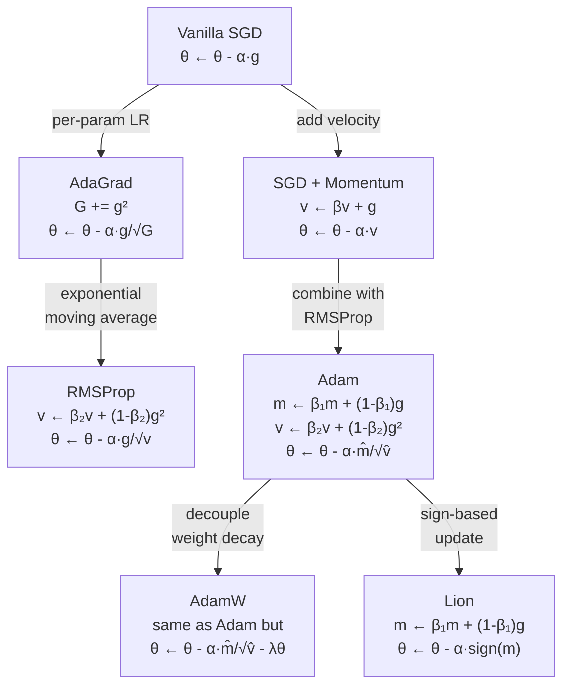

# ⚙️ Optimizers

> [!abstract] TL;DR
> Optimizers translate raw gradients into weight updates. SGD is the foundation; momentum adds velocity to escape local minima; AdaGrad adapts per-parameter learning rates; RMSProp fixes AdaGrad's decay; Adam combines momentum + RMSProp with bias correction; AdamW decouples weight decay from the adaptive update (the correct way to do L2 regularization). **AdamW** is the default for transformers; **SGD + momentum** often gives better generalization for CNNs if tuned.

## Intuition — Analogy First

Imagine a ball rolling down a hilly landscape toward the lowest point (minimum loss):

- **SGD**: a ball dropped on the slope with no momentum — it rolls straight down the current gradient but jitters wildly on rough terrain, and gets trapped in every small hollow.
- **SGD + Momentum**: a ball with physical inertia — it builds up speed on long downhill slopes, skips over small bumps, and cuts through narrow ravines. But it overshoots the valley if the slope is steep.
- **AdaGrad**: the ball adapts its wheel size per terrain dimension — large wheels (small effective LR) for frequently-updated dimensions, small wheels (large effective LR) for rarely-updated ones. But the wheels only get bigger — eventually it stops moving entirely.
- **RMSProp**: a ball that adjusts its wheel size using a recent moving average — recent terrain conditions matter more than ancient history. The ball keeps moving indefinitely.
- **Adam**: a ball with both inertia (momentum) AND adaptive wheel sizing — it remembers direction and adapts to local terrain. Most practical, most widely used.
- **AdamW**: Adam, but the weight decay (L2 penalty) is applied to the weights directly rather than through the gradient — more principled regularization.

## How It Works



### SGD with Momentum

Accumulates a velocity vector $v$ in the gradient direction:

$$v_t = \beta v_{t-1} + g_t \quad \quad \theta_{t+1} = \theta_t - \alpha v_t$$

Momentum $\beta$ (typically 0.9) creates a running average of past gradients. This:
- Accelerates in consistent gradient directions
- Dampens oscillations in noisy gradient directions
- Helps escape flat plateaus

### AdaGrad

Per-parameter learning rates that decrease for frequently-updated parameters:

$$G_t = G_{t-1} + g_t^2 \quad \quad \theta_{t+1} = \theta_t - \frac{\alpha}{\sqrt{G_t + \epsilon}} g_t$$

Effective LR decreases monotonically. Parameters that received many large updates get progressively smaller updates. Good for sparse features (NLP with word embeddings), bad for long training runs (LR → 0).

### RMSProp

Fixes AdaGrad's diminishing LR by using exponential moving average of squared gradients:

$$v_t = \beta_2 v_{t-1} + (1 - \beta_2) g_t^2$$

$$\theta_{t+1} = \theta_t - \frac{\alpha}{\sqrt{v_t + \epsilon}} g_t$$

$\beta_2 = 0.99$ → "forgets" old gradient information with a half-life of ~69 steps. LR is no longer monotonically decreasing.

### Adam

Combines SGD momentum (first moment) with RMSProp (second moment), plus bias correction for the initialization at $m_0 = v_0 = 0$:

$$m_t = \beta_1 m_{t-1} + (1 - \beta_1) g_t \quad \text{(first moment)}$$

$$v_t = \beta_2 v_{t-1} + (1 - \beta_2) g_t^2 \quad \text{(second moment)}$$

$$\hat{m}_t = \frac{m_t}{1 - \beta_1^t} \quad \hat{v}_t = \frac{v_t}{1 - \beta_2^t} \quad \text{(bias correction)}$$

$$\theta_{t+1} = \theta_t - \alpha \cdot \frac{\hat{m}_t}{\sqrt{\hat{v}_t} + \epsilon}$$

### AdamW — Adam with Decoupled Weight Decay

Original Adam applies weight decay via L2 regularization: $g_t' = g_t + \lambda \theta_t$. This couples weight decay with the adaptive gradient scaling, effectively reducing the weight decay for parameters with large gradient variance.

**AdamW** decouples the regularization:

$$\theta_{t+1} = \theta_t - \alpha \left(\frac{\hat{m}_t}{\sqrt{\hat{v}_t} + \epsilon} + \lambda \theta_t\right)$$

The $\lambda \theta_t$ term is applied directly to the parameter, bypassing the adaptive scaling. This is the correct way to do L2 regularization with adaptive optimizers.

## The Math

### Adam Complete Update

Given: gradient $g_t$, hyperparameters $\alpha$ (LR), $\beta_1=0.9$, $\beta_2=0.999$, $\epsilon=10^{-8}$:

**Step 1** — Update biased first moment:
$$m_t = \beta_1 m_{t-1} + (1 - \beta_1) g_t$$

**Step 2** — Update biased second raw moment:
$$v_t = \beta_2 v_{t-1} + (1 - \beta_2) g_t^2$$

**Step 3** — Bias correction (at early steps $m_t$ and $v_t$ are biased toward 0):
$$\hat{m}_t = \frac{m_t}{1 - \beta_1^t}, \quad \hat{v}_t = \frac{v_t}{1 - \beta_2^t}$$

**Step 4** — Parameter update:
$$\theta_t \leftarrow \theta_{t-1} - \alpha \cdot \frac{\hat{m}_t}{\sqrt{\hat{v}_t} + \epsilon}$$

### Why Bias Correction Matters

At $t=1$: $m_1 = (1-0.9) \cdot g_1 = 0.1 g_1$ (severely underestimates the true gradient). Without correction, the first update is 10× too small. $\hat{m}_1 = m_1 / (1 - 0.9^1) = m_1 / 0.1 = g_1$ — corrected.

### Effective Learning Rate per Parameter

Adam's per-parameter effective LR is:

$$\alpha_{\text{eff},i} = \alpha \cdot \frac{|\hat{m}_{t,i}|}{\sqrt{\hat{v}_{t,i}} + \epsilon}$$

This is bounded approximately by $\alpha$ — unlike AdaGrad, the effective LR does not go to zero.

## Code Demo

```python
import torch
import torch.nn as nn
import matplotlib.pyplot as plt

# ── Compare optimizers on a simple regression task ────────────────────────────
torch.manual_seed(42)
X = torch.randn(1000, 10)
y = X @ torch.randn(10) + 0.5 * torch.randn(1000)

def make_model():
    return nn.Sequential(nn.Linear(10, 32), nn.ReLU(), nn.Linear(32, 1))

def train_with_optimizer(opt_cls, opt_kwargs, epochs=200):
    model = make_model()
    optimizer = opt_cls(model.parameters(), **opt_kwargs)
    loss_fn = nn.MSELoss()
    losses = []
    for _ in range(epochs):
        optimizer.zero_grad()
        loss = loss_fn(model(X), y.unsqueeze(1))
        loss.backward()
        optimizer.step()
        losses.append(loss.item())
    return losses

configs = {
    "SGD":               (torch.optim.SGD,   {"lr": 0.01}),
    "SGD+Momentum":      (torch.optim.SGD,   {"lr": 0.01, "momentum": 0.9}),
    "Adagrad":           (torch.optim.Adagrad, {"lr": 0.01}),
    "RMSProp":           (torch.optim.RMSprop, {"lr": 0.001}),
    "Adam":              (torch.optim.Adam,  {"lr": 0.001}),
    "AdamW":             (torch.optim.AdamW, {"lr": 0.001, "weight_decay": 0.01}),
}

results = {name: train_with_optimizer(cls, kw) for name, (cls, kw) in configs.items()}
print("Final loss by optimizer:")
for name, losses in sorted(results.items(), key=lambda x: x[1][-1]):
    print(f"  {name:15s}: {losses[-1]:.6f}")

# ── AdamW for a transformer (correct hyperparameters) ────────────────────────
class TinyTransformerLayer(nn.Module):
    def __init__(self, d_model=256, nhead=4):
        super().__init__()
        self.attn = nn.MultiheadAttention(d_model, nhead, batch_first=True)
        self.ff   = nn.Sequential(nn.Linear(d_model, d_model*4), nn.GELU(), nn.Linear(d_model*4, d_model))
        self.ln1  = nn.LayerNorm(d_model)
        self.ln2  = nn.LayerNorm(d_model)

    def forward(self, x):
        x = self.ln1(x + self.attn(x, x, x)[0])
        return self.ln2(x + self.ff(x))

transformer = nn.Sequential(*[TinyTransformerLayer() for _ in range(4)])

# Standard transformer training hyperparameters (following BERT / LLaMA conventions)
optimizer = torch.optim.AdamW(
    transformer.parameters(),
    lr=3e-4,
    betas=(0.9, 0.999),
    eps=1e-8,
    weight_decay=0.01,
)
print(f"\nAdamW optimizer configured with {sum(p.numel() for p in transformer.parameters()):,} params")

# ── Inspect per-parameter gradient norms vs effective LR ─────────────────────
model = make_model()
optimizer_adam = torch.optim.Adam(model.parameters(), lr=0.001)
loss_fn = nn.MSELoss()

for step in range(10):
    optimizer_adam.zero_grad()
    loss = loss_fn(model(X[:64]), y[:64].unsqueeze(1))
    loss.backward()
    optimizer_adam.step()

# Access Adam's internal state (m and v moments)
for group in optimizer_adam.param_groups:
    for p in group['params']:
        if p in optimizer_adam.state:
            state = optimizer_adam.state[p]
            m = state['exp_avg']
            v = state['exp_avg_sq']
            eff_lr = (m.abs() / (v.sqrt() + 1e-8)).mean().item()
            print(f"  param shape {str(p.shape):15s}  eff_lr_factor={eff_lr:.4f}")
        break
    break

# ── SGD with momentum for CNNs (better generalization) ───────────────────────
# Typical CNN training recipe
sgd_optimizer = torch.optim.SGD(
    model.parameters(),
    lr=0.1,
    momentum=0.9,
    weight_decay=1e-4,
    nesterov=True,   # Nesterov momentum: look ahead before computing gradient
)
print(f"\nSGD+Nesterov configured (standard CNN recipe).")
```

## Real-World Example

**AdamW is the standard for transformer training**. When Loshchilov & Hutter (2019) compared Adam vs AdamW on transformer language models, AdamW consistently outperformed Adam in generalization by 1–3 perplexity points. The reason: with Adam, the weight decay is applied to the momentum-corrected gradient, which varies per-parameter. With AdamW, it's applied uniformly to all parameters — this is the mathematically correct way to apply L2 regularization with an adaptive optimizer. Every major LLM (BERT, GPT-3, LLaMA, Gemini) uses AdamW.

**SGD + Momentum for CNNs**: despite Adam's generality, well-tuned SGD with momentum still achieves state-of-the-art results on image classification. ResNet-50 achieves 76.1% top-1 on ImageNet with SGD (momentum=0.9, weight_decay=1e-4) and cosine LR decay, compared to ~75.5% with Adam. The "Adam generalization gap" for vision tasks is an active area of research.

## Trade-offs

| Optimizer | Hyperparameter Sensitivity | Convergence Speed | Generalization | Memory (states) | Best For |
|-----------|---------------------------|-------------------|----------------|-----------------|---------|
| SGD | Very high (LR critical) | Slow (no adapt) | Best (CNNs) | 0 | CNNs with tuning |
| SGD+Momentum | High | Medium | Very good | 1× params | CNNs |
| Adagrad | Medium | Fast early | Poor (long run) | 1× params | Sparse NLP |
| RMSProp | Medium | Fast | Good | 1× params | RNNs |
| Adam | Low | Fast | Good | 2× params | NLP, general |
| AdamW | Low | Fast | Very good | 2× params | Transformers (default) |
| Lion | Low | Fast | Comparable | 1× params | Large models (memory) |

## When to Use vs Avoid

**AdamW** — default for all transformer-based models (BERT, GPT, T5, ViT, LLaMA). Use `lr=1e-4` to `3e-4`, `betas=(0.9, 0.999)`, `weight_decay=0.01`. Pair with cosine LR schedule and warmup.

**SGD + Momentum + Nesterov** — for ResNets, EfficientNets, and other CNN architectures when you have budget to tune LR properly. Often achieves better final accuracy than Adam with a good schedule.

**RMSProp** — for RNNs and LSTMs (historical default). Also used in some RL algorithms (e.g., original DQN).

**Avoid Adam (not AdamW)** for regularization: Adam's L2 regularization is not equivalent to weight decay — use AdamW explicitly.

## Common Pitfalls

1. **Using `weight_decay` in Adam instead of AdamW**: PyTorch's `torch.optim.Adam` with `weight_decay > 0` implements L2 regularization as gradient addition, not true weight decay. Use `torch.optim.AdamW` for proper decoupled weight decay.
2. **Wrong learning rate for Adam**: `lr=0.01` (typical SGD default) is 10× too large for Adam. Adam default `lr=1e-3` is a good starting point; transformer training often uses `1e-4` to `3e-4`.
3. **Not resetting optimizer state when resuming**: if you change the model architecture or load from a checkpoint with a different architecture, the optimizer state (m, v moments) from the old model won't match new parameters.
4. **Beta₂ too low for transformers**: using `beta2=0.99` instead of `0.999` in transformer training reduces the effective gradient window and can destabilize training of large models.
5. **Gradient clipping with Adam**: Adam normalizes gradients by their variance, so clipping may seem redundant — but large gradient spikes (NaN risk) still require clipping. Always use `clip_grad_norm_` with threshold 1.0 for transformers.

## Related Concepts

- [[_MOC_Deep_Learning|↑ Section MOC]]

- [[Gradient_Descent_Variants]] — the base algorithm that optimizers extend
- [[Learning_Rate_Scheduling]] — LR schedule is applied on top of the optimizer
- [[Weight_Initialization]] — initialization determines the starting gradient magnitudes
- [[Backpropagation]] — produces the gradients that optimizers consume
- [[Gradient_Clipping]] — critical companion to Adam for LLM training stability

## Review Questions

1. **Walk through the complete Adam update for one step starting from $m_0 = v_0 = 0$. Why is bias correction necessary at early timesteps, and what happens to the correction factor $1/(1 - \beta_1^t)$ as $t \to \infty$?**

2. **AdamW and Adam with weight decay are not equivalent. Explain the mathematical difference: in Adam, how does weight decay interact with the adaptive learning rate, and why does this lead to incorrect regularization? How does AdamW fix this?**

3. **SGD with momentum sometimes achieves better generalization than Adam on image classification, despite Adam converging faster. Propose a mechanistic explanation based on the geometry of the loss landscape (sharp vs. flat minima).**

## Sources

- Kingma, D. P., Ba, J. (2015). Adam: A method for stochastic optimization. *ICLR*.
- Loshchilov, I., Hutter, F. (2019). Decoupled weight decay regularization. *ICLR*. (AdamW)
- Tieleman, T., Hinton, G. (2012). Lecture 6.5 — RMSProp. *COURSERA: Neural Networks for Machine Learning*.
- Chen, X., et al. (2023). Symbolic discovery of optimization algorithms. *NeurIPS*. (Lion)
- Goodfellow, I., Bengio, Y., Courville, A. (2016). *Deep Learning*. MIT Press. Chapter 8.

#optimizers #adam #adamw #sgd #momentum #rmsprop #deep-learning #training
