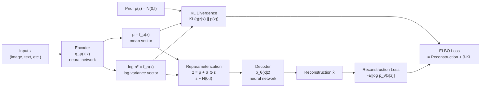

# Variational Autoencoders

> [!abstract] TL;DR
> A VAE learns a probabilistic latent space: the encoder outputs a distribution $q(z|x)$ (mean and variance) rather than a single point, and the decoder reconstructs from samples drawn from this distribution. Training optimizes the ELBO (Evidence Lower Bound) — reconstruction quality minus KL divergence from a standard Gaussian prior. The reparameterization trick makes this differentiable. The result: a smooth, structured latent space that supports interpolation and generation.

---

## Intuition — Analogy First

**Analogy:** Imagine a cartographer who maps a complex landscape to a simple 2D grid. A standard autoencoder is like a cartographer who assigns each city exactly one GPS coordinate — precise but brittle. Ask "what's between New York and Chicago?" and you get a random point in the ocean.

A VAE is a cartographer who assigns each city a **fuzzy zone** on the map, not a precise point. "New York" is centered at (40, -74) but the zone has some spread. Chicago is centered at (42, -88) with its own spread. The zones overlap sensibly. A point halfway between them lands somewhere in the Midwest — a real, meaningful place, not an ocean.

This "fuzziness" is the Gaussian posterior $q(z|x)$ — and it's what makes the latent space smooth and interpolable. The KL divergence term in the loss forces all these fuzzy zones to stay near the origin, preventing the zones from collapsing to points (standard AE) or spreading arbitrarily far apart.

---

## How It Works

### Architecture



### The Three Key Components

#### 1. Encoder (Inference Network) $q_\phi(z|x)$

A neural network that maps input $x$ to a **distribution** over latent codes $z$:
$$q_\phi(z|x) = \mathcal{N}(z;\, \mu_\phi(x),\, \sigma^2_\phi(x)\mathbf{I})$$

The encoder outputs **two vectors** of size $d_z$ (latent dimension):
- $\mu_\phi(x)$: the mean of the posterior — where in latent space this input "lives"
- $\log\sigma^2_\phi(x)$: the log-variance — how uncertain we are about the location

Outputting log-variance instead of variance ensures the variance is always positive: $\sigma^2 = e^{\log\sigma^2}$.

#### 2. Reparameterization Trick

Sampling $z \sim q_\phi(z|x)$ is not differentiable — we cannot backpropagate through a stochastic node. The trick: express the sample as a deterministic function of the parameters plus a separate noise source:

$$z = \mu_\phi(x) + \sigma_\phi(x) \odot \varepsilon, \qquad \varepsilon \sim \mathcal{N}(0, \mathbf{I})$$

Now gradients flow through $\mu$ and $\sigma$ while $\varepsilon$ is treated as a fixed random input. This converts an intractable stochastic computation graph into a differentiable one.

#### 3. Decoder (Generative Network) $p_\theta(x|z)$

A neural network that maps a latent code $z$ back to a reconstruction of $x$:
- For images: $p_\theta(x|z) = \mathcal{N}(x;\, \mu_\theta(z), \sigma^2\mathbf{I})$ → MSE reconstruction loss
- For binary/discrete data: $p_\theta(x|z) = \text{Bernoulli}(\mu_\theta(z))$ → BCE reconstruction loss
- For text tokens: $p_\theta(x|z) = \text{Categorical}(\text{softmax}(\mu_\theta(z)))$ → CE loss

---

## The Math

### Evidence Lower Bound (ELBO)

The true objective of VAE is maximum likelihood: $\max_\theta \log p_\theta(x)$.

Since $p_\theta(x) = \int p_\theta(x|z)p(z)\,dz$ is intractable, we optimize a lower bound — the ELBO:

$$\log p_\theta(x) \geq \underbrace{\mathbb{E}_{q_\phi(z|x)}\!\left[\log p_\theta(x|z)\right]}_{\text{Reconstruction term}} - \underbrace{D_{KL}\!\left(q_\phi(z|x) \,\|\, p(z)\right)}_{\text{KL regularization term}}$$

$$= \mathcal{L}_{\text{ELBO}}(\theta, \phi; x)$$

**Reconstruction term**: how well does the decoder reconstruct $x$ from samples of $z$? Maximizing this improves sample fidelity.

**KL divergence term**: how far is the approximate posterior $q_\phi(z|x)$ from the prior $p(z) = \mathcal{N}(0, I)$? Minimizing this regularizes the latent space, preventing collapse to delta functions (which would be a regular autoencoder).

### Closed-Form KL for Gaussians

For $q = \mathcal{N}(\mu, \text{diag}(\sigma^2))$ and $p = \mathcal{N}(0, I)$:

$$D_{KL}(q \,\|\, p) = -\frac{1}{2}\sum_{j=1}^{d_z}\!\left(1 + \log\sigma_j^2 - \mu_j^2 - \sigma_j^2\right)$$

This has a closed form — no Monte Carlo estimation needed for the KL term.

### Beta-VAE

The $\beta$-VAE (Higgins et al., 2017) adds a weight $\beta > 1$ to the KL term:

$$\mathcal{L}_{\beta\text{-VAE}} = \mathbb{E}_{q}\!\left[\log p_\theta(x|z)\right] - \beta \cdot D_{KL}(q_\phi(z|x) \,\|\, p(z))$$

Larger $\beta$ forces stronger disentanglement: each latent dimension tends to control one interpretable factor of variation (pose, lighting, shape). The cost is slightly worse reconstruction.

---

## Code Demo

```python
import torch
import torch.nn as nn
import torch.nn.functional as F
from torch.utils.data import DataLoader
from torchvision import datasets, transforms

# ── VAE Architecture ──────────────────────────────────────────────────────────
class VAE(nn.Module):
    """
    Variational Autoencoder for MNIST.
    Encoder: 784 → hidden → (μ, log_σ²) of size latent_dim
    Decoder: latent_dim → hidden → 784
    """
    def __init__(self, input_dim: int = 784, hidden_dim: int = 400, latent_dim: int = 20):
        super().__init__()
        self.latent_dim = latent_dim

        # Encoder
        self.fc1 = nn.Linear(input_dim, hidden_dim)
        self.fc_mu = nn.Linear(hidden_dim, latent_dim)      # mean
        self.fc_logvar = nn.Linear(hidden_dim, latent_dim)  # log-variance

        # Decoder
        self.fc3 = nn.Linear(latent_dim, hidden_dim)
        self.fc4 = nn.Linear(hidden_dim, input_dim)

    def encode(self, x: torch.Tensor) -> tuple:
        h = F.relu(self.fc1(x))
        return self.fc_mu(h), self.fc_logvar(h)

    def reparameterize(self, mu: torch.Tensor, logvar: torch.Tensor) -> torch.Tensor:
        """
        Reparameterization trick: z = μ + σ * ε, ε ~ N(0, I)
        Differentiable w.r.t. μ and σ; ε is a fixed random input.
        """
        if self.training:
            std = torch.exp(0.5 * logvar)   # σ = exp(log_σ²/2)
            eps = torch.randn_like(std)      # ε ~ N(0, I), same shape as std
            return mu + std * eps
        else:
            return mu  # at inference, use the mean (deterministic)

    def decode(self, z: torch.Tensor) -> torch.Tensor:
        h = F.relu(self.fc3(z))
        return torch.sigmoid(self.fc4(h))  # pixel values in [0, 1]

    def forward(self, x: torch.Tensor) -> tuple:
        mu, logvar = self.encode(x.view(-1, 784))
        z = self.reparameterize(mu, logvar)
        x_recon = self.decode(z)
        return x_recon, mu, logvar


# ── ELBO Loss ─────────────────────────────────────────────────────────────────
def vae_loss(x_recon: torch.Tensor, x: torch.Tensor,
             mu: torch.Tensor, logvar: torch.Tensor,
             beta: float = 1.0) -> dict:
    """
    ELBO = Reconstruction loss + β * KL divergence
    Reconstruction: binary cross-entropy for pixel values
    KL: closed-form for Gaussian posterior vs N(0, I) prior
    """
    # Reconstruction: -E[log p_θ(x|z)] — BCE averaged over batch
    recon_loss = F.binary_cross_entropy(
        x_recon, x.view(-1, 784), reduction="sum"
    )

    # KL divergence: -1/2 * sum(1 + log_σ² - μ² - σ²)
    kl_loss = -0.5 * torch.sum(1 + logvar - mu.pow(2) - logvar.exp())

    total_loss = recon_loss + beta * kl_loss
    return {
        "loss": total_loss,
        "recon_loss": recon_loss.item(),
        "kl_loss": kl_loss.item(),
    }


# ── Training Loop ─────────────────────────────────────────────────────────────
def train_vae(n_epochs: int = 10, beta: float = 1.0, latent_dim: int = 20):
    device = "cuda" if torch.cuda.is_available() else "cpu"

    # MNIST dataset
    transform = transforms.Compose([transforms.ToTensor()])
    train_loader = DataLoader(
        datasets.MNIST("./data", train=True, download=True, transform=transform),
        batch_size=128, shuffle=True
    )

    model = VAE(latent_dim=latent_dim).to(device)
    optimizer = torch.optim.Adam(model.parameters(), lr=1e-3)

    for epoch in range(1, n_epochs + 1):
        model.train()
        total_loss = total_recon = total_kl = 0

        for batch_idx, (x, _) in enumerate(train_loader):
            x = x.to(device)
            x_recon, mu, logvar = model(x)
            losses = vae_loss(x_recon, x, mu, logvar, beta=beta)

            optimizer.zero_grad()
            losses["loss"].backward()
            optimizer.step()

            total_loss  += losses["loss"].item()
            total_recon += losses["recon_loss"]
            total_kl    += losses["kl_loss"]

        n = len(train_loader.dataset)
        print(f"Epoch {epoch}/{n_epochs} | "
              f"Loss: {total_loss/n:.2f} | "
              f"Recon: {total_recon/n:.2f} | "
              f"KL: {total_kl/n:.2f}")

    return model


# ── Latent Space Interpolation ────────────────────────────────────────────────
def interpolate_latent(model: VAE, x1: torch.Tensor, x2: torch.Tensor,
                       n_steps: int = 10) -> list:
    """
    Interpolate between two inputs in latent space.
    Returns decoded images at each interpolation step.
    """
    model.eval()
    with torch.no_grad():
        mu1, _ = model.encode(x1.view(-1, 784))
        mu2, _ = model.encode(x2.view(-1, 784))

        interpolations = []
        for alpha in torch.linspace(0, 1, n_steps):
            z_interp = (1 - alpha) * mu1 + alpha * mu2
            x_interp = model.decode(z_interp)
            interpolations.append(x_interp.view(28, 28))

    return interpolations  # smooth transition from x1 to x2


# ── Unconditional Generation ──────────────────────────────────────────────────
def generate_samples(model: VAE, n_samples: int = 16) -> torch.Tensor:
    """Sample from prior p(z) = N(0, I) and decode."""
    model.eval()
    with torch.no_grad():
        z = torch.randn(n_samples, model.latent_dim)
        samples = model.decode(z)
    return samples.view(n_samples, 1, 28, 28)
```

---

## Real-World Example

> **Stable Diffusion latent space (Rombach et al., 2022):** Stable Diffusion does not run the diffusion process in pixel space (28M pixels for 512x512 RGB) but in the **latent space of a VAE**. An encoder VAE first compresses the image from 512x512x3 to a 64x64x4 latent code — a 48x compression. The diffusion model is trained on these latent codes, not raw pixels. At inference, the reverse diffusion process generates a latent code, which the VAE decoder maps back to a full-resolution image. This makes Stable Diffusion ~48x faster than pixel-space diffusion. The quality of the VAE (measured by reconstruction loss + perceptual similarity) directly bounds the sharpness of the final generated images.

---

## Trade-offs

| Aspect | Pro | Con |
|--------|-----|-----|
| Latent space | Smooth, structured, interpolable; supports generation | Less sharp reconstructions than standard autoencoders |
| vs Standard AE | Explicit probabilistic model; supports sampling | More complex training; blurrier outputs at same capacity |
| vs GANs | Stable training; no mode collapse; explicit likelihood | Sample quality typically lower; blurriness at high resolution |
| KL balance | Strong KL → disentangled; weak KL → sharper reconstruction | Trade-off between fidelity and generation diversity |
| Scalability | Works well for small-medium latent dims | Posterior collapse: KL vanishes if decoder is too powerful |

---

## When to Use vs Avoid

**Use VAE when:**
- You need a generative model with a structured, interpolable latent space
- Representation learning for downstream tasks (semi-supervised, clustering in latent space)
- Anomaly detection (high reconstruction error + KL from prior = anomaly)
- Compressing data into a meaningful low-dimensional code

**Avoid VAE when:**
- Photorealistic generation is the primary goal — use diffusion models or GANs
- Sharp boundaries are critical — VAE's reconstruction blur is fundamental
- Discrete data (text) — VAE with discrete latent variables requires special tricks (VQ-VAE, Gumbel-softmax)

---

## Common Pitfalls

- **Posterior collapse** — when the decoder is very powerful, it can ignore $z$ entirely, causing the KL term to collapse to zero (decoder learns the marginal $p(x)$ without using latent codes). Mitigation: reduce decoder capacity, use KL annealing (start $\beta$ at 0 and gradually increase), or use free bits.
- **KL annealing forgetting** — gradually increasing $\beta$ from 0 to 1 during training avoids posterior collapse but must be scheduled carefully; too-fast annealing reintroduces collapse.
- **Using variance (not log-variance)** — outputting raw variance from the encoder can produce negative values. Always output $\log\sigma^2$ and exponentiate: `sigma = torch.exp(0.5 * logvar)`.
- **Forgetting `reduction="sum"` in BCE** — PyTorch's `F.binary_cross_entropy` defaults to `reduction="mean"`. The ELBO derivation requires summing over all dimensions. Using `"mean"` implicitly rescales the reconstruction vs KL balance and requires adjusting $\beta$.
- **Not normalizing KL by batch size** — the KL term sums over all latent dimensions; if you also sum over the batch, you must divide by batch size consistently with the reconstruction term.

---

## Related Concepts

- [[_MOC_Deep_Learning|↑ Section MOC]]

- [[Information_Theory]] — the ELBO is a variational lower bound on the log-evidence; the KL divergence term connects directly to information-theoretic regularization
- [[Autoencoders]] — the standard (deterministic) autoencoder: same encoder-decoder structure but no probabilistic bottleneck; no smooth latent space; cannot generate new samples
- [[Loss_Functions]] — the ELBO is a composite loss: reconstruction (BCE or MSE) + KL; understanding each component requires fluency with information-theoretic losses
- [[Backpropagation]] — the reparameterization trick is specifically designed to make the stochastic sampling step differentiable so backprop can compute gradients through the latent variable
- [[Contrastive_Learning]] — both VAEs and contrastive learning learn compressed representations; VAEs optimize a probabilistic objective (ELBO), contrastive methods optimize mutual information (InfoNCE)

---

## Review Questions

1. The reparameterization trick rewrites $z \sim \mathcal{N}(\mu, \sigma^2 I)$ as $z = \mu + \sigma \odot \varepsilon$, $\varepsilon \sim \mathcal{N}(0, I)$. Explain precisely why the original sampling is not differentiable and how this reparameterization restores differentiability for backpropagation.

2. The VAE loss contains a KL divergence term. Describe what happens to the learned latent space if you set $\beta = 0$ (remove KL entirely) and train only with reconstruction loss. Why does this degenerate to a standard autoencoder, and why does that make unconditional sampling from the latent space fail?

3. Compare the VAE and GAN approaches for generative modeling. VAEs optimize a tractable lower bound (ELBO); GANs optimize a min-max adversarial objective. Which typically produces sharper images, which has more stable training, and what fundamental trade-off explains the difference?

---

## Sources

- Kingma, D. P., & Welling, M. (2013). *Auto-Encoding Variational Bayes*. ICLR 2014. [arXiv:1312.6114](https://arxiv.org/abs/1312.6114)
- Higgins, I., et al. (2017). *beta-VAE: Learning Basic Visual Concepts with a Constrained Variational Framework*. ICLR 2017.
- Rombach, R., et al. (2022). *High-Resolution Image Synthesis with Latent Diffusion Models*. CVPR 2022. [arXiv:2112.10752](https://arxiv.org/abs/2112.10752)
- Weng, L. (2018). *From Autoencoder to Beta-VAE*. [lilianweng.github.io](https://lilianweng.github.io/posts/2018-08-12-vae/)

#vae #variational-autoencoder #generative-models #elbo #reparameterization #latent-space #deep-learning
