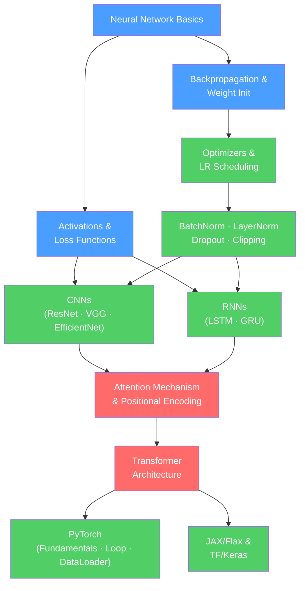

# 🗺️ Deep Learning — Map of Content

> [!info] How to use this map
> Start with Fundamentals, follow the arrows, and use the Learning Path below as your guide.
> Each node links to a full note. Come back here when you feel lost.

---

## Concept Map

*(Blue = fundamental, Green = intermediate, Red = advanced)*

---

## Learning Path

1. [[Neural_Network_Basics]] — single neurons, layers, feedforward pass, and the universal approximation theorem. Every other note in this section builds on this.
2. [[Activation_Functions]] — ReLU, sigmoid, tanh, GELU, Swish; why non-linearity is essential and how the choice of activation affects training dynamics.
3. [[Loss_Functions]] — MSE, cross-entropy, Huber; the probabilistic interpretation of each and how to choose the right one for your task.
4. [[Backpropagation]] — the chain rule applied recursively across layers; how gradients flow backward to update every weight in the network.
5. [[Weight_Initialization]] — Xavier/Glorot and He init; why random initialization scale matters enormously for deep networks.
6. [[Gradient_Descent_Variants]] — batch, mini-batch, stochastic GD; momentum, Nesterov; the building blocks all optimizers extend.
7. [[Optimizers]] — Adam, AdaGrad, RMSProp, AdamW; adaptive learning rate methods that dominate deep learning practice.
8. [[Learning_Rate_Scheduling]] — warmup, cosine annealing, cyclical LR, polynomial decay; how to change LR over training for better convergence.
9. [[Batch_Normalization]] — normalizes layer activations; accelerates training and reduces sensitivity to initialization.
10. [[Layer_Normalization]] — normalizes across the feature dimension; preferred over BatchNorm in transformers and RNNs.
11. [[Dropout]] — stochastic regularization by zeroing random neurons; ensemble interpretation and practical training tips.
12. [[Gradient_Clipping]] — prevents exploding gradients in deep and recurrent networks; essential for stable training.
13. [[Early_Stopping]] — monitor validation loss to halt training before overfitting; the simplest regularization strategy.
14. [[CNN_Fundamentals]] — convolution operations, pooling, receptive fields, translation invariance; the building block of vision models.
15. [[Famous_CNN_Architectures]] — AlexNet, VGG, ResNet (skip connections), EfficientNet; how architecture design evolved and why residuals changed everything.
16. [[RNN_and_LSTM]] — recurrent networks for sequences; vanishing gradient problem and how LSTM gates (input, forget, output) address it.
17. [[GRU]] — gated recurrent unit; simpler than LSTM with fewer parameters and comparable performance.
18. [[Attention_Mechanism]] — query, key, value; scaled dot-product attention; the core operation that powers transformers.
19. [[Positional_Encoding]] — sinusoidal and learnable encodings; why attention is permutation-invariant and how to inject position.
20. [[Transformer_Architecture]] — encoder/decoder blocks, multi-head attention, FFN, residuals, layer norm; encoder-only (BERT), decoder-only (GPT), encoder-decoder (T5).
21. [[PyTorch_Fundamentals]] — tensors, autograd, `nn.Module`; the essential PyTorch building blocks.
22. [[PyTorch_Training_Loop]] — training loop, validation loop, checkpointing, gradient accumulation; production-ready training code.
23. [[PyTorch_DataLoader]] — `Dataset`, `DataLoader`, samplers, collate functions, pin memory; efficient data loading for GPU training.
24. [[JAX_and_Flax]] — functional ML with XLA compilation; `jit`, `grad`, `vmap`; the framework of choice for TPU research.
25. [[TensorFlow_Keras]] — high-level Keras API, `tf.data`, SavedModel; Google's production ML framework.

---

## All Notes in This Section

### Fundamentals

| Note | Core Idea | Difficulty |
|------|-----------|------------|
| [[Neural_Network_Basics]] | Neurons, layers, forward pass, universal approximation theorem | Beginner |
| [[Activation_Functions]] | ReLU, sigmoid, tanh, GELU — non-linearity that makes depth meaningful | Beginner |
| [[Backpropagation]] | Chain rule applied across layers; computing gradients for every weight | Intermediate |
| [[Weight_Initialization]] | Xavier/He init; why initial weight scale determines whether training succeeds | Intermediate |
| [[Loss_Functions]] | MSE, cross-entropy, Huber — objective functions with probabilistic interpretations | Beginner |

### Training

| Note | Core Idea | Difficulty |
|------|-----------|------------|
| [[Gradient_Descent_Variants]] | Batch vs mini-batch vs SGD; momentum, Nesterov | Beginner |
| [[Optimizers]] | Adam, AdaGrad, RMSProp, AdamW — adaptive LR methods that dominate practice | Intermediate |
| [[Learning_Rate_Scheduling]] | Warmup, cosine decay, cyclical LR — shaping the learning rate over training | Intermediate |
| [[Batch_Normalization]] | Normalize layer inputs; reduce internal covariate shift; accelerate training | Intermediate |
| [[Layer_Normalization]] | Normalize across features; position-independent; preferred in transformers | Intermediate |
| [[Dropout]] | Zero random neurons during training; ensemble effect; reduces overfitting | Intermediate |
| [[Gradient_Clipping]] | Cap gradient norm to prevent exploding gradients in deep/recurrent networks | Intermediate |
| [[Early_Stopping]] | Halt training when validation loss stops improving; simplest regularization | Beginner |

### Architectures

| Note | Core Idea | Difficulty |
|------|-----------|------------|
| [[CNN_Fundamentals]] | Convolution, pooling, receptive fields, translation invariance | Intermediate |
| [[Famous_CNN_Architectures]] | AlexNet → VGG → ResNet → EfficientNet; the residual connection breakthrough | Intermediate |
| [[RNN_and_LSTM]] | Sequential processing with memory; input/forget/output gates cure vanishing gradients | Intermediate |
| [[GRU]] | Simpler gated RNN; reset/update gates; fewer parameters than LSTM | Intermediate |
| [[Attention_Mechanism]] | Scaled dot-product attention; query, key, value; the core of transformers | Advanced |
| [[Transformer_Architecture]] | Multi-head attention + FFN + residuals; encoder/decoder/encoder-decoder variants | Advanced |
| [[Positional_Encoding]] | Sinusoidal and learnable encodings; inject position into permutation-invariant attention | Advanced |

### Frameworks

| Note | Core Idea | Difficulty |
|------|-----------|------------|
| [[PyTorch_Fundamentals]] | Tensors, autograd, `nn.Module` — the PyTorch foundation | Beginner |
| [[PyTorch_Training_Loop]] | Training loop, validation, checkpointing, gradient accumulation — production-ready code | Intermediate |
| [[PyTorch_DataLoader]] | `Dataset`, `DataLoader`, batching, pin memory — efficient GPU data pipelines | Intermediate |
| [[JAX_and_Flax]] | Functional ML; XLA compilation; `jit`/`grad`/`vmap`; dominant in research | Advanced |
| [[TensorFlow_Keras]] | High-level Keras API, `tf.data`, SavedModel — Google's production framework | Intermediate |

---

## Key Questions This Section Answers

- Why does adding more layers (depth) give more expressive power than adding more neurons (width)?
- What is the vanishing gradient problem, and which architectural and training choices fix it?
- Why did Transformers largely replace RNNs for sequence modeling, despite RNNs being explicitly designed for sequences?
- When is Batch Normalization preferred over Layer Normalization, and why do transformers use Layer Norm?
- How does the attention mechanism decide which tokens are relevant to which other tokens?
- What does `model.eval()` do, and why is forgetting it a common source of subtle bugs?

---

## Connections to Other Sections

- [[_MOC_Foundations]] — all deep learning rests on linear algebra (`Wx + b`), calculus (backpropagation = chain rule), and probability (loss functions = negative log-likelihood)
- [[_MOC_NLP]] — the Transformer Architecture is the backbone of every modern language model (BERT, GPT, T5, LLaMA); understanding it here makes the NLP section tractable
- [[_MOC_Computer_Vision]] — CNN Fundamentals and Famous CNN Architectures directly power object detection, segmentation, and all other vision tasks

---

#MOC #AI-ML #Deep-Learning
