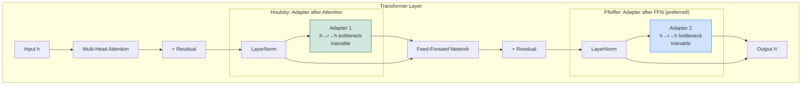

# 🔌 Adapter Layers

> [!abstract] TL;DR
> Adapter layers are small bottleneck feed-forward modules inserted directly into each transformer layer. The base model is frozen; only the adapter weights (~1-5% of total parameters) are trained. Houlsby adapters insert two adapters per layer; Pfeiffer adapters insert one. AdapterFusion combines multiple task adapters without interference. AdapterHub hosts hundreds of pretrained adapters for BERT-family models. Compared to LoRA, adapters add inference overhead but enable more modular composition.

---

## Intuition — Analogy First

Think of a **desktop computer's expansion slots**: the motherboard (the pretrained model) is expensive and works for everything. When you need a graphics card, sound card, or network card, you insert a **plugin card** into a dedicated slot. The motherboard doesn't change; you just add cards for specific capabilities.

Adapter layers are those plugin cards: small, specialised, inserted into fixed slots in the transformer architecture. Remove the card, the base model is intact. Insert a different card, and you have a different specialised model.

Unlike LoRA (which is a parallel bypass), adapters are inserted **serially** — data flows through the adapter on every forward pass.

---

## How It Works — Mechanics

### Adapter Architecture

A single adapter module is a **bottleneck feed-forward network**:

$$f_\text{adapter}(h) = W_\text{up} \cdot \sigma(W_\text{down} \cdot h + b_\text{down}) + b_\text{up}$$

Where:
- $W_\text{down} \in \mathbb{R}^{r \times d}$: down-projection (bottleneck)
- $W_\text{up} \in \mathbb{R}^{d \times r}$: up-projection
- $r \ll d$: bottleneck dimension (adapter rank)
- $\sigma$: non-linearity (usually ReLU or GELU)

The adapter applies a **residual connection** so the model starts from the identity function:

$$h' = h + f_\text{adapter}(h)$$

**Initialisation**: $W_\text{up}$ and $W_\text{down}$ are initialised such that $f_\text{adapter}(h) \approx 0$ at the start (near-zero init). This ensures the adapted model starts identical to the pretrained model.

### Houlsby vs Pfeiffer Placement

The two most common adapter placements within a transformer layer:

#### Houlsby (2019) — Two Adapters Per Layer

```
Input
  └─ Multi-Head Attention
  └─ Adapter 1 (after attention)    ← trainable
  └─ Add & LayerNorm
  └─ Feed-Forward Network (FFN)
  └─ Adapter 2 (after FFN)          ← trainable
  └─ Add & LayerNorm
Output
```

Two adapters per layer, inserted after attention and after FFN. More parameters, more capacity, more inference overhead.

#### Pfeiffer (2020) — One Adapter Per Layer

```
Input
  └─ Multi-Head Attention
  └─ Add & LayerNorm
  └─ Feed-Forward Network (FFN)
  └─ Adapter (after FFN only)       ← trainable
  └─ Add & LayerNorm
Output
```

One adapter per layer after the FFN. Fewer parameters, less overhead, similar performance to Houlsby on most tasks. **Pfeiffer placement is now preferred** for efficiency.

### AdapterFusion — Combining Multiple Adapters

**AdapterFusion** (Pfeiffer et al., 2021) enables **non-destructive combination** of multiple task adapters:

1. Train separate adapters for each source task (Task A, Task B, Task C)
2. Insert trainable "fusion" attention modules that learn to combine the outputs of multiple adapters
3. The fusion layer learns which adapter's representation to attend to for each input

This is particularly powerful for transfer learning: combine knowledge from many source tasks without multi-task training interference.

```
Input hidden state h
  ├─ Adapter_A(h) → key, value
  ├─ Adapter_B(h) → key, value
  ├─ Adapter_C(h) → key, value
  └─ Fusion: attend to [A, B, C] outputs → weighted combination
```

### Mermaid: Adapter Placement in Transformer Layer



---

## The Math

### Adapter Forward Pass (Pfeiffer)

For a transformer layer with hidden state $h \in \mathbb{R}^d$ after the FFN:

$$h' = h + W_\text{up} \cdot \text{GELU}(W_\text{down} \cdot \text{LayerNorm}(h))$$

Where $W_\text{down} \in \mathbb{R}^{r \times d}$, $W_\text{up} \in \mathbb{R}^{d \times r}$, and $r$ is the bottleneck size.

**Parameter count per adapter**: $2 \times d \times r$ (ignoring biases).

For BERT-base ($d=768, r=64, n_L=12$):
$$12 \times 2 \times 768 \times 64 = 1.18\text{M parameters (Pfeiffer)}$$
$$12 \times 2 \times 2 \times 768 \times 64 = 2.36\text{M parameters (Houlsby)}$$

BERT-base total: 110M parameters. Adapters: ~1-2% of total.

### AdapterFusion Attention

Given $K$ adapter outputs $\{h_k\}_{k=1}^K$ and the input query $q = h$:

$$\text{Fusion}(q, \{h_k\}) = \sum_{k=1}^K \alpha_k h_k$$

Where attention scores:

$$\alpha_k = \frac{\exp(q^\top W_q \cdot h_k^\top W_k / \sqrt{d_k})}{\sum_j \exp(q^\top W_q \cdot h_j^\top W_k / \sqrt{d_k})}$$

---

## Code Demo

### adapter-transformers Library

```python
# pip install adapter-transformers
# (fork of HuggingFace transformers with adapter support built in)

from transformers import AutoAdapterModel, AutoTokenizer, AdapterConfig, AdapterTrainer
from transformers import TrainingArguments
from datasets import load_dataset

# ── 1. Load model with adapter support ──
model_name = "bert-base-uncased"
model = AutoAdapterModel.from_pretrained(model_name)
tokenizer = AutoTokenizer.from_pretrained(model_name)

# ── 2. Add Pfeiffer adapter for sentiment analysis ──
pfeiffer_config = AdapterConfig.load(
    "pfeiffer",           # adapter architecture
    reduction_factor=16,  # bottleneck = hidden_dim / reduction_factor = 768/16 = 48
    non_linearity="relu",
)

model.add_adapter("sentiment", config=pfeiffer_config)
model.add_classification_head("sentiment", num_labels=2)  # binary classification

# Activate adapter and head — only adapter params will be trained
model.train_adapter("sentiment")

# Verify
total = sum(p.numel() for p in model.parameters())
trainable = sum(p.numel() for p in model.parameters() if p.requires_grad)
print(f"Trainable: {trainable:,} / {total:,} ({100*trainable/total:.1f}%)")
# Trainable: ~650K / 109M (0.6%)

# ── 3. Dataset ──
dataset = load_dataset("imdb")

def tokenize(example):
    return tokenizer(
        example["text"],
        truncation=True,
        max_length=512,
        padding="max_length",
    )

tokenized = dataset.map(tokenize, batched=True)
tokenized = tokenized.rename_column("label", "labels")

# ── 4. Train ──
training_args = TrainingArguments(
    output_dir="./adapter_sentiment",
    num_train_epochs=3,
    per_device_train_batch_size=32,
    per_device_eval_batch_size=64,
    learning_rate=1e-4,              # higher LR than full FT (small adapter)
    warmup_steps=100,
    eval_strategy="epoch",
    save_strategy="epoch",
    load_best_model_at_end=True,
    report_to="none",
)

trainer = AdapterTrainer(
    model=model,
    args=training_args,
    train_dataset=tokenized["train"],
    eval_dataset=tokenized["test"],
    tokenizer=tokenizer,
)
trainer.train()

# ── 5. Save and load adapter ──
model.save_adapter("./adapter_sentiment/final", "sentiment")  # saves only adapter weights
# Adapter directory size: ~2MB vs 440MB for full BERT-base

# Load pre-trained adapter
model2 = AutoAdapterModel.from_pretrained(model_name)
model2.load_adapter("./adapter_sentiment/final", config=pfeiffer_config)
model2.set_active_adapters("sentiment")


# ── AdapterFusion: combine multiple task adapters ──
from transformers import AdapterFusionConfig, Fuse

# Assume we have separately trained adapters: "ner", "pos", "qa"
model_fusion = AutoAdapterModel.from_pretrained(model_name)
model_fusion.load_adapter("AdapterHub/bert-base-uncased-pf-ner")
model_fusion.load_adapter("AdapterHub/bert-base-uncased-pf-conll2003_pos")

# Add fusion layer
fusion_config = AdapterFusionConfig.load("dynamic")
model_fusion.add_adapter_fusion(
    Fuse("ner", "pos"),    # fuse these two adapters
    config=fusion_config,
)
model_fusion.train_adapter_fusion(Fuse("ner", "pos"))

# Add target task adapter + head
model_fusion.add_adapter("target_task")
model_fusion.add_classification_head("target_task", num_labels=3)
model_fusion.train_adapter("target_task")
```

### Loading from AdapterHub

```python
# AdapterHub provides pre-trained adapters for BERT, RoBERTa, etc.
# Browse at: adapterhub.ml

model = AutoAdapterModel.from_pretrained("bert-base-uncased")

# Load pre-trained NER adapter directly from AdapterHub
model.load_adapter(
    "AdapterHub/bert-base-uncased-pf-conll2003",  # hub identifier
    source="hf",                                   # HuggingFace Hub
    set_active=True,
)
model.add_classification_head("ner", num_labels=9)  # CoNLL NER labels

# Inference
from transformers import pipeline
ner_pipeline = pipeline("ner", model=model, tokenizer=tokenizer)
print(ner_pipeline("Apple is a tech company based in Cupertino."))
```

---

## Real-World Example

**AdapterHub (Pfeiffer et al., 2020):** A repository of ~300+ pre-trained adapters for BERT, RoBERTa, XLM-R, and other encoder models, covering NER, POS tagging, sentiment, NLI, and more. The concept: train once, share the small adapter file (~2MB), let anyone plug it into the shared base model. Analogous to the Python package ecosystem but for NLP task adaptations.

**Multi-lingual adapters (MAD-X framework):** Language adapters + task adapters combined for zero-shot cross-lingual transfer. A language adapter for Swahili + an NER adapter trained on English = zero-shot Swahili NER, without any Swahili NER training data.

---

## Trade-offs

| Factor | Adapters | LoRA |
|---|---|---|
| Inference overhead | Yes (serial computation) | No (merge into weights) |
| Composability | High (AdapterFusion, stacking) | Limited |
| Parameter efficiency | ~1-3% | ~0.1-1% |
| Architecture change | Yes (insert new modules) | No (modify existing matmuls) |
| Multi-task composition | Native (AdapterFusion) | Requires re-training |
| Ecosystem maturity | High (AdapterHub) | High (HF PEFT) |
| Standard practice (2024) | Less common | Most common |

---

## When to Use vs Avoid

**Use adapters when:**
- You need **modular composition** — combine multiple task adapters at inference time without re-training
- Building a cross-lingual or multi-task NLP system (MAD-X, AdapterFusion)
- Working with BERT-family encoder models where AdapterHub has pre-trained adapters
- Inference efficiency is not the primary concern

**Use LoRA instead when:**
- Inference speed is critical (no adapter overhead after merging)
- Working with decoder LLMs (GPT-style) — LoRA ecosystem is more mature there
- Standard fine-tuning without multi-task composition needs

**Avoid adapters when:**
- You need zero inference overhead (latency-critical serving)
- Working with very small models where the serial overhead is proportionally large

---

## Common Pitfalls

1. **Using adapter-transformers library for LoRA** — adapter-transformers is optimised for serial adapter layers; for LoRA, use HuggingFace PEFT. They coexist but have different APIs.
2. **Forgetting to call `model.train_adapter()`** — this freezes the base model and activates only adapter parameters. Without it, you'll accidentally train or freeze the wrong parameters.
3. **Setting reduction_factor too high** — reduction_factor=64 gives a bottleneck of 768/64=12 dimensions for BERT. This is extremely small and often underperforms. Use reduction_factor=8 to 32.
4. **Serialising the full model instead of adapter** — `model.save_adapter()` saves only the adapter (~2MB). Using `model.save_pretrained()` saves the full model + adapter. Always use the adapter-specific save method.
5. **Not initialising adapters near identity** — adapters must be initialised so $f_\text{adapter}(h) \approx 0$. This is handled automatically by the library, but custom implementations often miss it, causing unstable training start.

---

## Related Concepts

- [[_MOC_NLP|↑ Section MOC]]

- [[LoRA]] — the dominant PEFT alternative; parallel low-rank bypass instead of serial bottleneck; no inference overhead
- [[PEFT]] — the broader family of parameter-efficient methods and the HuggingFace library
- [[BERT]] — the most common base model architecture where adapters were originally developed and are most mature
- [[Full_Fine_Tuning]] — the baseline that adapters efficiently approximate

---

## Review Questions

1. Compare adapter layers and LoRA in terms of their computational graph during inference. Why does LoRA have zero inference overhead after merging, while adapter layers always add overhead?

2. Explain AdapterFusion: if you have adapters trained on NER, sentiment, and POS tagging tasks, how does the fusion layer decide which adapter's output to use for a given input token? What is trained during the fusion stage?

3. The MAD-X framework uses "language adapters" and "task adapters" in combination for zero-shot cross-lingual transfer. Describe how this stacking works and why it achieves zero-shot transfer to unseen languages.

---

## Sources

- Houlsby et al. (2019). *Parameter-Efficient Transfer Learning for NLP*. [arXiv:1902.00751](https://arxiv.org/abs/1902.00751)
- Pfeiffer et al. (2020). *AdapterFusion: Non-Destructive Task Composition for Transfer Learning*. [arXiv:2005.00247](https://arxiv.org/abs/2005.00247)
- Pfeiffer et al. (2020). *AdapterHub: A Framework for Adapting Transformers*. [arXiv:2007.07779](https://arxiv.org/abs/2007.07779)
- Pfeiffer et al. (2020). *MAD-X: An Adapter-Based Framework for Multi-Task Cross-Lingual Transfer*. [arXiv:2005.00052](https://arxiv.org/abs/2005.00052)
- AdapterHub: [adapterhub.ml](https://adapterhub.ml)

#adapters #peft #fine-tuning #bert #nlp #adapterfusion #adapterhub #modular-nlp
