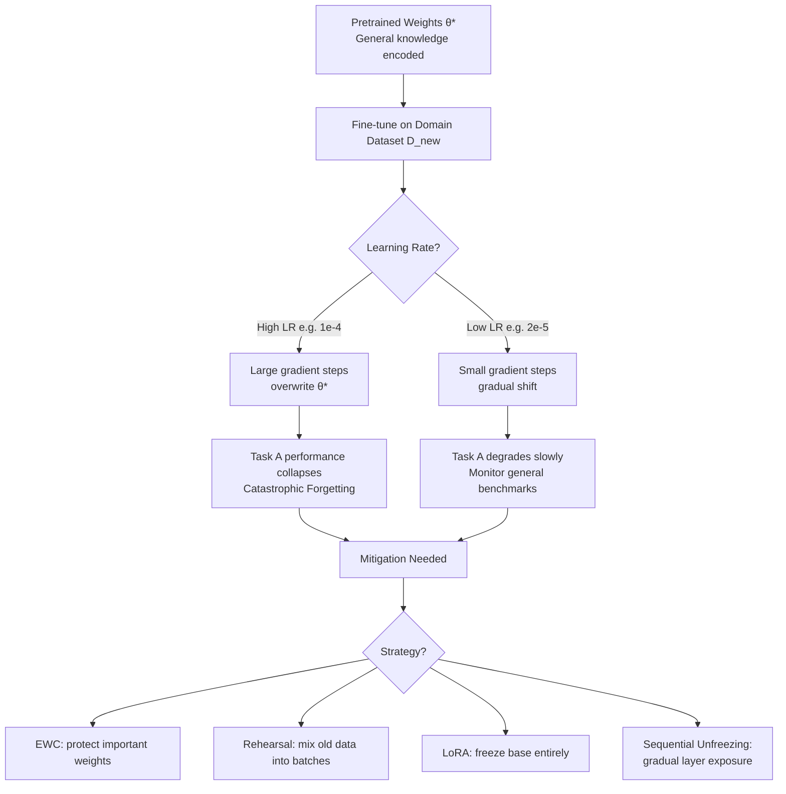

# Catastrophic Forgetting

> [!abstract] TL;DR
> Catastrophic forgetting is the tendency of a neural network to abruptly lose previously learned knowledge when trained on new tasks — because gradient updates for the new task overwrite the weights that encoded old knowledge. It is the central challenge of continual learning and a key risk in full fine-tuning. Mitigation strategies include Elastic Weight Consolidation (EWC), rehearsal mixing, sequential unfreezing, and — most practically — parameter-efficient methods like LoRA that freeze the base model entirely.

---

## Intuition — Analogy First

**Analogy:** Imagine a doctor who spent years mastering cardiology. They go back to school to specialize in oncology. If the oncology training is too intensive and isolated — studying nothing but cancer biology for 12 hours a day — they may gradually lose their cardiology expertise. Their mental "circuits" for reading ECGs get repurposed for interpreting tumor markers. When a cardiac patient arrives, they struggle.

This is catastrophic forgetting. The brain (neural network) has a limited capacity. When new learning strongly updates the same pathways used for old knowledge, the old knowledge is overwritten — sometimes suddenly ("catastrophically"), not gradually.

In fine-tuning: the "cardiology training" is pretraining on diverse text. The "oncology specialization" is fine-tuning on a narrow domain dataset. Too aggressive fine-tuning rewrites the weights that encode general reasoning, language understanding, and factual knowledge.

---

## How It Works

### The Mechanism: Gradient Interference

Neural network weights are **shared representations** across all tasks the model has learned. When you minimize loss on task B:

1. Gradients flow through weights that were also important for task A
2. The optimizer moves those weights in a direction that reduces task B loss
3. This direction is typically *not* aligned with reducing task A loss
4. Task A performance degrades — sometimes sharply after just a few gradient steps

**Why it's "catastrophic":** Unlike human forgetting (gradual, partial), neural network forgetting can be sudden. A model at 95% accuracy on task A can drop to 30% after a single epoch of fine-tuning on task B at an aggressive learning rate.

### When It Occurs in LLM Fine-Tuning

| Scenario | Risk Level | Reason |
|----------|-----------|--------|
| Full fine-tuning at high LR | Very high | All weights updated aggressively |
| Full fine-tuning at low LR | Moderate | Weights drift slowly; early stopping helps |
| Fine-tuning on tiny dataset (<1K) | High | Model overfits, memorizes instead of adapts |
| LoRA fine-tuning | Very low | Base weights frozen; only adapters updated |
| Catastrophic forgetting in RLHF | Moderate | PPO updates push policy far from SFT reference |

### Architecture of Forgetting



---

## Mitigation Strategies

### 1. Low Learning Rate (Primary Mitigation)

The simplest and most effective single intervention. The weight update magnitude $\|\Delta\theta\|$ is directly proportional to the learning rate:

$$\theta_{t+1} = \theta_t - \eta \nabla_\theta \mathcal{L}_\text{new}(\theta_t)$$

Keeping $\eta \leq 2 \times 10^{-5}$ for full fine-tuning of 7B+ models limits how far any weight can move per step, preserving pretrained representations.

### 2. Elastic Weight Consolidation (EWC)

EWC adds a quadratic penalty to the loss that **protects weights important for previous tasks**:

$$\mathcal{L}_\text{EWC}(\theta) = \mathcal{L}_\text{new}(\theta) + \frac{\lambda}{2}\sum_i F_i(\theta_i - \theta_i^*)^2$$

Where:
- $\theta_i^*$ = pretrained (anchor) parameter values
- $F_i$ = **Fisher information** of parameter $i$ with respect to the original task
- $\lambda$ = regularization strength (higher $\lambda$ = more protection for old tasks)

**Fisher information** measures how much a parameter matters for the original task:
$$F_i = \mathbb{E}_{x \sim \mathcal{D}_\text{old}}\!\left[\left(\frac{\partial}{\partial\theta_i}\log p_\theta(y|x)\right)^2\right]$$

High $F_i$ → parameter is important for old task → penalize changes more.

**Practical limitation:** Computing the full Fisher matrix for a 7B parameter model is intractable. Common approximation: diagonal Fisher (treat each parameter independently). Still expensive at scale; rarely used for LLMs — LoRA is preferred.

### 3. Rehearsal (Experience Replay)

Mix a small fraction of pretraining or general data into every fine-tuning batch:

$$\mathcal{L}_\text{rehearsal}(\theta) = \mathcal{L}_\text{new}(\theta) + \alpha \cdot \mathcal{L}_\text{old}(\theta)$$

Typically $\alpha = 0.05$–$0.10$ (5–10% general data per batch). The model continues to see examples from the original distribution, preventing drift. Used by Meta in LLaMA continual pretraining.

### 4. Parameter-Efficient Fine-Tuning (LoRA)

The cleanest solution: **freeze all base model weights** and only train small adapter matrices:

$$W' = W_\text{frozen} + \Delta W = W_\text{frozen} + BA$$

where $B \in \mathbb{R}^{d \times r}$, $A \in \mathbb{R}^{r \times k}$, $r \ll d$.

Since $W_\text{frozen}$ never changes, the pretrained knowledge is perfectly preserved — catastrophic forgetting becomes mathematically impossible for those weights. Forgetting risk reduces to only the small fraction of parameters in the adapter ($\sim 0.1$–$1\%$).

### 5. Sequential Unfreezing

Unfreeze layers from top (task-specific) to bottom (general representations) over the course of training. Lower layers encode fundamental linguistic and factual knowledge; they should be the last to be updated and only by that point should the model be converging rather than making large updates.

---

## The Math

### Formalizing the Catastrophic Forgetting Problem

Let task A have loss $\mathcal{L}_A(\theta)$ and task B have loss $\mathcal{L}_B(\theta)$.

After pretraining: $\theta^* = \arg\min \mathcal{L}_A(\theta)$

After fine-tuning on B: $\theta^\dagger = \arg\min \mathcal{L}_B(\theta)$

**Catastrophic forgetting occurs when:**
$$\mathcal{L}_A(\theta^\dagger) \gg \mathcal{L}_A(\theta^*)$$

**The plasticity-stability dilemma:** The optimizer cannot simultaneously minimize both $\mathcal{L}_A$ and $\mathcal{L}_B$ unless the optimal parameters for both tasks overlap significantly in weight space.

**Why LoRA avoids it:** LoRA constrains $\theta = \theta^* + \Delta\theta$ where $\Delta\theta$ lives in a low-rank subspace. The component $\theta^*$ is fixed, so $\mathcal{L}_A(\theta) = \mathcal{L}_A(\theta^* + \Delta\theta) \approx \mathcal{L}_A(\theta^*)$ as long as $\Delta\theta$ is small — which it typically is at low LoRA rank.

---

## Code Demo

```python
import torch
import torch.nn as nn
import torch.nn.functional as F
from torch.utils.data import DataLoader, TensorDataset
from copy import deepcopy

# ── EWC Implementation ───────────────────────────────────────────────────────
class EWC:
    """Elastic Weight Consolidation for preventing catastrophic forgetting."""

    def __init__(self, model: nn.Module, dataset: DataLoader, device: str = "cpu"):
        self.model = model
        self.device = device
        # Store optimal parameters θ*
        self.params = {n: p.clone().detach() for n, p in model.named_parameters() if p.requires_grad}
        # Compute diagonal Fisher information matrix
        self.fisher = self._compute_fisher(dataset)

    def _compute_fisher(self, dataset: DataLoader) -> dict:
        """Compute diagonal Fisher information over the original dataset."""
        fisher = {n: torch.zeros_like(p) for n, p in self.model.named_parameters() if p.requires_grad}
        self.model.eval()
        n_samples = 0

        for inputs, targets in dataset:
            inputs, targets = inputs.to(self.device), targets.to(self.device)
            self.model.zero_grad()
            outputs = self.model(inputs)
            loss = F.cross_entropy(outputs, targets)
            loss.backward()

            for name, param in self.model.named_parameters():
                if param.requires_grad and param.grad is not None:
                    fisher[name] += param.grad.data.clone() ** 2
            n_samples += inputs.size(0)

        # Normalize by number of samples
        for name in fisher:
            fisher[name] /= n_samples
        return fisher

    def penalty(self, model: nn.Module, lambda_ewc: float = 1000.0) -> torch.Tensor:
        """EWC regularization loss term."""
        loss = torch.tensor(0.0, device=self.device)
        for name, param in model.named_parameters():
            if name in self.fisher:
                # Penalize deviation from θ* weighted by Fisher information
                loss += (self.fisher[name] * (param - self.params[name]) ** 2).sum()
        return (lambda_ewc / 2) * loss


# ── Rehearsal Mixing ─────────────────────────────────────────────────────────
def training_step_with_rehearsal(
    model: nn.Module,
    new_batch: tuple,
    general_batch: tuple,
    optimizer: torch.optim.Optimizer,
    rehearsal_fraction: float = 0.1,
):
    """Mix general data into fine-tuning batches to prevent forgetting."""
    x_new, y_new = new_batch
    x_gen, y_gen = general_batch

    # Combine: 90% new domain + 10% general (rehearsal)
    x = torch.cat([x_new, x_gen[:max(1, int(len(x_new) * rehearsal_fraction))]])
    y = torch.cat([y_new, y_gen[:max(1, int(len(y_new) * rehearsal_fraction))]])

    optimizer.zero_grad()
    loss = F.cross_entropy(model(x), y)
    loss.backward()
    optimizer.step()
    return loss.item()


# ── Monitoring forgetting during fine-tuning ─────────────────────────────────
def evaluate_forgetting(
    model: nn.Module,
    general_eval_loader: DataLoader,
    baseline_loss: float,
) -> dict:
    """
    Measure how much the model has forgotten by comparing
    current general-task loss to baseline (pretrained) loss.
    """
    model.eval()
    total_loss = 0.0
    n_batches = 0
    with torch.no_grad():
        for x, y in general_eval_loader:
            total_loss += F.cross_entropy(model(x), y).item()
            n_batches += 1

    current_loss = total_loss / n_batches
    forgetting_delta = current_loss - baseline_loss
    forgetting_pct = (forgetting_delta / baseline_loss) * 100

    return {
        "baseline_loss": baseline_loss,
        "current_loss": current_loss,
        "forgetting_delta": forgetting_delta,
        "forgetting_pct": forgetting_pct,
        "status": "OK" if forgetting_pct < 5 else "WARNING: Forgetting detected",
    }


# ── Sequential Unfreezing for Transformers ───────────────────────────────────
def progressive_unfreeze(model: nn.Module, epoch: int, total_layers: int = 32) -> None:
    """
    Unfreeze transformer layers progressively.
    Epoch 0: only top 4 layers + head trainable.
    Each epoch: unfreeze 4 more layers from the top down.
    """
    layers_to_unfreeze_from = max(0, total_layers - 4 - epoch * 4)

    for name, param in model.named_parameters():
        # Detect layer number from parameter name (works for LLaMA-style models)
        import re
        match = re.search(r"layers\.(\d+)\.", name)
        if match:
            layer_num = int(match.group(1))
            param.requires_grad = (layer_num >= layers_to_unfreeze_from)
        else:
            # LM head and embeddings: always trainable
            param.requires_grad = True

    trainable = sum(p.numel() for p in model.parameters() if p.requires_grad)
    total = sum(p.numel() for p in model.parameters())
    print(f"Epoch {epoch}: {trainable:,}/{total:,} params trainable "
          f"({100*trainable/total:.1f}%)")
```

---

## Real-World Example

> **Llama 3 Continual Pretraining (Meta, 2024):** When Meta trained Llama 3 on new data after the base Llama 2 training, they used a rehearsal-based approach: approximately 10% of each training batch consisted of data from the original Llama 2 pretraining corpus. This prevented forgetting of skills learned in the first training run while the model absorbed new knowledge. They tracked forgetting by monitoring MMLU and other general-benchmark scores throughout training — if scores dropped more than 1-2%, the rehearsal fraction was increased. The alternative (full retraining from scratch) would have cost tens of millions of dollars.

---

## Trade-offs

| Mitigation Strategy | Forgetting Prevention | Compute Cost | Task Performance | Practical for LLMs? |
|--------------------|----------------------|-------------|-----------------|---------------------|
| Low learning rate | Good | None | Slightly lower | Yes |
| EWC | Strong | High (Fisher computation) | Good | Rarely (too expensive at scale) |
| Rehearsal mixing | Strong | Low (5-10% extra data) | Good | Yes |
| LoRA / PEFT | Perfect (base frozen) | Minimal | 90-95% of FFT | Best default |
| Sequential unfreezing | Moderate | None | Moderate | Yes, for full FT |

---

## When to Use vs Avoid

**Use full fine-tuning with forgetting mitigation when:**
- Domain shift is too fundamental for LoRA to capture (e.g., genomics code notation)
- You have > 1M domain examples where the extra performance from FFT is warranted
- You can afford to monitor general benchmarks throughout training

**Prefer LoRA / PEFT when:**
- You want to eliminate forgetting risk entirely
- Data volume is modest (< 100K examples)
- You need to serve multiple fine-tuned variants from one base model

**When forgetting is acceptable:**
- The fine-tuned model is deployed only for the new task and general capability is not needed
- You have a separate "general" model and the fine-tuned model is task-specific

---

## Common Pitfalls

- **Tracking only domain loss** — a steadily decreasing fine-tuning loss looks great but hides forgetting. Always co-monitor a general benchmark (MMLU, Winogrande, or a held-out general set).
- **Forgetting in RLHF** — PPO-based RLHF causes forgetting too. The KL penalty acts as the regularizer (analogous to EWC), but if $\beta$ is too small, the model forgets factual knowledge even while improving in helpfulness.
- **EWC on modern LLMs** — computing diagonal Fisher for a 7B model requires a full backward pass over the original dataset with parameter-level accumulation — practically infeasible at scale. Use rehearsal or LoRA instead.
- **Assuming LoRA eliminates all forgetting** — LoRA protects the base weights, but the trained adapter introduces representations that can interfere with each other in multi-task adapter settings. Use task-specific adapters that are swapped, not merged, when serving multiple tasks.

---

## Related Concepts

- [[_MOC_NLP|↑ Section MOC]]

- [[Full_Fine_Tuning]] — the fine-tuning regime where catastrophic forgetting risk is highest; this note is referenced from there
- [[LoRA]] — the primary practical solution: freeze base weights, train only low-rank adapters
- [[PEFT]] — the broader category of parameter-efficient methods that all avoid catastrophic forgetting by design
- [[Instruction_Tuning]] — SFT that must be done carefully to avoid forgetting general capabilities
- [[Regularization]] — EWC is a regularization technique; same principle as L2 but weighted by parameter importance

---

## Review Questions

1. Explain why catastrophic forgetting is "catastrophic" in neural networks but only "gradual" in human memory. What property of gradient descent causes sudden forgetting rather than graceful degradation?

2. You are fine-tuning a 13B LLM on a medical QA dataset (500K examples) using full fine-tuning. Describe three concrete measures you would take to monitor and mitigate catastrophic forgetting during training.

3. LoRA is described as making catastrophic forgetting "mathematically impossible" for the base weights. Under what conditions could catastrophic forgetting still occur in a LoRA fine-tuning setup?

---

## Sources

- McCloskey, M., & Cohen, N. J. (1989). *Catastrophic interference in connectionist networks: The sequential learning problem*. Psychology of Learning and Motivation, 24, 109–165.
- Kirkpatrick, J., et al. (2017). *Overcoming Catastrophic Forgetting in Neural Networks* (EWC). PNAS. [doi:10.1073/pnas.1611835114](https://doi.org/10.1073/pnas.1611835114)
- Hu, E. J., et al. (2021). *LoRA: Low-Rank Adaptation of Large Language Models*. [arXiv:2106.09685](https://arxiv.org/abs/2106.09685)
- Meta AI (2024). *LLaMA 3 Technical Report*. [arXiv:2407.21783](https://arxiv.org/abs/2407.21783)

#fine-tuning #catastrophic-forgetting #continual-learning #llm #ewc #rehearsal #lora
