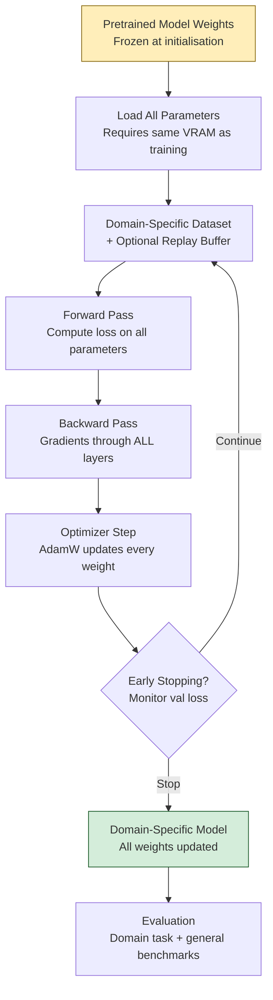

# 🔄 Full Fine-Tuning

> [!abstract] TL;DR
> Full fine-tuning updates every parameter of a pretrained model on a new dataset. It achieves the strongest domain adaptation when you have sufficient data and compute, but risks catastrophic forgetting at high learning rates and requires the same GPU RAM as training from scratch. For most practical use cases, parameter-efficient methods (LoRA, QLoRA) achieve 90-95% of full fine-tuning performance at a fraction of the cost.

---

## Intuition — Analogy First

Imagine hiring a **PhD-level generalist** who has read everything. You need them to become an expert in a highly specialised subfield — say, nuclear reactor safety analysis. You send them back to school for 6 months, and they study nothing but reactor physics and safety protocols. They keep all their language, reasoning, and general knowledge, but their entire expertise is now re-orientated toward this domain.

That's full fine-tuning: the pretrained model is your PhD generalist. Fine-tuning is the specialist retraining. They emerge with all prior knowledge intact (if you're careful) but optimised for the new domain. The risk: if you "train too hard," they might forget their general skills — catastrophic forgetting.

---

## How It Works — Mechanics

### What Changes During Full Fine-Tuning

Every weight matrix across all layers is updated:
- Token embedding table
- All attention weight matrices (Q, K, V, O projections) in all layers
- All feed-forward network (FFN) weights in all layers
- Layer normalisation parameters
- Output (LM head) projection

This contrasts with PEFT (LoRA, etc.) where 95-99% of parameters are frozen.

### Learning Rate: Much Lower Than Pretraining

| Phase | Typical LR | Reason |
|---|---|---|
| Pretraining | `3e-4` to `1e-3` | Learning from scratch |
| Full Fine-Tuning | `1e-5` to `5e-5` | Preserving pretrained representations |
| LoRA / PEFT | `1e-4` to `3e-4` | Only small adapter weights change |

Too high an LR during fine-tuning causes **catastrophic forgetting** — the model overwrites pretrained representations with the fine-tuning data distribution, losing general capabilities.

### Catastrophic Forgetting

When fine-tuning on a narrow domain dataset, the model's parameters shift to fit that distribution. Performance on original tasks (general reasoning, language understanding) degrades. Mitigation strategies:

1. **Low learning rate** — primary mitigation
2. **Early stopping** — monitor validation loss on a general held-out set
3. **Replay** — mix general pretraining data into the fine-tuning batch (5-10% of batch)
4. **Elastic Weight Consolidation (EWC)** — penalise changes to weights that were important for previous tasks (Fisher information regulariser)
5. **Sequential unfreezing** — start with only the top layers trainable, gradually unfreeze lower layers

### Sequential Unfreezing

Unfreeze layers from top to bottom during training:

```
Epoch 1:  Only train layers 30-32 (top layers) + LM head
Epoch 2:  Unfreeze layers 24-32
Epoch 3:  Unfreeze all 32 layers
```

This prevents early, destabilising gradient updates from propagating too deep into the pretrained representations.

### When Full Fine-Tuning Is Justified

- Large domain-specific dataset (> 1M examples)
- Domain language differs substantially from pretraining data (genomics, legal, medical codes)
- Downstream task requires deep representation change (not just surface format)
- Compute and GPU memory are not constraints
- Need maximum quality, not efficiency

### Mermaid Diagram



---

## The Math

### Full Fine-Tuning Objective

Standard cross-entropy loss over the domain dataset $\mathcal{D}_\text{domain}$, with all parameters $\theta$ trainable:

$$\mathcal{L}_\text{FT}(\theta) = -\mathbb{E}_{(x,y) \sim \mathcal{D}_\text{domain}} \left[ \sum_{t} \log P_\theta(y_t \mid y_{<t}, x) \right]$$

### Catastrophic Forgetting Formalisation

Let $\mathcal{D}_\text{orig}$ be the original task distribution. Catastrophic forgetting occurs when:

$$\mathbb{E}_{(x,y) \sim \mathcal{D}_\text{orig}} [\mathcal{L}(\theta_\text{FT})] \gg \mathbb{E}_{(x,y) \sim \mathcal{D}_\text{orig}} [\mathcal{L}(\theta_\text{pretrained})]$$

### Elastic Weight Consolidation (EWC) Regulariser

$$\mathcal{L}_\text{EWC}(\theta) = \mathcal{L}_\text{FT}(\theta) + \frac{\lambda}{2} \sum_i F_i (\theta_i - \theta_i^*)^2$$

Where:
- $F_i$ = Fisher information of parameter $i$ (importance for original task)
- $\theta_i^*$ = pretrained parameter values
- $\lambda$ = regularisation strength

High-importance parameters (high $F_i$) are penalised more for changing — they're protected.

### Memory Requirements

Full fine-tuning in bf16 with Adam optimiser:

| Component | Memory |
|---|---|
| Model parameters (bf16) | 2 bytes/param |
| Gradients (fp32) | 4 bytes/param |
| Adam moment 1 (fp32) | 4 bytes/param |
| Adam moment 2 (fp32) | 4 bytes/param |
| **Total** | **~14 bytes/param** |

For a 7B parameter model: 7B × 14 bytes ≈ **98GB** — requires multiple A100 80GB GPUs or ZeRO-3 distributed training.

---

## Code Demo

### HuggingFace Trainer — Full Fine-Tuning

```python
from transformers import (
    AutoModelForCausalLM,
    AutoTokenizer,
    TrainingArguments,
    Trainer,
    DataCollatorForLanguageModeling,
    EarlyStoppingCallback,
)
from datasets import load_dataset
import torch

# ── 1. Load model for full fine-tuning ──
model_name = "meta-llama/Llama-3.2-3B"  # Use smaller model for full FT

model = AutoModelForCausalLM.from_pretrained(
    model_name,
    torch_dtype=torch.bfloat16,
    device_map="auto",
    # Note: no quantization — full fine-tuning needs full precision gradients
)
tokenizer = AutoTokenizer.from_pretrained(model_name)
tokenizer.pad_token = tokenizer.eos_token

# Verify ALL parameters are trainable
total_params = sum(p.numel() for p in model.parameters())
trainable_params = sum(p.numel() for p in model.parameters() if p.requires_grad)
print(f"Trainable parameters: {trainable_params:,} / {total_params:,} ({100 * trainable_params / total_params:.1f}%)")
# Output: 100% trainable

# ── 2. Domain-specific dataset ──
# Example: medical question answering (PubMedQA-style)
dataset = load_dataset("pubmed_qa", "pqa_labeled", split="train")

def tokenize_medical(example):
    """Format medical QA for causal LM fine-tuning."""
    context = " ".join(example["context"]["contexts"][:3])  # top 3 passages
    question = example["question"]
    answer = example["long_answer"]

    full_text = (
        f"Context: {context}\n\n"
        f"Question: {question}\n\n"
        f"Answer: {answer}{tokenizer.eos_token}"
    )
    return tokenizer(
        full_text,
        truncation=True,
        max_length=1024,
        padding="max_length",
    )

tokenized_dataset = dataset.map(tokenize_medical, remove_columns=dataset.column_names)
train_test = tokenized_dataset.train_test_split(test_size=0.1, seed=42)

# ── 3. Sequential unfreezing callback ──
from transformers import TrainerCallback

class SequentialUnfreeze(TrainerCallback):
    """Gradually unfreeze transformer layers during training."""
    def __init__(self, num_layers: int = 28, unfreeze_per_epoch: int = 4):
        self.num_layers = num_layers
        self.unfreeze_per_epoch = unfreeze_per_epoch
        # Start: freeze all except top 4 layers + head
        self._set_frozen_layers(model, freeze_up_to=num_layers - 4)

    def _set_frozen_layers(self, model, freeze_up_to: int):
        for name, param in model.named_parameters():
            layer_num = self._extract_layer_num(name)
            if layer_num is not None and layer_num < freeze_up_to:
                param.requires_grad = False
            else:
                param.requires_grad = True

    def _extract_layer_num(self, name: str):
        import re
        match = re.search(r"layers\.(\d+)\.", name)
        return int(match.group(1)) if match else None

    def on_epoch_begin(self, args, state, control, **kwargs):
        # Unfreeze more layers each epoch
        layers_to_keep_frozen = max(
            0, self.num_layers - 4 - state.epoch * self.unfreeze_per_epoch
        )
        self._set_frozen_layers(model, freeze_up_to=int(layers_to_keep_frozen))
        trainable = sum(p.numel() for p in model.parameters() if p.requires_grad)
        print(f"\nEpoch {state.epoch}: {trainable:,} params trainable")


# ── 4. Training arguments ──
training_args = TrainingArguments(
    output_dir="./full_ft_checkpoints",
    num_train_epochs=3,
    per_device_train_batch_size=2,
    per_device_eval_batch_size=4,
    gradient_accumulation_steps=8,         # effective batch = 16
    learning_rate=2e-5,                    # MUCH lower than pretraining
    lr_scheduler_type="cosine",
    warmup_ratio=0.05,
    weight_decay=0.01,
    bf16=True,
    gradient_checkpointing=True,           # trade compute for memory
    logging_steps=50,
    eval_strategy="epoch",
    save_strategy="epoch",
    load_best_model_at_end=True,
    metric_for_best_model="eval_loss",
    report_to="wandb",
    # Memory optimisations
    optim="adamw_torch_fused",             # faster fused AdamW
    dataloader_num_workers=4,
    remove_unused_columns=False,
)

# ── 5. Optional: Mix in general data to prevent catastrophic forgetting ──
general_dataset = load_dataset("HuggingFaceFW/fineweb", "sample-10BT",
                               streaming=True, split="train").take(5000)
# In practice, mix 5-10% general data into each batch via a custom data collator

# ── 6. Train ──
trainer = Trainer(
    model=model,
    args=training_args,
    train_dataset=train_test["train"],
    eval_dataset=train_test["test"],
    data_collator=DataCollatorForLanguageModeling(tokenizer, mlm=False),
    callbacks=[
        EarlyStoppingCallback(early_stopping_patience=2),
        # SequentialUnfreeze(num_layers=28),  # uncomment to enable
    ],
)

trainer.train()
trainer.save_model("./full_ft_final")
```

---

## Real-World Example

**BioGPT (Microsoft, 2022):** GPT-2-style model fully fine-tuned on 15M PubMed abstracts. Full fine-tuning was justified because biomedical language is highly domain-specific (SMILES notation, gene names, clinical terminology) and the team had 15M documents — far more than what LoRA needs.

**CodeBERT (Microsoft, 2020):** BERT-style model fully fine-tuned on a bimodal corpus of code + natural language from GitHub. Full fine-tuning was necessary to deeply encode code semantics into all layers — surface adapter layers (LoRA) would not capture the representation shift needed.

**Domain-Specific LLMs (2023-2024):** MedPaLM-2 (Google), ClinicalBERT, LegalBERT — all examples of full fine-tuning on massive domain corpora where the domain shift is too deep for PEFT methods alone.

---

## Trade-offs

| Factor | Full Fine-Tuning | LoRA / PEFT |
|---|---|---|
| Domain adaptation quality | Highest | 90-95% of FFT |
| GPU memory | ~14 bytes/param | ~4 bytes/param (frozen base) |
| Training time | Slow (all gradients) | Fast (small adapter) |
| Risk of forgetting | High (mitigated by low LR) | Low (base frozen) |
| Deployment | Single model per task | Base model + swap adapters |
| Data requirement | 100K–10M+ examples | 1K–100K examples |
| Multi-task serving | Expensive (separate model per task) | Cheap (one base, many adapters) |

---

## When to Use vs Avoid

**Use full fine-tuning when:**
- Domain data volume > 1M examples
- Domain language or reasoning differs fundamentally from pretraining data
- Maximum task performance required (not cost-sensitive)
- You need to modify the model's fundamental representations, not just surface outputs

**Avoid full fine-tuning when:**
- Data is limited (< 100K examples) — LoRA will generalise better
- Multi-task serving (serving one base + multiple LoRA adapters is 10x cheaper)
- Single GPU available — use QLoRA instead
- Rapid iteration required — LoRA trains 5-10x faster

---

## Common Pitfalls

1. **Learning rate too high** — `LR > 1e-4` for a 7B+ model almost always causes catastrophic forgetting. Start at `2e-5`.
2. **Not monitoring general benchmarks** — tracking only domain loss misses forgetting. Evaluate on MMLU or Winogrande throughout training to catch regression.
3. **No gradient checkpointing** — without it, a 7B model at batch size 2 requires ~96GB VRAM. Enable `gradient_checkpointing=True`.
4. **Training too many epochs on small datasets** — 3+ epochs on <10K examples causes severe overfitting. Use early stopping.
5. **Forgetting to set `pad_token`** — LLaMA-style models have no pad token by default. Set `tokenizer.pad_token = tokenizer.eos_token` or use right-padding.

---

## Related Concepts

- [[_MOC_NLP|↑ Section MOC]]

- [[LoRA]] — parameter-efficient alternative; trains small rank-decomposition adapters instead of all weights
- [[QLoRA]] — LoRA on 4-bit quantized model; enables fine-tuning 70B models on consumer hardware
- [[Instruction_Tuning]] — the SFT variant of fine-tuning; can be done with full FT or PEFT
- [[PEFT]] — the HuggingFace library and broader category of parameter-efficient methods
- [[Catastrophic_Forgetting]] — the core risk in full fine-tuning; mitigation techniques

---

## Review Questions

1. A 13B parameter model requires approximately how many GB of GPU VRAM to fully fine-tune with AdamW in mixed precision (bf16 parameters + fp32 optimizer states)? Show your calculation.

2. Explain the mechanism behind sequential unfreezing. Why does unfreezing top layers first and bottom layers last reduce catastrophic forgetting compared to unfreezing all layers simultaneously from the start?

3. You have a dataset of 500K biomedical papers and want maximum performance on biomedical NLP tasks. You have access to 4× A100 80GB GPUs. Compare full fine-tuning vs QLoRA: which would you choose, and what additional techniques would you apply?

---

## Sources

- Luo et al. (2022). *BioGPT: Generative Pre-trained Transformer for Biomedical Text Generation and Mining*. [arXiv:2210.10341](https://arxiv.org/abs/2210.10341)
- Feng et al. (2020). *CodeBERT: A Pre-Trained Model for Programming and Natural Language*. [arXiv:2002.08155](https://arxiv.org/abs/2002.08155)
- Kirkpatrick et al. (2017). *Overcoming Catastrophic Forgetting in Neural Networks* (EWC). [PNAS](https://doi.org/10.1073/pnas.1611835114)
- HuggingFace Trainer Documentation: [huggingface.co/docs/transformers/trainer](https://huggingface.co/docs/transformers/main/en/trainer)

#fine-tuning #full-fine-tuning #llm #nlp #catastrophic-forgetting #huggingface
