# 🔌 PEFT — Parameter-Efficient Fine-Tuning

> [!abstract] TL;DR
> PEFT is the family of techniques that fine-tune only a small fraction of a model's parameters while keeping the base model frozen. The HuggingFace PEFT library implements the main methods: LoRA (inject trainable low-rank matrices), Prefix Tuning (prepend trainable virtual tokens), Prompt Tuning (only train soft prompt embeddings), Adapter Layers (insert small bottleneck modules), and IA³ (scale activations with learned vectors). All methods train < 1% of parameters while achieving 90-95% of full fine-tuning quality.

---

## Intuition — Analogy First

Imagine a **universal power strip** that works in every country (the pretrained model). Instead of redesigning the power strip for each country's plug standard (full fine-tuning — expensive, results in many separate units), you add **small adapter plugs** to the universal strip. Each adapter is tiny, specific to one plug type, and slots into the universal strip. The core strip never changes; only the adapter does.

That's PEFT: one base model plus a collection of small, swappable adapters — each specialised for a different task, format, or domain.

---

## How It Works — Mechanics

### The PEFT Family

All PEFT methods share the same philosophy: freeze the pretrained base model; add a small set of trainable parameters.

#### Method 1: LoRA (Low-Rank Adaptation)

Inject trainable low-rank matrices parallel to the frozen weight matrices in attention layers.

$$h = W_0 x + \frac{\alpha}{r} B A x$$

- Trainable: A, B matrices (~0.1-1% of params)
- Frozen: $W_0$ (base model)
- Can be merged at inference (zero overhead)
- See [[LoRA]] for full details

#### Method 2: Prefix Tuning

Prepend trainable **virtual tokens** ("prefix") to the key and value sequences at every transformer layer. These virtual tokens act like soft prompts that condition the model's attention.

$$\text{Keys} = [\underbrace{P_K}_\text{trainable}; W_K E], \quad \text{Values} = [\underbrace{P_V}_\text{trainable}; W_V E]$$

Where $P_K, P_V \in \mathbb{R}^{n_\text{prefix} \times d_\text{head}}$ are the trainable prefix parameters.

**Key properties:**
- Prefix length $n_\text{prefix}$ is a hyperparameter (typically 10-100 tokens)
- Adds no new weight matrices to the base model
- Slightly slower at inference (additional KV cache entries)
- Works well for generation tasks

#### Method 3: Prompt Tuning

Even simpler than prefix tuning: only add trainable **soft prompt embeddings** to the input layer (not all layers). The base model is completely frozen.

$$\text{Input} = [\underbrace{P_\text{soft}}_\text{trainable}; E(x)]$$

- Fewer parameters than prefix tuning (single layer vs all layers)
- Works well only for large models (>10B parameters)
- Very efficient at inference (just extra input tokens)

#### Method 4: Adapter Layers

Insert small **bottleneck feed-forward modules** after the attention and FFN blocks of each transformer layer (see [[Adapters]] for detail):

$$h' = h + f_\text{adapter}(h) = h + W_\text{up} \cdot \sigma(W_\text{down} \cdot h)$$

Where $W_\text{down} \in \mathbb{R}^{d \times r}$ and $W_\text{up} \in \mathbb{R}^{r \times d}$ with $r \ll d$.

- Cannot be merged into base weights (adds inference overhead)
- Flexible — can be inserted at different positions in each layer
- Good for multi-task serving

#### Method 5: IA³ (Infused Adapter by Inhibiting and Amplifying Inner Activations)

Scale the keys, values, and FFN activations with learned vectors:

$$h = (l \odot W) x$$

Where $l \in \mathbb{R}^d$ is a learned scaling vector (initialised to ones). Even fewer parameters than LoRA — only one vector per layer component. Designed for few-shot scenarios.

### HuggingFace PEFT Library

The `peft` library provides a unified API for all these methods:

```python
from peft import get_peft_model, LoraConfig, PrefixTuningConfig, PromptTuningConfig, TaskType
```

### Mermaid: PEFT Family Tree

```mermaid
graph TD
    ROOT[PEFT — Parameter-Efficient Fine-Tuning] --> LORA[LoRA Family]
    ROOT --> PREFIX[Prefix Methods]
    ROOT --> ADAPTER[Adapter Methods]
    ROOT --> SPARSE[Sparse Update Methods]

    LORA --> L1[LoRA<br/>Low-rank ΔW = BA]
    LORA --> L2[QLoRA<br/>LoRA on 4-bit quantized base]
    LORA --> L3[DoRA<br/>LoRA with weight decomposition]
    LORA --> L4[LoHA / LoKR<br/>Hadamard / Kronecker product]

    PREFIX --> P1[Prefix Tuning<br/>Trainable KV prefix all layers]
    PREFIX --> P2[Prompt Tuning<br/>Trainable soft prompt input only]
    PREFIX --> P3[P-Tuning v2<br/>Prefix + reparametrisation]

    ADAPTER --> A1[Houlsby Adapters<br/>After attn + FFN]
    ADAPTER --> A2[Pfeiffer Adapters<br/>After FFN only]
    ADAPTER --> A3[AdapterFusion<br/>Combine multiple adapters]

    SPARSE --> S1[IA³<br/>Scale key/value/FFN activations]
    SPARSE --> S2[BitFit<br/>Only train bias terms]
    SPARSE --> S3[Diff Pruning<br/>Sparse weight difference]

    style L1 fill:#d1e7dd,stroke:#0f5132
    style L2 fill:#d1e7dd,stroke:#0f5132
    style ROOT fill:#cfe2ff,stroke:#0d6efd
```



---

## The Math

### Parameterisation Comparison

| Method | Trainable Params | Where Added |
|---|---|---|
| LoRA (r=16, all attn) | $4 \times 2 \times d \times r = 8dr$ | Parallel to attention projections |
| Prefix Tuning ($n_p$ tokens) | $2 \times n_p \times d \times n_L$ | Prepended to KV in all layers |
| Prompt Tuning ($n_p$ tokens) | $n_p \times d_\text{embed}$ | Input embedding layer only |
| Adapter ($r$ bottleneck) | $2 \times 2 \times d \times r \times n_L$ | Serial in each transformer layer |
| IA³ | $3 \times d \times n_L$ | Scale vectors for K, V, FFN |
| BitFit | Bias terms only | All bias parameters |

For LLaMA-3.2-3B ($d=3072$, $n_L=28$):

| Method | Approx Params | % of Total (3B) |
|---|---|---|
| LoRA r=16 all attn | 12.6M | 0.4% |
| Prefix Tuning (50 tokens) | 8.6M | 0.3% |
| Prompt Tuning (50 tokens) | 154K | 0.005% |
| IA³ | 516K | 0.017% |

---

## Code Demo

### HuggingFace PEFT — Multiple Methods

```python
from peft import (
    LoraConfig,
    PrefixTuningConfig,
    PromptTuningConfig,
    IA3Config,
    get_peft_model,
    TaskType,
)
from transformers import AutoModelForCausalLM, AutoTokenizer
import torch

model_name = "meta-llama/Llama-3.2-3B"
tokenizer = AutoTokenizer.from_pretrained(model_name)

def load_base():
    return AutoModelForCausalLM.from_pretrained(model_name, torch_dtype=torch.bfloat16)

# ── Method 1: LoRA ──
lora_config = LoraConfig(
    r=16,
    lora_alpha=32,
    target_modules=["q_proj", "k_proj", "v_proj", "o_proj"],
    lora_dropout=0.05,
    bias="none",
    task_type=TaskType.CAUSAL_LM,
)
model_lora = get_peft_model(load_base(), lora_config)
model_lora.print_trainable_parameters()

# ── Method 2: Prefix Tuning ──
prefix_config = PrefixTuningConfig(
    task_type=TaskType.CAUSAL_LM,
    num_virtual_tokens=30,      # number of virtual prefix tokens
    prefix_projection=True,     # use a small MLP to project prefix (more stable)
    encoder_hidden_size=512,    # hidden size of prefix MLP
)
model_prefix = get_peft_model(load_base(), prefix_config)
model_prefix.print_trainable_parameters()
# trainable params: 2.36M || all params: 3.08B || trainable%: 0.077%

# ── Method 3: Prompt Tuning (minimal params) ──
prompt_config = PromptTuningConfig(
    task_type=TaskType.CAUSAL_LM,
    num_virtual_tokens=20,
    tokenizer_name_or_path=model_name,
    # Optional: initialise prompt from real token embeddings for better convergence
    prompt_tuning_init="TEXT",
    prompt_tuning_init_text="Classify the sentiment of the following text:",
)
model_prompt = get_peft_model(load_base(), prompt_config)
model_prompt.print_trainable_parameters()
# trainable params: 61,440 || all params: 3.06B || trainable%: 0.002%

# ── Method 4: IA³ ──
ia3_config = IA3Config(
    task_type=TaskType.CAUSAL_LM,
    target_modules=["k_proj", "v_proj", "down_proj"],  # K, V, FFN down
    feedforward_modules=["down_proj"],   # specify which are feedforward
)
model_ia3 = get_peft_model(load_base(), ia3_config)
model_ia3.print_trainable_parameters()
# trainable params: 172,032 || all params: 3.06B || trainable%: 0.006%
```

### Multi-Task Serving with Multiple LoRA Adapters

```python
from peft import PeftModel, PeftConfig
from transformers import AutoModelForCausalLM, AutoTokenizer
import torch

# ── Load one base model, serve multiple tasks ──
base_model = AutoModelForCausalLM.from_pretrained(
    "meta-llama/Llama-3.2-3B-Instruct",
    torch_dtype=torch.bfloat16,
    device_map="auto",
)
tokenizer = AutoTokenizer.from_pretrained("meta-llama/Llama-3.2-3B-Instruct")

# Load multiple LoRA adapters
base_model.load_adapter("./adapters/sql_adapter", adapter_name="sql")
base_model.load_adapter("./adapters/medical_adapter", adapter_name="medical")
base_model.load_adapter("./adapters/legal_adapter", adapter_name="legal")

def generate_with_adapter(prompt: str, adapter_name: str, max_new_tokens: int = 256):
    # Switch to the appropriate adapter
    base_model.set_adapter(adapter_name)

    inputs = tokenizer(prompt, return_tensors="pt").to(base_model.device)
    with torch.no_grad():
        outputs = base_model.generate(
            **inputs,
            max_new_tokens=max_new_tokens,
            do_sample=False,
        )
    return tokenizer.decode(outputs[0][inputs["input_ids"].shape[1]:], skip_special_tokens=True)

# Route requests to appropriate adapter
sql_response = generate_with_adapter(
    "Convert to SQL: find all users who signed up last month", "sql"
)
medical_response = generate_with_adapter(
    "What is the mechanism of action of metformin?", "medical"
)
print(f"SQL: {sql_response}")
print(f"Medical: {medical_response}")
```

### Benchmarking PEFT Methods

```python
def benchmark_peft_method(config, model_name: str, dataset) -> dict:
    """Compare different PEFT methods on the same task."""
    base = AutoModelForCausalLM.from_pretrained(model_name, torch_dtype=torch.bfloat16)
    model = get_peft_model(base, config)

    trainable = sum(p.numel() for p in model.parameters() if p.requires_grad)
    total = sum(p.numel() for p in model.parameters())

    # ... training and evaluation ...
    return {
        "method": type(config).__name__,
        "trainable_params": trainable,
        "trainable_pct": 100 * trainable / total,
        # "task_performance": eval_result,  # fill in after training
    }

configs = [
    LoraConfig(r=16, target_modules=["q_proj", "v_proj"], task_type=TaskType.CAUSAL_LM),
    PrefixTuningConfig(num_virtual_tokens=30, task_type=TaskType.CAUSAL_LM),
    IA3Config(target_modules=["k_proj", "v_proj", "down_proj"],
              feedforward_modules=["down_proj"], task_type=TaskType.CAUSAL_LM),
]
```

---

## Real-World Example

**Multi-task serving at Predibase and Baseten:** Companies serving multiple fine-tuned LLMs keep one base model resident in GPU memory and swap LoRA adapters per request. A single A100 serving one 7B base model can handle requests for 50+ different fine-tuned variants with sub-millisecond adapter switching overhead — far cheaper than hosting 50 separate 7B models.

**Stable Diffusion LoRA ecosystem:** The image generation community has published thousands of LoRA adapters on HuggingFace and Civitai for style transfer, character fine-tuning, and concept injection. A single base SDXL model is shared; users download small LoRA files (2-50MB) for specialisation.

---

## Trade-offs

| Method | Params | Inference Overhead | Quality | Best Use Case |
|---|---|---|---|---|
| LoRA | 0.1-1% | None (merge) | High | General fine-tuning, instruct |
| Prefix Tuning | 0.1-0.3% | Small (extra KV) | Good | Generation tasks |
| Prompt Tuning | < 0.01% | Minimal | Good (large models) | Classification, large models |
| Adapters | 0.5-3% | Yes (serial) | Good | Multi-task, modular NLP |
| IA³ | < 0.01% | None | Moderate | Few-shot, tiny compute |
| Full Fine-Tuning | 100% | None | Highest | Maximum quality, large data |

---

## When to Use vs Avoid

**LoRA**: default choice — best quality/cost balance, mergeable, widely supported.

**Prefix Tuning**: when you want to condition generation without touching architecture; good for tasks where the model just needs "instructions" baked in.

**Prompt Tuning**: extreme memory constraints; only competitive with very large models (> 10B). Poor for small models.

**IA³**: few-shot fine-tuning with minimal data (< 1K examples); minimal parameter budget.

**Adapters**: modular NLP systems where you need to combine multiple adapters (AdapterFusion); serialised bottleneck OK at inference.

**Avoid PEFT when**: deep domain shift requiring fundamental representation changes; full fine-tuning justified by large data and available compute.

---

## Common Pitfalls

1. **Not using `get_peft_model()`** — manually wrapping layers is error-prone and misses PEFT's handling of gradient setup, save/load, and training utilities.
2. **Mixing PEFT methods incorrectly** — some combinations (e.g., prefix tuning + LoRA) work but require careful configuration. Test carefully.
3. **Prompt tuning on small models** — prompt tuning is competitive with LoRA only for models > 10B parameters. Below that, use LoRA.
4. **Saving the full model instead of adapter** — `model.save_pretrained()` on a PEFT model should save only the adapter weights (~MB), not the full model. Verify the saved directory size.
5. **Forgetting `model.enable_adapters()` / `model.disable_adapters()`** — when evaluating the base model vs adapted model, these calls control whether adapter weights are applied.

---

## Related Concepts

- [[_MOC_NLP|↑ Section MOC]]

- [[LoRA]] — the most popular PEFT method; rank decomposition of weight updates
- [[QLoRA]] — LoRA applied to a 4-bit quantized base model for maximum memory efficiency
- [[Adapters]] — the sequential bottleneck variant of PEFT; different architecture from LoRA
- [[Full_Fine_Tuning]] — the baseline PEFT replaces; updates 100% of parameters
- [[Instruction_Tuning]] — the most common task PEFT is applied to

---

## Review Questions

1. Compare LoRA and Prefix Tuning in terms of where trainable parameters are added and whether they can be merged into the base model at inference. What is the practical implication of mergeability for production serving?

2. Prompt Tuning achieves competitive performance with full fine-tuning for very large models (> 11B) but not for small models. What is the hypothesis for why this is the case?

3. You're building a system that serves 100 different company-specific chatbots from a single 7B base model. Each chatbot has been fine-tuned on 5K company-specific examples. Describe the full architecture: base model, adapter type, inference-time adapter switching, and storage requirements.

---

## Sources

- Hu et al. (2021). *LoRA: Low-Rank Adaptation of Large Language Models*. [arXiv:2106.09685](https://arxiv.org/abs/2106.09685)
- Li & Liang (2021). *Prefix-Tuning: Optimizing Continuous Prompts for Generation*. [arXiv:2101.00190](https://arxiv.org/abs/2101.00190)
- Lester et al. (2021). *The Power of Scale for Parameter-Efficient Prompt Tuning*. [arXiv:2104.08691](https://arxiv.org/abs/2104.08691)
- Liu et al. (2022). *Few-Shot Parameter-Efficient Fine-Tuning is Better and Cheaper than In-Context Learning* (IA³). [arXiv:2205.05638](https://arxiv.org/abs/2205.05638)
- HuggingFace PEFT Documentation: [huggingface.co/docs/peft](https://huggingface.co/docs/peft)

#peft #lora #fine-tuning #parameter-efficient #nlp #llm #prefix-tuning #prompt-tuning
