# 🗜️ QLoRA — Quantized Low-Rank Adaptation

> [!abstract] TL;DR
> QLoRA (Dettmers et al., 2023) enables fine-tuning of enormous LLMs on a single consumer GPU by combining two techniques: (1) **4-bit NF4 quantization** of the frozen base model (4x memory reduction), and (2) **LoRA adapters** for the small trainable portion. Three key innovations — NF4 quantization, double quantization, and paged optimizers — together allow fine-tuning a 65B model on a single 48GB GPU with performance matching full fine-tuning. The Guanaco 65B model, trained with QLoRA, matched ChatGPT on human preference benchmarks.

---

## Intuition — Analogy First

LoRA is like **doing precision work on a document**: you add marginal notes (adapters) to a book (base model) without rewriting it. The book is expensive to store.

QLoRA is like **doing precision work on a compressed file**: you compress the book (quantize to 4-bit), do your marginal notes (LoRA adapters) on the compressed version, without fully decompressing it. The compression is smart enough that the marginal notes stay accurate.

The challenge: normally you can't do precise arithmetic on compressed data. QLoRA's trick: **dequantize to bf16 just for the forward/backward pass** through the LoRA layers, then immediately discard the decompressed values — keeping the base model stored in 4-bit throughout.

---

## How It Works — Mechanics

### The Three QLoRA Innovations

#### 1. NF4 Quantization (Normal Float 4-bit)

Standard INT4 quantization assigns equal spacing between quantization levels. But weight distributions in pretrained LLMs are approximately **normal (Gaussian)**, meaning most weights cluster near zero and few are large. Equally-spaced levels waste precision on the tails.

**NF4** (Normal Float 4) is an **information-theoretically optimal** quantization data type for normally distributed data. It places quantization levels at the quantile boundaries of a standard normal distribution, so each level represents an equal portion of the weight distribution. More precision where the weights actually are.

Quantization levels are computed by finding quantiles of the standard normal distribution:
$$q_i = \frac{1}{2}\left[\Phi^{-1}\!\left(\frac{i - \frac{1}{2}}{2^k}\right) + \Phi^{-1}\!\left(\frac{i + \frac{1}{2}}{2^k}\right)\right]$$

Where $\Phi^{-1}$ is the inverse CDF of the standard normal.

#### 2. Double Quantization

NF4 requires a **quantization constant** (scale factor) per block of weights. These constants themselves consume memory — for block size 64, the constants add ~0.5 bits per weight.

**Double quantization** quantizes the quantization constants themselves (from fp32 to 8-bit), saving an additional ~0.37 bits per parameter. Small saving per parameter, but adds up to ~3.6 GB saved for a 65B model.

#### 3. Paged Optimizers

During training, occasional GPU memory spikes cause OOM errors (gradient checkpointing, large batch). Paged optimizers use **NVIDIA's unified memory** to automatically page optimizer states between GPU RAM and CPU RAM when GPU memory is full — like virtual memory for the GPU. Prevents OOM without requiring CPU offloading of the entire optimizer.

### The QLoRA Forward Pass

```
1. Base model weights: stored in NF4 (4-bit) on GPU
2. For each forward/backward pass through a LoRA layer:
   a. Dequantize the relevant NF4 block to bf16 (temporary)
   b. Compute h = W_dequant * x + BA * x in bf16
   c. Discard the dequantized copy
3. Gradients flow through BA only (LoRA adapters in bf16)
4. Base model weights remain in NF4 throughout training
```

The dequantized weights are **never stored persistently** — only materialised for the duration of the computation. This is why QLoRA doesn't require the same memory as full precision.

### Memory Comparison

```
Full Fine-Tuning (bf16 + AdamW):
  Model: 65B × 2 bytes = 130 GB
  Gradients: 65B × 4 bytes = 260 GB
  Optimizer: 65B × 8 bytes = 520 GB
  Total: ~910 GB  (requires ~12 × A100 80GB)

LoRA (bf16 base + AdamW on adapters):
  Frozen base: 65B × 2 bytes = 130 GB
  Adapters + optimizer: ~10 GB
  Total: ~140 GB  (requires 2 × A100 80GB)

QLoRA (4-bit base + AdamW on adapters):
  Frozen base: 65B × 0.5 bytes = 32.5 GB
  Double quant constants: ~2 GB
  Adapters + optimizer: ~10 GB
  Total: ~44 GB  (fits on 1 × A100 80GB or 2 × RTX 4090)
```

### Mermaid Diagram

```mermaid
graph TD
    subgraph FullFT["Full Fine-Tuning"]
        F1[65B params in fp32/bf16<br/>~910 GB total] --> F2[Update ALL params<br/>12+ A100 80GB GPUs]
    end

    subgraph LoRA_plain["LoRA only"]
        L1[65B params in bf16 frozen<br/>~130 GB] --> L2[Train only small adapters<br/>2 A100 80GB GPUs]
    end

    subgraph QLoRA_block["QLoRA"]
        Q1[NF4 4-bit quantized base<br/>~32 GB] --> Q2[Dequantize per-block<br/>for forward pass only]
        Q2 --> Q3[LoRA adapters in bf16<br/>Trained normally]
        Q3 --> Q4[Paged optimizers<br/>handle memory spikes]
        Q4 --> Q5[1 A100 80GB GPU!]
    end

    style FullFT fill:#fdd,stroke:#c00
    style LoRA_plain fill:#fff3cd,stroke:#856404
    style QLoRA_block fill:#d1e7dd,stroke:#0f5132
```



---

## The Math

### NF4 Quantization

For a weight block $\mathbf{w}$ with max absolute value $c = \max(|\mathbf{w}|)$:

$$\mathbf{w}_\text{NF4} = \text{NF4\_quantize}\!\left(\frac{\mathbf{w}}{c}\right), \quad \text{stored as 4-bit index}$$

Dequantization:

$$\hat{w} = c \cdot \text{NF4\_lookup}[\text{index}]$$

The NF4 levels are fixed constants derived from the normal distribution quantiles — the lookup table is stored once.

### Double Quantization

The scale constant $c$ per block (originally fp32) is further quantized:

$$c_\text{quant} = \text{INT8\_quantize}\!\left(\frac{c}{c_\text{outer}}\right)$$

Where $c_\text{outer}$ is a coarser scale shared across 256 blocks (stored in fp32). This two-level scheme reduces constant storage from 32 bits to ~8.37 bits per block constant.

### QLoRA Gradient Flow

The forward pass through a QLoRA layer:

$$h = \underbrace{\text{dequant}(W_\text{NF4})}_{\text{bf16, temporary}} x + \underbrace{B A x}_{\text{bf16, persistent}}$$

Only $B$ and $A$ accumulate gradients. $W_\text{NF4}$ has no gradient (and is never in bf16 persistently).

---

## Code Demo

### HuggingFace BitsAndBytes QLoRA

```python
import torch
from transformers import AutoModelForCausalLM, AutoTokenizer, BitsAndBytesConfig
from peft import LoraConfig, get_peft_model, TaskType, prepare_model_for_kbit_training
from trl import SFTTrainer, SFTConfig
from datasets import load_dataset

# ── 1. NF4 Quantization Config ──
bnb_config = BitsAndBytesConfig(
    load_in_4bit=True,                     # enable 4-bit loading
    bnb_4bit_quant_type="nf4",             # NF4 data type (vs fp4)
    bnb_4bit_compute_dtype=torch.bfloat16, # compute in bf16 during forward pass
    bnb_4bit_use_double_quant=True,        # double quantization for constants
)

# ── 2. Load the large model in 4-bit ──
model_name = "meta-llama/Llama-3.1-70B"   # 70B — would need 8 GPUs in bf16!

model = AutoModelForCausalLM.from_pretrained(
    model_name,
    quantization_config=bnb_config,
    device_map="auto",                     # auto-distribute across available GPUs
    torch_dtype=torch.bfloat16,
)
tokenizer = AutoTokenizer.from_pretrained(model_name)
tokenizer.pad_token = tokenizer.eos_token
tokenizer.padding_side = "right"

# Verify memory usage
memory_gb = model.get_memory_footprint() / (1024**3)
print(f"Model loaded in 4-bit: {memory_gb:.1f} GB")
# Expected: ~35 GB for 70B in NF4

# ── 3. Prepare model for k-bit training (CRITICAL step) ──
# This: enables gradient checkpointing, casts non-4bit layers to bf16,
# and handles mixed-precision edge cases
model = prepare_model_for_kbit_training(model, use_gradient_checkpointing=True)

# ── 4. LoRA Config ──
lora_config = LoraConfig(
    r=64,                   # higher rank possible since base model is cheap to store
    lora_alpha=16,          # scale = alpha/r = 0.25
    target_modules=[
        "q_proj", "k_proj", "v_proj", "o_proj",
        "gate_proj", "up_proj", "down_proj",  # include FFN for best results
    ],
    lora_dropout=0.1,
    bias="none",
    task_type=TaskType.CAUSAL_LM,
)

model = get_peft_model(model, lora_config)
model.print_trainable_parameters()
# trainable params: 524M || all params: 70.6B || trainable%: 0.74%

# ── 5. Dataset ──
dataset = load_dataset("HuggingFaceH4/ultrachat_200k", split="train_sft[:20000]")

def format_chat(example):
    return {
        "text": tokenizer.apply_chat_template(
            example["messages"], tokenize=False, add_generation_prompt=False
        )
    }
dataset = dataset.map(format_chat, remove_columns=dataset.column_names)

# ── 6. SFT Config with paged adamw (QLoRA recommended optimizer) ──
sft_config = SFTConfig(
    output_dir="./qlora_llama70b",
    num_train_epochs=2,
    per_device_train_batch_size=1,      # small batch — model is large even in 4-bit
    gradient_accumulation_steps=16,     # effective batch = 16
    learning_rate=2e-4,
    optim="paged_adamw_32bit",          # PAGED optimizer — handles memory spikes
    lr_scheduler_type="cosine",
    warmup_ratio=0.03,
    bf16=True,
    max_seq_length=2048,
    dataset_text_field="text",
    packing=True,
    logging_steps=10,
    save_steps=100,
    report_to="wandb",
)

# ── 7. Train ──
trainer = SFTTrainer(
    model=model,
    args=sft_config,
    train_dataset=dataset,
    peft_config=lora_config,
    tokenizer=tokenizer,
)

trainer.train()
model.save_pretrained("./qlora_llama70b_adapter")

# ── 8. Merge adapters back into full-precision model ──
# NOTE: To merge, you reload the base model in full precision
from peft import PeftModel

base_model_fp16 = AutoModelForCausalLM.from_pretrained(
    model_name,
    torch_dtype=torch.bfloat16,
    device_map="cpu",   # load to CPU first if GPU memory is tight
)
merged = PeftModel.from_pretrained(base_model_fp16, "./qlora_llama70b_adapter")
merged = merged.merge_and_unload()
merged.save_pretrained("./qlora_llama70b_merged_bf16")
```

### Memory Usage Comparison Script

```python
import torch
from transformers import AutoModelForCausalLM, BitsAndBytesConfig

def compare_memory_usage(model_name: str):
    results = {}

    # BF16 baseline
    model = AutoModelForCausalLM.from_pretrained(model_name, torch_dtype=torch.bfloat16)
    results["bf16"] = model.get_memory_footprint() / 1e9
    del model; torch.cuda.empty_cache()

    # INT8
    config_int8 = BitsAndBytesConfig(load_in_8bit=True)
    model = AutoModelForCausalLM.from_pretrained(model_name, quantization_config=config_int8)
    results["int8"] = model.get_memory_footprint() / 1e9
    del model; torch.cuda.empty_cache()

    # NF4 (QLoRA)
    config_nf4 = BitsAndBytesConfig(
        load_in_4bit=True, bnb_4bit_quant_type="nf4",
        bnb_4bit_use_double_quant=True, bnb_4bit_compute_dtype=torch.bfloat16
    )
    model = AutoModelForCausalLM.from_pretrained(model_name, quantization_config=config_nf4)
    results["nf4_dq"] = model.get_memory_footprint() / 1e9
    del model; torch.cuda.empty_cache()

    print(f"Memory usage for {model_name}:")
    for dtype, gb in results.items():
        reduction = results["bf16"] / gb
        print(f"  {dtype:10s}: {gb:.1f} GB  ({reduction:.1f}x smaller than bf16)")

compare_memory_usage("meta-llama/Llama-3.2-3B")
# bf16:       6.4 GB  (1.0x baseline)
# int8:       3.2 GB  (2.0x smaller)
# nf4_dq:     1.7 GB  (3.7x smaller)
```

---

## Real-World Example

**Guanaco (Dettmers et al., 2023):** The QLoRA paper fine-tuned LLaMA-65B on the OASST1 dataset using QLoRA on a single 48GB A100 GPU in ~24 hours (~$30 on cloud). The resulting Guanaco 65B model achieved 99.3% of ChatGPT's quality on the Vicuna benchmark — a remarkable result for a model trained with $30 in compute on a single GPU.

**Community adoption:** After the QLoRA paper, essentially every "personal fine-tuning" project switched to QLoRA. It democratised LLM fine-tuning: a single RTX 4090 (24GB) can fine-tune a 7B model; two RTX 3090s can fine-tune a 13B model.

---

## Trade-offs

| Factor | QLoRA | LoRA (bf16) | Full Fine-Tuning |
|---|---|---|---|
| GPU memory for 70B | ~35 GB (1 GPU) | ~140 GB (2 GPUs) | ~910 GB (12 GPUs) |
| Training speed | Slightly slower (dequant overhead) | Faster | Fastest |
| Quality vs FFT | ~97-99% | ~95-97% | 100% |
| Merge overhead | Must reload in full precision | Merge directly | N/A |
| Adapter storage | Small (~100MB) | Small (~100MB) | Full model |
| Accessibility | Single consumer GPU | 2-4 A100s | 8-128 A100s |

---

## When to Use vs Avoid

**Use QLoRA when:**
- Fine-tuning a model larger than what fits in GPU memory at bf16
- Running on consumer hardware (RTX 3090, RTX 4090, A6000)
- Rapid experimentation where slight quality loss is acceptable
- Budget constraints (one GPU vs many)

**Prefer LoRA (no quantization) when:**
- GPU memory is sufficient for bf16
- Quality difference matters and you can afford it
- Production serving at scale (avoid quantization inference overhead)

**Avoid QLoRA when:**
- Merging and serving at full precision anyway (QLoRA saves training memory, not inference memory)
- Working with tiny models (< 1B parameters) — overhead not worth it

---

## Common Pitfalls

1. **Forgetting `prepare_model_for_kbit_training()`** — this step is mandatory for QLoRA. Without it, the model will error or produce NaNs during backward pass.
2. **Using `load_in_4bit` without `bnb_4bit_compute_dtype=torch.bfloat16`** — default compute dtype is fp32, which defeats the memory savings. Always set compute dtype to bf16.
3. **Merging in 4-bit** — you cannot merge LoRA adapters while the base model is still in 4-bit. Reload the base in bf16 or fp16 first, then merge.
4. **Not using `paged_adamw_32bit`** — standard AdamW can OOM when combined with 4-bit base due to memory spikes. Use paged optimizers.
5. **Double quantization disabled by default** — explicitly set `bnb_4bit_use_double_quant=True` to get the additional ~0.37 bits/param savings.

---

## Related Concepts

- [[_MOC_NLP|↑ Section MOC]]

- [[LoRA]] — the adapter component of QLoRA; the low-rank decomposition mechanism
- [[Quantization]] — general quantization methods for neural networks; QLoRA uses NF4 specifically
- [[Mixed_Precision_Training]] — bf16/fp16 training; QLoRA extends this with 4-bit storage
- [[PEFT]] — the HuggingFace library implementing QLoRA via BitsAndBytes
- [[Full_Fine_Tuning]] — the memory-expensive baseline that QLoRA dramatically reduces

---

## Review Questions

1. QLoRA uses NF4 rather than INT4 for quantizing base model weights. Explain why NF4 is information-theoretically optimal for LLM weights, and what property of the weight distribution it exploits.

2. Explain why the forward pass in QLoRA must dequantize weights to bf16 even though the base weights are stored in 4-bit. Why can't gradients flow through the 4-bit representation directly?

3. The paged optimizer in QLoRA uses NVIDIA's unified memory to handle OOM. Describe a scenario during training where GPU memory would spike temporarily, causing an OOM without paged optimizers, and explain the mechanism paged optimizers use to handle it.

---

## Sources

- Dettmers et al. (2023). *QLoRA: Efficient Finetuning of Quantized LLMs*. [arXiv:2305.14314](https://arxiv.org/abs/2305.14314)
- Dettmers et al. (2022). *LLM.int8(): 8-bit Matrix Multiplication for Transformers at Scale*. [arXiv:2208.07339](https://arxiv.org/abs/2208.07339)
- HuggingFace PEFT + BitsAndBytes Documentation: [huggingface.co/docs/peft/developer_guides/quantization](https://huggingface.co/docs/peft/developer_guides/quantization)
- BitsAndBytes Library: [github.com/TimDettmers/bitsandbytes](https://github.com/TimDettmers/bitsandbytes)

#qlora #lora #quantization #peft #fine-tuning #llm #nf4 #bitsandbytes
