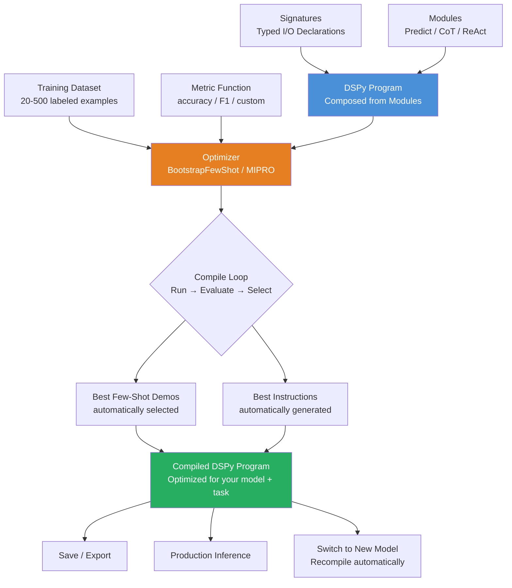

# 🔬 DSPy — Programming, Not Prompting

> [!abstract] TL;DR
> **DSPy** (Declarative Self-improving Python) is a Stanford NLP framework that treats LLM programs as **compiled artifacts**, not hand-written prompts. You write a program using typed **signatures** (input/output specs) and composable **modules** (Predict, ChainOfThought, ReAct). Then an **optimizer** (BootstrapFewShot, MIPRO) automatically generates and tests prompts and few-shot examples using a small labeled dataset. The result is a *compiled program* where prompts are discovered by optimization, not written by hand. DSPy makes LLM programs **reproducible, portable, and systematically improvable**.

---

## Intuition — Analogy First

**LangChain / manual prompting is like writing assembly code.** You manually control every instruction: "say this phrase," "use this example," "format output this way." It works, but it's brittle, hard to maintain, and non-portable — your carefully tuned GPT-4 prompt may perform terribly on Claude or Llama 3.

**DSPy is a compiler.** You write the *logic* of your program — what transformations should happen, what the inputs and outputs should be — and the compiler figures out the best way to implement it for the target model.

This analogy is precise:
- **Source code (your DSPy program):** Defines the structure of reasoning (signatures, modules, composition)
- **Compiler (DSPy optimizer):** Runs experiments on your training data to find the best prompts and examples
- **Compiled artifact (optimized DSPy program):** A specific prompt configuration that achieves high metric scores on your task
- **Target machine (LLM):** The optimizer adapts the compiled output to each different model

The philosophical shift: **instead of asking "what should I say to the model?" you ask "what should my program do?" and let the optimizer figure out the phrasing.**

---

## How It Works — Mechanics

### 1. Signatures — Typed I/O Specs

A `Signature` declares what information goes in and what should come out. It says *nothing* about how to achieve this — no prompt templates, no examples. The optimizer fills those in.

```python
class SentimentClassifier(dspy.Signature):
    """Classify the sentiment of a customer review."""
    review: str = dspy.InputField(desc="Customer product review text")
    sentiment: Literal["positive", "negative", "neutral"] = dspy.OutputField()
    confidence: float = dspy.OutputField(desc="Confidence score 0-1")
```

The docstring becomes the task description. Fields are typed and annotated with descriptions.

### 2. Modules — Composable LLM Calls

Modules are building blocks for LLM computation:

| Module | Behavior |
|--------|---------|
| `dspy.Predict(sig)` | Direct prediction from signature |
| `dspy.ChainOfThought(sig)` | Adds reasoning field before output |
| `dspy.ReAct(sig, tools)` | Reason + Act with tool use |
| `dspy.MultiChainComparison(sig)` | Sample multiple chains, compare |
| `dspy.Retrieve(k)` | Retrieval from configured corpus |

Modules are composable — a `dspy.Module` subclass can contain multiple modules as attributes and define a `forward()` method.

### 3. Optimizers — Automatic Prompt Compilation

Optimizers take a program + a metric function + a training dataset and search for prompts/examples that maximize the metric:

| Optimizer | Strategy | Data Needed |
|-----------|---------|------------|
| `BootstrapFewShot` | Runs program on training data, collects successful traces as few-shot examples | Small (20–50 labeled) |
| `BootstrapFewShotWithRandomSearch` | Multiple random restarts of BootstrapFewShot | Small-medium |
| `MIPRO` (v2) | Bayesian optimization over prompt instructions + examples | Medium (100–500) |
| `COPRO` | Generates instruction candidates using an LLM | Small |
| `BootstrapFinetune` | Fine-tunes model weights instead of prompts | Large |

### 4. The Compile Loop

```
Program definition (signatures + modules)
      ↓
Optimizer samples training examples
      ↓
Runs program on each sample, collecting intermediate traces
      ↓
Evaluates against metric function
      ↓
Selects best traces as few-shot demonstrations
      ↓
Optionally refines instructions via LLM
      ↓
Returns optimized program (with baked-in prompts + examples)
```



---

## The Math

**Optimizer as black-box search over the prompt space:**

Define a prompt configuration $\pi = (\text{instructions}, \text{demonstrations})$. The optimizer searches:

$$\pi^* = \arg\max_{\pi \in \Pi} \mathbb{E}_{(x, y) \sim \mathcal{D}_{\text{eval}}} \left[ \text{metric}(f_\pi(x), y) \right]$$

Where $f_\pi$ is the LLM with prompt configuration $\pi$, $\mathcal{D}_{\text{eval}}$ is the dev set.

`BootstrapFewShot` uses a greedy beam search over the trace space:
1. Run the *unoptimized* program on training examples
2. Collect traces $(x, \text{intermediate\_outputs}, y)$ where the final output is correct
3. Use these as few-shot demonstrations in the optimized program
4. Repeat, filtering for traces that improve the metric

`MIPRO` applies **Bayesian optimization** (TPE or random search) over a joint space of instruction text and few-shot selection, using the LLM itself to generate instruction candidates.

---

## Code Demo

```python
# pip install dspy-ai

import dspy
from dspy.datasets import HotPotQA
from dspy.evaluate import Evaluate
from dspy.teleprompt import BootstrapFewShot, MIPROv2
from typing import Literal


# ── 0. Configure LLM ─────────────────────────────────────────────────────────
lm = dspy.LM("openai/gpt-4o-mini", max_tokens=1000)
dspy.configure(lm=lm)


# ── 1. Define Signatures ──────────────────────────────────────────────────────
class ClassifyIntent(dspy.Signature):
    """Classify the intent of a customer support message."""
    message: str = dspy.InputField(desc="Customer support message text")
    intent: Literal["BILLING", "TECHNICAL", "SHIPPING", "RETURNS", "OTHER"] = dspy.OutputField()
    confidence: float = dspy.OutputField(desc="Classification confidence 0.0 to 1.0")


class GenerateSQLQuery(dspy.Signature):
    """Generate a SQL query to answer a natural language question about a database."""
    schema: str = dspy.InputField(desc="Database schema as CREATE TABLE statements")
    question: str = dspy.InputField(desc="Natural language question about the data")
    sql_query: str = dspy.OutputField(desc="Valid SQL query to answer the question")
    explanation: str = dspy.OutputField(desc="Brief explanation of the query logic")


# ── 2. Simple Module (Single Predict) ─────────────────────────────────────────
class IntentClassifier(dspy.Module):
    def __init__(self):
        super().__init__()
        self.classify = dspy.Predict(ClassifyIntent)

    def forward(self, message: str):
        return self.classify(message=message)


classifier = IntentClassifier()
result = classifier("My order still hasn't arrived after 3 weeks.")
print(f"Intent: {result.intent}, Confidence: {result.confidence}")


# ── 3. Multi-Step Module with ChainOfThought ──────────────────────────────────
class ReasonAndClassify(dspy.Module):
    def __init__(self):
        super().__init__()
        self.cot_classify = dspy.ChainOfThought(ClassifyIntent)

    def forward(self, message: str):
        return self.cot_classify(message=message)


cot_classifier = ReasonAndClassify()
result = cot_classifier("I was charged twice for the same order and need a refund.")
print(f"\nCoT Intent: {result.intent}")
print(f"CoT Reasoning: {result.rationale}")


# ── 4. RAG Pipeline as DSPy Module ───────────────────────────────────────────
class GenerateAnswer(dspy.Signature):
    """Answer a question given retrieved context passages."""
    context: list[str] = dspy.InputField(desc="Retrieved passages from knowledge base")
    question: str = dspy.InputField()
    answer: str = dspy.OutputField(desc="Concise factual answer based on context")
    confidence: float = dspy.OutputField(desc="Confidence in the answer 0-1")


class RAGModule(dspy.Module):
    def __init__(self, num_passages: int = 3):
        super().__init__()
        self.retrieve = dspy.Retrieve(k=num_passages)
        self.generate = dspy.ChainOfThought(GenerateAnswer)

    def forward(self, question: str):
        retrieved = self.retrieve(question).passages
        pred = self.generate(context=retrieved, question=question)
        return pred


# ── 5. Compile with BootstrapFewShot ─────────────────────────────────────────
# Prepare training data (normally from a dataset)
train_data = [
    dspy.Example(
        message="My credit card was charged but I never received a confirmation.",
        intent="BILLING"
    ).with_inputs("message"),
    dspy.Example(
        message="The app shows error code 502 when I try to login.",
        intent="TECHNICAL"
    ).with_inputs("message"),
    dspy.Example(
        message="Where is my package? Tracking shows it's been stuck for 5 days.",
        intent="SHIPPING"
    ).with_inputs("message"),
    dspy.Example(
        message="I received the wrong size, how do I return it?",
        intent="RETURNS"
    ).with_inputs("message"),
    dspy.Example(
        message="Do you offer student discounts?",
        intent="OTHER"
    ).with_inputs("message"),
    # Add more examples for real optimization (aim for 20-50 training examples)
]


# Define metric function
def intent_accuracy(example, prediction, trace=None):
    """Return 1.0 if predicted intent matches gold intent, else 0.0."""
    return float(example.intent == prediction.intent)


# Compile with BootstrapFewShot
teleprompter = BootstrapFewShot(
    metric=intent_accuracy,
    max_bootstrapped_demos=4,   # how many few-shot examples to include
    max_labeled_demos=4,        # max labeled examples from training set
    max_rounds=1,
)

compiled_classifier = teleprompter.compile(
    IntentClassifier(),
    trainset=train_data,
)

# The compiled classifier now has optimized few-shot examples baked in
result = compiled_classifier("The app crashes whenever I upload a file larger than 10MB.")
print(f"\nCompiled Intent: {result.intent}")


# ── 6. MIPRO Optimizer (More Powerful) ───────────────────────────────────────
# For production quality, use MIPROv2 with more data
# teleprompter_mipro = MIPROv2(
#     metric=intent_accuracy,
#     auto="medium",  # "light" / "medium" / "heavy" — controls search budget
# )
# compiled_mipro = teleprompter_mipro.compile(
#     IntentClassifier(),
#     trainset=train_data,
#     num_trials=20,   # number of Bayesian optimization trials
# )


# ── 7. Save and Load Compiled Program ─────────────────────────────────────────
compiled_classifier.save("./compiled_intent_classifier.json")

# Load in a new process
new_classifier = IntentClassifier()
new_classifier.load("./compiled_intent_classifier.json")


# ── 8. Evaluate Compiled vs Unoptimized ──────────────────────────────────────
eval_data = [
    dspy.Example(message="I need a receipt for my order.", intent="BILLING").with_inputs("message"),
    dspy.Example(message="How do I reset my password?", intent="TECHNICAL").with_inputs("message"),
]

evaluator = Evaluate(devset=eval_data, metric=intent_accuracy, display_progress=True)

unoptimized_score = evaluator(IntentClassifier())
optimized_score = evaluator(compiled_classifier)
print(f"\nUnoptimized accuracy: {unoptimized_score:.0%}")
print(f"Optimized accuracy:   {optimized_score:.0%}")
```

---

## Real-World Example

**Stanford NLP's own research** on complex QA tasks demonstrated DSPy's core value proposition: on HotPotQA (multi-hop question answering), a hand-written prompt chain scored ~35% exact match. After DSPy compilation with BootstrapFewShot, the same program structure scored ~52% — without changing a single line of program logic.

The implication: the gain came entirely from the optimizer discovering better few-shot examples and instructions. The human never needed to figure out the optimal prompts.

More practically, DSPy is used in organizations where:
1. The LLM must be **swappable** (compliance requires avoiding vendor lock-in) — recompile for each model
2. The task definition is stable but the model is upgraded over time — recompile, don't re-prompt
3. Multiple team members work on the same pipeline — DSPy separates program logic from prompt implementation cleanly

---

## Trade-offs

| Dimension | DSPy | LangChain (manual prompting) |
|-----------|------|----------------------------|
| **Initial setup** | Higher (need training data + metric) | Lower (write prompts immediately) |
| **Prompt quality** | Often higher (optimizer finds non-obvious prompts) | Depends on author skill |
| **Model portability** | Excellent (recompile for any model) | Low (prompts are model-specific) |
| **Iteration speed** | Slow (compilation takes time) | Fast (edit prompt → test) |
| **Data requirement** | 20–500 labeled examples | None |
| **Interpretability** | Compiled prompts are inspectable | Direct authorship |
| **Production stability** | High (compiled artifacts are reproducible) | Variable |
| **Learning curve** | Steep | Moderate |

---

## When to Use vs Avoid

**Use DSPy when:**
- You have a labeled dataset (even small: 20–50 examples) and a clear metric
- The task will run millions of times in production — optimization ROI is high
- You need to swap LLMs (switch from GPT-4o to Claude without re-prompting)
- You want reproducible, version-controlled LLM programs
- Research: systematic comparison of model capabilities on a task

**Avoid DSPy when:**
- No labeled data and no clear metric — optimizer has nothing to optimize
- Exploratory prototyping — the compilation overhead slows iteration
- Single-use or very low-volume tasks — optimization cost exceeds inference savings
- The task is creative/generative with no single "correct" answer

---

## Common Pitfalls

1. **No metric function:** DSPy without a metric is useless — the optimizer is blind. Define your metric carefully. Even a weak metric (LLM-as-judge) is better than none.
2. **Training data too small:** `BootstrapFewShot` needs at least 20 examples to have enough traces. `MIPRO` benefits from 100+. With 5 examples, compilation is essentially random.
3. **Metric leakage:** If your training and evaluation sets overlap, compiled programs may overfit to those examples. Keep a held-out test set.
4. **Forgetting to `dspy.configure`:** Every script must configure the LM. Forgetting this leads to cryptic errors when modules try to call an unconfigured model.
5. **Expensive compilation:** Each compilation run makes many LLM calls (training_size × trials). For MIPRO with 100 examples and 30 trials, expect hundreds of LLM calls. Use cheaper models (`gpt-4o-mini`) for optimization and verify on stronger models.
6. **Treating compiled programs as permanent:** Models update, datasets drift. Recompile periodically to maintain performance.

---

## Related Concepts

- [[_MOC_NLP|↑ Section MOC]]

- [[LangChain]] — the alternative approach: manual chain composition without optimization
- [[Prompt_Engineering_Basics]] — DSPy automates the core skill of prompt writing
- [[RAG_Overview]] — DSPy's `Retrieve` module and RAG modules implement the RAG pattern
- [[Chain_of_Thought]] — DSPy's `ChainOfThought` module implements CoT with optimized prompts
- [[Zero_Shot_and_Few_Shot]] — DSPy's optimizer produces and selects few-shot examples automatically

---

## Review Questions

1. Explain the core conceptual difference between LangChain and DSPy. What does "programming vs prompting" mean in this context, and what does the DSPy optimizer actually optimize?
2. You have a text-to-SQL task with 200 labeled (question, SQL) pairs. Walk through how you would set up and run a DSPy compilation pipeline, including signature definition, module design, metric function, and optimizer choice.
3. A team compiled a DSPy program 6 months ago and it worked great. Now performance has dropped 15%. What are the three most likely causes, and what would you do to fix it?

---

## Sources

- Khattab et al. (2023). *DSPy: Compiling Declarative Language Model Calls into Self-Improving Pipelines*. arXiv:2310.03714
- Khattab et al. (2024). *Optimizing Instructions and Demonstrations for Multi-Stage Language Model Programs*. arXiv:2406.11695 (MIPROv2)
- DSPy Documentation. https://dspy.ai/
- DSPy GitHub. https://github.com/stanfordnlp/dspy
- Lian et al. (2024). *AutoRAG: Automated Framework for Optimization of Retrieval Augmented Generation Pipeline*. arXiv:2401.03077

#dspy #llm-framework #prompt-optimization #nlp #ai-ml #advanced #stanford
