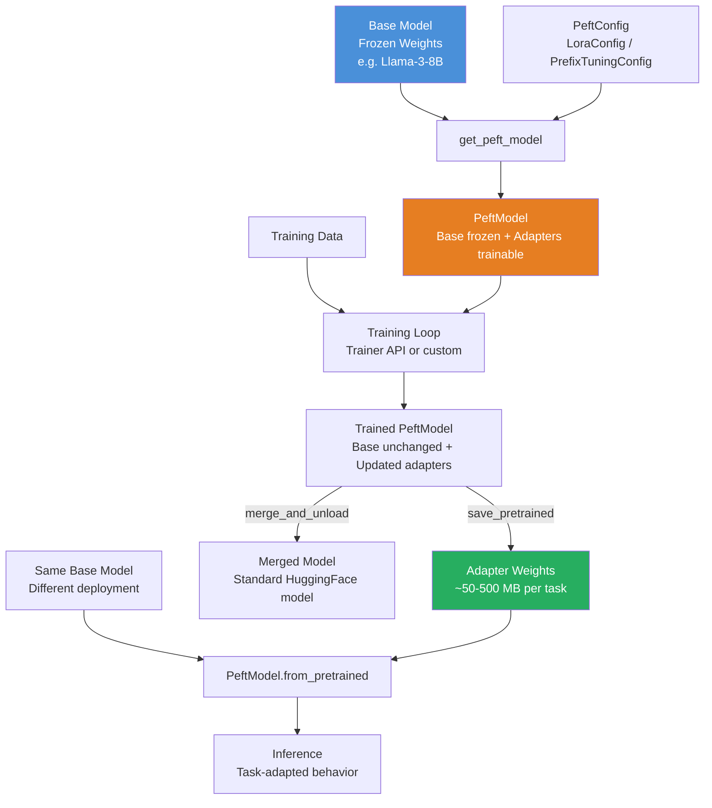

# 🔌 HuggingFace PEFT Library

> [!abstract] TL;DR
> **PEFT** (Parameter-Efficient Fine-Tuning) is HuggingFace's library for adapter-based fine-tuning. Instead of updating all model parameters (expensive, memory-intensive), PEFT adds small trainable modules — LoRA adapters, prefix tuning vectors, prompt embeddings — while keeping the base model frozen. This enables fine-tuning billion-parameter models on consumer hardware. Models can be saved as lightweight adapter files (MBs, not GBs), loaded on top of any compatible base model, and composed for multi-task inference.

---

## Intuition — Analogy First

Think of pretrained model weights as a massive operating system — millions of lines of code, years of engineering, refined to near-perfection for general tasks.

You need to customize it for your specific application. You have two options:

**Option A (full fine-tuning):** Fork the entire OS and modify it directly. Your fork weighs gigabytes, diverges from the original, and needs to be maintained separately. Reproducing it requires re-running the full training pipeline.

**Option B (PEFT/adapters):** Install a plugin — a small module that intercepts specific OS calls and adjusts behavior without touching the underlying code. The plugin weighs megabytes. Multiple plugins can coexist. Removing it restores the original OS perfectly.

PEFT is the plugin system. The base model stays frozen (read-only). The adapter (your plugin) is a tiny set of trainable parameters that gets layered on top. The entire fine-tuned model = base model + adapter file.

This matters enormously in practice: a fine-tuned Llama 3 70B via LoRA is a 2–8GB adapter file, not a 140GB full checkpoint.

---

## How It Works — Mechanics

### Supported PEFT Methods

| Method | Trainable Params | Memory | Best For |
|--------|-----------------|--------|---------|
| **LoRA** | 0.1–1% | Low | Most fine-tuning tasks |
| **QLoRA** | 0.1–1% | Very Low (4-bit base) | Very large models on small GPU |
| **Prefix Tuning** | ~0.1% | Very Low | Sequence-to-sequence tasks |
| **Prompt Tuning** | ~0.01% | Minimal | Lightweight task adaptation |
| **IA³** | ~0.01% | Minimal | Few-shot task adaptation |
| **AdaLoRA** | Dynamic | Low | When optimal rank is unknown |

### PeftModel Wrapper

`get_peft_model(base_model, peft_config)` wraps any HuggingFace model. The wrapper:
1. Freezes all original parameters (sets `requires_grad=False`)
2. Injects trainable adapter modules at configured target layers
3. Returns a `PeftModel` that is otherwise a drop-in replacement for the original

### LoraConfig Parameters

- `r`: Rank of the low-rank matrices. Higher = more capacity, more parameters. Typical values: 4–64.
- `lora_alpha`: Scaling factor. Effective learning rate scaled by `lora_alpha / r`. Typically set to `2*r`.
- `target_modules`: Which linear layers to apply LoRA to. For Llama: `["q_proj", "v_proj"]` or `["q_proj", "k_proj", "v_proj", "o_proj"]`.
- `lora_dropout`: Dropout on adapter activations. Typically 0.05–0.1.
- `bias`: Whether to train bias terms. Usually `"none"`.

### Saving and Loading

`model.save_pretrained(path)` saves **only the adapter weights** — a few hundred MB at most. `PeftModel.from_pretrained(base_model, path)` loads the adapter on top of a fresh base model. This separation means you can share fine-tuned models without sharing the base model weights.

### Merging Adapters

`model.merge_and_unload()` permanently fuses the LoRA adapter into the base model weights. The result is a standard (non-PEFT) model with the fine-tuned behavior. Useful for deployment when adapter overhead is undesirable.



---

## The Math

**LoRA recap (implemented by PEFT):**

For a weight matrix $W_0 \in \mathbb{R}^{d \times k}$, LoRA adds:

$$h = W_0 x + \Delta W x = W_0 x + BA x$$

Where $B \in \mathbb{R}^{d \times r}$, $A \in \mathbb{R}^{r \times k}$, $r \ll \min(d, k)$.

During training: $W_0$ is frozen, $A$ and $B$ are updated. $A$ initialized with random Gaussian, $B$ initialized to zero so $\Delta W = 0$ at initialization — the model starts from the pretrained baseline.

**Parameter count reduction:**

Full fine-tuning updates $d \times k$ parameters per layer. LoRA updates $r(d + k)$ per layer.

For GPT-3 (175B) with $r=8$ on attention projections:
- Full fine-tuning: ~175B parameters
- LoRA: ~4.7M parameters — **0.003% of the original**

**Merging:** After training, the adapted weight is:
$$W = W_0 + \frac{\alpha}{r} BA$$

Where $\alpha$ is `lora_alpha`. This is a simple matrix addition — no inference overhead after merging.

---

## Code Demo

```python
# pip install peft transformers datasets accelerate bitsandbytes

from transformers import (
    AutoTokenizer,
    AutoModelForCausalLM,
    AutoModelForSequenceClassification,
    TrainingArguments,
    Trainer,
)
from peft import (
    LoraConfig,
    PrefixTuningConfig,
    get_peft_model,
    PeftModel,
    TaskType,
    prepare_model_for_kbit_training,
)
from datasets import load_dataset
import torch


# ── 1. LoRA Fine-Tuning — Sequence Classification ────────────────────────────
BASE_MODEL = "distilbert-base-uncased"

tokenizer = AutoTokenizer.from_pretrained(BASE_MODEL)
base_model = AutoModelForSequenceClassification.from_pretrained(BASE_MODEL, num_labels=2)

# Configure LoRA
lora_config = LoraConfig(
    task_type=TaskType.SEQ_CLS,
    r=8,                          # rank
    lora_alpha=16,                # scaling: alpha/r = 2 is common
    target_modules=["q_lin", "k_lin", "v_lin"],  # DistilBERT attention projections
    lora_dropout=0.05,
    bias="none",
)

# Wrap with PEFT
model = get_peft_model(base_model, lora_config)
model.print_trainable_parameters()
# Output: trainable params: 296,706 || all params: 67,252,738 || trainable%: 0.44%


# ── 2. Load Dataset and Fine-Tune ─────────────────────────────────────────────
dataset = load_dataset("imdb", split={"train": "train[:1000]", "test": "test[:200]"})


def tokenize(batch):
    return tokenizer(batch["text"], truncation=True, padding="max_length", max_length=256)


tokenized = dataset.map(tokenize, batched=True)
tokenized = tokenized.rename_column("label", "labels")
tokenized.set_format("torch", columns=["input_ids", "attention_mask", "labels"])

training_args = TrainingArguments(
    output_dir="./peft_lora_imdb",
    num_train_epochs=3,
    per_device_train_batch_size=16,
    per_device_eval_batch_size=32,
    eval_strategy="epoch",
    save_strategy="epoch",
    load_best_model_at_end=True,
    fp16=torch.cuda.is_available(),
    report_to="none",
)

trainer = Trainer(
    model=model,
    args=training_args,
    train_dataset=tokenized["train"],
    eval_dataset=tokenized["test"],
)
trainer.train()


# ── 3. Save and Load Adapter ──────────────────────────────────────────────────
# Save only the adapter (small!)
model.save_pretrained("./lora_adapter")
tokenizer.save_pretrained("./lora_adapter")
# Adapter directory contains adapter_config.json + adapter_model.safetensors

# Load adapter on top of a fresh base model
fresh_base = AutoModelForSequenceClassification.from_pretrained(BASE_MODEL, num_labels=2)
loaded_model = PeftModel.from_pretrained(fresh_base, "./lora_adapter")
loaded_model.eval()

# Run inference
inputs = tokenizer("This movie was phenomenal!", return_tensors="pt")
with torch.no_grad():
    outputs = loaded_model(**inputs)
prediction = outputs.logits.argmax(-1).item()
print(f"Prediction: {'Positive' if prediction == 1 else 'Negative'}")


# ── 4. Merge Adapter into Base Model ─────────────────────────────────────────
# Merge for deployment — removes adapter overhead
merged_model = loaded_model.merge_and_unload()
# merged_model is now a standard AutoModelForSequenceClassification
merged_model.save_pretrained("./merged_model")


# ── 5. QLoRA — Large Model on Consumer GPU ────────────────────────────────────
# Requires: bitsandbytes, and a GPU
import bitsandbytes as bnb  # noqa: F401  (import check)
from transformers import BitsAndBytesConfig

bnb_config = BitsAndBytesConfig(
    load_in_4bit=True,
    bnb_4bit_quant_type="nf4",
    bnb_4bit_compute_dtype=torch.bfloat16,
    bnb_4bit_use_double_quant=True,
)

# Load Llama-3 in 4-bit (needs GPU + ~5GB VRAM)
# base_llm = AutoModelForCausalLM.from_pretrained(
#     "meta-llama/Meta-Llama-3-8B",
#     quantization_config=bnb_config,
#     device_map="auto",
# )
# base_llm = prepare_model_for_kbit_training(base_llm)
#
# lora_config_llm = LoraConfig(
#     task_type=TaskType.CAUSAL_LM,
#     r=16,
#     lora_alpha=32,
#     target_modules=["q_proj", "k_proj", "v_proj", "o_proj",
#                     "gate_proj", "up_proj", "down_proj"],
#     lora_dropout=0.05,
#     bias="none",
# )
# peft_llm = get_peft_model(base_llm, lora_config_llm)
# peft_llm.print_trainable_parameters()
# # trainable params: ~20M || all params: ~8B || trainable%: ~0.25%
```

---

## Real-World Example

The vast majority of open-source LLM fine-tunes shared on HuggingFace Hub use PEFT + LoRA. When a team wants to fine-tune **Llama 3 70B** for a medical documentation task, they:

1. Load Llama 3 70B in 4-bit (QLoRA) — reduces 140GB to ~35GB
2. Apply `LoraConfig` with `r=16` on all attention projections — adds ~35M trainable params
3. Train on 50K clinical notes for 3 epochs on 4×A100s (vs. 32×A100s for full fine-tuning)
4. Save the adapter: ~200MB file published to the Hub
5. Users download **only the adapter** and load it on top of the base Llama 3 they already have

This is why you see thousands of "Llama-3-8B-Instruct-LoRA-{domain}" models on HuggingFace — they're all tiny adapter files, not full model copies.

---

## Trade-offs

| Dimension | PEFT (LoRA) | Full Fine-Tuning |
|-----------|------------|-----------------|
| **GPU memory** | 2–4× base model | 6–8× base model (weights + grads + optimizer) |
| **Training time** | 30–70% faster | Baseline |
| **Accuracy** | 95–99% of full FT | 100% |
| **Storage per task** | 50–500 MB | Full model copy (7–140GB) |
| **Multi-task serving** | Load adapters dynamically | Need separate model per task |
| **Deployment complexity** | Slight — adapter loading step | Simple standard model |
| **Forgetting** | Less catastrophic forgetting | More forgetting of base capabilities |

---

## When to Use vs Avoid

**Use PEFT when:**
- GPU memory is constrained (single or few GPUs)
- Need to maintain multiple task-specific versions of one base model
- Want to share fine-tuned models without distributing the large base
- Rapid iteration — adapter training is faster than full fine-tuning

**Use full fine-tuning when:**
- Maximum accuracy is critical and resources allow
- Changing the model's fundamental capabilities (not just task adaptation)
- Pretraining a new domain-adapted base model from scratch

---

## Common Pitfalls

1. **Wrong `target_modules`:** Different architectures have different attention layer names. For BERT it's `query/key/value`, for Llama it's `q_proj/v_proj`. Check the model's `named_modules()` to find the right names, or use `"all-linear"` for an automatic selection.
2. **Not calling `prepare_model_for_kbit_training`:** For QLoRA, forgetting this step causes training instability. It enables gradient checkpointing and casts the model's normalization layers to float32.
3. **Merging before evaluation:** Never merge for offline evaluation — you lose the ability to swap adapters. Merge only when deploying to production.
4. **Rank too high:** `r=64` is rarely better than `r=16` and uses 4× the parameters. Start with `r=8` or `r=16` and only increase if performance is clearly insufficient.
5. **Forgetting `model.eval()` and disabling dropout:** LoRA dropout behaves differently in train vs eval mode. Always set `model.eval()` before inference.

---

## Related Concepts

- [[_MOC_NLP|↑ Section MOC]]

- [[LoRA]] — the underlying mathematical technique implemented by PEFT's LoRA adapter
- [[QLoRA]] — quantized LoRA for training large models on consumer hardware
- [[PEFT]] — the broader concept of parameter-efficient fine-tuning methods
- [[HuggingFace_Transformers]] — the underlying library PEFT wraps
- [[LLM_Architecture_Deep_Dive]] — understanding which layers to target with LoRA

---

## Review Questions

1. Explain what `get_peft_model` does to a base model's parameters. After calling it, how many parameters are trainable, and what happens to the rest?
2. You have a LoRA adapter fine-tuned on customer support data and want to deploy it for production inference without any adapter loading overhead. What function would you use, and what are the trade-offs?
3. You need to fine-tune Llama 3 70B on a single 80GB A100 GPU. Walk through the specific PEFT + HuggingFace configuration (BitsAndBytesConfig, LoraConfig, prepare steps) required to make this feasible.

---

## Sources

- Hu et al. (2022). *LoRA: Low-Rank Adaptation of Large Language Models*. arXiv:2106.09685
- Dettmers et al. (2023). *QLoRA: Efficient Finetuning of Quantized LLMs*. arXiv:2305.14314
- HuggingFace PEFT Documentation. https://huggingface.co/docs/peft
- HuggingFace. *PEFT GitHub Repository*. https://github.com/huggingface/peft
- Lialin et al. (2023). *Scaling Down to Scale Up: A Guide to Parameter-Efficient Fine-Tuning*. arXiv:2303.15647

#huggingface #peft #lora #qlora #fine-tuning #nlp #ai-ml #intermediate
