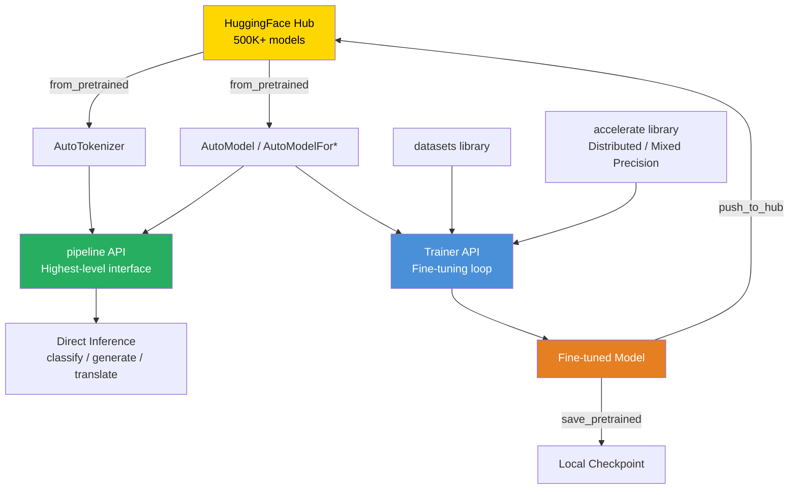

# 🤗 HuggingFace Transformers Library

> [!abstract] TL;DR
> **HuggingFace Transformers** is the standard Python library for working with transformer-based models. It provides a unified API (`AutoModel`, `AutoTokenizer`, `pipeline`) to download, run, and fine-tune 500,000+ pretrained models from the HuggingFace Hub. The `Trainer` API handles training loops, evaluation, and checkpointing. The `datasets` library integrates seamlessly for data loading. Together, these components cover 90% of NLP and vision-language tasks without writing framework code from scratch.

---

## Intuition — Analogy First

Imagine a library with 500,000 pre-built LEGO sets — each one a different model trained for a different task (sentiment analysis, translation, image captioning, code generation). You walk in, pick a set that's closest to what you need, and either use it directly (inference) or modify a few pieces for your specific task (fine-tuning).

HuggingFace is that library:
- **Hub = the warehouse:** 500K+ models, all indexed and versioned
- **`from_pretrained()` = checking out a set:** One line to download any model
- **`pipeline()` = a pre-assembled LEGO kit:** Highest-level API, handles all the plumbing
- **`Trainer` = the instruction manual customizer:** You change a few steps and the rest still builds
- **`datasets` library = standardized LEGO piece bins:** Consistent data loading and preprocessing

Before HuggingFace, every team maintained their own transformer implementations — PyTorch code, their own tokenizers, their own training loops. The duplication was enormous. HuggingFace standardized everything behind a clean interface, enabling the community to share models like open-source code.

---

## How It Works — Mechanics

### The Core Abstraction: AutoClasses

`AutoModel` and `AutoTokenizer` select the right implementation automatically based on the model identifier. You never need to know whether a model is BERT, GPT-2, T5, or Llama — `Auto` classes handle it.

```
model_name = "bert-base-uncased"
→ AutoTokenizer detects BertTokenizer
→ AutoModel detects BertModel
```

### Pipeline API (Highest Level)

`pipeline()` wraps tokenizer + model + postprocessing into a single callable. Ideal for rapid prototyping and simple production use cases.

### Trainer API (Training Level)

`Trainer` is a complete training loop. You provide:
1. A model
2. `TrainingArguments` (batch size, LR, epochs, checkpoint strategy)
3. Train and eval datasets
4. An optional `compute_metrics` function

`Trainer` handles distributed training, gradient accumulation, mixed precision, logging, and evaluation automatically.

### Hub Integration

Every `model.save_pretrained()` creates a directory compatible with `from_pretrained()`. `push_to_hub()` uploads it to the HuggingFace Hub. This is the core sharing mechanism for the open-source AI community.



### Key AutoModel Variants

| Class | Use Case |
|-------|---------|
| `AutoModel` | Raw hidden states, embeddings |
| `AutoModelForSequenceClassification` | Text classification |
| `AutoModelForTokenClassification` | NER, POS tagging |
| `AutoModelForQuestionAnswering` | Extractive QA |
| `AutoModelForCausalLM` | Text generation (GPT-style) |
| `AutoModelForSeq2SeqLM` | Translation, summarization (T5-style) |
| `AutoModelForMaskedLM` | Masked language modeling (BERT-style) |

---

## The Math

The library doesn't introduce new math — it implements transformer architectures faithfully. The key design decision is **model configuration as a JSON file** (`config.json`):

Every `from_pretrained()` call:
1. Downloads `config.json` (architecture hyperparameters: num_heads, hidden_dim, etc.)
2. Downloads `model.safetensors` (pretrained weights)
3. Downloads `tokenizer.json` (vocabulary and special tokens)

The `AutoClass` machinery reads `config.json`'s `"model_type"` field and dispatches to the correct implementation class. This makes model sharing format-agnostic — any framework (PyTorch, JAX/Flax, TensorFlow) can load the same checkpoint.

Token IDs flow through:
$$\text{token\_ids} \xrightarrow{\text{embed}} \mathbf{h}_0 \xrightarrow{\text{L transformer blocks}} \mathbf{h}_L \xrightarrow{\text{head}} \text{logits}$$

Where each transformer block applies self-attention + FFN with residual connections.

---

## Code Demo

```python
# pip install transformers datasets accelerate torch

from transformers import (
    AutoTokenizer,
    AutoModelForSequenceClassification,
    AutoModelForCausalLM,
    pipeline,
    Trainer,
    TrainingArguments,
)
from datasets import load_dataset
import torch

# ── 1. pipeline API — Fastest Path to Inference ───────────────────────────────
# Sentiment analysis
sentiment_pipe = pipeline(
    "sentiment-analysis",
    model="distilbert-base-uncased-finetuned-sst-2-english",
    device=0 if torch.cuda.is_available() else -1,
)
results = sentiment_pipe([
    "This product is absolutely fantastic!",
    "The delivery was three weeks late and the item was broken.",
    "It does what it says, nothing more.",
])
for text, result in zip(["fantastic", "broken", "neutral"], results):
    print(f"  {text}: {result['label']} ({result['score']:.2%})")

# Text generation
gen_pipe = pipeline(
    "text-generation",
    model="microsoft/phi-2",
    torch_dtype=torch.float16,
    device_map="auto",
)
output = gen_pipe(
    "def fibonacci(n: int) -> int:",
    max_new_tokens=100,
    do_sample=False,
)
print(output[0]["generated_text"])


# ── 2. AutoModel + AutoTokenizer — Low-Level Control ─────────────────────────
model_name = "bert-base-uncased"
tokenizer = AutoTokenizer.from_pretrained(model_name)
model = AutoModelForSequenceClassification.from_pretrained(
    model_name,
    num_labels=2,
)

# Tokenize
inputs = tokenizer(
    ["I love this!", "This is terrible."],
    padding=True,
    truncation=True,
    max_length=128,
    return_tensors="pt",
)
print("Input IDs shape:", inputs["input_ids"].shape)  # [2, 128]

# Forward pass
with torch.no_grad():
    outputs = model(**inputs)
probs = torch.softmax(outputs.logits, dim=-1)
print("Probabilities:", probs)


# ── 3. Trainer API — Fine-tuning ─────────────────────────────────────────────
# Load dataset
dataset = load_dataset("imdb", split={"train": "train[:2000]", "test": "test[:500]"})

# Tokenize dataset
tokenizer = AutoTokenizer.from_pretrained("distilbert-base-uncased")


def tokenize_fn(batch):
    return tokenizer(batch["text"], truncation=True, padding="max_length", max_length=256)


tokenized = dataset.map(tokenize_fn, batched=True)
tokenized = tokenized.rename_column("label", "labels")
tokenized.set_format("torch", columns=["input_ids", "attention_mask", "labels"])

# Model
model = AutoModelForSequenceClassification.from_pretrained(
    "distilbert-base-uncased",
    num_labels=2,
)

# Training arguments
training_args = TrainingArguments(
    output_dir="./imdb_finetuned",
    num_train_epochs=2,
    per_device_train_batch_size=16,
    per_device_eval_batch_size=32,
    warmup_steps=100,
    weight_decay=0.01,
    logging_dir="./logs",
    eval_strategy="epoch",
    save_strategy="epoch",
    load_best_model_at_end=True,
    fp16=torch.cuda.is_available(),  # mixed precision on GPU
    report_to="none",
)


# Compute metrics
import evaluate
import numpy as np

accuracy_metric = evaluate.load("accuracy")


def compute_metrics(eval_pred):
    logits, labels = eval_pred
    predictions = np.argmax(logits, axis=-1)
    return accuracy_metric.compute(predictions=predictions, references=labels)


# Train
trainer = Trainer(
    model=model,
    args=training_args,
    train_dataset=tokenized["train"],
    eval_dataset=tokenized["test"],
    compute_metrics=compute_metrics,
)
trainer.train()

# Save and push to Hub
model.save_pretrained("./imdb_finetuned/final")
tokenizer.save_pretrained("./imdb_finetuned/final")
# trainer.push_to_hub("your-username/imdb-distilbert")  # uncomment to publish
```

---

## Real-World Example

**HuggingFace Hub is the GitHub for AI models.** Every major AI team — Google, Meta, Microsoft, Mistral, Anthropic, academic labs — publishes model weights on the Hub. As of 2025:

- 500,000+ public model checkpoints
- 150,000+ public datasets
- Millions of monthly downloads

When **Meta releases Llama 3**, they publish it on HuggingFace Hub. When **Mistral releases Mixtral**, same. Fine-tuned variants appear within hours. The Hub's `from_pretrained()` API means any of these models is two lines of code away from running locally.

The practical implication: if you're an ML engineer starting a new NLP project, your first question should be "Is there a HuggingFace model for this?" — not "Should I train from scratch?" For the vast majority of tasks, there is a pretrained model that gets you to 90% of your target metric before writing any training code.

---

## Trade-offs

| Dimension | HuggingFace Transformers | Custom Implementation |
|-----------|------------------------|--------------------|
| **Speed to first result** | Minutes | Days/weeks |
| **Flexibility** | High (but abstracted) | Maximum |
| **Inference optimization** | Moderate | Full control |
| **Community/model support** | Excellent | None |
| **Production serving** | Requires additional tooling (vLLM, TGI) | Full control |
| **Debugging** | Harder (deep abstraction stack) | Direct access |

| Component | Best For | Avoid When |
|-----------|---------|-----------|
| `pipeline` | Prototyping, simple production | Batch inference at scale |
| `Trainer` | Standard fine-tuning | Custom training loops, RL |
| `AutoModel` directly | Custom architectures, research | You just need inference |
| `datasets` | Standardized benchmarks, Hub datasets | Streaming very large private datasets |

---

## When to Use vs Avoid

**Use HuggingFace Transformers when:**
- Loading any pretrained transformer model for inference or fine-tuning
- Experimenting with multiple architectures quickly
- Building on top of an existing HuggingFace model (BERT, T5, Llama, etc.)
- You need access to the model ecosystem (Hub) for reproducible research

**Avoid (or supplement) when:**
- Serving at high throughput — use vLLM or HuggingFace TGI instead of the Transformers `generate()` directly
- Custom training loops with complex schedulers, multi-objective losses, or RL — PyTorch Lightning or raw PyTorch may be clearer
- Extremely tight latency requirements — consider ONNX export or TensorRT

---

## Common Pitfalls

1. **Not setting `device_map="auto"` for large models:** Large models (>7B) will OOM on a single GPU if not distributed. Always use `device_map="auto"` with `torch_dtype=torch.float16`.
2. **Forgetting `model.eval()` during inference:** Without `model.eval()`, dropout layers remain active, making inference non-deterministic and slightly degraded.
3. **Tokenizer/model mismatch:** Always use the tokenizer that shipped with the model. Different tokenizers have different vocabularies and special tokens — mixing them silently degrades performance.
4. **DataLoader workers on Windows:** The `num_proc` parameter in `dataset.map()` can cause issues on Windows with multiprocessing. Set `num_proc=1` if you see pickle errors.
5. **Not truncating inputs:** If you skip `truncation=True` in the tokenizer, sequences longer than `max_position_embeddings` will crash. Always truncate.
6. **Checkpoint save strategy:** Default `save_strategy` is `"steps"` — you can accumulate many checkpoints. Set `save_total_limit=2` to avoid filling disk.

---

## Related Concepts

- [[_MOC_NLP|↑ Section MOC]]

- [[BERT]] — the architecture that made HuggingFace the standard library
- [[LoRA]] — parameter-efficient fine-tuning built on top of HuggingFace
- [[HuggingFace_PEFT_Library]] — the official HuggingFace library for adapter-based fine-tuning
- [[QLoRA]] — quantized LoRA, requires `bitsandbytes` integration with Transformers
- [[LangChain]] — often wraps HuggingFace models for LLM application development

---

## Review Questions

1. Explain the role of `AutoModel` and `AutoTokenizer`. What problem do they solve compared to importing `BertModel` and `BertTokenizer` directly? When might you prefer the concrete class?
2. A colleague's `Trainer` fine-tuning job runs correctly for one epoch then crashes with OOM on epoch 2. What are the three most likely causes, and what would you investigate first?
3. You need to fine-tune a 7B parameter model on a single 24GB GPU. Walk through the specific HuggingFace components and settings you would use to make this feasible.

---

## Sources

- Wolf et al. (2020). *HuggingFace's Transformers: State-of-the-Art Natural Language Processing*. arXiv:1910.03771
- HuggingFace. *Transformers Documentation*. https://huggingface.co/docs/transformers
- HuggingFace. *Trainer API*. https://huggingface.co/docs/transformers/main_classes/trainer
- HuggingFace. *Model Hub*. https://huggingface.co/models
- HuggingFace. *Datasets Library*. https://huggingface.co/docs/datasets

#huggingface #transformers #nlp #fine-tuning #framework #ai-ml #beginner
