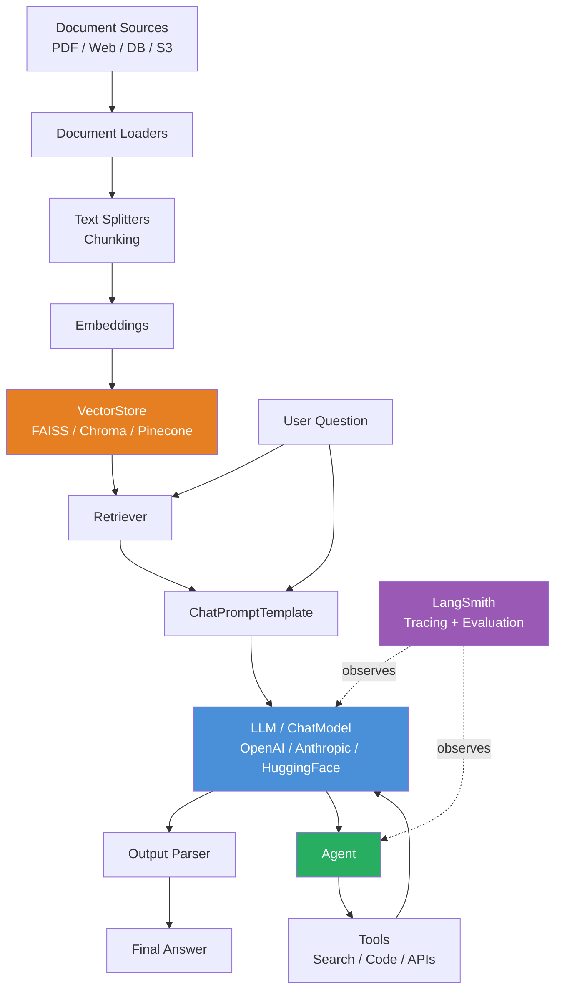

# ⛓️ LangChain Framework

> [!abstract] TL;DR
> **LangChain** is a Python/JavaScript framework for composing LLM applications from modular components: chains, prompts, document loaders, text splitters, vector stores, retrievers, agents, and tools. The **LangChain Expression Language (LCEL)** uses a pipe `|` syntax to compose these components declaratively. LangChain is not a model — it's the **wiring harness** that connects your LLM to data sources, tools, and other LLMs, with LangSmith providing observability.

---

## Intuition — Analogy First

Imagine building an electrical system for a building:
- **Power source (generator):** The LLM — it produces the "power" (language intelligence)
- **Appliances (tools):** Search engines, databases, code interpreters, APIs — things the LLM can use
- **Wiring (LangChain chains):** Connects power sources to appliances in specific configurations
- **Circuit breaker panel (agents):** Decides which appliances to power based on the current need
- **Monitoring panel (LangSmith):** Observes power flow, detects failures

Without wiring, a generator and appliances are useless. LangChain is the professional electrical wiring system — standardized connectors, proper routing, safety checks, and monitoring.

The key shift in thinking: **LangChain applications are pipelines, not scripts.** Instead of writing procedural code (`call LLM → parse result → call API → call LLM again`), you declare components and compose them. LCEL's `|` operator connects output of one step to input of the next, exactly like a Unix pipe.

---

## How It Works — Mechanics

### LCEL (LangChain Expression Language)

LCEL is the core composition API. Every component implements `Runnable` with `.invoke()`, `.stream()`, and `.batch()`. The pipe `|` operator chains runnables:

```python
chain = prompt | llm | output_parser
result = chain.invoke({"question": "What is RAG?"})
```

All LCEL chains automatically support:
- **Streaming:** `.stream()` yields tokens as they arrive
- **Async:** `.ainvoke()`, `.astream()` for async frameworks
- **Batch:** `.batch([...])` processes multiple inputs in parallel
- **Introspection:** `.get_graph()` returns a visual computation graph

### Core Components

| Component | Purpose | Example |
|-----------|---------|---------|
| **ChatPromptTemplate** | Format messages with variables | `"You are {role}. Answer: {question}"` |
| **LLM / ChatModel** | Model inference | `ChatOpenAI`, `ChatAnthropic`, `HuggingFacePipeline` |
| **Output parsers** | Parse model output | `StrOutputParser`, `JsonOutputParser`, `PydanticOutputParser` |
| **Document loaders** | Load from sources | PDF, web, S3, database, Notion |
| **Text splitters** | Chunk documents | `RecursiveCharacterTextSplitter`, `TokenTextSplitter` |
| **Embeddings** | Create vector representations | `OpenAIEmbeddings`, `HuggingFaceEmbeddings` |
| **VectorStores** | Store and search vectors | FAISS, Chroma, Pinecone, Weaviate |
| **Retrievers** | Fetch relevant documents | `VectorStoreRetriever`, `MultiQueryRetriever` |
| **Agents** | LLM-driven tool selection | `create_react_agent`, `create_openai_tools_agent` |
| **Memory** | Conversation history | `ConversationBufferMemory`, `ConversationSummaryMemory` |



---

## The Math

LangChain doesn't introduce novel math — it orchestrates components. The key technical concept is **retrieval-augmented generation (RAG)**, which LangChain makes easy to implement:

**Retrieval step (semantic search):**
$$\text{score}(q, d_i) = \cos(\mathbf{e}_q, \mathbf{e}_{d_i}) = \frac{\mathbf{e}_q \cdot \mathbf{e}_{d_i}}{\|\mathbf{e}_q\| \|\mathbf{e}_{d_i}\|}$$

Top-$k$ documents with highest cosine similarity to the query embedding are retrieved.

**LCEL composition as function composition:**

If each Runnable is a function $f_i : X_i \to X_{i+1}$, a chain `f1 | f2 | f3` is:

$$\text{chain}(x) = f_3(f_2(f_1(x)))$$

LCEL makes this lazy (returns a Runnable object, not the result) and adds streaming and async as first-class features.

---

## Code Demo

```python
# pip install langchain langchain-openai langchain-anthropic langchain-community
# pip install faiss-cpu chromadb

from langchain_openai import ChatOpenAI, OpenAIEmbeddings
from langchain_anthropic import ChatAnthropic
from langchain_core.prompts import ChatPromptTemplate
from langchain_core.output_parsers import StrOutputParser, JsonOutputParser
from langchain_core.runnables import RunnablePassthrough
from langchain_community.document_loaders import WebBaseLoader, TextLoader
from langchain_community.vectorstores import FAISS, Chroma
from langchain.text_splitter import RecursiveCharacterTextSplitter
from langchain.tools import tool
from langchain_core.messages import HumanMessage

# ── 1. Basic LCEL Chain ───────────────────────────────────────────────────────
llm = ChatOpenAI(model="gpt-4o", temperature=0.3)

prompt = ChatPromptTemplate.from_messages([
    ("system", "You are a concise technical writer. Respond in {language}."),
    ("human", "{question}"),
])

chain = prompt | llm | StrOutputParser()

# Invoke (blocking)
result = chain.invoke({"question": "What is a transformer?", "language": "English"})
print(result)

# Stream tokens
for chunk in chain.stream({"question": "Explain attention mechanism", "language": "English"}):
    print(chunk, end="", flush=True)

# Batch
results = chain.batch([
    {"question": "What is BERT?", "language": "English"},
    {"question": "What is GPT?", "language": "English"},
])


# ── 2. RAG Chain with LCEL ────────────────────────────────────────────────────
# Build vector store from documents
texts = [
    "LangChain is a framework for building LLM applications with chains and agents.",
    "LCEL uses the pipe operator to compose runnables in a declarative style.",
    "LangSmith provides observability and tracing for LangChain applications.",
    "Retrievers in LangChain fetch relevant documents from vector stores.",
    "Agents use LLMs as reasoning engines to select and invoke tools dynamically.",
]

embeddings = OpenAIEmbeddings()
vectorstore = FAISS.from_texts(texts, embeddings)
retriever = vectorstore.as_retriever(search_kwargs={"k": 3})

# Build RAG prompt
rag_prompt = ChatPromptTemplate.from_template("""
Answer the question based only on the following context:

{context}

Question: {question}

If the context doesn't contain relevant information, say "I don't have that information."
""")


def format_docs(docs):
    return "\n\n".join(doc.page_content for doc in docs)


# LCEL RAG chain
rag_chain = (
    {"context": retriever | format_docs, "question": RunnablePassthrough()}
    | rag_prompt
    | llm
    | StrOutputParser()
)

answer = rag_chain.invoke("What is LangSmith used for?")
print("\nRAG Answer:", answer)


# ── 3. Custom Tools and Agent ─────────────────────────────────────────────────
from langchain_openai import ChatOpenAI
from langchain.agents import create_openai_tools_agent, AgentExecutor
from langchain_core.prompts import ChatPromptTemplate, MessagesPlaceholder
from langchain.tools import tool
import math


@tool
def calculate(expression: str) -> str:
    """Evaluate a mathematical expression. Input: a valid Python math expression as a string."""
    try:
        # Safe evaluation (only math operations)
        allowed_names = {k: v for k, v in math.__dict__.items() if not k.startswith("__")}
        result = eval(expression, {"__builtins__": {}}, allowed_names)
        return str(result)
    except Exception as e:
        return f"Error: {e}"


@tool
def word_count(text: str) -> str:
    """Count the number of words in a text string."""
    count = len(text.split())
    return f"The text contains {count} words."


tools = [calculate, word_count]

agent_prompt = ChatPromptTemplate.from_messages([
    ("system", "You are a helpful assistant with access to calculation and text analysis tools."),
    ("human", "{input}"),
    MessagesPlaceholder(variable_name="agent_scratchpad"),
])

agent_llm = ChatOpenAI(model="gpt-4o", temperature=0)
agent = create_openai_tools_agent(agent_llm, tools, agent_prompt)
agent_executor = AgentExecutor(agent=agent, tools=tools, verbose=True)

result = agent_executor.invoke({"input": "What is 15% of 847, and how many words are in 'the quick brown fox jumps'?"})
print("\nAgent result:", result["output"])


# ── 4. Structured Output with LCEL ────────────────────────────────────────────
from pydantic import BaseModel, Field
from typing import Literal

class ReviewAnalysis(BaseModel):
    sentiment: Literal["positive", "negative", "neutral"]
    score: float = Field(ge=0, le=10)
    key_issues: list[str]
    recommended_action: str

structured_llm = llm.with_structured_output(ReviewAnalysis)

structured_chain = (
    ChatPromptTemplate.from_template("Analyze this customer review: {review}")
    | structured_llm
)

analysis = structured_chain.invoke(
    {"review": "The software has great features but crashes every 2 hours. Support is unresponsive."}
)
print(f"\nSentiment: {analysis.sentiment}, Score: {analysis.score}")
print(f"Issues: {analysis.key_issues}")
```

---

## Real-World Example

The majority of enterprise LLM applications in production use LangChain or a direct competitor. Notable deployments:

**Elastic's AI search** uses LangChain's retriever interface to connect Elasticsearch's vector search to LLM generation, powering natural language search across enterprise document corpora.

**GitLab Duo** (enterprise AI coding assistant) uses LangChain for orchestrating multi-step code analysis pipelines: retrieve relevant files → analyze with LLM → generate suggestions → validate output.

**A typical mid-size enterprise deployment:** An internal knowledge base chatbot ingests 50,000 PDFs, chunks them with `RecursiveCharacterTextSplitter`, embeds with `OpenAIEmbeddings`, stores in Pinecone, and serves RAG queries via a LangChain LCEL chain. LangSmith monitors latency and retrieval quality in production.

---

## Trade-offs

| Dimension | LangChain | LlamaIndex | Raw API calls |
|-----------|----------|-----------|--------------|
| **Abstraction level** | High | High (data-focused) | Low |
| **Learning curve** | Steep (large API surface) | Moderate | Low |
| **RAG support** | Good | Excellent | Manual |
| **Agent support** | Excellent | Good | Manual |
| **Debugging** | LangSmith helps; chain depth is hard | Similar | Direct |
| **Performance overhead** | Some | Some | None |
| **Flexibility** | High | High | Maximum |
| **Community / ecosystem** | Very large | Large | N/A |

---

## When to Use vs Avoid

**Use LangChain when:**
- Building complex, multi-step LLM pipelines with multiple components
- Rapidly prototyping RAG applications with standard components
- Need agent-based architectures where LLMs select tools dynamically
- Want built-in observability via LangSmith

**Avoid or minimize LangChain when:**
- Simple single-step LLM calls — use the provider SDK directly
- Maximum inference performance — LangChain's abstractions add latency
- The abstraction impedes understanding — for learning, build pipelines manually first
- The LangChain API has changed again and broken your code (versioning has historically been a pain point)

---

## Common Pitfalls

1. **Abstraction hiding errors:** LangChain's deep component stack can make debugging non-obvious. Use LangSmith traces or set `verbose=True` to see what's happening.
2. **Ignoring LCEL:** Pre-LCEL "legacy" chains (`LLMChain`, `RetrievalQA`) still appear in tutorials but are deprecated. Use LCEL pipe syntax for all new code.
3. **Oversized chunks:** Default chunk sizes (`chunk_size=1000`) are often too large for precise retrieval. Tune chunk size to your content type — 200–400 tokens for technical docs, 500–800 for prose.
4. **No retrieval evaluation:** It's easy to build a RAG chain and never verify if retrieval is actually returning relevant documents. Use LangSmith or manual inspection to validate retrieval quality.
5. **Agent infinite loops:** Agents can loop if a tool consistently fails or returns unexpected results. Always set `max_iterations` in `AgentExecutor`.

---

## Related Concepts

- [[_MOC_NLP|↑ Section MOC]]

- [[LlamaIndex]] — alternative data framework, better for complex document indexing
- [[RAG_Overview]] — the retrieval-augmented generation pattern LangChain often implements
- [[AI_Agents_Overview]] — the broader agent paradigm LangChain supports
- [[Prompt_Engineering_Basics]] — LangChain prompts are still fundamentally prompt engineering
- [[DSPy]] — a more programmatic, optimization-first alternative to LangChain's manual chaining

---

## Review Questions

1. Explain LCEL's pipe `|` operator semantics. What interface must a component implement to participate in an LCEL chain, and what capabilities does this interface provide beyond simple function composition?
2. Describe the end-to-end data flow in a LangChain RAG chain — from raw PDF document to final answer. Name the specific components involved at each step.
3. A colleague's LangChain agent is calling tools correctly but producing wrong final answers. List three things you would investigate using LangSmith tracing to diagnose the issue.

---

## Sources

- LangChain Documentation. https://python.langchain.com/docs/
- LangChain. *LangChain Expression Language (LCEL)*. https://python.langchain.com/docs/concepts/lcel/
- LangSmith Documentation. https://docs.smith.langchain.com/
- Chase, H. (2022). *LangChain GitHub*. https://github.com/langchain-ai/langchain
- Zhao et al. (2023). *A Survey of Large Language Models*. arXiv:2303.18223

#langchain #lcel #llm-framework #rag #agents #nlp #ai-ml #intermediate
