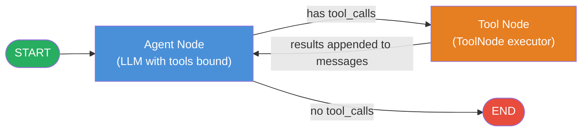
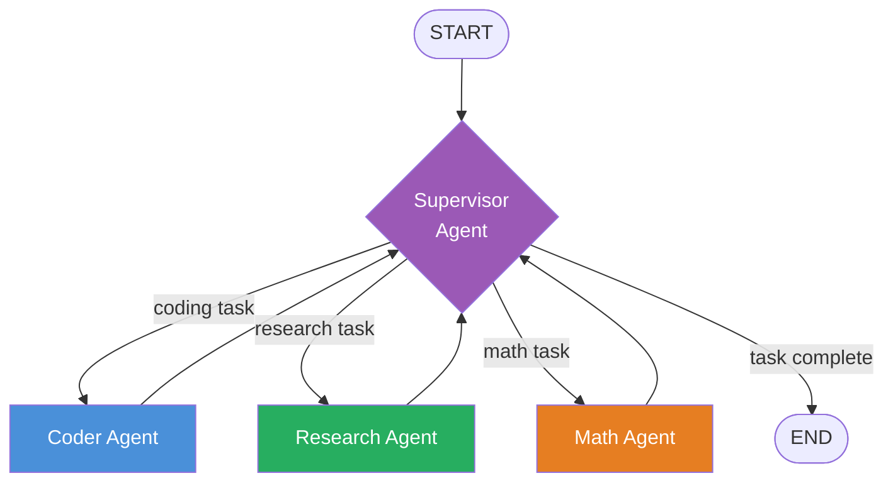

# 🔀 LangGraph

> [!abstract] TL;DR
> LangGraph is a stateful graph runtime built on top of LangChain that models agent workflows as explicit **cyclic state machines** — enabling loops, persistent checkpointing, human-in-the-loop pauses, and time-travel debugging that are structurally impossible in LangChain's linear LCEL chains.

---

## Intuition — Analogy First

**Analogy:** LangChain LCEL is a **conveyor belt** — items flow in one direction: check-in → security → gate → board. If anything goes wrong, you restart from the beginning.

LangGraph is the **full airport operations system**:
- A passenger (state) can **loop back**: security flags them → re-screening → gate, or customs → secondary inspection → re-check.
- A supervisor (conditional edge) decides at every junction where the passenger goes next.
- If the system crashes mid-process, the passenger's status is **checkpointed** — they resume exactly where they were.
- A human supervisor can **pause the process** at any gate, inspect the situation, and decide whether to wave them through or inject a correction.
- You can **replay** any passenger's journey from any prior checkpoint to investigate incidents.

The key shift: agent reasoning is inherently **cyclical** — the LLM thinks, calls a tool, reads the result, and thinks again. LCEL forces you to unroll that loop manually. LangGraph makes the cycle a first-class primitive in the graph.

---

## How It Works

### Core Concepts

| Concept | What It Is |
|---------|-----------|
| **StateGraph** | The container that holds nodes, edges, and the state schema |
| **State** | A `TypedDict` snapshot threaded through every node — the single source of truth |
| **Node** | A Python function (or LCEL chain) that receives state and returns a partial state update |
| **Edge** | A directed connection from one node to another — deterministic routing |
| **Conditional Edge** | A routing function that inspects state and returns the name of the next node |
| **Reducer** | A merge function that controls how a node's output is applied to a shared key (e.g., `add_messages` appends; default is overwrite) |
| **Checkpointer** | Persists the full state snapshot after every node — enables resume, replay, and HITL |

### State Schema and Reducers

State is a plain `TypedDict`. Keys without a reducer are **overwritten** by the latest node; keys annotated with a reducer are **merged** using that function:

```python
from typing import Annotated
from typing_extensions import TypedDict
from langgraph.graph.message import add_messages

class AgentState(TypedDict):
    # Reducer: new messages are appended to the list, never replaced
    messages: Annotated[list, add_messages]
    # No reducer: last-write-wins — the node that runs last sets this value
    retrieved_docs: list[str]
    iteration_count: int
```

`MessagesState` is the built-in shorthand for `{"messages": Annotated[list, add_messages]}` and is the default choice for chat agents.

### Building a Graph: The Five Steps

1. **Define state** — write a `TypedDict` with every field nodes need to share
2. **Define nodes** — write functions `(state: S) -> dict` returning a partial state update
3. **Add nodes** — `graph.add_node("name", function)`
4. **Add edges** — `graph.add_edge("a", "b")` for static routes; `graph.add_conditional_edges("a", router_fn, mapping)` for dynamic routing
5. **Compile** — `graph.compile()` returns an executable supporting `.invoke()`, `.stream()`, and `.get_state()`

### Conditional Edges (Routing)

The routing function inspects state and returns a string that maps to the next node. Returning `END` exits the graph:

```python
from langgraph.graph import END

def should_continue(state: AgentState) -> str:
    last_msg = state["messages"][-1]
    # If the LLM emitted tool calls, route to the tool executor
    if getattr(last_msg, "tool_calls", None):
        return "tools"
    # Otherwise the LLM gave a final answer — exit
    return END

graph.add_conditional_edges(
    "agent",                                    # source node
    should_continue,                            # routing function
    {"tools": "tools", END: END},               # output string → next node
)
```

`tools_condition` from `langgraph.prebuilt` is a ready-made version of the above pattern.

### Persistence and Checkpointing

```python
from langgraph.checkpoint.memory import MemorySaver        # dev / unit tests
# from langgraph.checkpoint.sqlite import SqliteSaver      # single-machine prod
# from langgraph.checkpoint.postgres import PostgresSaver  # distributed prod

checkpointer = MemorySaver()
graph = builder.compile(checkpointer=checkpointer)

# thread_id scopes the checkpoint to one session / conversation
config = {"configurable": {"thread_id": "user-123-session-7"}}
result = graph.invoke({"messages": [HumanMessage("Hello")]}, config=config)

# Inspect the saved state at any time
snapshot = graph.get_state(config)
print(snapshot.values)    # current state dict
print(snapshot.next)      # which node runs next (empty if graph finished)
```

Each node execution writes an immutable checkpoint. If the process crashes or is paused, the runtime replays from the last checkpoint transparently — no data is lost.

### Human-in-the-Loop (HITL)

Compile with `interrupt_before` or `interrupt_after` to pause execution at a named node and wait for human input:

```python
graph_hitl = builder.compile(
    checkpointer=MemorySaver(),
    interrupt_before=["tools"],   # pause before the tool executor runs
)

hitl_config = {"configurable": {"thread_id": "hitl-review-1"}}

# Step 1: run until the interrupt point
graph_hitl.invoke(initial_input, config=hitl_config)
# execution pauses here; the LLM has decided to call a tool but hasn't yet

# Step 2: human inspects the pending tool call
snapshot = graph_hitl.get_state(hitl_config)
print("Pending tool call:", snapshot.values["messages"][-1].tool_calls)

# Step 3a: human approves — resume by passing None as input
final_state = graph_hitl.invoke(None, config=hitl_config)

# Step 3b: human injects a correction instead
graph_hitl.update_state(
    hitl_config,
    {"messages": [HumanMessage("Search for X instead of Y.")]}
)
final_state = graph_hitl.invoke(None, config=hitl_config)
```

### Time-Travel Debugging

```python
# List all checkpoints for a thread, newest first
history = list(graph.get_state_history(config))

# Pick any checkpoint by index or by metadata
target_checkpoint = history[3]   # e.g., state before the bug occurred

# Re-run from that exact checkpoint — creates a branch; original thread is unchanged
replayed_result = graph.invoke(None, config=target_checkpoint.config)
```

This allows you to reproduce the exact state that produced a bad output, branch alternative histories, and regression-test fixes without touching production data.

### Streaming Modes

| Mode | What is emitted | Best for |
|------|----------------|----------|
| `"values"` | Full state snapshot after each node | Debugging; UI showing current complete state |
| `"updates"` | Delta (only what each node changed) | Efficient logging; incremental UI updates |
| `"messages"` | Individual LLM tokens as they stream | Chat interfaces; live typing effect |

```python
for event in graph.stream(input_state, config=config, stream_mode="updates"):
    for node_name, delta in event.items():
        last_msg = delta["messages"][-1]
        print(f"[{node_name}] {type(last_msg).__name__}: {str(last_msg.content)[:80]}")
```

### ReAct Agent as a LangGraph — Architecture



The `agent → tools → agent` back-edge is the structural difference from LCEL. Tool results are appended to `messages` via the `add_messages` reducer, so the agent node receives the full updated conversation on every tick.

### Multi-Agent Patterns

**Supervisor pattern:** A central agent node inspects the task and routes to specialized sub-agent nodes. Each sub-agent can be its own compiled `StateGraph` (a subgraph).



**Shared-state collaboration:** Multiple agent nodes write to different keys of the same `StateGraph`. A planner node writes `plan`; an executor node reads `plan` and writes `results`; a critic node reads `results` and writes `feedback` plus a boolean `approved`. A conditional edge routes back to the executor if `approved` is `False`.

### LangGraph vs CrewAI vs AutoGen

| Dimension | LangGraph | CrewAI | AutoGen |
|-----------|-----------|--------|---------|
| **Mental model** | Explicit state machine / graph | Role-based team ("crew") | Conversational agents |
| **Control** | Fine-grained — define every edge | Medium — role config drives flow | High-level — agents self-coordinate |
| **Setup cost** | Higher — state, nodes, edges explicit | Low — YAML-driven roles | Low — minimal code |
| **Cycles and loops** | Native | Limited | Via conversation turns |
| **Persistence / HITL** | First-class | Plugin-based | Add-on |
| **Best for** | Production workflows needing exact control | Team-simulation with defined roles | Conversational research tasks |

### LangGraph Platform

LangGraph Platform (formerly LangGraph Cloud) provides:
- **Managed deployment** — deploy graphs as REST APIs with autoscaling
- **Async background runs** — long-running agents run without blocking the client
- **Built-in Postgres persistence** — no need to wire your own checkpointer
- **LangGraph Studio** — visual debugger showing the live graph, state at each node, and replay controls
- **LangSmith integration** — full traces, latency metrics, and evaluation for every run

---

## Code Demo

```python
# pip install langgraph langchain-openai
from typing import Annotated
from typing_extensions import TypedDict
from langchain_openai import ChatOpenAI
from langchain_core.messages import HumanMessage
from langchain_core.tools import tool
from langgraph.graph import StateGraph, START, END
from langgraph.graph.message import add_messages
from langgraph.prebuilt import ToolNode
from langgraph.checkpoint.memory import MemorySaver

# ── 1. State Schema ────────────────────────────────────────────────────────────
class AgentState(TypedDict):
    # add_messages reducer: new messages are appended, never overwritten
    messages: Annotated[list, add_messages]

# ── 2. Tools ───────────────────────────────────────────────────────────────────
@tool
def web_search(query: str) -> str:
    """Search the web for current information about any topic."""
    # Replace with Tavily, SerpAPI, or similar in production
    return f"Top result for '{query}': LangGraph is an open-source stateful graph runtime."

@tool
def calculator(expression: str) -> str:
    """Evaluate a mathematical expression safely."""
    try:
        return str(eval(expression, {"__builtins__": {}}, {}))
    except Exception as e:
        return f"Error: {e}"

tools = [web_search, calculator]

# ── 3. LLM with Tools Bound ────────────────────────────────────────────────────
llm = ChatOpenAI(model="gpt-4o", temperature=0)
llm_with_tools = llm.bind_tools(tools)

# ── 4. Nodes ───────────────────────────────────────────────────────────────────
def agent_node(state: AgentState) -> dict:
    """LLM decides: answer directly, or emit tool calls."""
    response = llm_with_tools.invoke(state["messages"])
    return {"messages": [response]}

# ToolNode reads tool_calls from the last AIMessage and executes each tool
tool_node = ToolNode(tools)

# ── 5. Routing Function ────────────────────────────────────────────────────────
def route(state: AgentState) -> str:
    last = state["messages"][-1]
    if getattr(last, "tool_calls", None):
        return "tools"
    return END

# ── 6. Build the Graph ─────────────────────────────────────────────────────────
builder = StateGraph(AgentState)
builder.add_node("agent", agent_node)
builder.add_node("tools", tool_node)

builder.add_edge(START, "agent")
# Conditional edge: agent either calls tools (loop) or exits (END)
builder.add_conditional_edges("agent", route, {"tools": "tools", END: END})
# Back-edge: after tools run, return to the agent for another reasoning turn
builder.add_edge("tools", "agent")

# ── 7. Compile with In-Memory Checkpointer ─────────────────────────────────────
checkpointer = MemorySaver()
graph = builder.compile(checkpointer=checkpointer)

# ── 8. Basic Invoke ────────────────────────────────────────────────────────────
config = {"configurable": {"thread_id": "demo-session-1"}}
result = graph.invoke(
    {"messages": [HumanMessage("What is 25% of 1240? Also search for LangGraph.")]},
    config=config,
)
print("Answer:", result["messages"][-1].content)

# ── 9. Stream with Delta Updates ───────────────────────────────────────────────
config2 = {"configurable": {"thread_id": "demo-session-2"}}
for event in graph.stream(
    {"messages": [HumanMessage("Search for the ReAct prompting pattern.")]},
    config=config2,
    stream_mode="updates",     # emit only what changed after each node
):
    for node_name, delta in event.items():
        last_msg = delta["messages"][-1]
        print(f"[{node_name}] {type(last_msg).__name__}: {str(last_msg.content)[:80]}")

# ── 10. Human-in-the-Loop ──────────────────────────────────────────────────────
graph_hitl = builder.compile(
    checkpointer=MemorySaver(),
    interrupt_before=["tools"],   # pause BEFORE the tool executor runs
)
hitl_config = {"configurable": {"thread_id": "hitl-session-1"}}

# Run until the interrupt — execution pauses after agent emits tool_calls
graph_hitl.invoke(
    {"messages": [HumanMessage("Search for LangGraph platform pricing.")]},
    config=hitl_config,
)

# Human inspects the pending tool call
snapshot = graph_hitl.get_state(hitl_config)
pending = snapshot.values["messages"][-1].tool_calls
print("Pending tool call:", pending)

# Human approves — resume by passing None (continue from checkpoint)
final = graph_hitl.invoke(None, config=hitl_config)
print("Final answer:", final["messages"][-1].content)

# ── 11. Time-Travel: Replay from a Prior Checkpoint ───────────────────────────
history = list(graph.get_state_history(config))
# history[0] is latest; history[-1] is the initial state
early_checkpoint = history[-2]      # the state just after the first node ran
replayed = graph.invoke(None, config=early_checkpoint.config)
print("Replayed result:", replayed["messages"][-1].content)
```

---

## Real-World Example

> **Cognition AI's Devin** uses a stateful agent loop structurally identical to LangGraph's model: a planner node emits subtasks, executor nodes run code and shell commands in a sandboxed VM, an observer node reads stdout/stderr, and a conditional edge decides whether to retry (loop), escalate to a human-review node (interrupt), or finalize. The full file system diff, command history, and task plan are persisted so the agent resumes correctly after hour-long pauses or system restarts.
>
> In more accessible production deployments: enterprise internal chatbots use a LangGraph ReAct agent with three tools (vector search, SQL query, web search). `interrupt_before=["tools"]` flags any SQL write operation for a human DBA to approve before execution — preventing accidental data modification.

---

## Trade-offs

| Aspect | LangGraph | LangChain LCEL | Raw LLM API |
|--------|-----------|----------------|-------------|
| **Cycles / loops** | Native — add a back-edge | Impossible (DAG only) | Manual recursion |
| **State persistence** | Built-in checkpointers | None | Build your own |
| **Human-in-the-loop** | `interrupt_before/after` | Not supported | Fully custom |
| **Time-travel debugging** | `get_state_history` + replay | None | None |
| **Setup complexity** | Higher — define state, nodes, edges | Medium — pipe syntax | Low |
| **Flexibility per node** | Fine-grained | Pipeline-level | Maximum |
| **Streaming** | values / updates / messages modes | Token-level stream | Provider-specific |
| **Multi-agent support** | First-class (subgraphs, supervisor) | Manual composition | Fully custom |
| **Observability** | LangSmith traces every node transition | LangSmith traces chain steps | Manual logging |

---

## When to Use vs Avoid

**Use LangGraph when:**
- The agent must **loop** — call tools, read results, reason again — before producing an answer
- Tasks span multiple sessions or hours and require **cross-session state persistence**
- A **human must approve or correct** agent actions before they are executed
- You are building **multi-agent systems** with handoffs, shared state, or parallel sub-tasks
- You need **production-grade debuggability** — replay exact state sequences that caused failures

**Avoid LangGraph when:**
- The task is a simple one-shot pipeline (e.g., RAG Q&A, text classification) — LCEL is sufficient and simpler
- You want **minimum dependencies and maximum control** — use the provider SDK directly
- The team is unfamiliar with LangChain and the learning-curve cost exceeds the benefit of the framework
- The workflow is **purely sequential with no branching** — a LangGraph with no conditional edges is over-engineering

---

## Common Pitfalls

- **Missing reducers on shared keys** — if two nodes write to the same key without a reducer, the last writer silently discards earlier data. Define a reducer (`add_messages`, or a custom merge function) for any key multiple nodes update.
- **Unbounded cycles** — a conditional edge that never returns `END` creates an infinite loop. Add an `iteration_count` field to state and a guard in the routing function (e.g., `if state["iteration_count"] > 10: return END`).
- **Thread ID collisions** — using the same `thread_id` for two users merges their state into one checkpoint. Generate unique, per-user-per-session thread IDs and treat them as secrets.
- **`interrupt_before` is compile-time** — it affects every run of that compiled graph. If you need both an interactive (HITL) and a headless (automated) variant, compile two separate graph objects from the same builder.
- **Checkpointer not propagated to subgraphs** — in multi-agent setups, each subgraph needs its own checkpointer (or the parent's passed through). Subgraphs without checkpointers lose state silently on failure.
- **State schema drift across deployments** — adding a new required key to `TypedDict` without a default breaks deserialization of existing checkpoints. Always provide `Optional` typing or a default factory for new fields.

---

## Related Concepts

- [[_MOC_NLP|↑ Section MOC]]

- [[LangChain]] — the foundational library LangGraph extends; LCEL chains are the building blocks that become LangGraph nodes, and LangSmith provides the observability layer
- [[AI_Agents_Overview]] — the broader agent paradigm LangGraph implements as an explicit, inspectable state machine
- [[ReAct_Pattern]] — the thought-action-observation loop maps directly to LangGraph's `agent → tools → agent` back-edge cycle
- [[Multi_Agent_Systems]] — supervisor and collaborative multi-agent patterns that LangGraph enables natively through subgraphs and shared state
- [[Plan_and_Execute]] — naturally expressed as two LangGraph nodes: a planner node generates a task list, an executor node iterates through it with a loop
- [[Memory_in_Agents]] — LangGraph's checkpointers are a concrete implementation of external/episodic agent memory; `MessagesState` handles in-context memory
- [[Tool_Use_and_Function_Calling]] — `ToolNode` in LangGraph is the execution layer that dispatches tool calls emitted in LLM messages
- [[Model_Context_Protocol]] — MCP servers can be wrapped as LangChain tools and used as LangGraph tool nodes, providing a standardized protocol for exposing external capabilities

---

## Review Questions

1. Explain precisely why LangChain LCEL chains cannot natively implement a ReAct agent loop. What structural change in LangGraph resolves this limitation, and how does the `add_messages` reducer make repeated loop iterations safe?
2. You are building an agent that autonomously executes database migrations. Describe which LangGraph features you would use to ensure: (a) a human DBA reviews every schema change before it executes, (b) the agent resumes correctly after a 48-hour weekend pause, and (c) you can debug a failed migration by replaying the exact state that caused it.
3. Compare `MemorySaver`, `SqliteSaver`, and `PostgresSaver` as LangGraph checkpointers. What failure modes does each protect against, and in which production deployment topology is each appropriate?

---

## Sources

- [LangGraph Official Documentation](https://langchain-ai.github.io/langgraph/)
- [LangGraph Conceptual Guide](https://langchain-ai.github.io/langgraph/concepts/)
- [LangGraph vs CrewAI vs AutoGen — DataCamp](https://www.datacamp.com/tutorial/crewai-vs-langgraph-vs-autogen)
- [LangGraph vs AutoGen vs CrewAI — Latenode](https://latenode.com/blog/platform-comparisons-alternatives/automation-platform-comparisons/langgraph-vs-autogen-vs-crewai-complete-ai-agent-framework-comparison-architecture-analysis-2025)
- [Persistence in LangGraph — Medium](https://medium.com/@iambeingferoz/persistence-in-langgraph-building-ai-agents-with-memory-fault-tolerance-and-human-in-the-loop-d07977980931)
- [What is LangGraph — FutureAGI](https://futureagi.com/blog/what-is-langgraph-2026/)
- [LangGraph Platform](https://www.langchain.com/langgraph-platform)

---

#langgraph #agents #state-machine #llm-framework #human-in-the-loop #multi-agent #nlp #ai-ml #advanced
