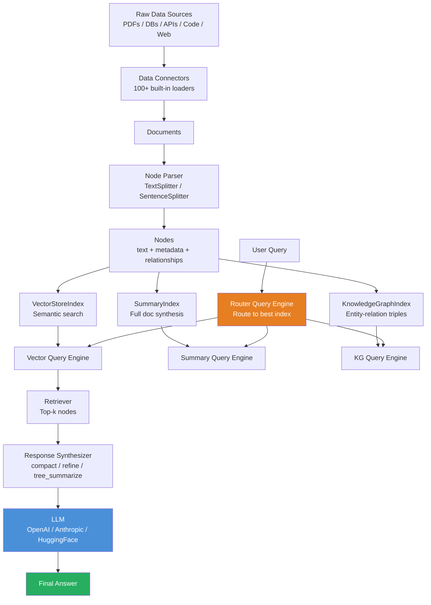

# 🦙 LlamaIndex Data Framework

> [!abstract] TL;DR
> **LlamaIndex** is a data framework for connecting LLMs to your data. Its core philosophy is **data-first**: it specializes in ingesting, indexing, and querying heterogeneous data sources (PDFs, databases, APIs, code repositories) in ways that LLMs can efficiently reason over. While LangChain is a general-purpose chain composition framework, LlamaIndex is optimized for the knowledge retrieval problem — it has richer index types, more sophisticated query engines, and better document hierarchy handling.

---

## Intuition — Analogy First

Think of LlamaIndex as a highly specialized **document management and research assistant system for AI**:

**LangChain** is like a general contractor — it can wire up anything: plumbing, electrical, framing, roofing. Flexible, widely used, does everything adequately.

**LlamaIndex** is like a specialized research librarian who happens to work with AI:
- Deep expertise in organizing and indexing knowledge (multiple index types)
- Knows how to break documents into the right pieces (node parsing)
- Can search across a library in multiple ways simultaneously (hybrid retrieval)
- Understands document hierarchies and relationships (parent-child chunks)
- Can synthesize answers from many sources coherently (response synthesis)

If your application is primarily about **querying knowledge** — documents, databases, knowledge graphs — LlamaIndex gives you better tooling for that specific problem. If your application is primarily about **orchestrating LLM workflows** with many different tools and actions, LangChain may be more natural.

---

## How It Works — Mechanics

### Core Concepts

**Nodes:** The fundamental unit. A document is split into Nodes, each containing text + metadata + relationships (prev/next/parent).

**Index:** A data structure that organizes nodes for efficient retrieval. The type of index determines *how* the data is searched.

**Query Engine:** Takes a natural language query, uses the index to retrieve relevant nodes, and synthesizes a response using the LLM.

**Response Synthesizer:** Determines how to combine retrieved chunks and prompt the LLM for a final answer. Multiple strategies: `compact`, `refine`, `tree_summarize`.

### Index Types

| Index Type | How It Works | Best For |
|------------|-------------|---------|
| `VectorStoreIndex` | Embeds nodes, stores in vector DB, semantic search | Most RAG use cases |
| `SummaryIndex` | Stores all nodes in a list, iterates to answer | Full document summarization |
| `KnowledgeGraphIndex` | Extracts entity-relation triples, builds graph | Structured knowledge queries |
| `DocumentSummaryIndex` | Stores per-document summaries for routing | Multi-document, route-to-doc |
| `PropertyGraphIndex` | Structured property graph with typed edges | Graph-based reasoning |

### LlamaParse

LlamaIndex's proprietary document parser (API service). Handles complex document layouts — tables, figures, multi-column PDFs, charts — far better than open-source PDF parsers. Critical for enterprise document QA.

### vs LangChain

| Dimension | LlamaIndex | LangChain |
|-----------|-----------|----------|
| **Primary focus** | Data indexing and querying | Chain/pipeline composition |
| **Index types** | Many (Vector, Summary, KG, Property Graph) | Primarily vector |
| **Document parsing** | LlamaParse (advanced) | Basic loaders |
| **Query strategies** | Rich (sub-question, hybrid, recursive) | Standard retrieve-then-generate |
| **Agent support** | Good (query engine as tool) | Excellent |
| **Learning curve** | Moderate | Steep |



---

## The Math

LlamaIndex's retrieval is built on the same vector similarity math as any RAG system. Its key technical contributions are in **advanced retrieval strategies**:

**Sub-question decomposition:**

For complex queries, the query is decomposed into sub-questions $q_1, q_2, \ldots, q_n$ that can each be answered by a specific data source or index:

$$\text{answer}(q) = \text{synthesize}(\text{answer}(q_1), \text{answer}(q_2), \ldots, \text{answer}(q_n))$$

**Recursive retrieval (small-to-big):**

Store small chunks for precise semantic matching, but retrieve their parent (larger) chunk for full context:

$$\text{retrieved context} = \text{parent}(\arg\max_{c_i} \text{sim}(\mathbf{e}_q, \mathbf{e}_{c_i}))$$

This addresses the chunking paradox: small chunks = better retrieval precision; large chunks = better context for generation.

**HyDE (Hypothetical Document Embedding):**

Instead of embedding the query directly, first generate a hypothetical answer document $h$, then embed $h$ for retrieval. The hypothesis is closer to real document embeddings than a short query:

$$\mathbf{e}_{\text{query}} \approx \mathbf{e}_{LLM(q)} \quad \text{(hypothesis document embedding)}$$

---

## Code Demo

```python
# pip install llama-index llama-index-embeddings-openai llama-index-llms-anthropic
# pip install llama-index-vector-stores-chroma chromadb

from llama_index.core import (
    VectorStoreIndex,
    SummaryIndex,
    SimpleDirectoryReader,
    Document,
    Settings,
)
from llama_index.core.node_parser import SentenceSplitter, HierarchicalNodeParser
from llama_index.core.query_engine import RouterQueryEngine, SubQuestionQueryEngine
from llama_index.core.tools import QueryEngineTool, ToolMetadata
from llama_index.core.retrievers import AutoMergingRetriever
from llama_index.core.indices.postprocessor import SimilarityPostprocessor
from llama_index.llms.openai import OpenAI
from llama_index.embeddings.openai import OpenAIEmbedding

# ── 0. Global Settings ────────────────────────────────────────────────────────
Settings.llm = OpenAI(model="gpt-4o", temperature=0.1)
Settings.embed_model = OpenAIEmbedding(model="text-embedding-3-small")
Settings.chunk_size = 512
Settings.chunk_overlap = 50


# ── 1. Basic VectorStoreIndex ─────────────────────────────────────────────────
# Create documents programmatically
documents = [
    Document(
        text=(
            "LlamaIndex is a data framework for LLM applications. "
            "It provides tools for ingesting, indexing, and querying data. "
            "The VectorStoreIndex stores document embeddings for semantic search."
        ),
        metadata={"source": "llamaindex_docs", "topic": "overview"},
    ),
    Document(
        text=(
            "The SubQuestionQueryEngine decomposes complex queries into sub-questions, "
            "routes each to the appropriate data source, and synthesizes a final answer. "
            "This is useful for multi-document QA and comparative analysis."
        ),
        metadata={"source": "llamaindex_docs", "topic": "query_engines"},
    ),
    Document(
        text=(
            "Auto-merging retrieval uses a hierarchical document structure. "
            "Small leaf nodes are retrieved for precision, then merged into parent nodes "
            "for broader context before generation."
        ),
        metadata={"source": "llamaindex_docs", "topic": "retrieval"},
    ),
]

# Build index
index = VectorStoreIndex.from_documents(documents, show_progress=True)

# Basic query engine
query_engine = index.as_query_engine(
    similarity_top_k=3,
    response_mode="compact",  # fits all retrieved chunks into fewest LLM calls
)
response = query_engine.query("How does auto-merging retrieval work?")
print("Answer:", response)
print("Source nodes:", [n.node.metadata for n in response.source_nodes])


# ── 2. Custom Node Parser ─────────────────────────────────────────────────────
node_parser = SentenceSplitter(
    chunk_size=256,
    chunk_overlap=30,
    paragraph_separator="\n\n",
)

nodes = node_parser.get_nodes_from_documents(documents)
print(f"\nCreated {len(nodes)} nodes from {len(documents)} documents")
for i, node in enumerate(nodes[:2]):
    print(f"Node {i}: {node.text[:80]}...")


# ── 3. Persistent Vector Store with Chroma ───────────────────────────────────
from llama_index.vector_stores.chroma import ChromaVectorStore
from llama_index.core import StorageContext
import chromadb

chroma_client = chromadb.EphemeralClient()
chroma_collection = chroma_client.get_or_create_collection("llamaindex_demo")

vector_store = ChromaVectorStore(chroma_collection=chroma_collection)
storage_context = StorageContext.from_defaults(vector_store=vector_store)

persistent_index = VectorStoreIndex.from_documents(
    documents,
    storage_context=storage_context,
)


# ── 4. Multi-Index Router Query Engine ───────────────────────────────────────
# Build two indexes with different strengths
vector_index = VectorStoreIndex.from_documents(documents)
summary_index = SummaryIndex.from_documents(documents)

# Wrap as tools
vector_tool = QueryEngineTool(
    query_engine=vector_index.as_query_engine(),
    metadata=ToolMetadata(
        name="vector_search",
        description="Useful for specific fact retrieval and targeted questions about LlamaIndex.",
    ),
)

summary_tool = QueryEngineTool(
    query_engine=summary_index.as_query_engine(),
    metadata=ToolMetadata(
        name="summary",
        description="Useful for summarization and high-level overview questions.",
    ),
)

# Router automatically selects the best tool
router_engine = RouterQueryEngine.from_defaults(
    query_engine_tools=[vector_tool, summary_tool],
    select_multi=False,
)

# Router will select vector_search for this specific question
response = router_engine.query("What is auto-merging retrieval?")
print("\nRouter response:", response)


# ── 5. Sub-Question Query Engine ─────────────────────────────────────────────
sub_question_engine = SubQuestionQueryEngine.from_defaults(
    query_engine_tools=[vector_tool, summary_tool],
    verbose=True,
)

# Decomposes into sub-questions automatically
response = sub_question_engine.query(
    "Compare the query engines available in LlamaIndex and explain when to use each."
)
print("\nSub-question response:", response)


# ── 6. Retriever with Postprocessing ─────────────────────────────────────────
retriever = index.as_retriever(similarity_top_k=5)
postprocessor = SimilarityPostprocessor(similarity_cutoff=0.75)

from llama_index.core.query_engine import RetrieverQueryEngine

filtered_engine = RetrieverQueryEngine(
    retriever=retriever,
    node_postprocessors=[postprocessor],
)
response = filtered_engine.query("What is the SubQuestionQueryEngine?")
print(f"\nFiltered response (nodes above 0.75 similarity): {response}")
```

---

## Real-World Example

**Notion AI's Q&A feature** uses an architecture similar to LlamaIndex's document hierarchy approach. Notion workspaces contain pages, sub-pages, databases, and linked documents — a tree structure. Simple flat chunking destroys the hierarchy. LlamaIndex's parent-child node system preserves it: a query about a project finds the project page summary, then drills into specific sub-pages.

**Stripe's internal developer tools** use LlamaIndex to power Q&A over their massive API documentation corpus (thousands of pages, constantly updated). `DocumentSummaryIndex` enables per-document routing — a query about webhooks routes to the webhook documentation, a query about billing routes to billing. This avoids diluting retrieval across unrelated documents.

---

## Trade-offs

| Dimension | LlamaIndex | LangChain | Raw implementation |
|-----------|-----------|----------|-------------------|
| **RAG sophistication** | Excellent | Good | Manual |
| **Index variety** | Many types | Primarily vector | Manual |
| **Document parsing** | LlamaParse (best-in-class) | Basic | Manual |
| **Query decomposition** | Built-in (SubQuestion, Router) | Custom work | Manual |
| **Agent / tool use** | Good | Excellent | Manual |
| **Learning curve** | Moderate | Steep | High |
| **Customizability** | Very high | Very high | Maximum |

---

## When to Use vs Avoid

**Use LlamaIndex when:**
- The application is primarily about knowledge retrieval from documents
- You have complex document structures (hierarchies, tables, mixed formats)
- You need multiple index types or query routing
- Building enterprise document QA, knowledge bases, or research tools

**Use LangChain instead when:**
- The application involves complex agent workflows with many different tools
- You're not primarily doing document retrieval (chatbots, code generation, data pipelines)
- Your team is already invested in the LangChain ecosystem

**Use both when:**
- LlamaIndex for indexing and retrieval, LangChain for orchestration (they are complementary)
- LlamaIndex query engines can be wrapped as LangChain tools

---

## Common Pitfalls

1. **Using VectorStoreIndex for everything:** For full-document summarization questions ("summarize this report"), `SummaryIndex` is far better — it processes all nodes rather than retrieving a subset.
2. **Default chunk size:** The default `chunk_size=1024` is too large for precise retrieval in most cases. Tune to 256–512 tokens for technical documents.
3. **Missing metadata:** Nodes inherit document metadata, but you must populate it (`doc.metadata = {"source": ..., "date": ...}`). Without metadata, source attribution and filtering are impossible.
4. **Not using `response_mode` appropriately:** `compact` is fast but can miss information across many chunks. `refine` iterates over every chunk (slower but more complete). Match to your task.
5. **LlamaParse for simple PDFs:** LlamaParse is an API service with usage costs. For simple text-based PDFs, `PyMuPDFLoader` (free, local) is perfectly adequate.

---

## Related Concepts

- [[_MOC_NLP|↑ Section MOC]]

- [[LangChain]] — the alternative/complementary orchestration framework
- [[RAG_Overview]] — the retrieval-augmented generation pattern LlamaIndex implements
- [[Vector_Databases_Overview]] — the storage backends LlamaIndex indexes into
- [[Prompt_Engineering_Basics]] — LlamaIndex generates prompts internally; understanding them helps tuning

---

## Review Questions

1. Explain the difference between `VectorStoreIndex` and `SummaryIndex`. Give a concrete example of a user query where you would route to each, and explain why.
2. What is the "chunking paradox" in RAG systems, and how does LlamaIndex's hierarchical node parser with auto-merging retrieval address it?
3. A user asks: "Compare the Q4 2024 and Q3 2024 earnings reports and summarize the key differences in revenue growth." Design a LlamaIndex architecture (index type, query engine, retrieval strategy) to handle this query well.

---

## Sources

- Liu, J. (2022). *LlamaIndex (formerly GPT Index) GitHub*. https://github.com/run-llama/llama_index
- LlamaIndex Documentation. https://docs.llamaindex.ai/
- LlamaIndex. *Building RAG from Scratch*. https://docs.llamaindex.ai/en/stable/examples/low_level/oss_ingestion_retrieval/
- LlamaIndex. *Advanced RAG Techniques*. https://docs.llamaindex.ai/en/stable/module_guides/querying/
- Shi et al. (2023). *REPLUG: Retrieval-Augmented Black-Box Language Models*. arXiv:2301.12652

#llamaindex #rag #llm-framework #document-qa #nlp #ai-ml #intermediate
