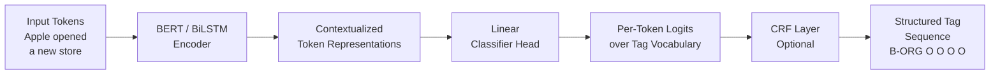

# 🏷️ Sequence Labeling

> [!abstract] TL;DR
> Sequence labeling assigns a structured label to each token in a sequence. Key tasks: Named Entity Recognition (NER — find "Apple Inc." as ORG), Part-of-Speech tagging (POS — "running" as VERB), and chunking. The BIO/BIOES tagging scheme encodes multi-token spans unambiguously. Modern approaches use BERT fine-tuned on token classification; CRFs add structured prediction to ensure valid label sequences. Evaluation uses span-level F1, not token accuracy, because partial entity matches don't count.

---

## Intuition — Analogy First

Imagine a copy editor marking up a manuscript. For each word, they annotate:
- *Is this a person's name? A company? A location?*
- *Is this a noun, verb, adjective?*
- *Does this word start a named entity, continue one, or is it unrelated?*

They work left to right through the text, labeling every single word. Crucially, they can't just label individual words in isolation — "New" by itself isn't a location, but "New York" together is. The labels have structure: once you've labeled "New" as the beginning of a location entity, "York" must be labeled as its continuation.

This is exactly what sequence labeling models do: read tokens sequentially, output one label per token, and respect the structural constraints of the labeling scheme.

---

## How It Works — Mechanics



### BIO Tagging Scheme

The most common scheme for encoding multi-token spans:

| Tag Prefix | Meaning | Example |
|---|---|---|
| `B-` | Beginning of an entity | `B-ORG` = first token of an organization |
| `I-` | Inside / continuation | `I-ORG` = second+ token of same organization |
| `O` | Outside all entities | not part of any named entity |

**Example sentence:**
```
Token:    Apple     Inc.    announced  earnings  in   New     York
BIO tag:  B-ORG     I-ORG   O          O         O    B-LOC   I-LOC
```

### BIOES Tagging Scheme (more expressive)

| Prefix | Meaning |
|---|---|
| `B-` | Beginning of multi-token span |
| `I-` | Inside multi-token span |
| `O` | Outside |
| `E-` | End of multi-token span |
| `S-` | Single-token span (entire entity in one token) |

BIOES allows the model to explicitly mark entity boundaries, which helps training but makes the label set larger.

### Common Sequence Labeling Tasks

**Named Entity Recognition (NER):**
- Labels: PER (person), ORG (organization), LOC (location), MISC (miscellaneous)
- Extended labels: DATE, TIME, MONEY, PERCENT, PRODUCT, EVENT, NORP (nationality/religion/political)

**Part-of-Speech Tagging:**
- Labels: NN (noun), VBZ (verb, 3rd singular present), JJ (adjective), RB (adverb), IN (preposition), DT (determiner), ...
- Uses Penn Treebank tagset (45 tags) or Universal POS (17 tags)

**Chunking (shallow parsing):**
- Identifies NP (noun phrases), VP (verb phrases), PP (prepositional phrases) without full parse tree

### Conditional Random Field (CRF) Layer

A CRF on top of the neural encoder adds structural constraints:
- Transition scores: learns that `I-ORG` after `O` is illegal (must start with `B-`)
- Uses Viterbi decoding to find globally optimal label sequence
- During training: CRF maximizes the conditional probability of the correct sequence
- During inference: finds the highest-scoring valid sequence

Without CRF, the model might output invalid sequences like `O → I-ORG → B-ORG` (which violates BIO rules). CRF prevents this.

---

## The Math

**CRF score for a sequence:**

Given input $\mathbf{x}$ and label sequence $\mathbf{y} = (y_1, y_2, ..., y_T)$:

$$s(\mathbf{x}, \mathbf{y}) = \sum_{t=1}^{T} \psi_t(y_t, \mathbf{x}) + \sum_{t=2}^{T} T(y_{t-1}, y_t)$$

Where:
- $\psi_t(y_t, \mathbf{x})$ = emission score for label $y_t$ at position $t$ (from neural encoder)
- $T(y_{t-1}, y_t)$ = transition score from label $y_{t-1}$ to $y_t$ (learned matrix)

**Conditional probability:**
$$P(\mathbf{y} | \mathbf{x}) = \frac{\exp(s(\mathbf{x}, \mathbf{y}))}{\sum_{\mathbf{y}'} \exp(s(\mathbf{x}, \mathbf{y}'))}$$

**Span-level F1 (the correct evaluation metric for NER):**

$$\text{Precision} = \frac{\text{correctly predicted spans}}{\text{total predicted spans}}, \quad \text{Recall} = \frac{\text{correctly predicted spans}}{\text{total gold spans}}$$

$$F_1 = \frac{2 \cdot P \cdot R}{P + R}$$

A span is "correct" only if BOTH the entity type AND the exact boundary (start, end token) match. A predicted "Apple Inc." (ORG) when the gold has "Apple" (ORG) is wrong — the boundary is different.

---

## Code Demo

```python
from transformers import (
    AutoTokenizer,
    AutoModelForTokenClassification,
    pipeline,
    TrainingArguments,
    Trainer,
)
import torch
from datasets import load_dataset
import numpy as np
from seqeval.metrics import f1_score, classification_report

# ── Quick NER inference with pipeline ────────────────────────────────────────
ner_pipeline = pipeline(
    "ner",
    model="dslim/bert-base-NER",        # fine-tuned BERT for NER
    aggregation_strategy="simple",      # merge subword tokens into words
)

text = "Apple Inc. CEO Tim Cook announced new iPhone models in Cupertino, California on Tuesday."
entities = ner_pipeline(text)
for entity in entities:
    print(f"  {entity['word']:20} {entity['entity_group']:6} score={entity['score']:.3f}")
# Apple Inc.          ORG    score=0.998
# Tim Cook            PER    score=0.997
# iPhone              MISC   score=0.871
# Cupertino           LOC    score=0.993
# California          LOC    score=0.996

# ── BIO scheme — manual labeling example ─────────────────────────────────────
tokens = ["Apple", "Inc.", "announced", "earnings", "in", "New", "York"]
bio_tags = ["B-ORG", "I-ORG", "O", "O", "O", "B-LOC", "I-LOC"]
bioes_tags = ["B-ORG", "E-ORG", "O", "O", "O", "B-LOC", "E-LOC"]

# ── Fine-tuning BERT for NER (CoNLL-2003 dataset) ────────────────────────────
dataset = load_dataset("conll2003")

model_name = "bert-base-cased"      # cased: NER is case-sensitive
tokenizer = AutoTokenizer.from_pretrained(model_name)

label_list = dataset["train"].features["ner_tags"].feature.names
# ['O', 'B-PER', 'I-PER', 'B-ORG', 'I-ORG', 'B-LOC', 'I-LOC', 'B-MISC', 'I-MISC']
num_labels = len(label_list)

model = AutoModelForTokenClassification.from_pretrained(
    model_name, num_labels=num_labels
)

def tokenize_and_align_labels(examples):
    """Critical: align word-level labels to subword tokens."""
    tokenized = tokenizer(
        examples["tokens"],
        truncation=True,
        is_split_into_words=True,   # input is already tokenized into words
    )
    all_labels = []
    for i, labels in enumerate(examples["ner_tags"]):
        word_ids = tokenized.word_ids(batch_index=i)
        aligned_labels = []
        prev_word_id = None
        for word_id in word_ids:
            if word_id is None:
                # Special tokens [CLS], [SEP] → -100 (ignored in loss)
                aligned_labels.append(-100)
            elif word_id != prev_word_id:
                # First subword of a word → use the word's label
                aligned_labels.append(labels[word_id])
            else:
                # Continuation subwords → -100 (ignore) OR use I- label
                aligned_labels.append(-100)
            prev_word_id = word_id
        all_labels.append(aligned_labels)
    tokenized["labels"] = all_labels
    return tokenized

tokenized_dataset = dataset.map(tokenize_and_align_labels, batched=True)

# ── Evaluation: span-level F1 with seqeval ───────────────────────────────────
def compute_metrics(eval_preds):
    logits, labels = eval_preds
    predictions = np.argmax(logits, axis=-1)

    true_preds, true_labels = [], []
    for pred_seq, label_seq in zip(predictions, labels):
        word_preds, word_labels = [], []
        for p, l in zip(pred_seq, label_seq):
            if l != -100:
                word_preds.append(label_list[p])
                word_labels.append(label_list[l])
        true_preds.append(word_preds)
        true_labels.append(word_labels)

    return {"f1": f1_score(true_labels, true_preds)}

training_args = TrainingArguments(
    output_dir="./ner-bert",
    num_train_epochs=3,
    per_device_train_batch_size=16,
    per_device_eval_batch_size=64,
    evaluation_strategy="epoch",
    learning_rate=5e-5,
    weight_decay=0.01,
)

trainer = Trainer(
    model=model,
    args=training_args,
    train_dataset=tokenized_dataset["train"],
    eval_dataset=tokenized_dataset["validation"],
    compute_metrics=compute_metrics,
)
trainer.train()
```

---

## Real-World Example

**Google Knowledge Graph entity extraction**

Google's Knowledge Graph relies heavily on NER to extract structured entities from unstructured web text. When Google indexes "Tim Cook announced Apple's new MacBook Pro at WWDC in San Jose", the NER system identifies:
- `Tim Cook` → Person
- `Apple` → Organization
- `MacBook Pro` → Product
- `WWDC` → Event
- `San Jose` → Location

These extractions populate the Knowledge Graph, enabling rich search features (the knowledge panel, "People also ask", entity cards).

**LinkedIn skill tagging:** LinkedIn uses sequence labeling to extract skills from job descriptions and resumes. "Experience with Python, Docker, and AWS EC2" → extract [Python (SKILL), Docker (SKILL), AWS EC2 (SKILL)].

**Clinical NLP — drug mention detection:** Medical NER systems (running on clinical notes) extract drug names, dosages, and adverse events. "Patient was prescribed 10mg Lisinopril for hypertension" → [Lisinopril (DRUG), 10mg (DOSAGE), hypertension (CONDITION)]. This feeds pharmacovigilance and clinical trial matching systems.

---

## Trade-offs

| Approach | Pros | Cons |
|---|---|---|
| Rule-based (regex + gazetteer) | Interpretable; precise for known entities | Brittle; no generalization; high maintenance |
| BiLSTM-CRF | Good sequence modeling; efficient | Needs hand-crafted features or embeddings |
| BERT + linear head (no CRF) | Strong contextual representations; simple | May produce invalid label sequences |
| BERT + CRF | Best structured prediction quality | Slightly more complex to implement; slower |
| GPT-style generative NER | Zero-shot / few-shot possible | Slower; harder to control output format exactly |
| spaCy rule-based + ML | Fast; production-ready; easy rules integration | Not state-of-the-art on standard benchmarks |

---

## When to Use vs Avoid

**Use BERT + token classification when:**
- You have labeled sequence labeling data (even 1,000 annotated sentences)
- NER, POS tagging, chunking on standard entity types
- Production system where inference latency is manageable (~50ms)
- The entity types match standard CoNLL-style categories

**Use rule-based / gazetteer when:**
- Entity types are highly structured and enumerable (product codes, drug names from a known list)
- You need perfect recall on a closed set
- No labeled training data is available

**Consider generative LLMs when:**
- Zero-shot / few-shot extraction needed for novel entity types
- Entity definitions are complex and hard to encode in BIO labels
- You need to extract relationships alongside entities

---

## Common Pitfalls

1. **Using token accuracy instead of span F1** — A model that labels every token as `O` achieves high token accuracy on a corpus where 90% of tokens are `O`. Always use seqeval span-level F1 for NER evaluation.

2. **Ignoring subword-to-word alignment** — When you tokenize with BERT's WordPiece, "NewYork" might become ["New", "##york"]. Your training labels are for words, not subwords. Failing to align labels to subword tokens (setting continuation tokens to -100) corrupts training.

3. **Using uncased BERT for NER** — Capitalization is a strong signal for named entities in English ("apple" vs "Apple"). Always use cased models (`bert-base-cased`, not `bert-base-uncased`) for NER.

4. **Evaluating on token-level when entities span multiple tokens** — "New York City" is one entity. If the model predicts "New York" but misses "City", a token-level metric calls this 66% correct. Span-level F1 correctly calls this 0% (wrong boundary).

5. **Ignoring transition constraints without CRF** — Without CRF, a model can emit `O → I-ORG` which violates BIO rules. Either add a CRF layer or post-process to fix invalid sequences.

---

## Related Concepts

- [[_MOC_NLP|↑ Section MOC]]

- [[BERT]] — the standard encoder backbone for modern NER and POS tagging
- [[Text_Preprocessing]] — tokenization must happen before labeling
- [[Tokenization]] — subword tokenization creates the word-to-token alignment challenge
- [[Word_Embeddings]] — older approaches used pre-trained embeddings as features for BiLSTM-CRF

---

## Review Questions

1. In the BIO tagging scheme, why can a token tagged `I-ORG` not follow a token tagged `O`? What constraint does this violate, and how does a CRF layer learn to prevent this error at inference time?

2. Your NER model achieves 95% token-level accuracy on the test set, but the business team reports it's "missing most entities." You look at the data and find that 92% of tokens are `O`. Explain what's happening, what the correct evaluation metric is, and what baseline the model needs to beat.

3. You fine-tune BERT for clinical NER on a dataset with labels for DRUG, DOSAGE, and CONDITION. At inference time, the word "Metformin" is split into subwords ["Met", "##for", "##min"]. How should you handle the predictions for these three subword tokens to produce a single word-level prediction, and why does the choice matter for span-level F1?

---

## Sources

- Lample, G., Ballesteros, M., Subramanian, S., Kawakami, K., & Dyer, C. (2016). Neural Architectures for Named Entity Recognition. *NAACL 2016*. https://arxiv.org/abs/1603.01360
- Devlin, J., Chang, M.-W., Lee, K., & Toutanova, K. (2019). BERT: Pre-training of Deep Bidirectional Transformers. *NAACL 2019*. https://arxiv.org/abs/1810.04805
- Sang, E. F., & De Meulder, F. (2003). Introduction to the CoNLL-2003 shared task: Language-independent named entity recognition. *CoNLL 2003*.
- seqeval library: https://github.com/chakki-works/seqeval

#nlp #ner #sequence-labeling #pos-tagging #token-classification #crf #bio-tagging #intermediate
