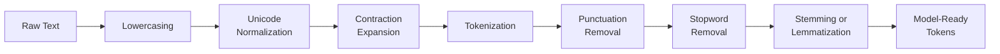

# 🥗 Text Preprocessing

> [!abstract] TL;DR
> Text preprocessing is the mandatory first stage of any NLP pipeline: raw text is messy, inconsistent, and full of noise. Preprocessing converts it into a clean, normalized form that downstream models can actually learn from. The key operations are tokenization, lowercasing, stopword removal, stemming/lemmatization, and text normalization. Like mise en place in cooking, doing this well makes everything downstream faster and more accurate.

---

## Intuition — Analogy First

Think of preprocessing as a chef's prep work before cooking. A chef doesn't throw whole cabbages and dirty carrots into the pot — they wash, peel, chop, and measure every ingredient first. Only then does actual cooking begin.

Raw text is the dirty cabbage:
- Inconsistent casing ("Dog" vs "dog" vs "DOG")
- Noise and punctuation ("Hello!!!! 😊 how r u??")
- Redundant words ("the", "is", "and" — stopwords that add little meaning)
- Morphological variants ("running", "runs", "ran" all mean the same root concept)
- Unicode inconsistencies (curly quotes, em-dashes, accented characters)

Preprocessing washes and chops all of this into uniform, model-ready tokens. Miss this step and your model spends its capacity learning that "Dog" and "dog" are different animals.

---

## How It Works — Mechanics

A preprocessing pipeline chains multiple operations in sequence. Each step has a reason:



**Step-by-step breakdown:**

| Step | What It Does | Example |
|---|---|---|
| Lowercasing | Reduces vocabulary size, removes case noise | "Apple" → "apple" |
| Unicode normalization | Standardizes encodings (NFC/NFKC), removes zero-width chars | "café" → "cafe" (NFKD) |
| Contraction expansion | Resolves ambiguity for downstream tokenization | "don't" → "do not" |
| Tokenization | Splits text into discrete units (words, subwords) | "I love NLP" → ["I", "love", "NLP"] |
| Punctuation removal | Strips characters that carry no semantic content (context-dependent!) | "hello!" → "hello" |
| Stopword removal | Removes high-frequency, low-information words | "the cat sat" → ["cat", "sat"] |
| Stemming/Lemmatization | Reduces words to base form | "running" → "run" |

> [!warning] Not all steps are always needed
> For transformer-based models (BERT, GPT), lowercasing is usually the only manual step — their subword tokenizers handle the rest. Heavy preprocessing like stopword removal can actually hurt performance on modern deep models. Always match preprocessing to the model downstream.

---

## The Math

**Vocabulary size impact:** If you skip lowercasing, your vocabulary contains both "Apple" and "apple" as separate entries. With a corpus of V unique lowercase words, cased vocabulary can grow to ~1.3V (rough estimate). Every extra vocabulary entry adds a dimension to your one-hot or embedding matrix.

**TF-IDF and stopwords:** The reason stopwords like "the" have low value is that their term frequency (TF) is high everywhere, making their TF-IDF score near zero:

$$\text{TF-IDF}(t, d) = \underbrace{\frac{f_{t,d}}{|d|}}_{\text{TF}} \times \underbrace{\log\frac{|D|}{|\{d : t \in d\}|}}_{\text{IDF}}$$

When "the" appears in nearly every document, the IDF term approaches $\log(1) = 0$, making the whole score negligible.

---

## Code Demo

```python
import nltk
import spacy
from nltk.stem import PorterStemmer
from nltk.corpus import stopwords

nltk.download("stopwords", quiet=True)
nltk.download("punkt_tab", quiet=True)

# ── NLTK stemming pipeline ──────────────────────────────────────────────────
def nltk_preprocess(text: str) -> list[str]:
    stemmer = PorterStemmer()
    stop_words = set(stopwords.words("english"))

    tokens = nltk.word_tokenize(text.lower())           # lowercase + tokenize
    tokens = [t for t in tokens if t.isalpha()]         # remove punctuation/numbers
    tokens = [t for t in tokens if t not in stop_words] # remove stopwords
    tokens = [stemmer.stem(t) for t in tokens]          # stem
    return tokens

# ── spaCy lemmatization pipeline ────────────────────────────────────────────
nlp = spacy.load("en_core_web_sm")

def spacy_preprocess(text: str) -> list[str]:
    doc = nlp(text.lower())
    tokens = [
        token.lemma_
        for token in doc
        if not token.is_stop          # remove stopwords
        and not token.is_punct        # remove punctuation
        and not token.is_space        # remove whitespace tokens
        and token.is_alpha            # only alphabetic tokens
    ]
    return tokens

# ── Stemming vs lemmatization comparison ────────────────────────────────────
test_phrases = [
    "The children were running quickly through the better gardens",
    "Studies showed the mice were running experiments",
    "He was caring for the geese while studying",
]

print(f"{'Original':<55} {'Stemmed':<40} {'Lemmatized'}")
print("-" * 130)
for phrase in test_phrases:
    stemmed = nltk_preprocess(phrase)
    lemmatized = spacy_preprocess(phrase)
    print(f"{phrase:<55} {str(stemmed):<40} {str(lemmatized)}")
```

**Key difference — stemming vs lemmatization:**

```
Input:    "The children were running quickly through the better gardens"
Stemmed:  ['children', 'run', 'quickli', 'better', 'garden']
           ↑ "quickly" → "quickli" (broken but consistent)
Lemmatized: ['child', 'run', 'quickly', 'well', 'garden']
             ↑ "better" → "well" (actually understands grammar!)
             ↑ "children" → "child" (true morphological reduction)
```

Lemmatization uses the word's POS tag to make grammatically-aware reductions; stemming just chops suffixes with heuristic rules.

---

## Real-World Example

**spaCy in Production NLP Systems**

spaCy is the industry standard for production preprocessing. The `nlp` pipeline object chains tokenization, POS tagging, dependency parsing, and NER in a single pass:

```python
doc = nlp("Apple Inc. announced quarterly earnings in Cupertino, California.")
for token in doc:
    print(f"{token.text:15} | POS: {token.pos_:6} | Lemma: {token.lemma_:15} | Stop: {token.is_stop}")
```

Output:
```
Apple           | POS: PROPN  | Lemma: Apple           | Stop: False
Inc.            | POS: PROPN  | Lemma: Inc.            | Stop: False
announced       | POS: VERB   | Lemma: announce        | Stop: False
quarterly       | POS: ADJ    | Lemma: quarterly       | Stop: False
earnings        | POS: NOUN   | Lemma: earning         | Stop: False
in              | POS: ADP    | Lemma: in              | Stop: True
...
```

All modern LLMs (GPT, BERT, LLaMA) have preprocessing as step one of their data pipelines. The Pile (used to train many open-source LLMs) went through deduplication, language detection, quality filtering, and normalization before any model saw it.

---

## Trade-offs

| Technique | Pros | Cons |
|---|---|---|
| Lowercasing | Reduces vocab, handles inconsistency | Breaks named entities ("US" vs "us") |
| Stopword removal | Speeds up bag-of-words models, reduces noise | Removes semantically critical words in some tasks ("not", "no") |
| Stemming (Porter) | Fast, simple, deterministic | Produces non-words ("quickli"), no POS awareness |
| Lemmatization (spaCy) | Produces real words, POS-aware | Slower, requires POS tagger, language-specific models |
| Punctuation removal | Simplifies vocabulary | Breaks sentence boundaries; destroys meaning in code/URLs |
| Heavy preprocessing for transformers | Can help for classical ML | Often hurts BERT/GPT — subword tokenizers handle it better |

---

## When to Use vs Avoid

**Use heavy preprocessing when:**
- Training classical ML models (TF-IDF + Logistic Regression, Naive Bayes, SVM)
- Working with very noisy user-generated text (tweets, SMS)
- You have limited training data and need to reduce vocabulary manually
- Building bag-of-words features

**Avoid / minimize preprocessing when:**
- Fine-tuning transformer models (BERT, RoBERTa, GPT) — their tokenizers handle normalization
- Tasks where case matters (named entity recognition, proper nouns)
- Tasks where "not" and negation are important (sentiment analysis with removal of "not" destroys meaning)
- Code or technical text where punctuation is semantic

---

## Common Pitfalls

1. **Removing negations with stopwords** — "not good" becomes "good" after stopword removal. This inverts sentiment. Always check your stopword list.

2. **Over-stemming** — Porter stemmer maps "organization" → "organ", "university" → "univers". For search and classification these broken forms can match unrelated concepts.

3. **Applying classical preprocessing to transformer models** — BERT was pretrained on raw text. Stripping stopwords or stemming before feeding BERT changes the token distribution away from what it learned.

4. **Forgetting sentence boundaries** — removing periods before tokenizing causes "end of sentence. Start of next" to merge across sentences.

5. **Ignoring Unicode edge cases** — zero-width joiners, bidirectional markers, and lookalike characters (Cyrillic "а" vs Latin "a") can silently corrupt text without normalization.

6. **Not fitting preprocessing on training data only** — if you build a stopword list or vocabulary from the full dataset, you leak test information. Fit only on train.

---

## Related Concepts

- [[_MOC_NLP|↑ Section MOC]]

- [[Tokenization]] — the central step in preprocessing; word vs subword methods
- [[Word_Embeddings]] — the representation that follows preprocessing
- [[BERT]] — transformer that benefits from minimal preprocessing
- [[Language_Model_Basics]] — why preprocessing quality affects model training
- [[Sequence_Labeling]] — NER and POS tagging depend on clean tokenization

---

## Review Questions

1. A sentiment classifier trained with stopword removal is performing poorly on product reviews. Upon inspection you notice reviews like "not bad", "not good", "nothing wrong" are being misclassified. What preprocessing change would you make and why?

2. You're fine-tuning a BERT model for document classification. A colleague suggests stemming all tokens before encoding. Should you do this? What happens inside BERT's tokenizer that makes this unnecessary or harmful?

3. What is the difference between stemming and lemmatization? Give a concrete example where lemmatization produces a meaningfully better output, and explain why stemming fails in that case.

---

## Sources

- Bird, S., Klein, E., & Loper, E. (2009). *Natural Language Processing with Python*. O'Reilly. https://www.nltk.org/book/
- Honnibal, M., & Montani, I. (2017). spaCy 2: Natural language understanding with Bloom embeddings, convolutional neural networks and incremental parsing. https://spacy.io
- Manning, C. D., Raghavan, P., & Schütze, H. (2008). *Introduction to Information Retrieval*. Cambridge University Press. https://nlp.stanford.edu/IR-book/

#nlp #preprocessing #tokenization #stemming #lemmatization #text-cleaning #fundamentals
