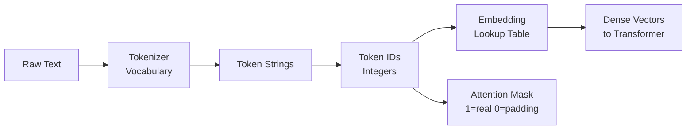

# ✂️ Tokenization

> [!abstract] TL;DR
> Tokenization is the process of splitting raw text into discrete units (tokens) that a model can process numerically. Three main strategies exist: character, word, and subword tokenization. Subword tokenization (BPE, WordPiece, SentencePiece) is the modern standard — it handles out-of-vocabulary words gracefully, keeps vocabulary sizes manageable, and is what every major LLM uses. Every transformer begins with a tokenizer that converts text → token IDs → embeddings.

---

## Intuition — Analogy First

Think of tokenization as cutting a recipe into measurable units before cooking. Word tokenization cuts at spaces — "un happiness" becomes ["un", "happiness"], which is clean when it works. But what about "unhappiness"? Word tokenization either treats it as a single unknown unit or fails entirely.

Subword tokenization is smarter: it cuts "unhappiness" into ["un", "happiness"] (or ["un", "##happi", "##ness"] in BERT's notation) because it has learned that these subunits are common building blocks. It's like a chef who knows that "tablespoon" = "table" + "spoon" when they run out of the measurement label — they can still represent it.

The key insight: **subword tokenization balances vocabulary size against sequence length**. Character tokenization has tiny vocabulary (26 letters) but very long sequences. Word tokenization has compact sequences but huge vocabulary and OOV problems. Subword lives in between.

---

## How It Works — Mechanics



### Three tokenization strategies:

**1. Character tokenization**
```
"hello" → ["h", "e", "l", "l", "o"] → [72, 65, 76, 76, 79]
```
- Pros: no OOV words, tiny vocabulary (~256 chars)
- Cons: very long sequences; model must learn to compose characters into meaning

**2. Word tokenization**
```
"I love NLP!" → ["I", "love", "NLP", "!"] → [1045, 2293, 17953, 999]
```
- Pros: intuitive, short sequences
- Cons: OOV problem ("ChatGPT" → [UNK]); vocabulary must be 50K–500K words

**3. Subword tokenization (modern standard)**
```
"unhappiness" → ["un", "##happi", "##ness"] (BERT/WordPiece)
"unhappiness" → ["un", "happ", "iness"]     (GPT/BPE)
"unhappiness" → ["▁un", "happiness"]        (LLaMA/SentencePiece)
```
- Pros: handles OOV via decomposition, compact vocabulary (32K–100K), works across languages
- Cons: tokens don't always align with human intuitions; token counts affect cost for LLM APIs

### Special tokens

Every transformer-based tokenizer adds special tokens with specific roles:

| Token | Used By | Purpose |
|---|---|---|
| `[CLS]` | BERT | Classification token — pooled representation for classification tasks |
| `[SEP]` | BERT | Separator between sentence A and sentence B |
| `[PAD]` | BERT, most | Padding to make sequences equal length in a batch |
| `[UNK]` | Most | Unknown token for characters/words outside vocabulary |
| `[MASK]` | BERT | Masked token for masked language model pretraining |
| `<s>`, `</s>` | RoBERTa, LLaMA | Start/end of sequence |
| `<\|endoftext\|>` | GPT-2/3/4 | End of document signal |

---

## The Math

**Vocabulary coverage vs sequence length trade-off:**

Let $V$ = vocabulary size, $L$ = average sequence length in tokens, $C$ = total characters in corpus.

- Character: $V \approx 256$, $L = C$
- Word: $V \approx 50{,}000$–$500{,}000$, $L \approx C / 5$ (avg word length ~5 chars)
- Subword (BPE 32K): $V = 32{,}000$, $L \approx C / 3.5$

For transformer attention, computational cost is $O(L^2 \cdot d)$ per layer. Longer sequences from character tokenization are quadratically more expensive — a key reason subword tokenization is dominant.

**Token ID to embedding:**

$$\mathbf{e}_i = W_E[t_i], \quad W_E \in \mathbb{R}^{V \times d_{model}}$$

Where $t_i$ is the token ID (integer), $W_E$ is the embedding matrix (learned), and $\mathbf{e}_i \in \mathbb{R}^{d_{model}}$ is the dense embedding for that token.

---

## Code Demo

```python
from transformers import AutoTokenizer

# ── Load tokenizers for different models ─────────────────────────────────────
bert_tokenizer = AutoTokenizer.from_pretrained("bert-base-uncased")
gpt2_tokenizer = AutoTokenizer.from_pretrained("gpt2")
llama_tokenizer = AutoTokenizer.from_pretrained("meta-llama/Llama-2-7b-hf")  # needs HF access

text = "The unhappiness of tokenization is misunderstood."

# ── BERT tokenization (WordPiece) ────────────────────────────────────────────
bert_tokens = bert_tokenizer.tokenize(text)
bert_ids = bert_tokenizer.encode(text)
print(f"BERT tokens: {bert_tokens}")
# ['the', 'un', '##happi', '##ness', 'of', 'token', '##ization', 'is', 'mis', '##under', '##stood', '.']
print(f"BERT IDs:    {bert_ids}")

# ── Full encoding with attention mask ────────────────────────────────────────
encoding = bert_tokenizer(
    text,
    return_tensors="pt",
    padding=True,
    truncation=True,
    max_length=128,
)
print(f"\nInput IDs:      {encoding['input_ids']}")
print(f"Attention mask: {encoding['attention_mask']}")
# attention_mask: 1 for real tokens, 0 for [PAD] tokens

# ── Decode back to text ───────────────────────────────────────────────────────
decoded = bert_tokenizer.decode(encoding["input_ids"][0])
print(f"\nDecoded: {decoded}")
# [CLS] the unhappiness of tokenization is misunderstood. [SEP]

# ── GPT-2 tokenization (BPE) — no [CLS]/[SEP] ────────────────────────────────
gpt2_tokens = gpt2_tokenizer.tokenize(text)
print(f"\nGPT-2 tokens: {gpt2_tokens}")
# ['The', 'Ġun', 'happiness', 'Ġof', 'Ġtoken', 'ization', 'Ġis', 'Ġmisunder', 'stood', '.']
# Note: Ġ prefix means "preceded by space"

# ── Batch encoding (critical for training) ───────────────────────────────────
sentences = [
    "I love machine learning.",
    "Tokenization is the first step.",
    "Transformers changed NLP.",
]
batch = bert_tokenizer(
    sentences,
    padding=True,      # pad shorter sequences
    truncation=True,   # truncate longer sequences
    max_length=32,
    return_tensors="pt",
)
print(f"\nBatch input_ids shape: {batch['input_ids'].shape}")
# torch.Size([3, 32]) — 3 sentences, 32 tokens each (padded)

# ── Token count analysis ──────────────────────────────────────────────────────
long_text = "This is an example of how token counts affect API costs in LLM providers."
n_tokens = len(bert_tokenizer.encode(long_text))
print(f"\n'{long_text[:50]}...' → {n_tokens} BERT tokens")
```

---

## Real-World Example

**GPT-4 uses ~100K token BPE vocabulary (tiktoken)**

OpenAI's `tiktoken` library implements the GPT tokenizer. The GPT-4 tokenizer (`cl100k_base`) has 100,277 tokens, which is ~3x larger than GPT-2's 50,257. This larger vocabulary means:
- More tokens represent full common words (fewer subword splits)
- Shorter average sequence lengths for the same text
- Lower inference cost per document

**Practical impact:** A 4,096-token context window with GPT-4 corresponds to roughly 3,000 words of English text. However, code, foreign languages, and rare words tokenize less efficiently — sometimes 1 token per character for very unusual inputs.

```python
import tiktoken

enc = tiktoken.encoding_for_model("gpt-4")
text = "The transformer architecture revolutionized natural language processing in 2017."
tokens = enc.encode(text)
print(f"Token count: {len(tokens)}")
print(f"Tokens: {[enc.decode([t]) for t in tokens]}")
```

---

## Trade-offs

| Strategy | Vocab Size | OOV Handling | Sequence Length | Speed | Best For |
|---|---|---|---|---|---|
| Character | ~256 | Perfect | Very long | Fast | Character-level models, multilingual |
| Word | 50K–500K | Poor ([UNK]) | Short | Fast | Simple baselines, classical ML |
| BPE (GPT) | 32K–100K | Excellent | Medium | Fast | Autoregressive LLMs |
| WordPiece (BERT) | 30K | Excellent | Medium | Fast | Bidirectional encoders |
| SentencePiece (LLaMA) | 32K | Excellent | Medium | Fast | Multilingual, language-agnostic |
| Unigram LM | Variable | Good | Medium | Moderate | Probabilistic tokenization |

---

## When to Use vs Avoid

**BPE (GPT-4, GPT-2, LLaMA):**
- Use when: autoregressive generation, code generation, large multilingual corpora
- Avoid when: you need strict character-level control

**WordPiece (BERT, DistilBERT):**
- Use when: fine-tuning BERT-family models for classification/NER
- Note: `##` prefix convention marks continuation subwords

**SentencePiece:**
- Use when: multilingual tasks, language-agnostic preprocessing, you want to train a tokenizer from scratch on new text
- Used by: LLaMA, T5, mT5, mBART

**Word tokenization:**
- Still valid for: classical ML baselines (TF-IDF + Logistic Regression), simple text processing where transformer models aren't used

---

## Common Pitfalls

1. **Assuming 1 token = 1 word** — Subword tokenization means "tokenization" might be 3 tokens. Token count ≠ word count. This matters for LLM API cost estimation and context window limits.

2. **Forgetting to add special tokens** — If you manually tokenize and skip `bert_tokenizer.encode()` (using `tokenize()` instead), you miss the `[CLS]` and `[SEP]` tokens that BERT expects. Always use the full `encode()` or `__call__()` interface.

3. **Using the wrong tokenizer for a model** — GPT-2's tokenizer won't work correctly with BERT. Always load the tokenizer paired with the model: `AutoTokenizer.from_pretrained(model_name)`.

4. **Ignoring the attention mask** — Padded tokens should always have `attention_mask=0`. If you feed padded sequences without masks, the model attends to padding tokens and performance degrades.

5. **Token boundary misalignment with NER** — In token classification, the model outputs one label per token, but subword tokenization splits one word into multiple tokens. You must align predictions back to word boundaries using `word_ids()`.

---

## Related Concepts

- [[_MOC_NLP|↑ Section MOC]]

- [[Tokenization_Algorithms]] — deep dive into BPE, WordPiece, SentencePiece mechanics
- [[BERT]] — uses WordPiece tokenization with `[CLS]`/`[SEP]`/`[MASK]` special tokens
- [[GPT_Family]] — uses BPE tokenization; `tiktoken` library for OpenAI models
- [[Word_Embeddings]] — what token IDs map to: dense embedding vectors
- [[Text_Preprocessing]] — preprocessing that happens before tokenization
- [[Sequence_Labeling]] — where subword-to-word alignment is critical for NER

---

## Review Questions

1. A word tokenizer represents "ChatGPT" as `[UNK]`. A subword tokenizer (BPE) represents it as `["Chat", "G", "PT"]`. Which representation is better for a downstream model and why? What capability does subword tokenization provide that word tokenization cannot?

2. BERT encodes text as: `[CLS] My sentence [SEP]`. What is the purpose of each special token, and which one would you use to perform document-level classification?

3. You are building a token classifier (NER) on top of BERT. The input word "unhappiness" is split into `["un", "##happi", "##ness"]` by WordPiece. How would you handle the fact that your training labels are at the word level, not the subword level, and what strategy should you use to produce word-level predictions at inference?

---

## Sources

- Sennrich, R., Haddow, B., & Birch, A. (2016). Neural Machine Translation of Rare Words with Subword Units. *ACL 2016*. https://arxiv.org/abs/1508.07909
- Devlin, J., Chang, M.-W., Lee, K., & Toutanova, K. (2019). BERT: Pre-training of Deep Bidirectional Transformers. *NAACL 2019*. https://arxiv.org/abs/1810.04805
- HuggingFace Tokenizers documentation. https://huggingface.co/docs/tokenizers/

#nlp #tokenization #subword #bpe #wordpiece #sentencepiece #transformers #fundamentals
