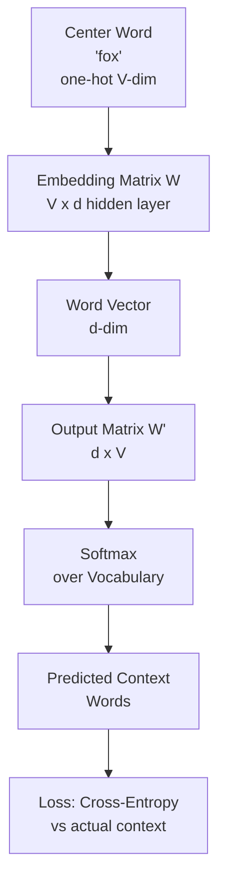
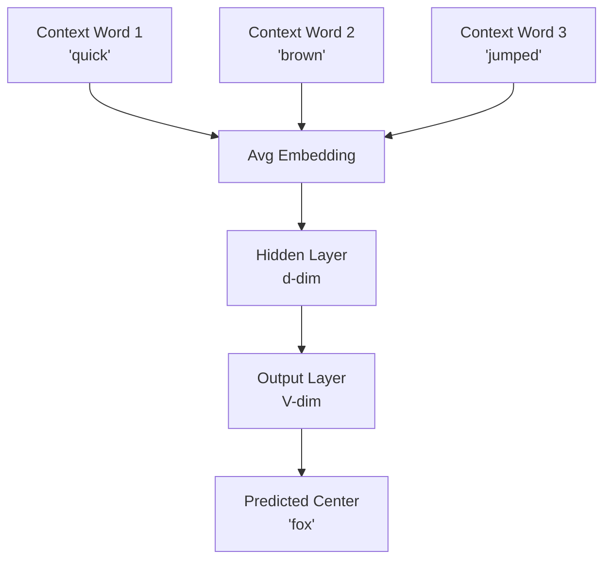

# 🔤 Word2Vec

> [!abstract] TL;DR
> Word2Vec (Mikolov et al., 2013) learns dense word embeddings by training a shallow neural network to predict words from context (CBOW) or context from words (Skip-gram). The key insight: you don't need the prediction task's output — the hidden layer weights become the embeddings. Negative sampling makes training tractable by avoiding a softmax over the entire vocabulary. The resulting vectors support analogy arithmetic (king − man + woman ≈ queen), demonstrating that semantic and syntactic relationships are encoded geometrically.

---

## Intuition — Analogy First

The fundamental principle behind Word2Vec is J.R. Firth's linguistic hypothesis: **"You shall know a word by the company it keeps."**

Consider the word "bank":
- In "deposit money at the bank" → surrounded by: money, deposit, account, interest
- In "sitting on the bank of the river" → surrounded by: river, sitting, water, boat

The co-occurrence patterns are completely different. If you build a model that learns to predict these contexts, words with similar meanings end up with similar prediction patterns — and therefore similar weight vectors (embeddings).

It's like learning what a new person is like by watching which parties they attend. If someone always shows up at jazz clubs, gallery openings, and poetry readings, you infer "artistic, culturally sophisticated." Two people who attend the same events share similar "social context vectors."

---

## How It Works — Mechanics

Word2Vec offers two architectures:

### Skip-gram (predict context from center word)

Given center word "fox", predict surrounding words: ["the", "quick", "jumped", "over"]



### CBOW (predict center word from context)

Given context ["quick", "brown", "jumped", "over"], predict center word "fox".



**Architecture comparison:**

| | Skip-gram | CBOW |
|---|---|---|
| Input | Center word | Context words (averaged) |
| Output | Context words | Center word |
| Better for | Rare words, large data | Common words, small data, speed |
| Training speed | Slower (multiple outputs per word) | Faster (one output per word) |

### Negative Sampling (the key efficiency trick)

Full softmax over vocabulary $V = 50{,}000$ words is expensive for every training step. Negative sampling converts the multiclass problem into binary classification:

For each (center, context) positive pair, sample $k$ negative words (random words NOT in the context). Train a binary classifier: "Is this a real context pair?"

- Positive pair (fox, jumped): label = 1
- Negative pair (fox, telescope): label = 0
- Negative pair (fox, bureaucracy): label = 0

Instead of computing $V$ probabilities, you compute $k+1$ (typically $k = 5$–$15$). This is 1000x–3000x fewer operations per step.

---

## The Math

### Skip-gram objective (without negative sampling)

Maximize log likelihood of context words given center:

$$J = \frac{1}{T} \sum_{t=1}^{T} \sum_{-m \le j \le m, j \ne 0} \log P(w_{t+j} | w_t)$$

Where the probability is:

$$P(o | c) = \frac{\exp(\mathbf{u}_o^T \mathbf{v}_c)}{\sum_{w=1}^{V} \exp(\mathbf{u}_w^T \mathbf{v}_c)}$$

- $\mathbf{v}_c$: center word embedding (from matrix $W$)
- $\mathbf{u}_o$: context word embedding (from matrix $W'$)

### Negative sampling objective

Replace the expensive softmax with binary cross-entropy over positive and negative samples:

$$J_{\text{neg}} = \log \sigma(\mathbf{u}_o^T \mathbf{v}_c) + \sum_{k=1}^{K} \mathbb{E}_{w_k \sim P_n(w)} \left[ \log \sigma(-\mathbf{u}_{w_k}^T \mathbf{v}_c) \right]$$

Where $\sigma$ is the sigmoid function and $P_n(w) \propto f(w)^{3/4}$ is the noise distribution (word unigram probabilities raised to $\frac{3}{4}$ power, which down-samples very common words as negatives).

### Subsampling frequent words

Very common words ("the", "a", "is") provide little training signal. Each word $w$ is randomly discarded during training with probability:

$$P(\text{discard } w) = 1 - \sqrt{\frac{t}{f(w)}}$$

Where $f(w)$ is the word's frequency and $t \approx 10^{-5}$ is a threshold. "The" might appear millions of times but gets subsampled to a few thousand appearances — other words' vectors aren't dragged toward it.

---

## Code Demo

```python
from gensim.models import Word2Vec
from gensim.models.callbacks import CallbackAny2Vec
import gensim.downloader as api

# ── Train a Word2Vec model from scratch ──────────────────────────────────────
# Using Brown corpus (standard NLP benchmark corpus)
corpus = api.load("text8")  # Wikipedia text, ~17M tokens

model = Word2Vec(
    sentences=corpus,
    vector_size=100,    # embedding dimension
    window=5,           # context window: ±5 words
    min_count=5,        # ignore words appearing < 5 times
    sg=1,               # 1 = Skip-gram, 0 = CBOW
    negative=10,        # negative samples per positive
    sample=1e-4,        # subsampling threshold for frequent words
    workers=4,          # parallel training threads
    epochs=5,
)

# Save and reload
model.save("word2vec_text8.model")
model = Word2Vec.load("word2vec_text8.model")

# ── Similarity queries ────────────────────────────────────────────────────────
print("Most similar to 'bank':", model.wv.most_similar("bank", topn=5))
print("Most similar to 'river':", model.wv.most_similar("river", topn=5))
# Note: 'bank' vector conflates both senses — this is the polysemy limitation

# ── Analogy evaluation ────────────────────────────────────────────────────────
# king - man + woman
result = model.wv.most_similar(
    positive=["king", "woman"],
    negative=["man"],
    topn=3,
)
print("\nking - man + woman:", result)

# country - capital analogies
result = model.wv.most_similar(
    positive=["paris", "germany"],
    negative=["france"],
    topn=3,
)
print("paris - france + germany (should be Berlin):", result)

# ── Using pretrained Google News embeddings (3M words, 300-dim) ──────────────
# (requires ~1.6 GB download)
pretrained = api.load("word2vec-google-news-300")

# Google News analogy benchmark (Mikolov 2013)
analogies = [
    ("king", "man", "woman"),    # → queen
    ("paris", "france", "italy"),  # → rome
    ("going", "go", "run"),       # → running
    ("biggest", "big", "small"),  # → smallest
]

print("\n--- Analogy Arithmetic ---")
for pos_b, neg_a, pos_c in analogies:
    result = pretrained.most_similar(
        positive=[pos_b, pos_c], negative=[neg_a], topn=1
    )
    word, score = result[0]
    print(f"  {pos_b} - {neg_a} + {pos_c} = {word} ({score:.3f})")

# ── Evaluate on word analogy benchmark ──────────────────────────────────────
# Standard evaluation: Google analogy dataset
accuracy = pretrained.evaluate_word_analogies(
    "questions-words.txt"  # download from: https://word2vec.googlecode.com/
)
print(f"\nOverall analogy accuracy: {accuracy[0]*100:.1f}%")

# ── CBOW comparison ────────────────────────────────────────────────────────────
cbow_model = Word2Vec(
    sentences=corpus,
    vector_size=100,
    window=5,
    min_count=5,
    sg=0,       # CBOW
    negative=10,
    workers=4,
    epochs=5,
)
# CBOW trains faster, slightly worse on rare word analogies
```

---

## Real-World Example

**Word2Vec's impact on NLP (2013–2019)**

When Mikolov et al. published Word2Vec at Google in 2013, it triggered a fundamental shift in how NLP was practiced:

**Before Word2Vec:** Most NLP systems used hand-crafted features, bag-of-words, or TF-IDF. Representing "doctor" and "physician" as completely unrelated features was the norm.

**After Word2Vec:** Semantic similarity became trivially available. Major applications:
1. **Google Search (2015):** Used Word2Vec-based query expansion to understand "running shoes" = "jogging footwear"
2. **Spotify (2018):** Applied Word2Vec to playlists — songs are "words", playlists are "sentences". This produced music recommendations that respected sequential listening patterns
3. **Airbnb (2018):** Listing2Vec — properties listed on same evenings are in the same "context". Produces semantic clusters of similar neighborhoods and listing types without any explicit feature engineering
4. **LinkedIn:** Applied to job titles, skill tagging, people-you-may-know recommendations

By 2020, static Word2Vec was largely superseded by BERT contextual embeddings for most NLP tasks. However, it remained dominant in recommendation systems and retrieval where inference speed matters.

---

## Trade-offs

| Choice | Option A | Option B | Guidance |
|---|---|---|---|
| Architecture | Skip-gram | CBOW | Skip-gram for rare words and larger datasets; CBOW for speed |
| Window size | Small (2–5) | Large (10–15) | Small → syntactic relationships; Large → semantic/topical |
| Dimensions | 50–100 | 200–300 | More dims = better quality but slower; 100–200 is sweet spot for most uses |
| Negative samples k | 5 | 15 | Small data → use k=15; large data → k=5 is fine |
| Subsampling | On (t=1e-4) | Off | Always subsample — greatly helps quality without downside |
| Pretrained vs custom | Pretrained (Google News) | Domain-specific | Use pretrained for general tasks; train custom for specialized domains (medical, legal) |

---

## When to Use vs Avoid

**Use Word2Vec when:**
- You need lightweight embeddings (model size matters)
- Recommendation systems where items can be treated as words
- Fast similarity search without GPU
- Domain-specific embedding training on specialized corpora (medical, legal, financial)
- You're building a simple semantic search baseline

**Avoid Word2Vec when:**
- Polysemy is important ("bank" must mean different things in context)
- State-of-the-art NLP performance is needed → use BERT/GPT fine-tuned
- You have very limited data (<100K sentences) — Word2Vec needs statistical signal from large corpora
- The task is sentence-level or document-level → use sentence transformers

---

## Common Pitfalls

1. **Too small a corpus** — Word2Vec is a statistical method. It needs millions of (word, context) co-occurrences to learn meaningful geometry. Training on 10,000 sentences will produce noisy embeddings.

2. **Not using subsampling** — Without `sample=1e-4`, extremely frequent words ("the", "of", "and") dominate training. The model wastes most updates on uninformative pairs.

3. **Window too large for syntactic tasks** — A window of ±10 captures topical similarity ("doctor" near "hospital" near "patient") but loses syntactic structure. For POS-tag-aware applications, use small windows (±2).

4. **Treating negative sampling as an approximation to avoid** — Negative sampling isn't just an approximation. It actually changes what is learned (optimizes for discrimination rather than full probability), which can be better for downstream tasks.

5. **Not handling the two embedding matrices** — Word2Vec actually trains two matrices: $W$ (input/center embeddings) and $W'$ (output/context embeddings). Most implementations return $W$ as the embedding. Research has shown averaging $W$ and $W'$ can give marginally better representations.

6. **Expecting analogies to always work** — The king/queen analogy is cherry-picked from a benchmark. Many analogies fail, especially for rare words or nuanced relationships. Evaluate on your actual task, not just the analogy benchmark.

---

## Related Concepts

- [[_MOC_NLP|↑ Section MOC]]

- [[Word_Embeddings]] — the broader category; Word2Vec is the foundational algorithm
- [[Language_Model_Basics]] — next-token prediction and Word2Vec share deep connections
- [[Tokenization]] — tokenization precedes Word2Vec training
- [[BERT]] — contextual embeddings that solved Word2Vec's polysemy limitation
- [[Embedding_Models]] — modern sentence/document embedding models built on similar ideas

---

## Review Questions

1. Skip-gram is trained to predict context words given a center word. Yet we throw away the prediction head after training and keep the hidden layer weights as embeddings. Why do these hidden weights end up encoding semantic relationships even though the task was just word prediction?

2. A colleague trains Word2Vec on a medical corpus and reports that cosine_sim("myocardial infarction", "heart attack") is only 0.42, much lower than expected. What are three possible causes for this poor similarity score, and how would you diagnose each?

3. Negative sampling uses $k$ randomly sampled "negative" words per positive training example. What problem does this solve compared to full softmax, and why does the noise distribution $P_n(w) \propto f(w)^{3/4}$ (rather than $P_n(w) \propto f(w)$) improve training?

---

## Sources

- Mikolov, T., Chen, K., Corrado, G., & Dean, J. (2013). Efficient Estimation of Word Representations in Vector Space. *ICLR 2013*. https://arxiv.org/abs/1301.3781
- Mikolov, T., Sutskever, I., Chen, K., Corrado, G., & Dean, J. (2013). Distributed Representations of Words and Phrases and their Compositionality. *NeurIPS 2013*. https://arxiv.org/abs/1310.4546
- Goldberg, Y., & Levy, O. (2014). Word2Vec Explained: Deriving Mikolov et al.'s Negative-Sampling Word-Embedding Method. https://arxiv.org/abs/1402.3722
- Barkan, O., & Koenigstein, N. (2016). Item2Vec: Neural Item Embedding for Collaborative Filtering. *MLSP 2016*.

#nlp #word2vec #skip-gram #cbow #negative-sampling #embeddings #intermediate
