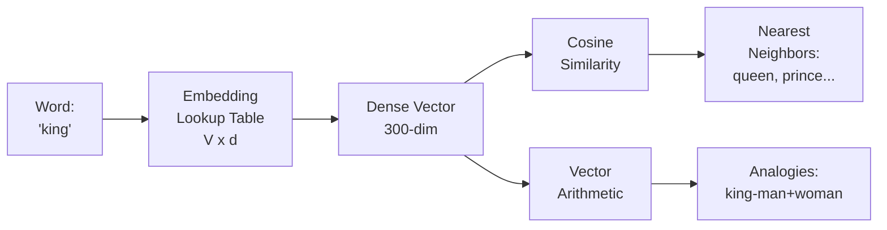

# 🗺️ Word Embeddings

> [!abstract] TL;DR
> Word embeddings are dense vector representations of words in a continuous, low-dimensional space (~50–300 dimensions) where semantically similar words cluster together. They replace one-hot encoding (sparse, no semantic meaning) with distributed representations learned from co-occurrence patterns. Key methods: Word2Vec, GloVe, FastText. Static embeddings (one vector per word) have been superseded by contextual embeddings (BERT, GPT) for most tasks, but remain useful for lightweight applications and understanding the foundations of modern NLP.

---

## Intuition — Analogy First

Imagine plotting every English word on a map. One-hot encoding is like assigning each word a random GPS coordinate — "king" and "queen" might be thousands of miles apart. Word embeddings are like drawing a real semantic map where **similar words cluster together**:

- "dog", "cat", "puppy", "kitten" form a cluster near each other
- "Paris", "London", "Berlin", "Tokyo" form a city cluster
- "running", "ran", "runs" are close to each other

The famous discovery: **linear arithmetic on the map works.** Take the vector for "king", subtract "man", add "woman" — and you land near "queen". The map has encoded gender, royalty, and nationality as geometric directions.

```
king - man + woman ≈ queen
Paris - France + Italy ≈ Rome
bigger - big + small ≈ smaller
```

This means the embedding space captures semantic and syntactic relationships as directions, not just proximity.

---

## How It Works — Mechanics



**One-hot vs distributed representation:**

| Method | Representation | Dimension | Semantic Info |
|---|---|---|---|
| One-hot | [0, 0, 1, 0, ..., 0] | V (~50,000) | None |
| Word embedding | [0.32, -0.15, 0.87, ...] | 50–300 | Encoded in geometry |

**How embeddings encode meaning:**
The distributional hypothesis (Firth, 1957): *"A word is known by the company it keeps."*

Words that appear in similar contexts (surrounding words) will be trained to have similar vectors. "Dog" and "puppy" both appear near "cute", "bark", "walk", "pet" → their vectors converge.

**Static vs contextual:**

| Type | Example | Context | Limitation |
|---|---|---|---|
| Static | Word2Vec, GloVe, FastText | None — one vector per word | "bank" (river) = "bank" (finance) |
| Contextual | BERT, GPT, RoBERTa | Full sentence | Computationally heavier |

---

## The Math

**Cosine similarity** — measures semantic similarity between vectors:

$$\text{cosine\_sim}(\mathbf{a}, \mathbf{b}) = \frac{\mathbf{a} \cdot \mathbf{b}}{\|\mathbf{a}\| \cdot \|\mathbf{b}\|} = \frac{\sum_{i=1}^{d} a_i b_i}{\sqrt{\sum_i a_i^2} \cdot \sqrt{\sum_i b_i^2}}$$

- Range: $[-1, 1]$, where 1 = identical direction, 0 = orthogonal, -1 = opposite
- Note: cosine similarity is **direction-based** (ignores magnitude), which is correct for embeddings — we care about the semantic direction, not vector length

**Embedding analogy arithmetic:**

$$\vec{v}(\text{king}) - \vec{v}(\text{man}) + \vec{v}(\text{woman}) \approx \vec{v}(\text{queen})$$

More formally, the analogy "a is to b as c is to d" holds when:

$$\vec{v}(d) \approx \vec{v}(c) - \vec{v}(a) + \vec{v}(b)$$

This is an empirical observation, not a guaranteed property — it works well for Word2Vec and GloVe on semantic/syntactic analogies.

**GloVe objective** — learns embeddings from co-occurrence matrix $X$:

$$J = \sum_{i,j=1}^{V} f(X_{ij}) \left( \mathbf{w}_i^T \tilde{\mathbf{w}}_j + b_i + \tilde{b}_j - \log X_{ij} \right)^2$$

Where $f(X_{ij})$ is a weighting function that down-weights very frequent co-occurrences.

---

## Code Demo

```python
import gensim.downloader as api
from gensim.models import Word2Vec
import numpy as np
from sklearn.metrics.pairwise import cosine_similarity

# ── Load pretrained Word2Vec (Google News, 300-dim) ──────────────────────────
# Download once: ~1.6GB
model = api.load("word2vec-google-news-300")

# ── Basic similarity queries ──────────────────────────────────────────────────
print("Most similar to 'king':")
for word, score in model.most_similar("king", topn=5):
    print(f"  {word:15} {score:.4f}")
# queen         0.7119
# monarch       0.6978
# prince        0.6543

# ── Analogy arithmetic ────────────────────────────────────────────────────────
result = model.most_similar(
    positive=["king", "woman"],
    negative=["man"],
    topn=3,
)
print("\nking - man + woman =")
for word, score in result:
    print(f"  {word:15} {score:.4f}")
# queen         0.7118

# ── Manual cosine similarity ──────────────────────────────────────────────────
def cosine_sim(w1: str, w2: str) -> float:
    v1 = model[w1].reshape(1, -1)
    v2 = model[w2].reshape(1, -1)
    return float(cosine_similarity(v1, v2)[0, 0])

pairs = [("dog", "cat"), ("dog", "car"), ("Paris", "France"), ("happy", "sad")]
for w1, w2 in pairs:
    print(f"  sim({w1:8}, {w2:8}) = {cosine_sim(w1, w2):.4f}")

# ── Train Word2Vec from scratch ───────────────────────────────────────────────
sentences = [
    ["the", "quick", "brown", "fox"],
    ["the", "dog", "ran", "fast"],
    ["a", "cat", "sat", "quietly"],
    ["the", "fox", "jumped", "over", "the", "dog"],
]

custom_model = Word2Vec(
    sentences=sentences,
    vector_size=50,     # embedding dimensions
    window=3,           # context window size
    min_count=1,        # ignore words with freq < min_count
    sg=1,               # 1=Skip-gram, 0=CBOW
    epochs=100,
)
print("\nCustom model 'fox' vector (first 5 dims):", custom_model.wv["fox"][:5])

# ── Visualize with t-SNE ──────────────────────────────────────────────────────
from sklearn.manifold import TSNE
import matplotlib.pyplot as plt

words = ["king", "queen", "man", "woman", "paris", "france", "london", "england",
         "dog", "cat", "puppy", "kitten", "happy", "sad", "joy", "grief"]

vectors = np.array([model[w] for w in words])
tsne = TSNE(n_components=2, random_state=42, perplexity=5)
coords = tsne.fit_transform(vectors)

plt.figure(figsize=(10, 8))
plt.scatter(coords[:, 0], coords[:, 1], alpha=0.5)
for i, word in enumerate(words):
    plt.annotate(word, (coords[i, 0] + 0.5, coords[i, 1] + 0.5))
plt.title("Word Embeddings Visualized with t-SNE")
plt.savefig("word_embeddings_tsne.png", dpi=150)
```

---

## Real-World Example

**Word2Vec and the "word algebra" revolution (2013)**

When Mikolov et al. published Word2Vec in 2013, the analogy arithmetic result ("king − man + woman ≈ queen") was a shock to the NLP community. It showed that neural networks could implicitly encode semantic relationships that no one had explicitly programmed.

Applications that emerged immediately:
- **Recommendation systems:** item2vec — embed products/movies in the same way Word2Vec embeds words; similar items cluster together
- **Search expansion:** query "fast food" → retrieves documents about "quick service restaurants" because the embeddings are close
- **Biomedical NLP:** embed drug names and diseases; King − Man + Woman analogy works as "Drug X treats Disease Y like Drug Z treats Disease W"

Today (2026), static word embeddings are largely superseded by contextual embeddings (BERT, GPT sentence transformers) for most production tasks. But they remain:
- Used in lightweight models on edge devices
- Used as initializations before fine-tuning
- Used in visualizations and probing experiments
- Foundational for understanding modern embedding models

---

## Trade-offs

| Method | Pros | Cons |
|---|---|---|
| One-hot | Simple, lossless | No semantic info; dimension = vocabulary size |
| Word2Vec | Fast training; captures semantics; lightweight | Static (polysemy problem); needs large corpus |
| GloVe | Global statistics; good on analogies | Static; requires full co-occurrence matrix precomputation |
| FastText | Handles OOV via character n-grams; good for morphologically rich languages | Larger model; still static |
| BERT contextual | Context-dependent; handles polysemy | Much heavier; overkill for simple similarity |
| Sentence transformers | Best semantic similarity | Requires large model for inference |

---

## When to Use vs Avoid

**Use word embeddings (Word2Vec/GloVe/FastText) when:**
- Inference speed and model size are critical (mobile, edge, microservices)
- You need a quick semantic similarity baseline
- The task is simple: document clustering, recommendation, keyword expansion
- You're probing/analyzing learned representations

**Avoid static embeddings when:**
- Polysemy matters: "bank" must mean different things in different sentences → use BERT
- Task requires sentence/document-level understanding → use sentence transformers
- You're fine-tuning a full NLP pipeline → contextual embeddings are learned end-to-end
- State-of-the-art performance is the goal → contextual beats static

---

## Common Pitfalls

1. **Ignoring polysemy** — Word2Vec has one vector for "bank" covering river banks, financial banks, and blood banks. For tasks involving ambiguous words, contextual embeddings are essential.

2. **Comparing embeddings from different models** — Embeddings from Word2Vec and GloVe live in different spaces. You cannot compute cosine similarity between a Word2Vec vector and a GloVe vector and expect meaningful results.

3. **Not normalizing before cosine similarity** — `model.most_similar()` normalizes internally, but if you implement your own similarity search, normalize vectors to unit length first to avoid confusing magnitude with direction.

4. **Treating embedding dimensions as interpretable** — Individual dimensions of a Word2Vec embedding are not interpretable. The meaning is encoded in the geometry across all dimensions collectively.

5. **Using small corpora** — Word2Vec needs millions of sentences to learn meaningful representations. Training on a small domain corpus produces poor analogies and weak clustering.

6. **Forgetting about bias** — Word embeddings learn and amplify societal biases present in the training corpus. "Doctor" may be closer to "man" than "woman". This is well-documented and must be considered in downstream applications.

---

## Related Concepts

- [[_MOC_NLP|↑ Section MOC]]

- [[Word2Vec]] — the dominant algorithm for learning word embeddings (CBOW and Skip-gram)
- [[Tokenization]] — tokenization must happen before embedding lookup
- [[BERT]] — contextual embeddings that solved the polysemy problem
- [[Embedding_Models]] — modern semantic embedding models (sentence transformers, OpenAI embeddings)
- [[Language_Model_Basics]] — why word embeddings are just the start of language modeling

---

## Review Questions

1. Word2Vec produces the analogy "king − man + woman ≈ queen" via vector arithmetic. Does this mean the model "understands" gender and royalty? What is actually happening geometrically, and what are the limits of this analogy arithmetic?

2. You have a document similarity task where "JPMorgan bank" and "river bank erosion" documents are being incorrectly grouped together. Static Word2Vec embeddings score "bank" very similarly in both contexts. What representation would solve this, and why?

3. You want to find the top-10 most similar products to a query product in a catalog of 1 million items using embeddings. Cosine similarity across all 1M pairs would be O(N). What data structure/algorithm would you use to scale this to millisecond latency, and what approximate trade-off does it involve?

---

## Sources

- Mikolov, T., et al. (2013). Efficient Estimation of Word Representations in Vector Space. *ICLR 2013*. https://arxiv.org/abs/1301.3781
- Pennington, J., Socher, R., & Manning, C. D. (2014). GloVe: Global Vectors for Word Representation. *EMNLP 2014*. https://nlp.stanford.edu/projects/glove/
- Bojanowski, P., et al. (2017). Enriching Word Vectors with Subword Information (FastText). *TACL 2017*. https://arxiv.org/abs/1607.04606
- Bolukbasi, T., et al. (2016). Man is to Computer Programmer as Woman is to Homemaker? Debiasing Word Embeddings. *NeurIPS 2016*. https://arxiv.org/abs/1607.06520

#nlp #embeddings #word2vec #glove #fasttext #semantic-similarity #distributed-representations #intermediate
