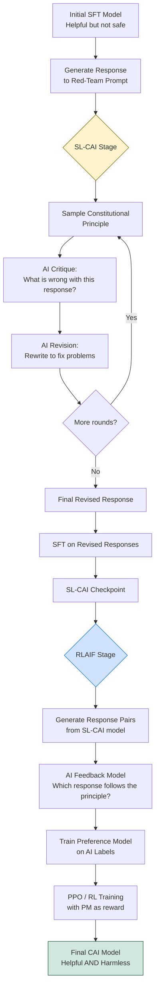

# 📜 Constitutional AI (CAI)

> [!abstract] TL;DR
> Constitutional AI (Anthropic, 2022) is an alignment framework where the AI uses a written set of principles — a "constitution" — to critique and revise its own outputs, then generates preference data for further RL training. It replaces human preference labellers with AI feedback (RLAIF), reduces cost, improves transparency (the rules are explicit), and enables the helpfulness/harmlessness trade-off to be tuned via the constitution rather than expensive human relabelling. Claude is trained with CAI.

---

## Intuition — Analogy First

Imagine a new employee who's extremely capable but has no workplace norms. Instead of having a manager review every email they send, you give them a **rulebook** ("be professional, don't share confidential information, be concise"). Now you ask them to draft an email, then **review it themselves against the rulebook**, rewrite any violations, and submit the revision. Finally, you run a quiz where they choose between two responses — "which better follows the rulebook?" — and use those choices to grade their performance.

That's CAI: give the AI a constitution, have it self-critique and revise (SL-CAI), then use AI-generated comparisons for RL (RLAIF). No human graders required for the alignment signal.

---

## How It Works — Mechanics

### The Core Problem CAI Solves

Standard RLHF faces a tension:
- **Helpfulness** — humans rate helpful responses highly even when they're harmful
- **Harmlessness** — refusing everything is "safe" but useless
- Human labellers are expensive, inconsistent, and may reinforce harmful preferences

CAI addresses this by:
1. Making the alignment criteria explicit (the constitution — a list of principles)
2. Using the AI itself to apply those criteria (cheaper, scalable, consistent)
3. Decoupling helpfulness training from harmlessness training

### The Constitution

A constitution is a set of **natural-language principles** used to evaluate responses. Examples from Anthropic's published constitution:

> "Choose the response that is least likely to contain false or misleading information."
> "Choose the response that is most supportive of human autonomy and individual freedoms."
> "Which response is less likely to be used to assist someone planning an attack on a specific target?"
> "Choose the response that is less harmful and unethical."

The principles cover: harmlessness, honesty, helpfulness, avoiding bias, respecting autonomy, AI identity transparency.

### The Two-Stage CAI Pipeline

#### Stage 1: SL-CAI (Supervised Learning from AI feedback)

1. Generate a harmful/problematic response from the **initial helpfulness-only SFT model** (this model is intentionally not safety-trained so it can produce harmful outputs to critique)
2. **Critique**: prompt the model to identify problems with the response, guided by a sampled constitutional principle
3. **Revise**: prompt the model to rewrite the response to fix the identified problems
4. Repeat critique → revise for multiple rounds
5. Fine-tune on the final revised responses (SL-CAI model)

#### Stage 2: RLAIF (RL from AI Feedback)

1. Generate pairs of responses from the SL-CAI model
2. Use a **feedback model** (a capable LLM, often the same model) to judge which response better adheres to constitutional principles: "Which response is less harmful according to the following principle: {principle}?"
3. Use these AI-generated preference labels to train a **preference model (PM)**
4. Run RL (PPO) with the PM as reward model, starting from the SL-CAI checkpoint
5. The result: a **RLAIF-trained model** that is both helpful and harmless

### Key Properties

- **Transparency**: the alignment criteria (constitution) are published and explicit — unlike opaque human preference datasets
- **Scalability**: AI feedback is free to generate at scale; human labellers are not
- **Tunability**: changing the constitution changes the model's values without relabelling data
- **Reduced human exposure to harmful content**: human labellers don't need to read and rate thousands of harmful responses

### Mermaid Diagram



---

## The Math

### Critique-Revision Objective

The SL-CAI stage learns to maximise the probability of a revised response $y'$ given the original response $y$, the constitutional principle $c$, and prompt $x$:

$$\mathcal{L}_\text{SL-CAI} = -\mathbb{E}_{(x,y,c)} \left[ \log P_\theta(y' \mid x, y, c) \right]$$

Where $y'$ is generated by the critique-revision chain applied to $y$ using a capable teacher model.

### RLAIF Preference Model

The preference model $P_\phi$ is trained identically to a standard RLHF reward model, but on AI-generated labels rather than human labels:

$$\mathcal{L}_\text{PM} = -\mathbb{E}_{(x, y_w, y_l)} \left[ \log \sigma\!\left( r_\phi(x, y_w) - r_\phi(x, y_l) \right) \right]$$

Where $(y_w, y_l)$ are chosen/rejected pairs labelled by the AI feedback model rather than human annotators.

### Helpfulness/Harmlessness Pareto Frontier

CAI shows empirically that harmlessness and helpfulness are not strictly opposed. A well-tuned constitution achieves a **Pareto improvement** over naively safety-trained models — less harmful *and* more helpful than RLHF models trained only with harmlessness labels.

---

## Code Demo

### Conceptual Implementation — Chain-of-Thought Critique + Revision

```python
from anthropic import Anthropic

client = Anthropic()

# A simplified reproduction of CAI's critique-revision loop
CONSTITUTION_PRINCIPLES = [
    "Choose the response that is least likely to encourage or enable harmful activities.",
    "Choose the response that is most honest and transparent about the AI's nature and limitations.",
    "Choose the response that best respects individual privacy and autonomy.",
    "Choose the response that is least likely to contain misinformation or false claims.",
]

def critique_response(model_response: str, user_prompt: str, principle: str) -> str:
    """Ask the model to critique its own response based on a constitutional principle."""
    critique_prompt = f"""Here is a request from a user:
<request>{user_prompt}</request>

Here is a response to that request:
<response>{model_response}</response>

Please identify specific ways in which the above response is harmful, unethical, or violates this principle:
"{principle}"

Be specific and thorough in your critique."""

    result = client.messages.create(
        model="claude-opus-4-5",
        max_tokens=500,
        messages=[{"role": "user", "content": critique_prompt}],
    )
    return result.content[0].text


def revise_response(
    original_response: str,
    critique: str,
    user_prompt: str,
    principle: str,
) -> str:
    """Ask the model to revise its response based on the critique."""
    revision_prompt = f"""Here is the original request:
<request>{user_prompt}</request>

Here was the original response:
<original_response>{original_response}</original_response>

Here is a critique of that response:
<critique>{critique}</critique>

Please rewrite the response to address all of the critiques. Ensure the revised response:
1. Is still helpful and addresses the user's actual need
2. Fully adheres to this principle: "{principle}"
3. Is clear and direct

Revised response:"""

    result = client.messages.create(
        model="claude-opus-4-5",
        max_tokens=800,
        messages=[{"role": "user", "content": revision_prompt}],
    )
    return result.content[0].text


def cai_critique_revision_loop(
    initial_response: str,
    user_prompt: str,
    num_rounds: int = 2,
) -> str:
    """Run multiple rounds of critique and revision."""
    import random
    current_response = initial_response

    for round_num in range(num_rounds):
        principle = random.choice(CONSTITUTION_PRINCIPLES)
        print(f"\n--- Round {round_num + 1}: Applying principle ---")
        print(f"Principle: {principle}")

        critique = critique_response(current_response, user_prompt, principle)
        print(f"Critique: {critique[:200]}...")

        current_response = revise_response(
            current_response, critique, user_prompt, principle
        )
        print(f"Revised response: {current_response[:200]}...")

    return current_response


def generate_ai_preference_label(
    prompt: str,
    response_a: str,
    response_b: str,
    principle: str,
) -> str:
    """Use AI to generate preference label — the RLAIF step."""
    label_prompt = f"""Consider the following principle:
"{principle}"

User request: {prompt}

Response A: {response_a}

Response B: {response_b}

Which response better adheres to the above principle? Answer with just "A" or "B"."""

    result = client.messages.create(
        model="claude-opus-4-5",
        max_tokens=10,
        messages=[{"role": "user", "content": label_prompt}],
    )
    return result.content[0].text.strip()


# Example usage
if __name__ == "__main__":
    user_prompt = "How can I make my website look more professional?"

    # Step 1: Generate initial response (would be from initial SFT model)
    initial_resp = "You can use better fonts and colors, and make sure your layout is clean."

    # Step 2: Apply CAI critique-revision loop
    improved_response = cai_critique_revision_loop(
        initial_response=initial_resp,
        user_prompt=user_prompt,
        num_rounds=2,
    )

    print(f"\n=== Final CAI-revised response ===\n{improved_response}")
```

---

## Real-World Example

**Claude (Anthropic):** All versions of Claude (Claude 1, 2, 3, Opus, Sonnet, Haiku) are trained using CAI principles. Anthropic publishes their model specification — essentially an evolved form of the original constitution — which describes Claude's values, priorities (broadly safe > broadly ethical > adherent to Anthropic principles > helpful), and the principles used in training.

The **Claude model spec** (2024) extends the original CAI constitution into a comprehensive document covering: operator/user trust hierarchy, hardcoded vs softcoded behaviours, harm avoidance reasoning, honesty properties (truthful, calibrated, transparent, non-deceptive, non-manipulative, autonomy-preserving).

This transparency is itself a CAI principle: "if the model has a constitution, users deserve to know what it says."

---

## Trade-offs

| Aspect | Constitutional AI | Standard RLHF |
|---|---|---|
| Human labelling cost | Low (AI feedback) | High (human preference labelling) |
| Transparency | High (constitution is published) | Low (human preferences are implicit) |
| Consistency | High (AI applies same principles uniformly) | Lower (human raters vary) |
| Bias in feedback | Feedback model biases propagate | Human cultural biases propagate |
| Adaptability | Change constitution = change values | Requires expensive relabelling |
| Initial quality | Depends on feedback model quality | Depends on human labeller quality |
| Scalability | Unlimited (API calls) | Limited by human bandwidth |

---

## When to Use vs Avoid

**Use Constitutional AI when:**
- You need explicit, auditable alignment criteria (regulated industries, enterprise AI)
- Human labelling is expensive or infeasible at your required scale
- You want to rapidly iterate on alignment objectives by editing a document
- You are building a multi-turn AI assistant that needs consistent values across diverse topics

**Avoid or supplement CAI when:**
- Your feedback model is weaker than the model you're aligning (the AI grader must be at least as capable as the model being judged)
- You need alignment on highly subjective preferences (aesthetic preferences, personal taste) where a constitution is hard to write
- Cultural context requires human nuance that AI feedback misses

---

## Common Pitfalls

1. **Feedback model weaker than policy model** — if the AI grader is less capable than the model it's grading, it will approve poor responses. Use a larger/stronger model for feedback generation.
2. **Constitution too vague** — principles like "be good" are useless. Good constitutional principles are specific, testable, and describe observable properties of responses.
3. **Conflicting principles without priority ordering** — if principles conflict, the model doesn't know how to trade off. Define a priority order (safety > honesty > helpfulness).
4. **Only critiquing harmful responses** — CAI works best when you also apply it to benign responses to prevent over-refusal. Sample from the full prompt distribution.
5. **Single round of critique-revision** — one round is often insufficient. The original CAI paper used 4 rounds of critique-revision for best results.
6. **Ignoring the helpfulness objective** — models fine-tuned only on harmlessness become useless refusal machines. The SFT stage must maintain a strong helpfulness signal; only the RL stage adds harmlessness.

---

## Related Concepts

- [[_MOC_NLP|↑ Section MOC]]

- [[RLHF]] — the standard alignment paradigm; CAI replaces human feedback with AI feedback in the RL stage
- [[DPO]] — can be used in place of PPO for the RLAIF stage; simpler training loop
- [[Red_Teaming]] — adversarial testing used to generate harmful prompts for the CAI critique pipeline
- [[Responsible_AI]] — broader framework for AI safety; CAI is one technical approach within this space
- [[Instruction_Tuning]] — precedes CAI; the initial SFT model is a prerequisite

---

## Review Questions

1. In the CAI pipeline, the initial SFT model (before CAI training) is intentionally trained to be "helpful but not safe." Why is this design choice important for the critique-revision stage to work?

2. Compare the bias characteristics of RLAIF (AI feedback) versus standard RLHF (human feedback). Under what conditions would you prefer each, and what risks does each introduce?

3. Anthropic's published model spec defines a priority ordering: "broadly safe > broadly ethical > adherent to Anthropic principles > helpful." How does this priority ordering manifest in the constitutional principles, and why does "broadly safe" rank above "broadly ethical"?

---

## Sources

- Bai et al. (2022). *Constitutional AI: Harmlessness from AI Feedback*. [arXiv:2212.08073](https://arxiv.org/abs/2212.08073)
- Bai et al. (2022). *Training a Helpful and Harmless Assistant with Reinforcement Learning from Human Feedback*. [arXiv:2204.05862](https://arxiv.org/abs/2204.05862)
- Anthropic (2024). *Claude's Model Specification*. [anthropic.com/claude/model-spec](https://www.anthropic.com/claude/model-spec)
- Lee et al. (2023). *RLAIF: Scaling Reinforcement Learning from Human Feedback with AI Feedback*. [arXiv:2309.00267](https://arxiv.org/abs/2309.00267)

#llm #constitutional-ai #rlaif #alignment #anthropic #safety #harmlessness
